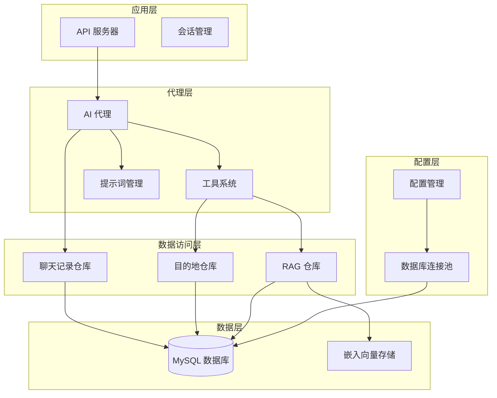
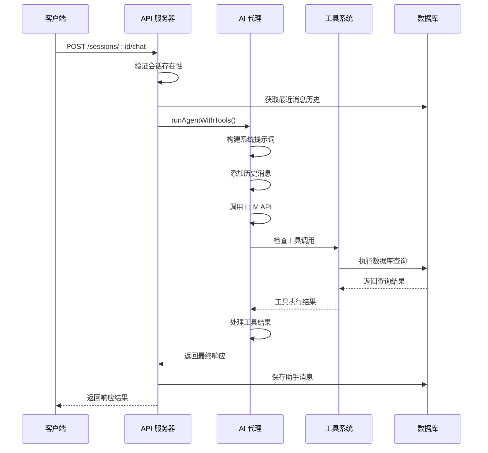
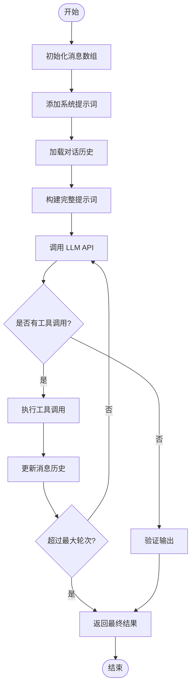
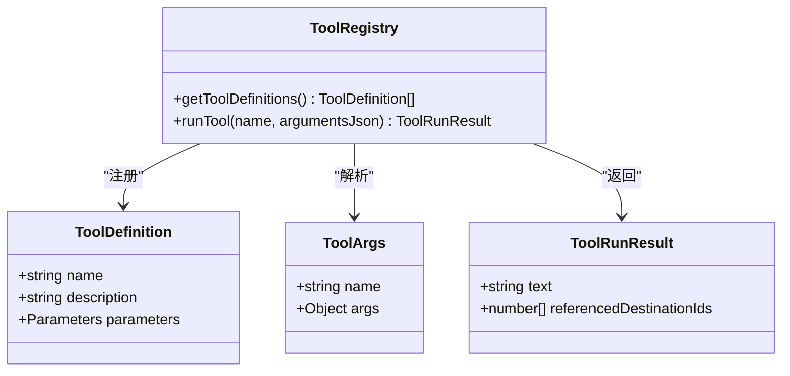
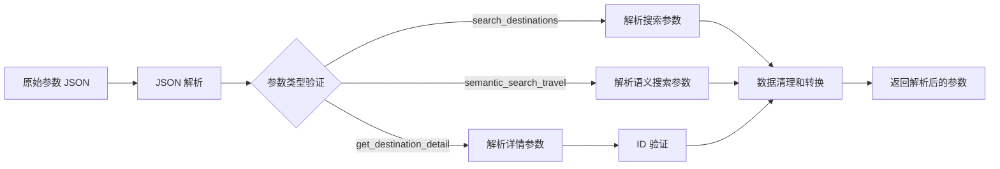
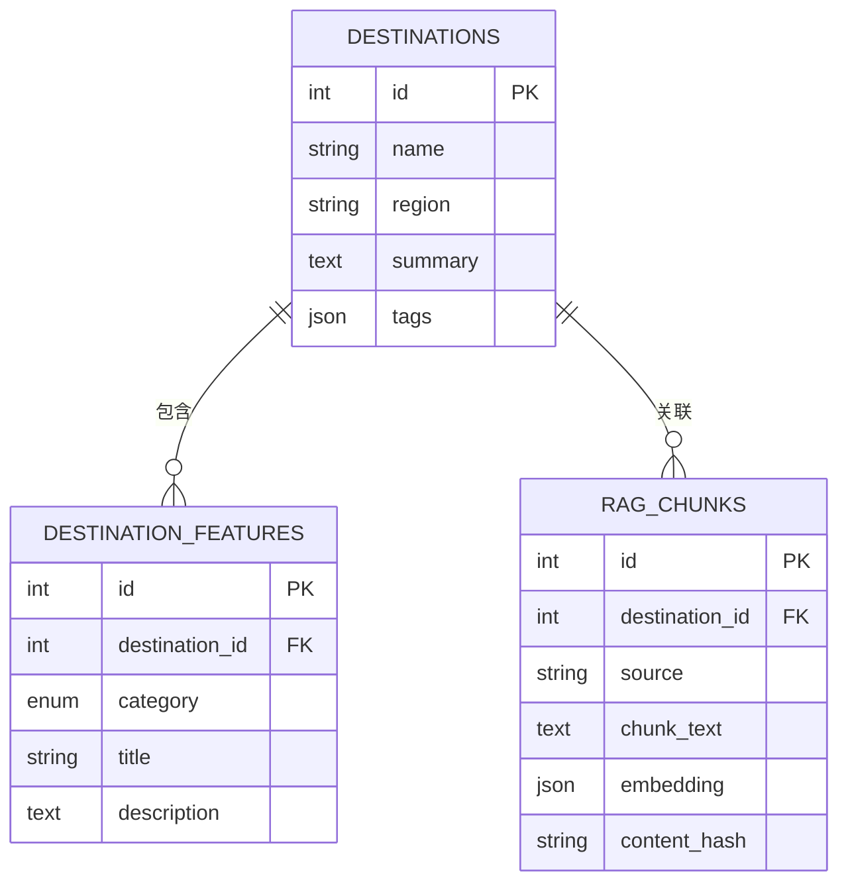
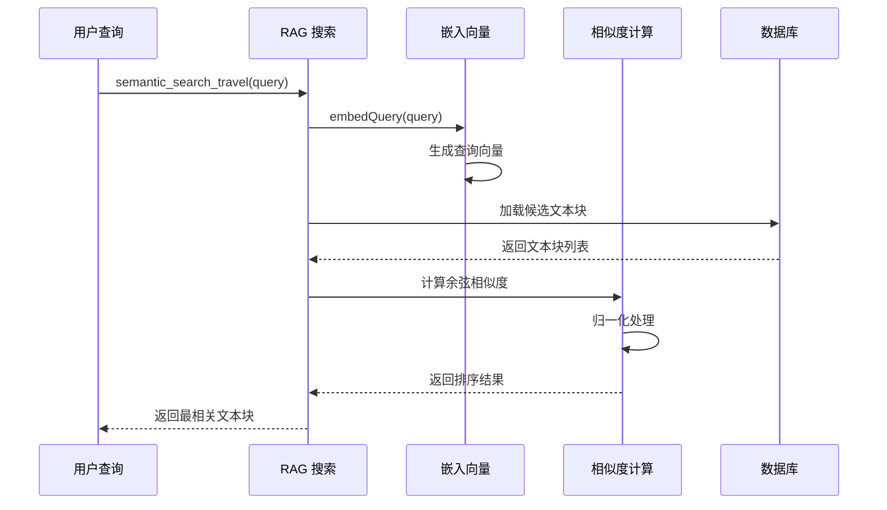
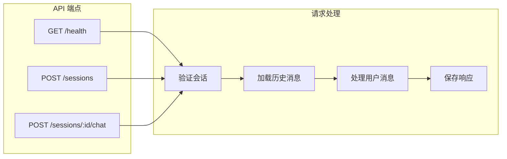
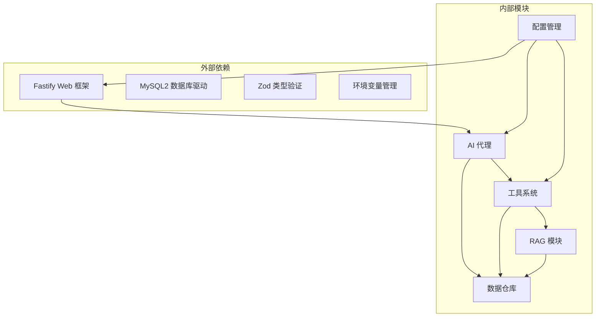

# AI 代理系统

<cite>
**本文档引用的文件**
- [src/agent/llm.ts](file://src/agent/llm.ts)
- [src/agent/tools.ts](file://src/agent/tools.ts)
- [src/agent/prompts.ts](file://src/agent/prompts.ts)
- [src/index.ts](file://src/index.ts)
- [src/config.ts](file://src/config.ts)
- [src/db/destinationRepo.ts](file://src/db/destinationRepo.ts)
- [src/db/ragRepo.ts](file://src/db/ragRepo.ts)
- [src/db/chatRepo.ts](file://src/db/chatRepo.ts)
- [src/db/pool.ts](file://src/db/pool.ts)
- [src/rag/embed.ts](file://src/rag/embed.ts)
- [src/rag/similarity.ts](file://src/rag/similarity.ts)
- [package.json](file://package.json)
- [AGENTS.md](file://AGENTS.md)
</cite>

## 目录
1. [简介](#简介)
2. [项目结构](#项目结构)
3. [核心组件](#核心组件)
4. [架构概览](#架构概览)
5. [详细组件分析](#详细组件分析)
6. [依赖关系分析](#依赖关系分析)
7. [性能考虑](#性能考虑)
8. [故障排除指南](#故障排除指南)
9. [结论](#结论)
10. [附录](#附录)

## 简介

Guide-Plan-Agent 是一个基于大型语言模型（LLM）的智能旅游规划代理系统。该系统通过工具调用机制，结合结构化数据库查询和向量语义搜索，为用户提供个性化的旅游目的地推荐和行程规划服务。

系统的核心特点包括：
- **多轮对话支持**：通过会话管理和消息历史维护，支持复杂的多轮交互
- **工具调用系统**：集成多种工具函数，实现数据检索、事实查询和语义搜索
- **智能提示词管理**：通过系统提示词指导代理行为，确保输出质量和准确性
- **RAG 集成**：结合检索增强生成（Retrieval-Augmented Generation）提升回答质量

## 项目结构

项目采用模块化设计，主要分为以下几个核心层次：



**图表来源**
- [src/index.ts:11-77](file://src/index.ts#L11-L77)
- [src/agent/llm.ts:49-114](file://src/agent/llm.ts#L49-L114)
- [src/agent/tools.ts:15-69](file://src/agent/tools.ts#L15-L69)

**章节来源**
- [src/index.ts:1-77](file://src/index.ts#L1-77)
- [src/config.ts:1-46](file://src/config.ts#L1-L46)

## 核心组件

### LLM 调用机制

系统通过 OpenAI 兼容的聊天完成接口进行 LLM 调用，支持函数调用功能。核心实现包括：

- **消息格式定义**：支持系统消息、用户消息、助手消息和工具消息
- **工具调用循环**：实现多轮工具调用的智能决策
- **错误处理**：完善的异常捕获和错误恢复机制

### 工具调用系统

系统集成了三个核心工具函数，每个工具都有明确的职责边界：

1. **search_destinations**：结构化关键词搜索
2. **semantic_search_travel**：语义向量搜索
3. **get_destination_detail**：详细事实查询

### 提示词管理系统

系统采用静态提示词文件管理，包含10行精心设计的指导规则，涵盖：
- 工具调用优先级
- 输出格式规范
- 上下文理解要求
- 知识一致性保证

**章节来源**
- [src/agent/llm.ts:5-18](file://src/agent/llm.ts#L5-L18)
- [src/agent/tools.ts:15-65](file://src/agent/tools.ts#L15-L65)
- [src/agent/prompts.ts:1-10](file://src/agent/prompts.ts#L1-L10)

## 架构概览

系统采用分层架构设计，从上到下分别为 API 层、代理层、数据访问层和数据存储层：



**图表来源**
- [src/index.ts:35-68](file://src/index.ts#L35-L68)
- [src/agent/llm.ts:49-114](file://src/agent/llm.ts#L49-L114)

## 详细组件分析

### AI 代理核心流程

AI 代理的工作流程是一个智能的多轮对话循环，通过工具调用实现知识检索和事实验证：



**图表来源**
- [src/agent/llm.ts:49-114](file://src/agent/llm.ts#L49-L114)

#### 工具调用系统设计

工具系统采用统一的接口设计，所有工具都遵循相同的参数解析和执行模式：



**图表来源**
- [src/agent/tools.ts:15-69](file://src/agent/tools.ts#L15-L69)
- [src/agent/tools.ts:71-112](file://src/agent/tools.ts#L71-L112)
- [src/agent/tools.ts:10-13](file://src/agent/tools.ts#L10-L13)

#### 参数解析机制

系统实现了严格的参数解析和验证机制，确保工具调用的安全性和正确性：



**图表来源**
- [src/agent/tools.ts:79-112](file://src/agent/tools.ts#L79-L112)

**章节来源**
- [src/agent/llm.ts:49-114](file://src/agent/llm.ts#L49-L114)
- [src/agent/tools.ts:114-195](file://src/agent/tools.ts#L114-L195)

### 数据访问层

#### 目的地数据访问

目的地数据访问层提供了完整的 CRUD 操作和高级查询功能：



**图表来源**
- [src/db/destinationRepo.ts:4-18](file://src/db/destinationRepo.ts#L4-L18)
- [src/db/ragRepo.ts:7-13](file://src/db/ragRepo.ts#L7-L13)

#### RAG 搜索实现

RAG 搜索系统实现了高效的向量相似度计算和检索机制：



**图表来源**
- [src/db/ragRepo.ts:97-143](file://src/db/ragRepo.ts#L97-L143)
- [src/rag/embed.ts:34-37](file://src/rag/embed.ts#L34-L37)
- [src/rag/similarity.ts:19-30](file://src/rag/similarity.ts#L19-L30)

**章节来源**
- [src/db/destinationRepo.ts:20-100](file://src/db/destinationRepo.ts#L20-L100)
- [src/db/ragRepo.ts:54-143](file://src/db/ragRepo.ts#L54-L143)
- [src/rag/embed.ts:7-37](file://src/rag/embed.ts#L7-L37)
- [src/rag/similarity.ts:1-31](file://src/rag/similarity.ts#L1-L31)

### API 接口设计

系统提供 RESTful API 接口，支持会话管理和实时聊天：



**图表来源**
- [src/index.ts:18-68](file://src/index.ts#L18-L68)

**章节来源**
- [src/index.ts:18-68](file://src/index.ts#L18-L68)

## 依赖关系分析

系统采用模块化依赖设计，各组件之间的耦合度较低，便于维护和扩展：



**图表来源**
- [package.json:18-24](file://package.json#L18-L24)
- [src/index.ts:1-9](file://src/index.ts#L1-L9)

**章节来源**
- [package.json:18-31](file://package.json#L18-L31)
- [src/config.ts:1-46](file://src/config.ts#L1-L46)

## 性能考虑

### 并发处理

系统通过数据库连接池实现并发控制，限制同时连接数以避免资源耗尽：

- **连接池大小**：默认 10 个连接
- **等待策略**：启用连接等待机制
- **超时处理**：合理设置查询超时时间

### 缓存策略

系统在工具调用层面实现了智能缓存：
- **引用目的地去重**：自动去除重复的目的地 ID
- **结果聚合**：将多个工具调用的结果合并处理

### 查询优化

数据库查询采用了多种优化策略：
- **索引利用**：对常用查询字段建立索引
- **LIMIT 限制**：防止查询结果过大
- **条件过滤**：根据区域等条件缩小搜索范围

## 故障排除指南

### 常见问题诊断

1. **LLM API 连接失败**
   - 检查 OPENAI_API_KEY 是否正确配置
   - 验证网络连接和代理设置
   - 确认 API 端点 URL 正确性

2. **数据库连接问题**
   - 验证 MySQL 服务器状态
   - 检查连接参数配置
   - 确认数据库权限设置

3. **工具调用异常**
   - 查看工具参数解析日志
   - 验证数据库查询结果
   - 检查嵌入向量生成状态

### 错误处理机制

系统实现了多层次的错误处理：
- **网络层错误**：HTTP 状态码检查和错误信息提取
- **业务层错误**：工具调用异常捕获和错误消息包装
- **系统级错误**：进程级异常捕获和优雅降级

**章节来源**
- [src/agent/llm.ts:42-47](file://src/agent/llm.ts#L42-L47)
- [src/agent/tools.ts:95-101](file://src/agent/tools.ts#L95-L101)

## 结论

Guide-Plan-Agent 代理系统展现了现代 AI 应用的最佳实践，通过以下关键特性实现了高质量的智能服务：

1. **模块化架构**：清晰的分层设计便于维护和扩展
2. **工具调用机制**：灵活的工具系统支持多样化的数据操作
3. **智能提示词管理**：精确的规则指导确保输出质量
4. **RAG 集成**：结合向量搜索提升回答的相关性
5. **多轮对话支持**：完整的会话管理实现自然的人机交互

该系统为构建企业级 AI 应用提供了良好的参考模板，其设计原则和实现模式可以应用于其他领域的智能代理系统开发。

## 附录

### 工具扩展指南

要扩展新的工具函数，需要遵循以下步骤：

1. **定义工具规范**
   ```typescript
   // 在工具定义数组中添加新工具
   {
     type: 'function',
     function: {
       name: 'new_tool_name',
       description: '工具功能描述',
       parameters: {
         type: 'object',
         properties: {
           // 参数定义
         },
         required: ['必需参数']
       }
     }
   }
   ```

2. **实现工具逻辑**
   - 在 `runTool` 函数中添加新的分支处理
   - 实现参数解析和验证
   - 编写数据库查询逻辑
   - 设计结果格式化

3. **测试和验证**
   - 编写单元测试覆盖各种场景
   - 验证错误处理机制
   - 测试边界条件和异常情况

### 自定义提示词开发

提示词的开发应该遵循以下原则：

1. **明确性**：规则描述要清晰具体
2. **一致性**：避免相互矛盾的指导原则
3. **实用性**：针对具体的业务场景定制
4. **可维护性**：保持简洁易懂的结构

### 配置管理最佳实践

- **环境隔离**：不同环境使用不同的配置文件
- **安全存储**：敏感信息通过环境变量管理
- **类型安全**：使用 Zod 进行配置验证
- **默认值**：为可选配置提供合理的默认值