# LLM 调用机制

<cite>
**本文档引用的文件**
- [src/agent/llm.ts](file://src/agent/llm.ts)
- [src/config.ts](file://src/config.ts)
- [src/index.ts](file://src/index.ts)
- [src/agent/tools.ts](file://src/agent/tools.ts)
- [src/agent/prompts.ts](file://src/agent/prompts.ts)
- [src/db/pool.ts](file://src/db/pool.ts)
- [src/db/chatRepo.ts](file://src/db/chatRepo.ts)
- [src/rag/embed.ts](file://src/rag/embed.ts)
- [package.json](file://package.json)
</cite>

## 目录
1. [简介](#简介)
2. [项目结构](#项目结构)
3. [核心组件](#核心组件)
4. [架构概览](#架构概览)
5. [详细组件分析](#详细组件分析)
6. [依赖关系分析](#依赖关系分析)
7. [性能考虑](#性能考虑)
8. [故障排除指南](#故障排除指南)
9. [结论](#结论)

## 简介

Guide-Plan-Agent 是一个基于 OpenAI API 的智能旅游规划代理系统。该系统实现了完整的 LLM 调用机制，支持工具调用、多轮对话和错误处理。本文档深入解析了系统的 LLM 集成方式，包括认证机制、请求格式、响应处理以及完整的聊天完成 API 调用流程。

## 项目结构

项目采用模块化设计，主要分为以下几个核心模块：

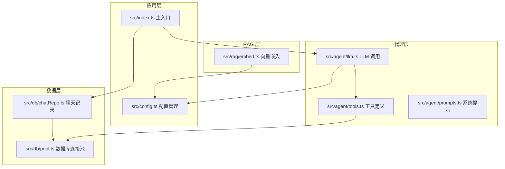

**图表来源**
- [src/index.ts:1-77](file://src/index.ts#L1-L77)
- [src/agent/llm.ts:1-114](file://src/agent/llm.ts#L1-L114)
- [src/config.ts:1-46](file://src/config.ts#L1-L46)

**章节来源**
- [src/index.ts:1-77](file://src/index.ts#L1-L77)
- [src/config.ts:1-46](file://src/config.ts#L1-L46)

## 核心组件

### LLM 调用器 (runAgentWithTools)

`runAgentWithTools` 函数是整个系统的核心，负责管理完整的 LLM 对话循环：

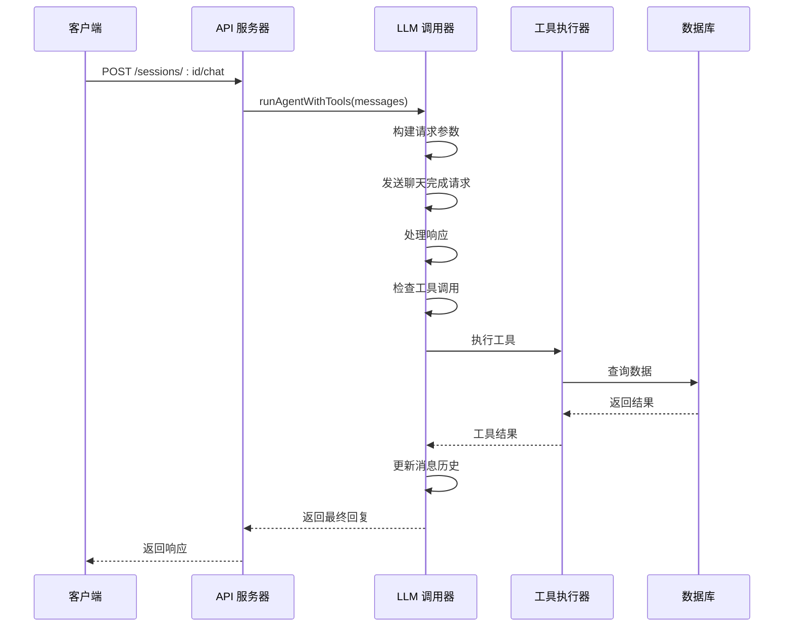

**图表来源**
- [src/agent/llm.ts:49-113](file://src/agent/llm.ts#L49-L113)
- [src/index.ts:35-67](file://src/index.ts#L35-L67)

### 工具系统

系统提供了三个核心工具，支持旅游信息检索和目的地详情查询：

| 工具名称 | 功能描述 | 参数 |
|---------|----------|------|
| search_destinations | 结构化搜索目的地 | query(必需), region(可选), limit(默认10) |
| semantic_search_travel | 语义搜索旅游知识 | query(必需), top_k(默认8), region(可选) |
| get_destination_detail | 获取目的地详情 | destination_id(必需) |

**章节来源**
- [src/agent/llm.ts:49-113](file://src/agent/llm.ts#L49-L113)
- [src/agent/tools.ts:15-65](file://src/agent/tools.ts#L15-L65)

## 架构概览

系统采用分层架构设计，确保了良好的可维护性和扩展性：

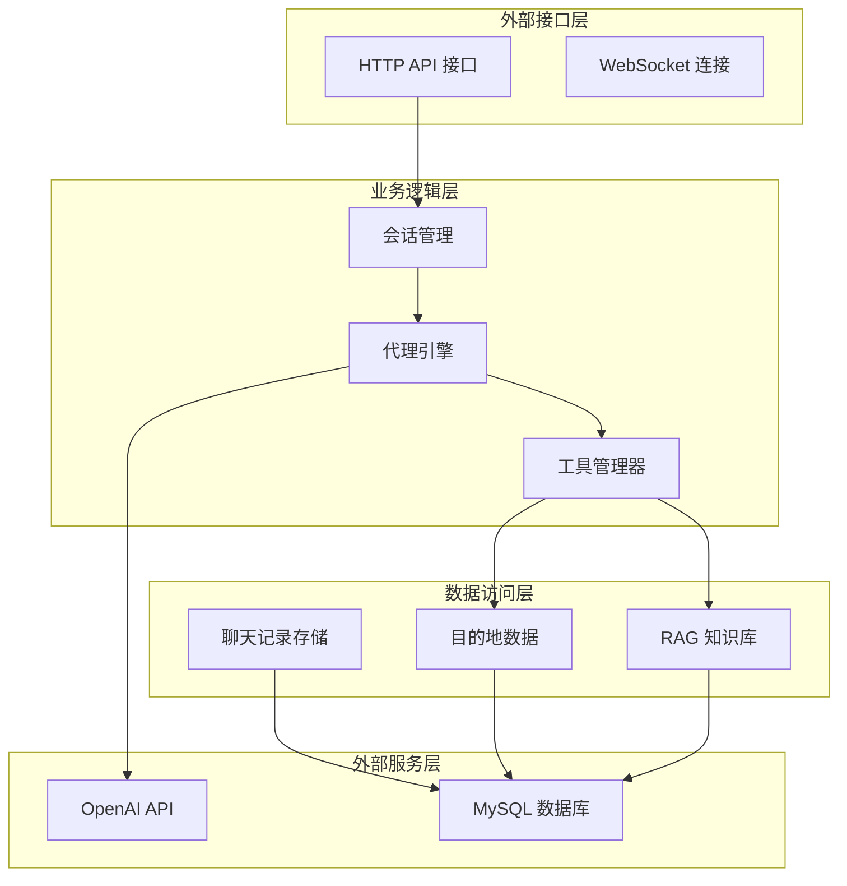

**图表来源**
- [src/index.ts:35-67](file://src/index.ts#L35-L67)
- [src/agent/llm.ts:49-113](file://src/agent/llm.ts#L49-L113)

## 详细组件分析

### OpenAI API 集成

#### 认证机制

系统使用标准的 Bearer Token 认证方式：

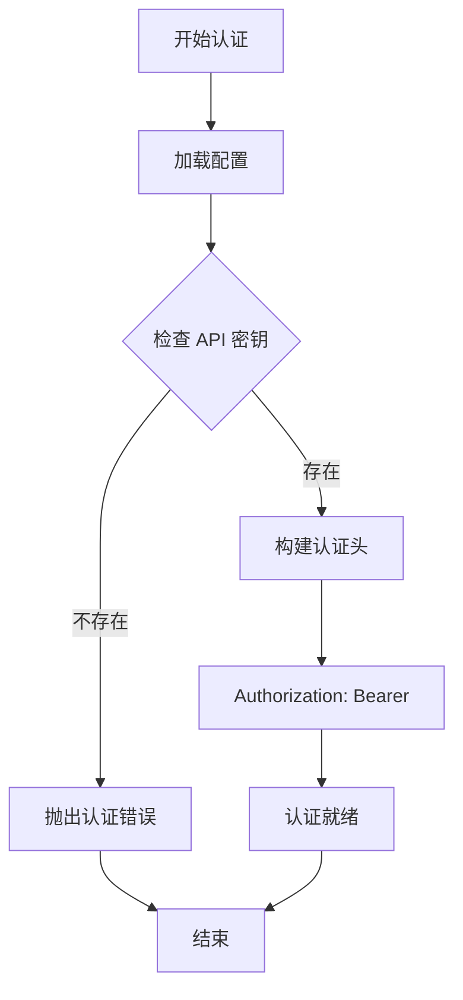

**图表来源**
- [src/agent/llm.ts:34-46](file://src/agent/llm.ts#L34-L46)
- [src/config.ts:13-15](file://src/config.ts#L13-L15)

#### 请求格式

聊天完成 API 的请求参数结构：

| 参数名 | 类型 | 必需 | 描述 | 默认值 |
|--------|------|------|------|--------|
| model | string | 是 | 模型名称 | gpt-4o-mini |
| messages | ChatMessage[] | 是 | 消息数组 | - |
| tools | ToolDefinition[] | 否 | 工具定义 | 自动 |
| tool_choice | string | 否 | 工具选择策略 | auto |
| temperature | number | 否 | 采样温度 | 0.4 |

#### 响应处理

系统支持多种响应类型和错误处理：

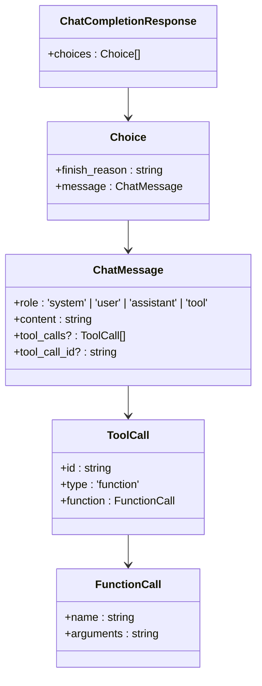

**图表来源**
- [src/agent/llm.ts:5-24](file://src/agent/llm.ts#L5-L24)

**章节来源**
- [src/agent/llm.ts:26-47](file://src/agent/llm.ts#L26-L47)
- [src/agent/llm.ts:5-24](file://src/agent/llm.ts#L5-L24)

### 工具调用机制

#### 工具执行流程

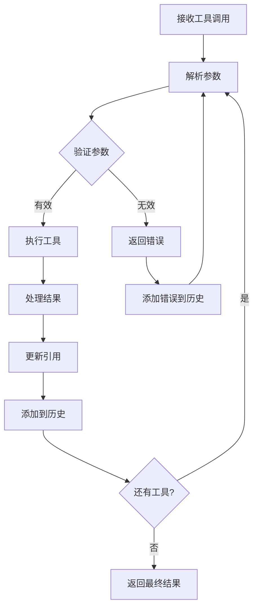

**图表来源**
- [src/agent/llm.ts:75-102](file://src/agent/llm.ts#L75-L102)
- [src/agent/tools.ts:79-112](file://src/agent/tools.ts#L79-L112)

#### 工具参数验证

每个工具都有严格的参数验证机制：

| 工具 | 参数验证 | 错误处理 |
|------|----------|----------|
| search_destinations | query 必需，limit 限制在1-50之间 | 抛出验证错误 |
| semantic_search_travel | query 必需，top_k 默认8 | 返回空结果 |
| get_destination_detail | destination_id 数字验证 | 返回未找到错误 |

**章节来源**
- [src/agent/tools.ts:114-194](file://src/agent/tools.ts#L114-L194)

### 配置管理

#### 环境变量配置

系统使用 Zod 进行配置验证，确保运行时安全：

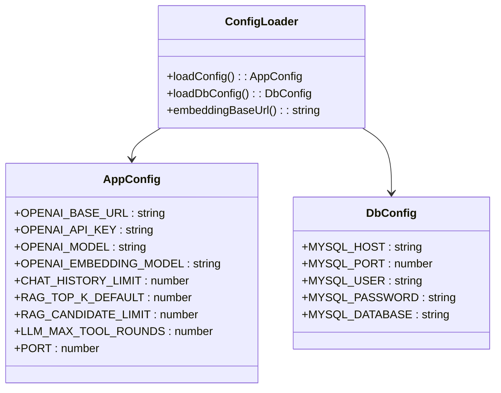

**图表来源**
- [src/config.ts:11-22](file://src/config.ts#L11-L22)
- [src/config.ts:35-45](file://src/config.ts#L35-L45)

**章节来源**
- [src/config.ts:1-46](file://src/config.ts#L1-L46)

## 依赖关系分析

### 外部依赖

系统的主要外部依赖包括：

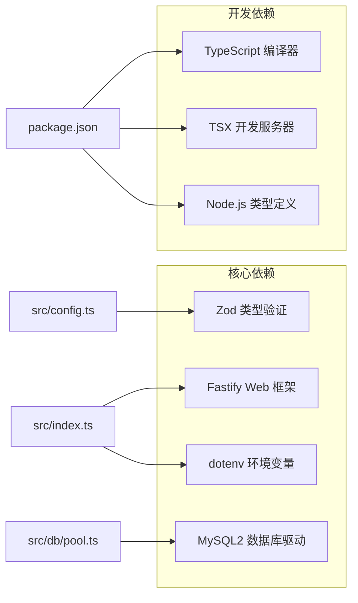

**图表来源**
- [package.json:18-30](file://package.json#L18-L30)
- [src/index.ts:1-9](file://src/index.ts#L1-L9)

### 内部模块依赖

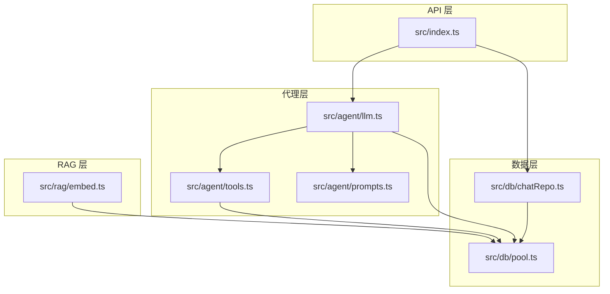

**图表来源**
- [src/index.ts:1-9](file://src/index.ts#L1-L9)
- [src/agent/llm.ts:1-3](file://src/agent/llm.ts#L1-L3)

**章节来源**
- [package.json:18-30](file://package.json#L18-L30)

## 性能考虑

### 连接池配置

系统使用 MySQL 连接池优化数据库性能：

| 配置项 | 值 | 说明 |
|--------|----|------|
| connectionLimit | 10 | 最大连接数 |
| queueLimit | 0 | 队列限制（无限制） |
| acquireTimeout | 60000 | 获取连接超时时间 |
| timeout | 60000 | 连接超时时间 |
| idleTimeout | 30000 | 空闲超时时间 |
| maxLifetimeSeconds | 3600 | 连接最大生命周期 |

### 缓存策略

系统实现了多层缓存机制：

1. **工具调用缓存**: 已执行工具的结果会被缓存
2. **会话历史缓存**: 最近的消息会被缓存以减少数据库查询
3. **向量嵌入缓存**: RAG 搜索结果会被缓存

### 错误处理和重试

系统具备完善的错误处理机制：

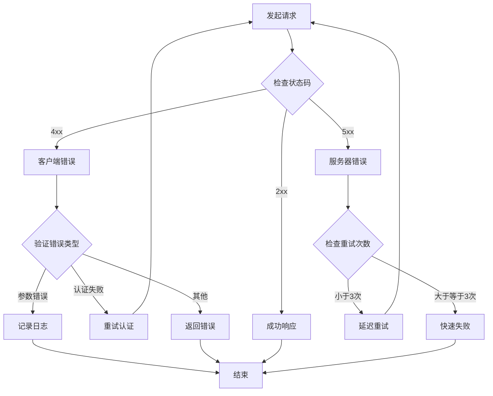

**图表来源**
- [src/agent/llm.ts:42-46](file://src/agent/llm.ts#L42-L46)

## 故障排除指南

### 常见问题及解决方案

#### 1. 认证失败

**症状**: API 调用返回 401 或 403 错误

**原因分析**:
- OPENAI_API_KEY 未设置或为空
- OPENAI_BASE_URL 配置错误
- 网络连接问题

**解决步骤**:
1. 验证环境变量是否正确设置
2. 检查网络连接状态
3. 确认 API 密钥权限

#### 2. 工具调用失败

**症状**: 工具执行过程中抛出异常

**原因分析**:
- 数据库连接失败
- 参数验证失败
- 工具实现错误

**解决步骤**:
1. 检查数据库连接状态
2. 验证工具参数格式
3. 查看工具执行日志

#### 3. 超时问题

**症状**: 请求长时间无响应

**原因分析**:
- 网络延迟过高
- LLM 模型响应慢
- 服务器负载过高

**解决步骤**:
1. 增加超时时间配置
2. 优化数据库查询
3. 水平扩展服务器实例

**章节来源**
- [src/agent/llm.ts:95-101](file://src/agent/llm.ts#L95-L101)
- [src/config.ts:35-41](file://src/config.ts#L35-L41)

### 调试技巧

#### 日志记录

系统提供了多层次的日志记录：

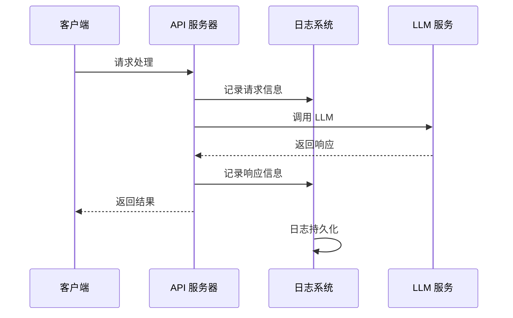

**图表来源**
- [src/index.ts:14](file://src/index.ts#L14)
- [src/agent/llm.ts:34-46](file://src/agent/llm.ts#L34-L46)

#### 性能监控

建议实施以下监控指标：

| 指标类型 | 监控内容 | 告警阈值 |
|----------|----------|----------|
| 响应时间 | API 请求响应时间 | >2000ms |
| 错误率 | LLM 调用错误率 | >5% |
| 资源使用 | CPU、内存使用率 | >80% |
| 数据库性能 | 查询响应时间 | >1000ms |

## 结论

Guide-Plan-Agent 的 LLM 调用机制展现了现代 AI 应用的最佳实践。系统通过模块化的架构设计、完善的错误处理机制和灵活的配置管理，为旅游规划场景提供了可靠的智能解决方案。

### 主要优势

1. **模块化设计**: 清晰的分层架构便于维护和扩展
2. **强类型安全**: 使用 TypeScript 和 Zod 确保运行时安全
3. **工具调用**: 支持多轮工具交互，增强 AI 能力
4. **配置灵活**: 支持多种部署环境和配置选项
5. **错误处理**: 完善的异常处理和恢复机制

### 未来改进方向

1. **增加重试机制**: 实现指数退避的自动重试
2. **性能优化**: 添加缓存层和连接池优化
3. **监控增强**: 集成 APM 工具进行性能监控
4. **安全性提升**: 添加请求限流和安全审计

该系统为构建类似的应用程序提供了优秀的参考模板，其设计理念和实现方式值得在更多场景中借鉴和应用。