# 工具调用系统

<cite>
**本文档引用的文件**
- [src/agent/tools.ts](file://src/agent/tools.ts)
- [src/agent/llm.ts](file://src/agent/llm.ts)
- [src/agent/prompts.ts](file://src/agent/prompts.ts)
- [src/db/destinationRepo.ts](file://src/db/destinationRepo.ts)
- [src/db/ragRepo.ts](file://src/db/ragRepo.ts)
- [src/db/pool.ts](file://src/db/pool.ts)
- [src/rag/embed.ts](file://src/rag/embed.ts)
- [src/rag/similarity.ts](file://src/rag/similarity.ts)
- [src/rag/ingest.ts](file://src/rag/ingest.ts)
- [src/config.ts](file://src/config.ts)
- [src/index.ts](file://src/index.ts)
- [src/db/migrations/001_init.sql](file://src/db/migrations/001_init.sql)
- [package.json](file://package.json)
</cite>

## 目录
1. [简介](#简介)
2. [项目结构](#项目结构)
3. [核心组件](#核心组件)
4. [架构概览](#架构概览)
5. [详细组件分析](#详细组件分析)
6. [依赖关系分析](#依赖关系分析)
7. [性能考虑](#性能考虑)
8. [故障排除指南](#故障排除指南)
9. [结论](#结论)
10. [附录](#附录)

## 简介

Guide-Plan-Agent 是一个基于大语言模型的智能旅游规划助手，其核心功能是通过工具调用系统实现与外部数据源的交互。该系统采用函数式工具设计模式，支持目的地查询、详情获取和语义检索等功能，能够根据用户需求自动选择合适的工具并执行相应的数据操作。

系统的核心设计理念是"工具即服务"，每个工具都是独立的功能模块，具有明确的输入输出规范和错误处理机制。通过标准化的工具接口，系统实现了灵活的工具组合和链式调用，为用户提供智能化的旅游规划服务。

## 项目结构

项目采用模块化的目录结构，按照功能域进行组织：

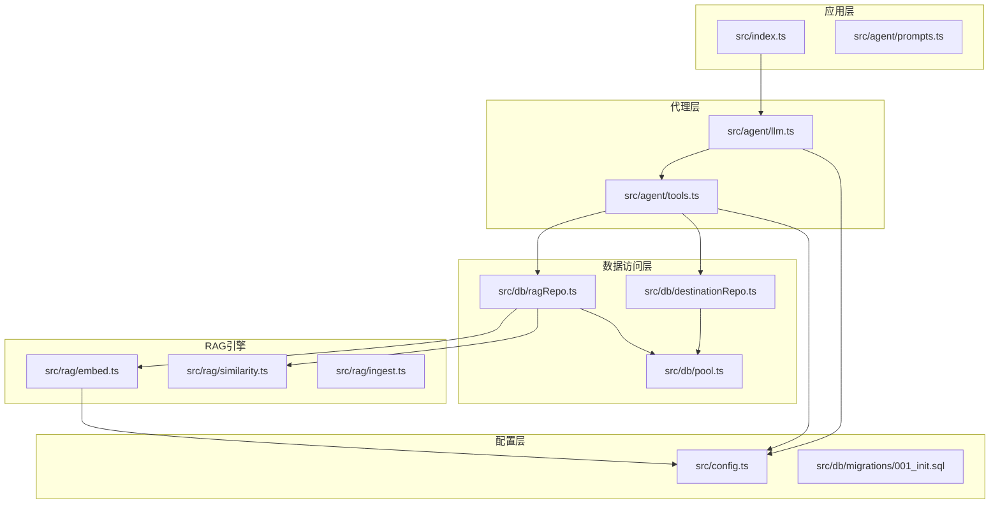

**图表来源**
- [src/index.ts:1-77](file://src/index.ts#L1-L77)
- [src/agent/llm.ts:1-114](file://src/agent/llm.ts#L1-L114)
- [src/agent/tools.ts:1-195](file://src/agent/tools.ts#L1-L195)

**章节来源**
- [src/index.ts:1-77](file://src/index.ts#L1-L77)
- [src/agent/llm.ts:1-114](file://src/agent/llm.ts#L1-L114)
- [src/agent/tools.ts:1-195](file://src/agent/tools.ts#L1-L195)

## 核心组件

### 工具定义系统

工具定义系统采用声明式设计，通过统一的工具定义数组来管理所有可用工具。每个工具都包含完整的元数据信息，包括名称、描述和参数规范。

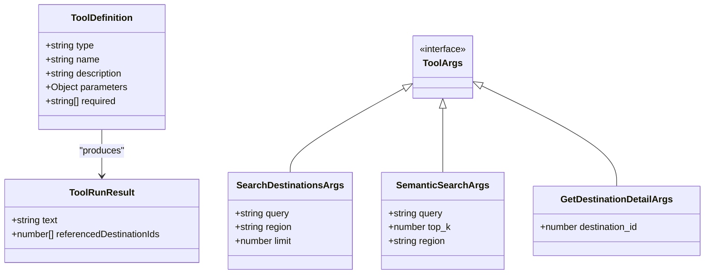

**图表来源**
- [src/agent/tools.ts:15-65](file://src/agent/tools.ts#L15-L65)
- [src/agent/tools.ts:10-13](file://src/agent/tools.ts#L10-L13)
- [src/agent/tools.ts:71-77](file://src/agent/tools.ts#L71-L77)

### 参数解析器

参数解析器负责将原始的 JSON 字符串转换为强类型的工具参数对象，同时进行必要的类型转换和验证。

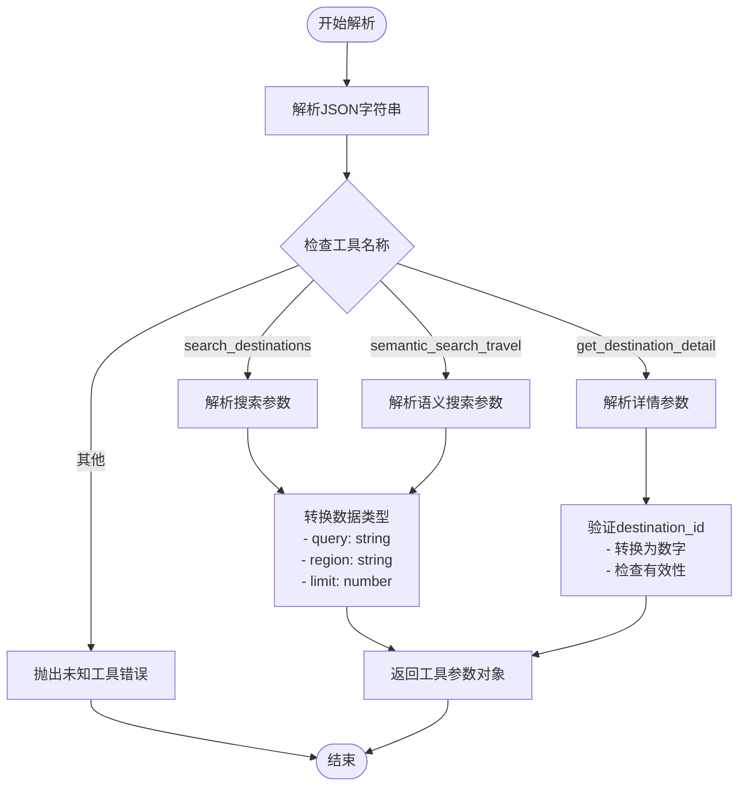

**图表来源**
- [src/agent/tools.ts:79-112](file://src/agent/tools.ts#L79-L112)

**章节来源**
- [src/agent/tools.ts:15-112](file://src/agent/tools.ts#L15-L112)

## 架构概览

系统采用分层架构设计，从上到下分为表现层、代理层、工具层和数据访问层：

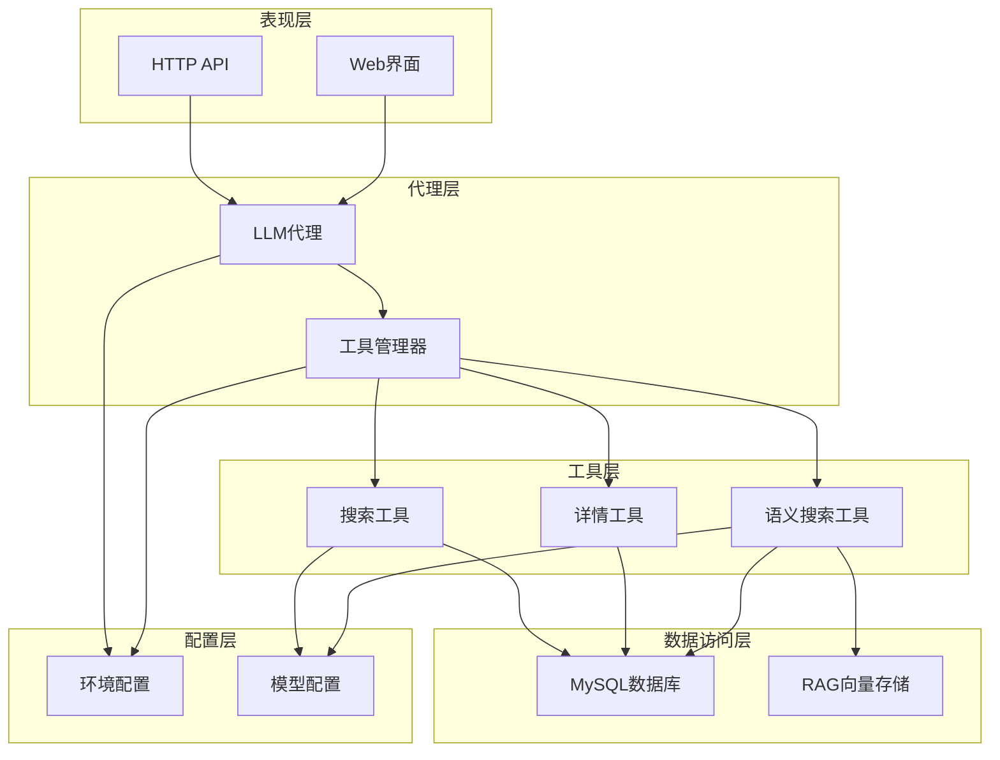

**图表来源**
- [src/index.ts:35-68](file://src/index.ts#L35-L68)
- [src/agent/llm.ts:49-114](file://src/agent/llm.ts#L49-L114)
- [src/agent/tools.ts:67-195](file://src/agent/tools.ts#L67-L195)

## 详细组件分析

### 工具执行引擎

工具执行引擎是整个系统的核心，负责协调工具的调用、参数解析和结果处理。

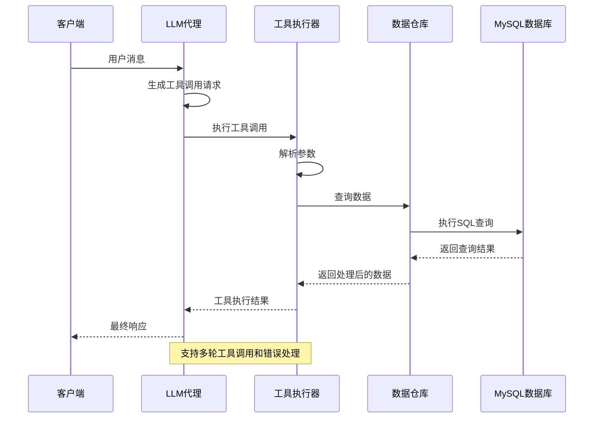

**图表来源**
- [src/agent/llm.ts:49-114](file://src/agent/llm.ts#L49-L114)
- [src/agent/tools.ts:114-195](file://src/agent/tools.ts#L114-L195)

#### 搜索工具实现

搜索工具支持结构化的目的地查询，具备关键词匹配和区域筛选功能：

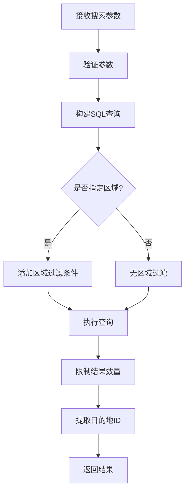

**图表来源**
- [src/agent/tools.ts:121-141](file://src/agent/tools.ts#L121-L141)
- [src/db/destinationRepo.ts:20-45](file://src/db/destinationRepo.ts#L20-L45)

#### 详情获取工具实现

详情获取工具提供目的地的完整信息，包括结构化详情和分类特征：

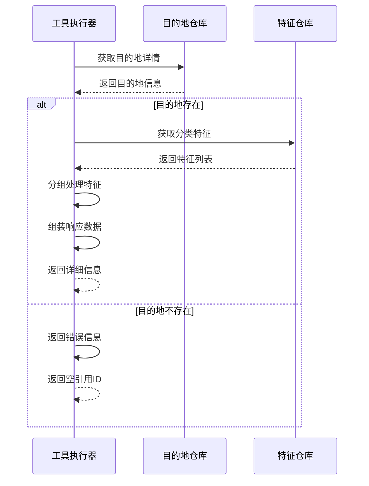

**图表来源**
- [src/agent/tools.ts:162-192](file://src/agent/tools.ts#L162-L192)
- [src/db/destinationRepo.ts:47-85](file://src/db/destinationRepo.ts#L47-L85)

#### 语义搜索工具实现

语义搜索工具基于向量相似度进行智能检索，支持自然语言查询和区域预筛选：

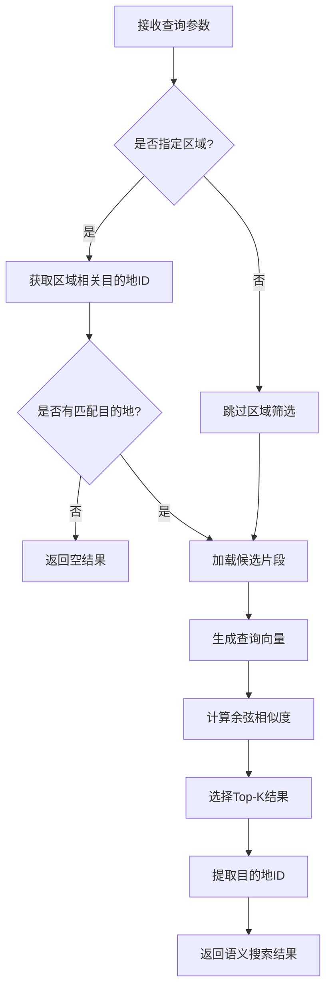

**图表来源**
- [src/agent/tools.ts:142-161](file://src/agent/tools.ts#L142-L161)
- [src/db/ragRepo.ts:97-142](file://src/db/ragRepo.ts#L97-L142)

**章节来源**
- [src/agent/tools.ts:114-195](file://src/agent/tools.ts#L114-L195)
- [src/db/destinationRepo.ts:20-100](file://src/db/destinationRepo.ts#L20-L100)
- [src/db/ragRepo.ts:97-142](file://src/db/ragRepo.ts#L97-L142)

### 上下文传递机制

系统实现了完整的上下文传递机制，确保工具调用过程中的状态保持和信息共享：

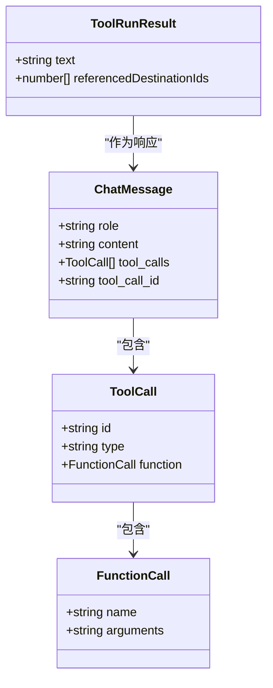

**图表来源**
- [src/agent/llm.ts:5-18](file://src/agent/llm.ts#L5-L18)

**章节来源**
- [src/agent/llm.ts:49-114](file://src/agent/llm.ts#L49-L114)

### 结果聚合与引用管理

系统实现了智能的结果聚合和引用目的地ID收集机制：

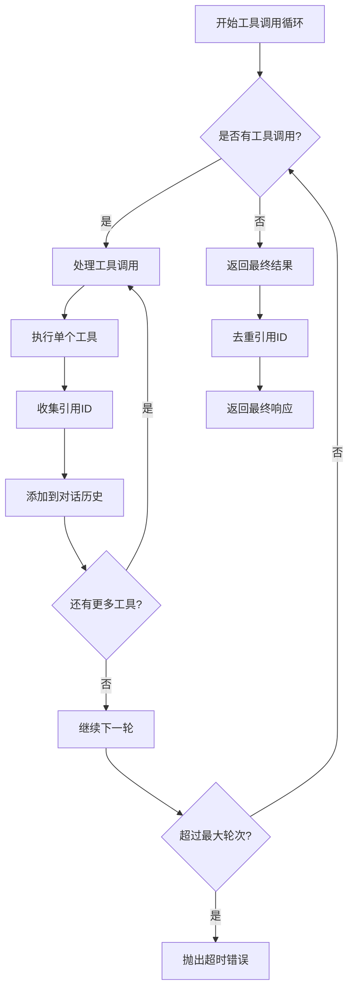

**图表来源**
- [src/agent/llm.ts:59-113](file://src/agent/llm.ts#L59-L113)

**章节来源**
- [src/agent/llm.ts:59-113](file://src/agent/llm.ts#L59-L113)

## 依赖关系分析

系统采用松耦合的设计原则，各组件之间的依赖关系清晰明确：

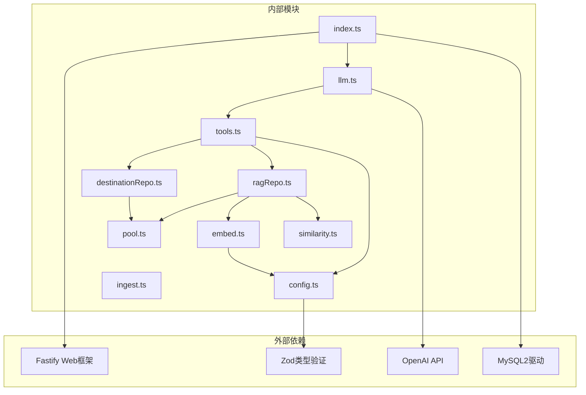

**图表来源**
- [package.json:18-30](file://package.json#L18-L30)
- [src/index.ts:1-77](file://src/index.ts#L1-L77)
- [src/agent/llm.ts:1-114](file://src/agent/llm.ts#L1-L114)
- [src/agent/tools.ts:1-195](file://src/agent/tools.ts#L1-L195)

**章节来源**
- [package.json:18-30](file://package.json#L18-L30)
- [src/config.ts:1-46](file://src/config.ts#L1-L46)

## 性能考虑

### 查询优化策略

系统在多个层面实现了性能优化：

1. **数据库查询优化**
   - 使用适当的索引策略（主键、外键、复合索引）
   - 实现查询参数化，防止SQL注入
   - 限制查询结果集大小，避免内存溢出

2. **缓存机制**
   - 向量嵌入结果缓存
   - 查询结果缓存
   - 配置参数缓存

3. **并发控制**
   - 连接池管理
   - 异步查询执行
   - 超时控制

### 内存管理

系统采用流式处理和分页机制来控制内存使用：

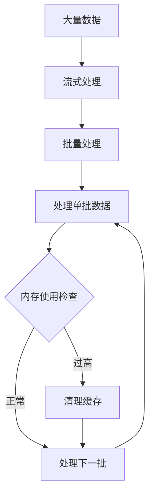

## 故障排除指南

### 常见问题诊断

1. **工具调用失败**
   - 检查工具名称是否正确
   - 验证参数格式和类型
   - 查看数据库连接状态

2. **查询性能问题**
   - 分析SQL执行计划
   - 检查索引使用情况
   - 监控数据库负载

3. **内存泄漏**
   - 检查异步操作的清理
   - 验证事件监听器的移除
   - 监控对象引用关系

### 错误处理机制

系统实现了多层次的错误处理：

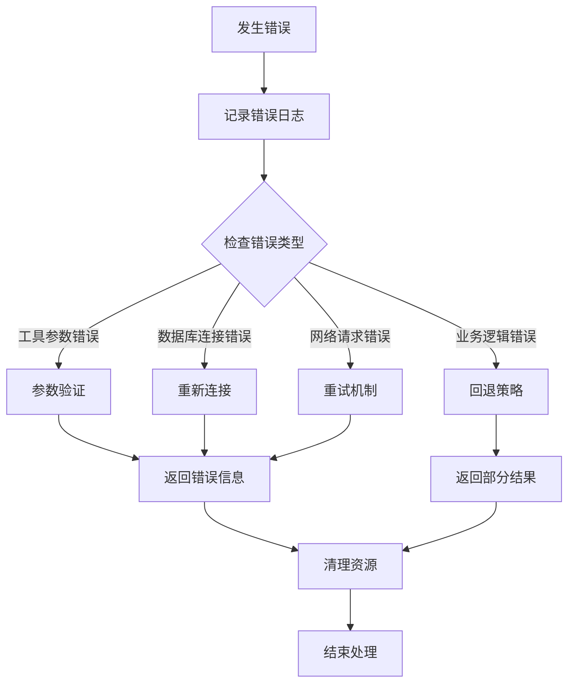

**章节来源**
- [src/agent/llm.ts:95-101](file://src/agent/llm.ts#L95-L101)
- [src/agent/tools.ts:103-112](file://src/agent/tools.ts#L103-L112)

## 结论

Guide-Plan-Agent 的工具调用系统展现了现代AI应用的优秀架构设计。通过模块化的工具定义、严格的参数验证和智能的上下文管理，系统实现了高度可扩展和可维护的工具调用机制。

系统的主要优势包括：
- **模块化设计**：每个工具都是独立的功能单元
- **类型安全**：完整的TypeScript类型定义
- **错误处理**：完善的异常处理和恢复机制
- **性能优化**：多层缓存和查询优化
- **扩展性**：易于添加新工具和自定义业务逻辑

## 附录

### 工具扩展指南

#### 添加新工具的步骤

1. **定义工具元数据**
   ```typescript
   // 在工具定义数组中添加新工具
   const newToolDefinition = {
     type: 'function',
     function: {
       name: 'your_tool_name',
       description: '工具功能描述',
       parameters: {
         type: 'object',
         properties: {
           // 定义参数
         },
         required: [] // 必需参数列表
       }
     }
   }
   ```

2. **实现工具逻辑**
   ```typescript
   // 在runTool函数中添加新工具分支
   if (parsed.name === 'your_tool_name') {
     // 实现工具逻辑
     return {
       text: JSON.stringify(result),
       referencedDestinationIds: ids
     }
   }
   ```

3. **更新类型定义**
   ```typescript
   // 更新ToolArgs联合类型
   type ToolArgs =
     // ... 其他工具类型
     | { name: 'your_tool_name'; args: YourToolArgs }
   ```

#### 自定义业务逻辑最佳实践

1. **参数验证**
   - 始终验证输入参数的有效性
   - 提供合理的默认值
   - 实施参数范围检查

2. **错误处理**
   - 使用具体的错误类型
   - 记录详细的错误上下文
   - 提供有意义的错误消息

3. **性能优化**
   - 实施适当的缓存策略
   - 优化数据库查询
   - 控制内存使用

4. **测试策略**
   - 编写单元测试
   - 实施集成测试
   - 进行性能测试

### 调试技巧

1. **日志记录**
   - 记录工具调用的输入输出
   - 跟踪数据库查询执行时间
   - 监控API调用响应

2. **监控指标**
   - 工具调用成功率
   - 平均响应时间
   - 错误率统计

3. **性能分析**
   - 使用性能分析工具
   - 监控内存使用情况
   - 分析数据库查询性能