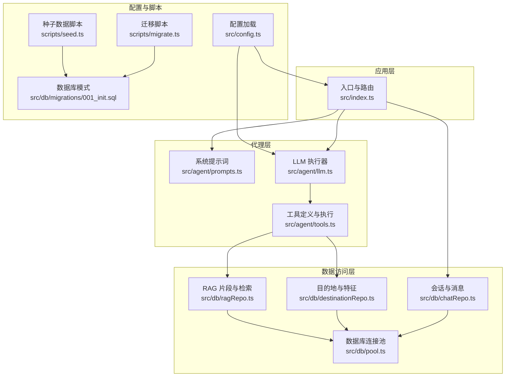
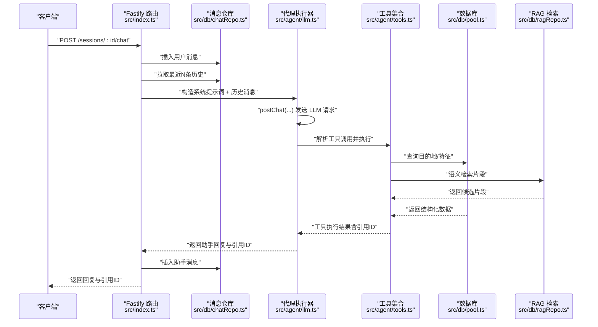
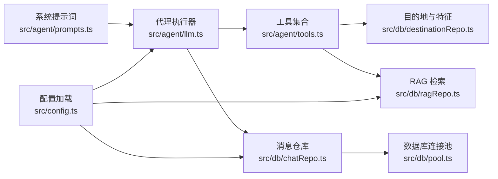

# 提示词管理

<cite>
**本文引用的文件列表**
- [src/agent/prompts.ts](file://src/agent/prompts.ts)
- [src/agent/llm.ts](file://src/agent/llm.ts)
- [src/agent/tools.ts](file://src/agent/tools.ts)
- [src/index.ts](file://src/index.ts)
- [src/db/chatRepo.ts](file://src/db/chatRepo.ts)
- [src/db/destinationRepo.ts](file://src/db/destinationRepo.ts)
- [src/db/ragRepo.ts](file://src/db/ragRepo.ts)
- [src/db/pool.ts](file://src/db/pool.ts)
- [src/config.ts](file://src/config.ts)
- [scripts/migrate.ts](file://scripts/migrate.ts)
- [scripts/seed.ts](file://scripts/seed.ts)
- [src/db/migrations/001_init.sql](file://src/db/migrations/001_init.sql)
</cite>

## 目录
1. [简介](#简介)
2. [项目结构](#项目结构)
3. [核心组件](#核心组件)
4. [架构总览](#架构总览)
5. [详细组件分析](#详细组件分析)
6. [依赖关系分析](#依赖关系分析)
7. [性能考量](#性能考量)
8. [故障排查指南](#故障排查指南)
9. [结论](#结论)
10. [附录](#附录)

## 简介
本技术文档聚焦于 Guide-Plan-Agent 的“提示词管理系统”，围绕系统提示词的设计原则与构建逻辑、上下文管理机制、提示词模板的参数化与动态注入、个性化定制策略、以及提示词优化与测试验证方法进行系统化阐述。该系统通过“系统提示词 + 工具调用 + 多轮对话上下文”的组合，实现面向中文旅游场景的智能问答与推荐，强调“以事实为依据、避免幻觉、提升准确性”。

## 项目结构
项目采用分层与功能模块化组织：
- 应用入口与路由：Fastify 路由处理会话与聊天请求，组装系统提示词与历史消息，调用代理执行器。
- 代理层：封装 LLM 请求、工具调用循环、上下文拼接与错误处理。
- 数据访问层：会话与消息持久化、目的地与特征查询、RAG 片段加载与相似度检索。
- 配置与环境：统一加载配置，控制模型、温度、最大工具轮次、历史长度等。
- 脚本：数据库初始化、种子数据导入、RAG 向量化重建。

图表来源
- [src/index.ts:1-77](file://src/index.ts#L1-L77)
- [src/agent/prompts.ts:1-10](file://src/agent/prompts.ts#L1-L10)
- [src/agent/llm.ts:1-114](file://src/agent/llm.ts#L1-L114)
- [src/agent/tools.ts:1-195](file://src/agent/tools.ts#L1-L195)
- [src/db/chatRepo.ts:1-53](file://src/db/chatRepo.ts#L1-L53)
- [src/db/destinationRepo.ts:1-100](file://src/db/destinationRepo.ts#L1-L100)
- [src/db/ragRepo.ts:1-143](file://src/db/ragRepo.ts#L1-L143)
- [src/db/pool.ts:1-17](file://src/db/pool.ts#L1-L17)
- [src/config.ts:1-46](file://src/config.ts#L1-L46)
- [scripts/migrate.ts:1-34](file://scripts/migrate.ts#L1-L34)
- [scripts/seed.ts:1-89](file://scripts/seed.ts#L1-L89)
- [src/db/migrations/001_init.sql:1-54](file://src/db/migrations/001_init.sql#L1-L54)

章节来源
- [src/index.ts:1-77](file://src/index.ts#L1-L77)
- [src/config.ts:1-46](file://src/config.ts#L1-L46)

## 核心组件
- 系统提示词（System Prompt）
  - 设计原则：明确角色定位（中文旅游顾问）、行为规则（工具优先、事实优先、避免编造）、对话策略（结合历史、处理省略与指代）。
  - 构建逻辑：以“规则清单”形式表达工具调用顺序与优先级，确保 LLM 在不同输入形态下遵循一致的决策流程。
- 上下文管理
  - 历史截断：通过配置项限制历史消息数量，保证上下文窗口可控。
  - 消息拼接：将系统提示词与最近 N 条用户/助手消息合并为一次推理的完整上下文。
  - 参考目的地 ID 收集：在工具调用链中收集被引用的目的地 ID，便于前端展示与后续追踪。
- 工具调用与提示词协同
  - 工具定义：结构化函数定义，包含名称、描述、参数与必填字段，作为 LLM 的“工具选择”依据。
  - 工具执行：解析 LLM 返回的工具调用参数，执行数据库查询或 RAG 检索，将结果回写到对话历史，驱动多轮迭代。
- 配置与扩展点
  - 温度、最大工具轮次、历史长度、RAG 参数等均通过配置集中管理，便于在不修改代码的情况下进行提示词与行为的微调。

章节来源
- [src/agent/prompts.ts:1-10](file://src/agent/prompts.ts#L1-L10)
- [src/agent/llm.ts:49-114](file://src/agent/llm.ts#L49-L114)
- [src/agent/tools.ts:15-69](file://src/agent/tools.ts#L15-L69)
- [src/db/chatRepo.ts:23-40](file://src/db/chatRepo.ts#L23-L40)
- [src/config.ts:11-22](file://src/config.ts#L11-L22)

## 架构总览
系统通过 Fastify 路由接收用户消息，加载系统提示词与历史消息，调用代理执行器。代理执行器将消息发送给 LLM，根据返回的工具调用执行数据库查询或 RAG 检索，并将结果回写到历史中，形成“提示词 + 工具 + 上下文”的闭环。

图表来源
- [src/index.ts:35-68](file://src/index.ts#L35-L68)
- [src/agent/llm.ts:49-114](file://src/agent/llm.ts#L49-L114)
- [src/agent/tools.ts:114-195](file://src/agent/tools.ts#L114-L195)
- [src/db/chatRepo.ts:23-52](file://src/db/chatRepo.ts#L23-L52)
- [src/db/ragRepo.ts:97-143](file://src/db/ragRepo.ts#L97-L143)
- [src/db/pool.ts:4-14](file://src/db/pool.ts#L4-L14)

## 详细组件分析

### 系统提示词（System Prompt）
- 角色设定
  - 明确身份：中文旅游顾问助手，职责是理解用户需求并给出可执行、友好的建议。
- 任务描述
  - 列举类需求：当用户要求列举美食、景点或文化特色时，必须调用结构化工具读取事实，不得凭空编造。
  - 灵感匹配：当用户描述模糊或需要灵感匹配时，优先进行语义检索，再结合常识组织回答。
  - 关键词/地区：当用户提供明确关键词或地区时，可进行结构化检索。
- 约束条件
  - 冲突处理：若结构化事实与语义检索片段冲突，以结构化结果为准。
  - 展示规范：可在回答中标注目的地 id 以便前端展示，但避免堆砌内部 JSON。
  - 历史理解：结合会话历史理解省略主语、指代，必要时先总结用户偏好再调用工具。
- 设计要点
  - 将“工具优先、事实优先”的原则固化为规则清单，降低 LLM 的自由度，减少幻觉风险。
  - 强调“可执行建议”，避免空泛描述，提升实用性。

章节来源
- [src/agent/prompts.ts:1-10](file://src/agent/prompts.ts#L1-L10)

### 上下文管理机制
- 历史截断与拼接
  - 通过配置项限制历史消息数量，避免上下文过长导致性能与成本问题。
  - 将系统提示词与最近 N 条用户/助手消息拼接为一次推理的完整上下文。
- 多轮对话维护
  - 每轮 LLM 输出可能包含工具调用，代理执行器将其转换为工具调用历史，再继续下一轮推理，直至无工具调用或达到最大轮次。
- 参考目的地 ID 收集
  - 工具执行结果中包含被引用的目的地 ID 集合，代理执行器将其汇总，最终返回给客户端，便于前端展示与后续追踪。

章节来源
- [src/db/chatRepo.ts:23-40](file://src/db/chatRepo.ts#L23-L40)
- [src/index.ts:50-61](file://src/index.ts#L50-L61)
- [src/agent/llm.ts:56-113](file://src/agent/llm.ts#L56-L113)

### 提示词模板的参数化设计与动态注入
- 参数化设计
  - 工具定义采用结构化参数（名称、描述、参数对象、必填字段），作为 LLM 的“工具选择”依据，实现提示词与工具的解耦。
  - 工具参数解析严格校验，确保输入合法性，避免因参数错误导致的异常。
- 动态内容注入
  - 代理执行器在每轮推理中将上一轮的工具调用结果注入到历史中，形成“问题 -> 工具调用 -> 工具结果 -> 推理”的动态闭环。
  - RAG 检索结果与结构化查询结果以统一格式注入，保持提示词对不同来源信息的一致处理方式。
- 个性化定制
  - 通过配置项（如温度、最大工具轮次、历史长度）在不修改提示词的前提下进行行为定制。
  - 工具定义可扩展，新增工具时仅需在工具定义处增加新函数定义与参数说明，提示词无需改动。

章节来源
- [src/agent/tools.ts:15-69](file://src/agent/tools.ts#L15-L69)
- [src/agent/tools.ts:79-112](file://src/agent/tools.ts#L79-L112)
- [src/agent/llm.ts:59-104](file://src/agent/llm.ts#L59-L104)
- [src/config.ts:11-22](file://src/config.ts#L11-L22)

### 提示词优化策略
- 减少幻觉
  - 明确“列举事实必须调用工具”的规则，避免 LLM 自行编造条目。
  - 冲突处理规则：结构化事实优先于语义检索片段，确保输出以权威数据为准。
- 提高准确性
  - 对模糊描述优先进行语义检索，再结合常识组织回答，提升匹配质量。
  - 工具执行结果中包含引用的目的地 ID，便于前端展示与二次确认。
- 提升可执行性
  - 强调“可执行、友好”的建议风格，避免空泛描述，增强实用性。

章节来源
- [src/agent/prompts.ts:1-10](file://src/agent/prompts.ts#L1-L10)
- [src/agent/tools.ts:114-195](file://src/agent/tools.ts#L114-L195)

### 提示词开发指南与测试验证方法
- 开发指南
  - 规则优先：在提示词中明确工具调用顺序与优先级，确保 LLM 在不同输入形态下遵循一致的决策流程。
  - 输入约束：在工具定义中明确参数类型、描述与必填字段，减少 LLM 的自由发挥空间。
  - 输出规范：在提示词中约定输出格式与展示规范，避免堆砌内部 JSON。
- 测试验证
  - 单元测试：针对工具定义与参数解析进行单元测试，覆盖边界值与非法输入。
  - 集成测试：通过路由接口模拟多轮对话，验证上下文拼接、工具调用与结果注入的正确性。
  - 场景回归：准备典型场景（列举类、模糊描述、关键词/地区）进行回归测试，确保规则生效。
  - 性能测试：在不同历史长度与工具轮次下进行压力测试，评估响应时间与资源消耗。

章节来源
- [src/agent/tools.ts:79-112](file://src/agent/tools.ts#L79-L112)
- [src/index.ts:35-68](file://src/index.ts#L35-L68)

## 依赖关系分析
- 组件耦合
  - 入口路由依赖系统提示词与消息仓库；代理执行器依赖工具集合；工具集合依赖数据库与 RAG 模块。
  - 提示词与工具定义之间通过 LLM 的函数调用能力耦合，形成“提示词 -> 工具选择 -> 工具执行”的闭环。
- 外部依赖
  - OpenAI API（或兼容服务）用于生成对话与工具调用；MySQL 用于存储会话、消息、目的地、特征与 RAG 片段。
- 配置影响
  - 温度、最大工具轮次、历史长度、RAG 参数等配置直接影响提示词效果与系统行为。

图表来源
- [src/agent/prompts.ts:1-10](file://src/agent/prompts.ts#L1-L10)
- [src/agent/llm.ts:49-114](file://src/agent/llm.ts#L49-L114)
- [src/agent/tools.ts:1-195](file://src/agent/tools.ts#L1-L195)
- [src/db/chatRepo.ts:1-53](file://src/db/chatRepo.ts#L1-L53)
- [src/db/destinationRepo.ts:1-100](file://src/db/destinationRepo.ts#L1-L100)
- [src/db/ragRepo.ts:1-143](file://src/db/ragRepo.ts#L1-L143)
- [src/db/pool.ts:1-17](file://src/db/pool.ts#L1-L17)
- [src/config.ts:1-46](file://src/config.ts#L1-L46)

## 性能考量
- 历史长度控制：通过配置项限制历史消息数量，避免上下文过长导致性能与成本问题。
- 工具轮次限制：通过最大工具轮次防止无限循环与过度调用。
- 数据库查询优化：目的地与特征查询使用索引列，RAG 加载候选片段时限制数量。
- 向量检索优化：RAG 检索前可按地区预筛选，减少候选集规模。

章节来源
- [src/config.ts:18-21](file://src/config.ts#L18-L21)
- [src/db/destinationRepo.ts:20-45](file://src/db/destinationRepo.ts#L20-L45)
- [src/db/ragRepo.ts:110-142](file://src/db/ragRepo.ts#L110-L142)

## 故障排查指南
- 常见错误
  - LLM 返回非助手消息：检查代理执行器的消息角色判断与异常处理。
  - 工具调用失败：检查工具参数解析与数据库连接状态，查看工具执行结果中的错误信息。
  - 会话不存在：检查会话 ID 是否有效，确认消息插入与查询逻辑。
- 排查步骤
  - 核对配置项是否正确加载（模型、API 密钥、历史长度、最大工具轮次）。
  - 查看消息仓库中是否存在最近历史记录，确认截断逻辑是否生效。
  - 检查工具定义与参数解析是否匹配，关注必填字段与类型校验。
  - 验证数据库连接池与表结构是否正确，确认迁移脚本已执行。

章节来源
- [src/agent/llm.ts:68-74](file://src/agent/llm.ts#L68-L74)
- [src/agent/tools.ts:101-112](file://src/agent/tools.ts#L101-L112)
- [src/index.ts:44-48](file://src/index.ts#L44-L48)
- [scripts/migrate.ts:23-26](file://scripts/migrate.ts#L23-L26)

## 结论
本系统的提示词管理以“系统提示词 + 工具调用 + 多轮上下文”为核心，通过明确的角色设定、严格的工具优先与事实优先规则、以及完善的上下文截断与轮次限制，有效降低了幻觉风险并提升了准确性与可执行性。配合参数化的工具定义与动态内容注入，系统具备良好的扩展性与可维护性。通过配置中心化与测试验证体系，可以在不修改提示词的前提下进行行为定制与回归保障。

## 附录
- 数据库模式概览
  - 目的地表：存储目的地基本信息与标签。
  - 特征表：存储美食、景色、文化三类特征，外键关联目的地。
  - 会话与消息表：存储会话与消息历史，支持按会话查询与排序。
  - RAG 片段表：存储向量化后的文本片段与嵌入，支持按目的地与来源检索。

章节来源
- [src/db/migrations/001_init.sql:3-53](file://src/db/migrations/001_init.sql#L3-L53)
- [scripts/seed.ts:21-79](file://scripts/seed.ts#L21-L79)