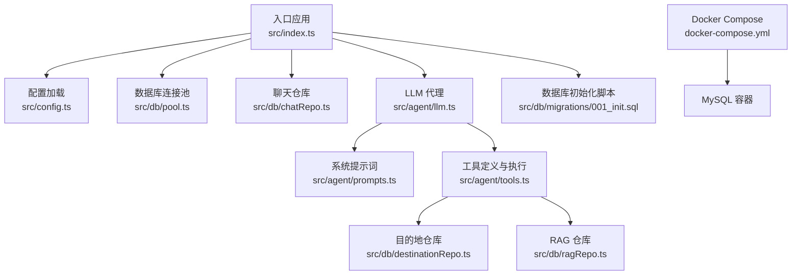
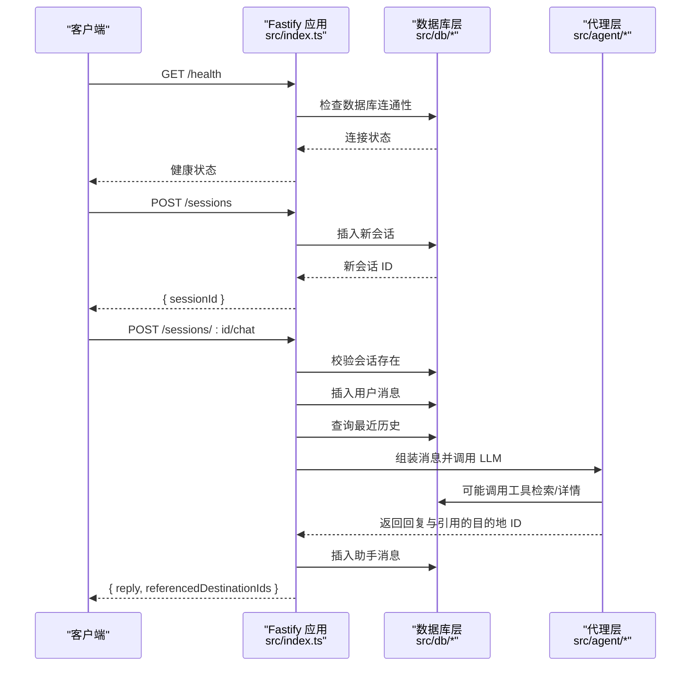
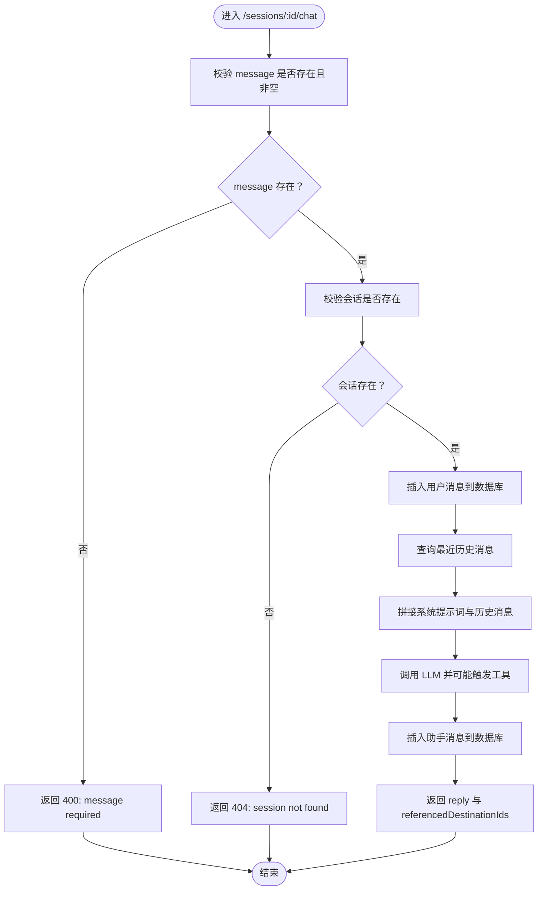
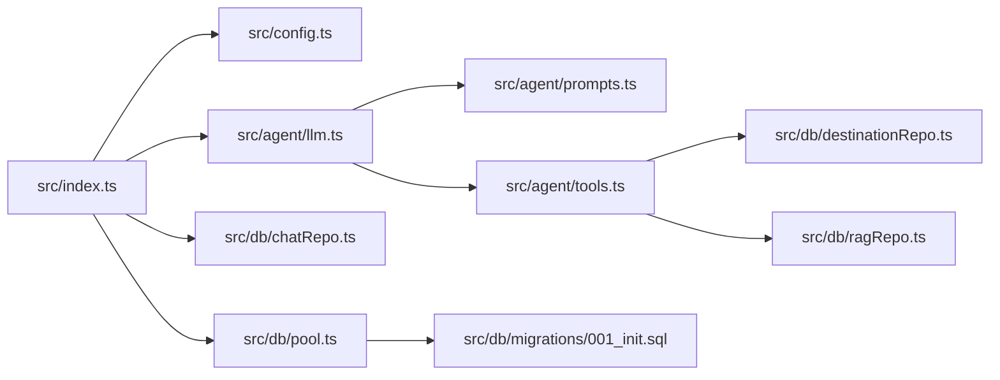

# API 接口文档

<cite>
**本文引用的文件**
- [src/index.ts](file://src/index.ts)
- [src/config.ts](file://src/config.ts)
- [src/db/pool.ts](file://src/db/pool.ts)
- [src/db/chatRepo.ts](file://src/db/chatRepo.ts)
- [src/agent/llm.ts](file://src/agent/llm.ts)
- [src/agent/prompts.ts](file://src/agent/prompts.ts)
- [src/agent/tools.ts](file://src/agent/tools.ts)
- [src/db/destinationRepo.ts](file://src/db/destinationRepo.ts)
- [src/db/ragRepo.ts](file://src/db/ragRepo.ts)
- [src/db/migrations/001_init.sql](file://src/db/migrations/001_init.sql)
- [package.json](file://package.json)
- [docker-compose.yml](file://docker-compose.yml)
</cite>

## 目录
1. [简介](#简介)
2. [项目结构](#项目结构)
3. [核心组件](#核心组件)
4. [架构总览](#架构总览)
5. [详细组件分析](#详细组件分析)
6. [依赖关系分析](#依赖关系分析)
7. [性能考虑](#性能考虑)
8. [故障排查指南](#故障排查指南)
9. [结论](#结论)
10. [附录](#附录)

## 简介
本项目是一个基于 Fastify 的 RESTful API 服务，提供旅行规划 Agent 的核心能力，包括：
- 健康检查接口，用于服务与数据库连通性验证
- 会话管理接口，支持创建新会话
- 聊天对话接口，支持与智能体进行多轮对话，具备工具调用能力（结构化检索、语义检索、目的地详情）

该服务通过环境变量配置 OpenAI API、MySQL 连接、历史长度、RAG 参数等，支持在 Docker 环境下快速部署与运行。

## 项目结构
- 入口文件负责路由注册与监听
- 配置模块负责加载与校验环境变量
- 数据库层提供会话、消息、目的地、RAG 片段的 CRUD 能力
- 代理层封装 LLM 调用与工具链路，实现多轮对话与工具调用
- Docker Compose 提供 MySQL 容器化运行

图表来源
- [src/index.ts:11-77](file://src/index.ts#L11-L77)
- [src/config.ts:35-41](file://src/config.ts#L35-L41)
- [src/db/pool.ts:4-14](file://src/db/pool.ts#L4-L14)
- [src/db/chatRepo.ts:6-52](file://src/db/chatRepo.ts#L6-L52)
- [src/agent/llm.ts:49-114](file://src/agent/llm.ts#L49-L114)
- [src/agent/prompts.ts:1-10](file://src/agent/prompts.ts#L1-L10)
- [src/agent/tools.ts:15-69](file://src/agent/tools.ts#L15-L69)
- [src/db/destinationRepo.ts:20-45](file://src/db/destinationRepo.ts#L20-L45)
- [src/db/ragRepo.ts:97-142](file://src/db/ragRepo.ts#L97-L142)
- [src/db/migrations/001_init.sql:1-54](file://src/db/migrations/001_init.sql#L1-L54)
- [docker-compose.yml:1-16](file://docker-compose.yml#L1-L16)

章节来源
- [src/index.ts:11-77](file://src/index.ts#L11-L77)
- [src/config.ts:35-41](file://src/config.ts#L35-L41)
- [src/db/migrations/001_init.sql:1-54](file://src/db/migrations/001_init.sql#L1-L54)

## 核心组件
- Fastify 应用与路由
  - 注册 CORS 中间件
  - 提供 /health、/sessions、/sessions/:id/chat 三个端点
- 配置加载
  - 通过 Zod 校验环境变量，包含数据库、OpenAI、RAG、历史长度等参数
- 数据库层
  - 会话与消息表、目的地与特征表、RAG 片段表
  - 提供会话存在性检查、最近消息列表、插入消息、目的地检索、RAG 语义检索等方法
- 代理层
  - 将系统提示词与历史消息拼接，调用 LLM 并根据工具定义自动选择工具
  - 工具包括结构化检索、语义检索、目的地详情读取

章节来源
- [src/index.ts:14-71](file://src/index.ts#L14-L71)
- [src/config.ts:35-41](file://src/config.ts#L35-L41)
- [src/db/chatRepo.ts:6-52](file://src/db/chatRepo.ts#L6-L52)
- [src/agent/llm.ts:49-114](file://src/agent/llm.ts#L49-L114)
- [src/agent/tools.ts:15-69](file://src/agent/tools.ts#L15-L69)

## 架构总览
整体架构采用分层设计：HTTP 层（Fastify）、业务逻辑层（聊天与代理）、数据访问层（MySQL 与 RAG），并通过环境变量统一配置。

图表来源
- [src/index.ts:18-68](file://src/index.ts#L18-L68)
- [src/db/chatRepo.ts:6-52](file://src/db/chatRepo.ts#L6-L52)
- [src/agent/llm.ts:49-114](file://src/agent/llm.ts#L49-L114)
- [src/agent/tools.ts:114-195](file://src/agent/tools.ts#L114-L195)

## 详细组件分析

### 健康检查接口
- 功能：检查服务与数据库的连通性
- HTTP 方法：GET
- URL 模式：/health
- 请求参数：无
- 成功响应：
  - 字段：ok（布尔）、db（布尔）
  - 示例：{"ok":true,"db":true}
- 失败响应：
  - 状态码：503 Service Unavailable
  - 字段：ok（布尔）、db（布尔）、error（字符串）
  - 示例：{"ok":false,"db":false,"error":"连接异常信息"}
- 错误码：
  - 503：数据库不可达或查询失败
- 典型使用场景：
  - 容器健康检查、负载均衡探活、CI/CD 部署验证

章节来源
- [src/index.ts:18-26](file://src/index.ts#L18-L26)

### 会话管理接口
- 功能：创建新的聊天会话，返回会话 ID
- HTTP 方法：POST
- URL 模式：/sessions
- 请求参数：无
- 成功响应：
  - 状态码：201 Created
  - 字段：sessionId（字符串，UUID）
  - 示例：{"sessionId":"xxxxxxxx-xxxx-4xxx-yxxx-xxxxxxxxxxxx"}
- 失败响应：无（当前实现不返回错误）
- 典型使用场景：
  - 客户端初始化一次对话，后续所有聊天均使用该会话 ID

章节来源
- [src/index.ts:28-33](file://src/index.ts#L28-L33)

### 聊天对话接口
- 功能：向智能体发送消息，获得回复，并返回引用的目的地 ID 列表
- HTTP 方法：POST
- URL 模式：/sessions/:id/chat
- 路径参数：
  - id（字符串，UUID）：会话 ID
- 请求体：
  - message（字符串，必填）：用户输入
- 成功响应：
  - 字段：reply（字符串）、referencedDestinationIds（数组，数字）
  - 示例：{"reply":"建议您前往XX地","referencedDestinationIds":[101,102]}
- 失败响应：
  - 400 Bad Request：message 缺失或为空
    - 字段：error（字符串）
    - 示例：{"error":"message required"}
  - 404 Not Found：会话不存在
    - 字段：error（字符串）
    - 示例：{"error":"session not found"}
- 典型使用场景：
  - 用户输入“我想去爬山”，系统返回推荐地点与理由，并标记引用的目的地 ID

图表来源
- [src/index.ts:35-68](file://src/index.ts#L35-L68)
- [src/db/chatRepo.ts:6-52](file://src/db/chatRepo.ts#L6-L52)
- [src/agent/llm.ts:49-114](file://src/agent/llm.ts#L49-L114)
- [src/agent/prompts.ts:1-10](file://src/agent/prompts.ts#L1-L10)

章节来源
- [src/index.ts:35-68](file://src/index.ts#L35-L68)
- [src/db/chatRepo.ts:6-52](file://src/db/chatRepo.ts#L6-L52)
- [src/agent/llm.ts:49-114](file://src/agent/llm.ts#L49-L114)

### 认证机制
- 当前实现未对任何端点启用鉴权
- 建议在生产环境中增加鉴权（如 API Key、JWT 或 OAuth），并在网关层统一处理

章节来源
- [src/index.ts:14-16](file://src/index.ts#L14-L16)

### 速率限制
- 当前实现未内置速率限制
- 建议在网关或中间件层添加限流策略（如基于 IP 或会话 ID）

章节来源
- [src/index.ts:14-16](file://src/index.ts#L14-L16)

### 版本控制策略
- 当前未实现显式的 API 版本控制
- 建议在 URL 中加入版本号（如 /v1/sessions）或通过 Accept 头部协商版本

章节来源
- [src/index.ts:18-68](file://src/index.ts#L18-L68)

## 依赖关系分析
- Fastify 应用依赖配置模块、数据库连接池、聊天仓库、代理层
- 代理层依赖工具定义与执行、系统提示词、数据库与 RAG 仓库
- 数据库层依赖 MySQL 连接池与迁移脚本初始化的表结构

图表来源
- [src/index.ts:14-71](file://src/index.ts#L14-L71)
- [src/config.ts:35-41](file://src/config.ts#L35-L41)
- [src/db/pool.ts:4-14](file://src/db/pool.ts#L4-L14)
- [src/db/chatRepo.ts:6-52](file://src/db/chatRepo.ts#L6-L52)
- [src/agent/llm.ts:49-114](file://src/agent/llm.ts#L49-L114)
- [src/agent/prompts.ts:1-10](file://src/agent/prompts.ts#L1-L10)
- [src/agent/tools.ts:15-69](file://src/agent/tools.ts#L15-L69)
- [src/db/destinationRepo.ts:20-45](file://src/db/destinationRepo.ts#L20-L45)
- [src/db/ragRepo.ts:97-142](file://src/db/ragRepo.ts#L97-L142)
- [src/db/migrations/001_init.sql:1-54](file://src/db/migrations/001_init.sql#L1-L54)

章节来源
- [src/index.ts:14-71](file://src/index.ts#L14-L71)
- [src/agent/tools.ts:15-69](file://src/agent/tools.ts#L15-L69)

## 性能考虑
- 数据库连接池
  - 默认连接数为 10，可根据并发请求数调整
- 历史消息长度
  - 通过环境变量控制，过长的历史会增加 LLM 上下文成本
- RAG 检索
  - 候选集大小与 Top-K 可配置，影响召回质量与延迟
- LLM 调用
  - 工具调用轮次有限制，避免无限循环
- 建议优化
  - 在网关层启用缓存与压缩
  - 对高频查询建立索引（如会话与时间戳索引）
  - 使用异步写入减少阻塞

章节来源
- [src/db/pool.ts:11-13](file://src/db/pool.ts#L11-L13)
- [src/config.ts:18-21](file://src/config.ts#L18-L21)
- [src/agent/llm.ts:57-113](file://src/agent/llm.ts#L57-L113)

## 故障排查指南
- /health 返回 503
  - 检查数据库连接参数与网络连通性
  - 查看数据库日志与容器健康状态
- /sessions 返回 404
  - 确认会话 ID 是否正确传递
  - 检查会话是否被清理或过期
- /sessions/:id/chat 返回 400
  - 确认请求体包含 message 字段且非空
- /sessions/:id/chat 返回 404
  - 确认会话 ID 是否存在
  - 检查数据库中 chat_sessions 表
- LLM 调用失败
  - 检查 OPENAI_API_KEY 与 OPENAI_BASE_URL
  - 关注工具调用返回的错误信息
- RAG 检索无结果
  - 确认 RAG 片段已重建
  - 检查候选集大小与区域过滤条件

章节来源
- [src/index.ts:18-26](file://src/index.ts#L18-L26)
- [src/index.ts:35-68](file://src/index.ts#L35-L68)
- [src/agent/llm.ts:42-47](file://src/agent/llm.ts#L42-L47)
- [src/agent/tools.ts:164-169](file://src/agent/tools.ts#L164-L169)
- [docker-compose.yml:10-16](file://docker-compose.yml#L10-L16)

## 结论
本 API 提供了旅行规划 Agent 的核心能力，具备清晰的分层架构与可扩展的工具链路。建议在生产环境中补充鉴权、限流与版本控制，并根据实际流量调整数据库连接池与 RAG 参数，以获得更稳定的性能表现。

## 附录

### 环境变量与默认值
- 数据库相关
  - MYSQL_HOST：默认 127.0.0.1
  - MYSQL_PORT：默认 3306
  - MYSQL_USER：默认 root
  - MYSQL_PASSWORD：默认 空
  - MYSQL_DATABASE：默认 guide_plan
- 服务相关
  - PORT：默认 3000
- LLM 与嵌入
  - OPENAI_BASE_URL：默认 https://api.openai.com/v1
  - OPENAI_API_KEY：必填
  - OPENAI_MODEL：默认 gpt-4o-mini
  - OPENAI_EMBEDDING_MODEL：默认 text-embedding-3-small
  - EMBEDDING_BASE_URL：可选，未设置则使用 OPENAI_BASE_URL
- RAG 与历史
  - CHAT_HISTORY_LIMIT：默认 30
  - RAG_TOP_K_DEFAULT：默认 8
  - RAG_CANDIDATE_LIMIT：默认 2000
  - LLM_MAX_TOOL_ROUNDS：默认 10

章节来源
- [src/config.ts:3-41](file://src/config.ts#L3-L41)

### 数据库表结构
- destinations：目的地基本信息
- destination_features：目的地的美食、景色、文化特征
- chat_sessions：会话表
- chat_messages：会话消息表
- rag_chunks：RAG 片段表

章节来源
- [src/db/migrations/001_init.sql:3-53](file://src/db/migrations/001_init.sql#L3-L53)

### 最佳实践
- 在网关层统一鉴权与限流
- 对敏感字段（如 API Key）进行脱敏输出
- 使用结构化日志记录请求与响应
- 对外部 LLM 调用增加超时与重试策略
- 对 RAG 检索结果进行二次校验与排序

### 常见问题与解决方案
- 会话无法创建：检查数据库权限与连接字符串
- 历史消息过多导致上下文超限：降低 CHAT_HISTORY_LIMIT
- 工具调用失败：检查工具参数与数据库可用性
- Docker 环境下 MySQL 无法访问：确认端口映射与容器健康状态