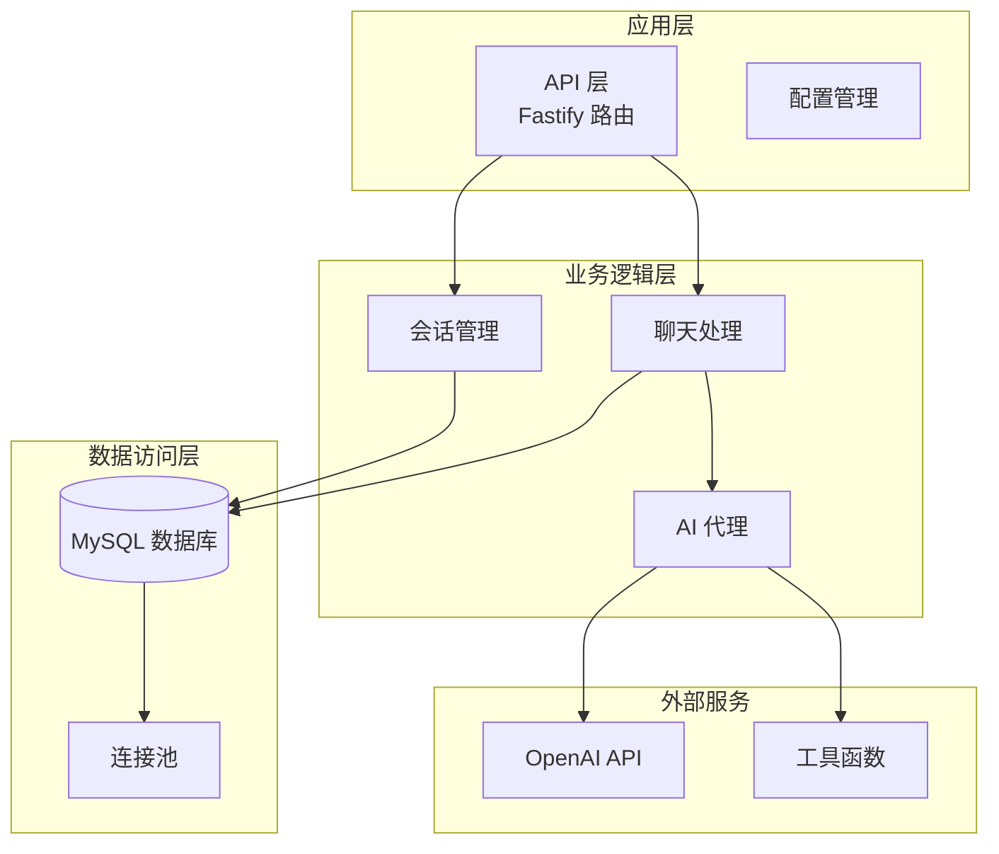
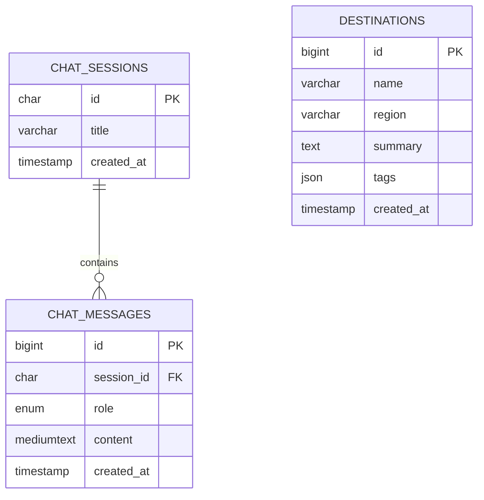
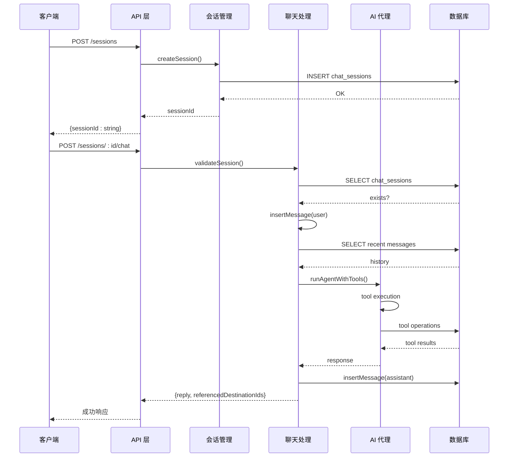
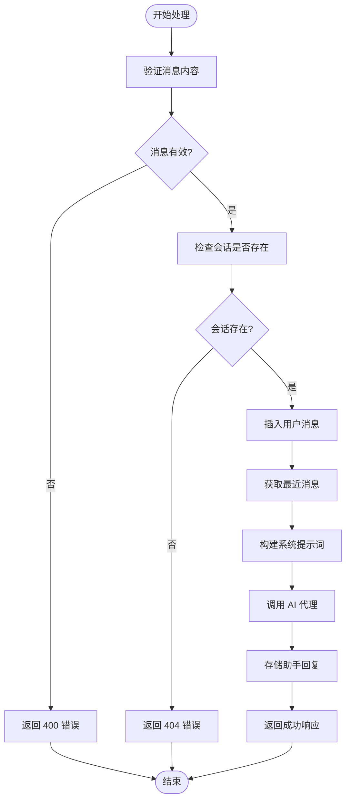
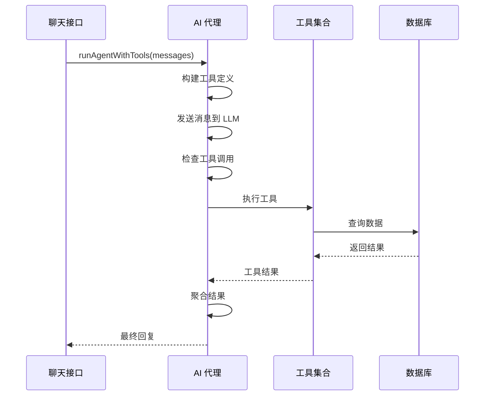
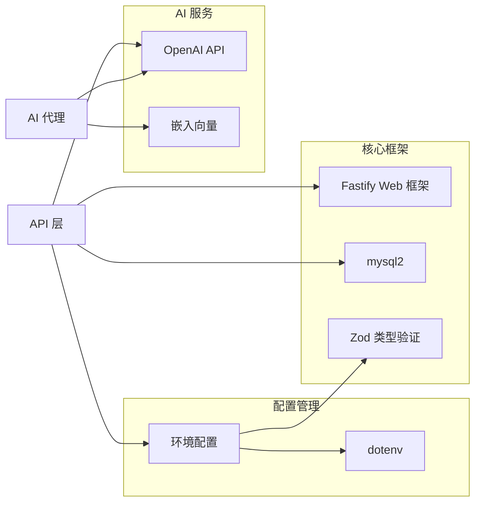
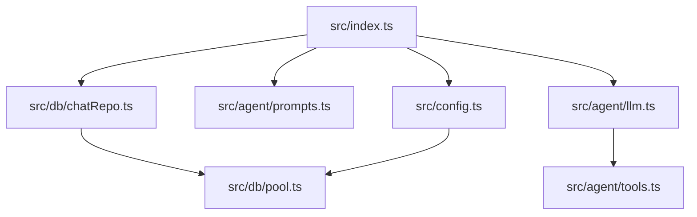

# 会话管理接口

<cite>
**本文档引用的文件**
- [src/index.ts](file://src/index.ts)
- [src/db/chatRepo.ts](file://src/db/chatRepo.ts)
- [src/db/migrations/001_init.sql](file://src/db/migrations/001_init.sql)
- [src/config.ts](file://src/config.ts)
- [src/agent/prompts.ts](file://src/agent/prompts.ts)
- [src/agent/llm.ts](file://src/agent/llm.ts)
- [src/agent/tools.ts](file://src/agent/tools.ts)
- [src/db/pool.ts](file://src/db/pool.ts)
- [package.json](file://package.json)
</cite>

## 目录
1. [简介](#简介)
2. [项目结构](#项目结构)
3. [核心组件](#核心组件)
4. [架构概览](#架构概览)
5. [详细组件分析](#详细组件分析)
6. [依赖关系分析](#依赖关系分析)
7. [性能考虑](#性能考虑)
8. [故障排除指南](#故障排除指南)
9. [结论](#结论)

## 简介

本项目是一个基于 Fastify 框架构建的旅游规划智能助手 API 服务，提供了完整的会话管理和聊天功能。系统通过会话 ID 实现多轮对话管理，支持与 AI 代理的集成，能够根据用户需求提供个性化的旅游建议。

主要功能特性：
- 基于 UUID 的会话创建和管理
- 多轮对话历史记录存储
- AI 代理集成，支持工具调用
- 结构化数据检索和推荐
- 完整的错误处理和状态管理

## 项目结构

项目采用模块化设计，主要包含以下核心模块：



**图表来源**
- [src/index.ts:11-77](file://src/index.ts#L11-L77)
- [src/db/chatRepo.ts:1-53](file://src/db/chatRepo.ts#L1-L53)
- [src/agent/llm.ts:1-57](file://src/agent/llm.ts#L1-L57)

**章节来源**
- [src/index.ts:1-77](file://src/index.ts#L1-L77)
- [package.json:1-31](file://package.json#L1-L31)

## 核心组件

### API 路由定义

系统提供两个核心 API 接口：

1. **POST /sessions** - 创建新会话
2. **POST /sessions/:id/chat** - 向指定会话发送消息

### 数据模型



**图表来源**
- [src/db/migrations/001_init.sql:24-38](file://src/db/migrations/001_init.sql#L24-L38)

**章节来源**
- [src/db/migrations/001_init.sql:1-54](file://src/db/migrations/001_init.sql#L1-L54)

## 架构概览

系统采用分层架构设计，确保关注点分离和代码可维护性：



**图表来源**
- [src/index.ts:28-68](file://src/index.ts#L28-L68)
- [src/db/chatRepo.ts:6-52](file://src/db/chatRepo.ts#L6-L52)

## 详细组件分析

### 会话创建组件 (POST /sessions)

#### 功能概述
会话创建接口负责生成新的 UUID 会话标识符并初始化数据库记录。

#### 请求/响应规范

**请求**
- 方法: `POST /sessions`
- 内容类型: `application/json`
- 请求体: 无

**响应**
- 状态码: `201 Created`
- 响应体: `{ "sessionId": string }`

**实现细节**
- 使用 `randomUUID()` 生成唯一标识符
- 调用 `createSession()` 函数在数据库中创建记录
- 返回标准响应格式

#### 错误处理
- 数据库连接失败: 返回 `503 Service Unavailable`
- 其他异常: 返回 `500 Internal Server Error`

**章节来源**
- [src/index.ts:28-33](file://src/index.ts#L28-L33)
- [src/db/chatRepo.ts:6-8](file://src/db/chatRepo.ts#L6-L8)

### 聊天接口组件 (POST /sessions/:id/chat)

#### 功能概述
聊天接口处理用户消息，执行完整的对话流程，包括会话验证、消息存储、历史获取和 AI 代理调用。

#### 请求/响应规范

**请求**
- 方法: `POST /sessions/:id/chat`
- 路径参数: `id` (会话 ID)
- 内容类型: `application/json`
- 请求体:
```json
{
  "message": "string"
}
```

**响应**
- 成功: `200 OK`
- 响应体:
```json
{
  "reply": "string",
  "referencedDestinationIds": [number]
}
```

**错误响应**
- 缺少消息: `400 Bad Request` - `{ "error": "message required" }`
- 会话不存在: `404 Not Found` - `{ "error": "session not found" }`
- 其他错误: `500 Internal Server Error`

#### 处理流程



**图表来源**
- [src/index.ts:35-68](file://src/index.ts#L35-L68)

#### 详细处理步骤

1. **消息验证**
   - 检查请求体中的 `message` 字段
   - 移除首尾空白字符
   - 返回 400 错误如果消息为空

2. **会话验证**
   - 使用 `sessionExists()` 检查会话 ID
   - 返回 404 错误如果会话不存在

3. **消息存储**
   - 将用户消息以 `user` 角色存储
   - 获取最近的历史消息（受配置限制）

4. **AI 代理调用**
   - 构建系统提示词和消息历史
   - 调用 `runAgentWithTools()` 执行工具链
   - 支持最多 `LLM_MAX_TOOL_ROUNDS` 次工具调用

5. **响应处理**
   - 存储助手的最终回复
   - 返回包含回复内容和引用目的地 ID 的响应

**章节来源**
- [src/index.ts:35-68](file://src/index.ts#L35-L68)
- [src/db/chatRepo.ts:23-52](file://src/db/chatRepo.ts#L23-L52)

### AI 代理组件

#### 功能概述
AI 代理组件负责处理复杂的对话逻辑，包括工具调用、多轮对话管理和结果聚合。

#### 工具集
系统支持三种核心工具：

1. **search_destinations**: 结构化目的地搜索
2. **semantic_search_travel**: 语义相似度搜索
3. **get_destination_detail**: 获取目的地详细信息

#### 处理流程



**图表来源**
- [src/agent/llm.ts:49-113](file://src/agent/llm.ts#L49-L113)
- [src/agent/tools.ts:15-69](file://src/agent/tools.ts#L15-L69)

**章节来源**
- [src/agent/llm.ts:1-113](file://src/agent/llm.ts#L1-L113)
- [src/agent/tools.ts:1-195](file://src/agent/tools.ts#L1-L195)

## 依赖关系分析

### 外部依赖



**图表来源**
- [package.json:18-24](file://package.json#L18-L24)
- [src/index.ts:1-9](file://src/index.ts#L1-L9)

### 内部模块依赖



**图表来源**
- [src/index.ts:7-9](file://src/index.ts#L7-L9)
- [src/db/chatRepo.ts:1-2](file://src/db/chatRepo.ts#L1-L2)

**章节来源**
- [package.json:1-31](file://package.json#L1-L31)

## 性能考虑

### 数据库优化

1. **索引策略**
   - `chat_messages(session_id, created_at)` 复合索引
   - `chat_sessions(id)` 主键索引
   - `destination_features(destination_id)` 外键索引

2. **查询优化**
   - 使用 `LIMIT` 控制历史消息数量
   - 反转查询结果避免额外排序
   - 连接池配置最大连接数为 10

3. **内存管理**
   - 历史消息限制默认 30 条
   - 工具调用轮次限制默认 10 次
   - 异步操作避免阻塞

### API 性能

1. **缓存策略**
   - 建议在应用层添加会话缓存
   - 对频繁查询的结果进行缓存

2. **并发处理**
   - Fastify 默认异步处理
   - 数据库连接池并发控制
   - AI 代理调用超时设置

## 故障排除指南

### 常见错误及解决方案

#### 会话相关错误

| 错误类型 | 状态码 | 错误原因 | 解决方案 |
|---------|--------|----------|----------|
| 会话不存在 | 404 | 会话 ID 无效或已删除 | 重新创建会话或使用正确的 ID |
| 消息为空 | 400 | 请求体缺少 message 字段 | 确保请求体包含有效的 message 字段 |
| 数据库连接失败 | 503 | MySQL 服务器不可达 | 检查数据库连接配置和网络 |

#### AI 代理错误

| 错误类型 | 状态码 | 错误原因 | 解决方案 |
|---------|--------|----------|----------|
| LLM 调用失败 | 500 | OpenAI API 调用异常 | 检查 API 密钥和网络连接 |
| 工具调用超时 | 500 | 数据库查询超时 | 优化查询语句或增加超时时间 |
| 工具参数错误 | 400 | 工具参数格式不正确 | 验证工具调用参数格式 |

#### 配置错误

| 错误类型 | 状态码 | 错误原因 | 解决方案 |
|---------|--------|----------|----------|
| 环境变量缺失 | 500 | 必需的环境变量未设置 | 检查 .env 文件配置 |
| 数据库配置错误 | 500 | MySQL 连接参数不正确 | 验证主机、端口、用户名和密码 |

### 调试建议

1. **启用详细日志**
   ```bash
   export NODE_ENV=development
   npm run dev
   ```

2. **数据库连接测试**
   ```sql
   SELECT 1 FROM chat_sessions LIMIT 1;
   ```

3. **API 健康检查**
   ```bash
   curl http://localhost:3000/health
   ```

**章节来源**
- [src/index.ts:18-26](file://src/index.ts#L18-L26)
- [src/config.ts:35-41](file://src/config.ts#L35-L41)

## 结论

本会话管理接口提供了完整、可靠的聊天服务基础设施，具有以下优势：

1. **架构清晰**: 分层设计确保了代码的可维护性和可扩展性
2. **功能完整**: 支持会话创建、消息管理、AI 代理集成和工具调用
3. **错误处理**: 完善的错误处理机制和状态码管理
4. **性能优化**: 合理的数据库设计和查询优化策略
5. **配置灵活**: 基于环境变量的配置管理，支持不同部署场景

建议在生产环境中进一步增强的功能：
- 添加会话过期和清理机制
- 实现消息内容的安全过滤
- 增加 API 速率限制
- 添加更详细的监控和日志记录
- 实现会话状态持久化和恢复机制