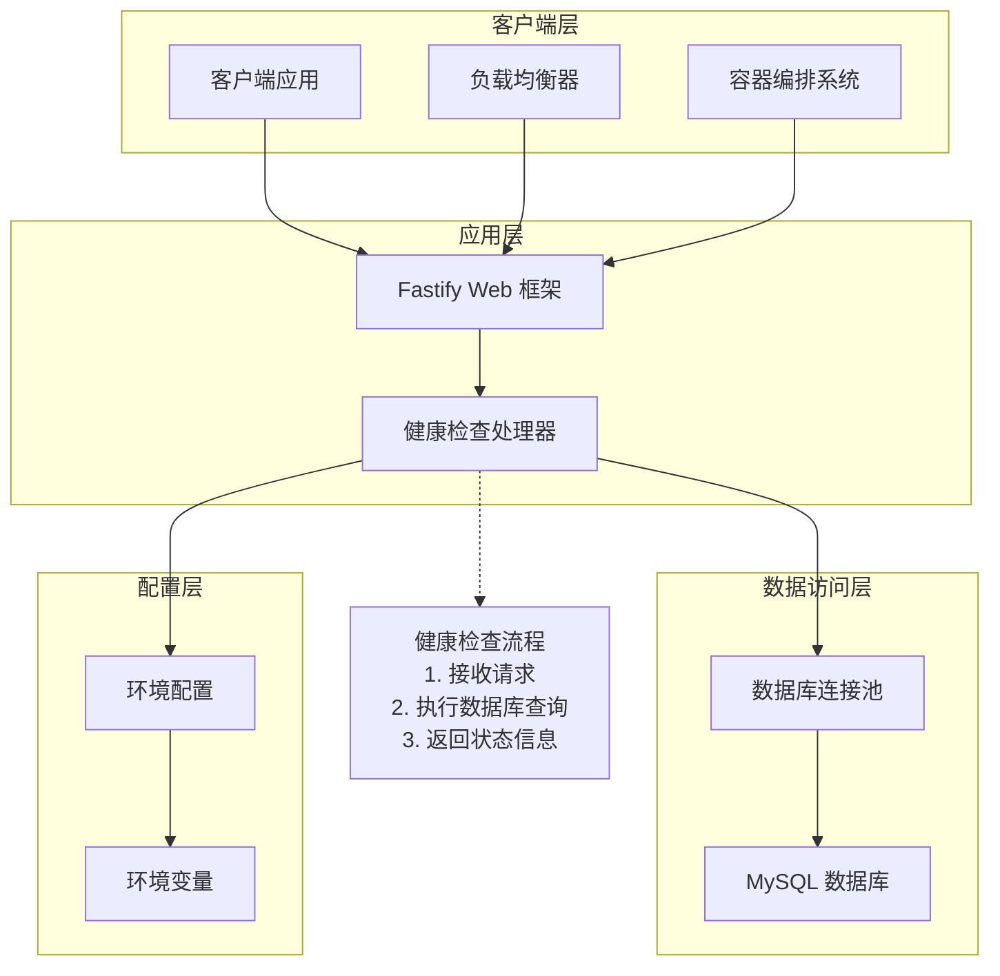
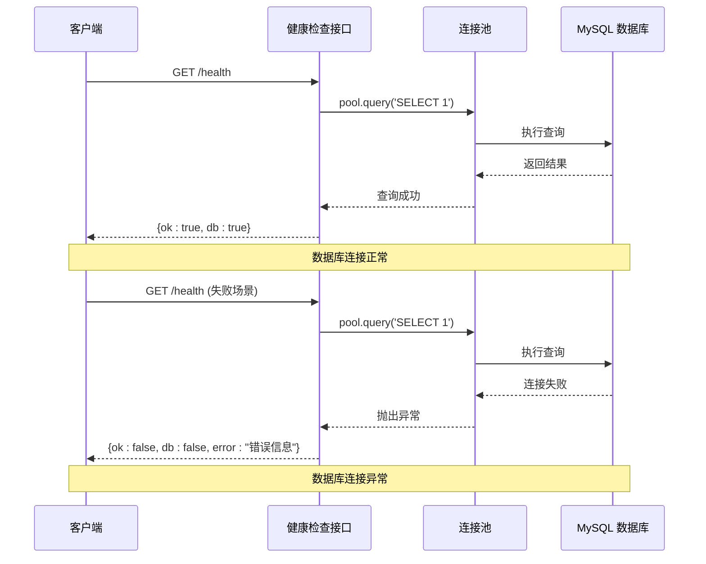

# 健康检查接口

<cite>
**本文档引用的文件**
- [src/index.ts](file://src/index.ts)
- [src/db/pool.ts](file://src/db/pool.ts)
- [src/config.ts](file://src/config.ts)
- [src/db/migrations/001_init.sql](file://src/db/migrations/001_init.sql)
- [docker-compose.yml](file://docker-compose.yml)
- [package.json](file://package.json)
</cite>

## 目录
1. [简介](#简介)
2. [接口概述](#接口概述)
3. [技术架构](#技术架构)
4. [请求规范](#请求规范)
5. [响应格式](#响应格式)
6. [使用示例](#使用示例)
7. [故障排除指南](#故障排除指南)
8. [性能考虑](#性能考虑)
9. [安全注意事项](#安全注意事项)
10. [相关接口](#相关接口)

## 简介

健康检查接口是系统监控和运维的重要组件，用于验证应用程序及其依赖服务的运行状态。在本项目中，`/health` 接口专门用于检查系统的健康状态，特别是数据库连接状态的验证，确保应用能够正常访问底层数据存储。

该接口采用简洁的设计理念，通过单一的 HTTP GET 请求即可完成系统健康状态的全面检查，为自动化部署、负载均衡器探活和容器编排系统提供了标准化的健康检查能力。

## 接口概述

### 基本信息
- **端点路径**: `/health`
- **HTTP 方法**: `GET`
- **内容类型**: `application/json`
- **认证要求**: 无需认证
- **CORS 支持**: 支持跨域请求

### 功能特性
- 实时数据库连接状态验证
- 系统可用性状态报告
- 错误信息的详细反馈
- 标准化的响应格式

## 技术架构

健康检查接口的实现基于以下核心组件：



**图表来源**
- [src/index.ts:18-26](file://src/index.ts#L18-L26)
- [src/db/pool.ts:4-14](file://src/db/pool.ts#L4-L14)

**章节来源**
- [src/index.ts:11-26](file://src/index.ts#L11-L26)
- [src/db/pool.ts:1-17](file://src/db/pool.ts#L1-L17)

## 请求规范

### HTTP 请求
- **方法**: `GET`
- **路径**: `/health`
- **协议**: HTTP/1.1 或 HTTP/2
- **主机**: 应用服务器地址
- **端口**: 默认 3000（可通过环境变量配置）

### 请求头
- `Accept: application/json` - 指定期望的响应格式
- `Content-Type: application/json` - 指定请求体格式
- 其他标准 HTTP 头部

### 请求参数
- **无查询参数**
- **无请求体**

## 响应格式

健康检查接口采用统一的 JSON 响应格式，包含系统状态的关键信息。

### 成功响应 (`200 OK`)
当数据库连接正常且系统可用时，返回以下结构：

```json
{
  "ok": true,
  "db": true
}
```

### 失败响应 (`503 Service Unavailable`)
当数据库连接异常或系统不可用时，返回以下结构：

```json
{
  "ok": false,
  "db": false,
  "error": "错误信息描述"
}
```

### 响应字段说明

| 字段名 | 类型 | 必填 | 描述 |
|--------|------|------|------|
| `ok` | boolean | 是 | 系统整体健康状态，true 表示系统正常 |
| `db` | boolean | 是 | 数据库连接状态，true 表示数据库可访问 |
| `error` | string | 可选 | 错误详情描述，仅在失败时返回 |

**章节来源**
- [src/index.ts:18-26](file://src/index.ts#L18-L26)

## 使用示例

### curl 命令示例

**成功示例**：
```bash
curl -X GET http://localhost:3000/health
# 输出: {"ok":true,"db":true}
```

**失败示例**：
```bash
curl -X GET http://localhost:3000/health
# 输出: {"ok":false,"db":false,"error":"数据库连接错误"}
```

### JavaScript Fetch 示例

```javascript
// 成功场景
fetch('http://localhost:3000/health')
  .then(response => response.json())
  .then(data => {
    if (data.ok && data.db) {
      console.log('系统健康状态正常');
    } else {
      console.log('系统存在健康问题:', data.error);
    }
  });

// 失败场景处理
fetch('http://localhost:3000/health')
  .then(response => {
    if (response.status === 503) {
      return response.json();
    }
    throw new Error('健康检查失败');
  })
  .then(data => {
    console.error('数据库连接失败:', data.error);
  });
```

### Python Requests 示例

```python
import requests

def check_health():
    try:
        response = requests.get('http://localhost:3000/health', timeout=5)
        
        if response.status_code == 200:
            data = response.json()
            if data['ok'] and data['db']:
                print("系统健康检查通过")
                return True
            else:
                print(f"系统健康检查失败: {data.get('error', '未知错误')}")
                return False
        elif response.status_code == 503:
            data = response.json()
            print(f"服务不可用: {data.get('error', '数据库连接失败')}")
            return False
        else:
            print(f"HTTP 错误: {response.status_code}")
            return False
            
    except requests.exceptions.RequestException as e:
        print(f"网络请求失败: {e}")
        return False

# 执行健康检查
check_health()
```

## 故障排除指南

### 常见问题及解决方案

#### 1. 数据库连接失败

**症状**：
```json
{
  "ok": false,
  "db": false,
  "error": "Error: connect ECONNREFUSED 127.0.0.1:3306"
}
```

**可能原因**：
- MySQL 服务未启动
- 网络连接问题
- 认证凭据错误
- 端口被占用

**解决步骤**：
1. 检查 MySQL 服务状态
2. 验证网络连通性
3. 确认数据库凭据正确
4. 检查端口配置

#### 2. 数据库认证失败

**症状**：
```json
{
  "ok": false,
  "db": false,
  "error": "Error: Access denied for user 'username'@'host'"
}
```

**解决步骤**：
1. 验证用户名和密码
2. 检查用户权限设置
3. 确认主机白名单配置
4. 重新创建数据库用户

#### 3. 数据库不存在

**症状**：
```json
{
  "ok": false,
  "db": false,
  "error": "Error: Can't connect to MySQL server on 'host:port'"
}
```

**解决步骤**：
1. 创建目标数据库
2. 运行数据库迁移脚本
3. 验证数据库初始化

### 调试工具和命令

#### 基础连接测试
```bash
# 测试 TCP 连接
telnet localhost 3306

# 使用 mysql 客户端测试
mysql -h localhost -P 3306 -u root -p

# 检查数据库状态
mysqladmin ping -h localhost -P 3306 -u root -p
```

#### 环境变量验证
```bash
# 检查关键环境变量
echo "MYSQL_HOST: $MYSQL_HOST"
echo "MYSQL_PORT: $MYSQL_PORT"
echo "MYSQL_USER: $MYSQL_USER"
echo "MYSQL_DATABASE: $MYSQL_DATABASE"
```

**章节来源**
- [src/index.ts:18-26](file://src/index.ts#L18-L26)
- [src/config.ts:27-41](file://src/config.ts#L27-L41)

## 性能考虑

### 响应时间优化

健康检查接口设计为轻量级操作，主要通过简单的数据库查询来验证连接状态。以下是性能优化建议：

1. **连接池复用**: 使用现有的数据库连接池，避免频繁建立新连接
2. **查询优化**: 使用最小化的 SQL 查询 (`SELECT 1`) 来减少数据库负载
3. **超时设置**: 合理设置连接超时和查询超时
4. **缓存策略**: 对于频繁的健康检查，可以考虑短期缓存结果

### 监控指标

建议监控以下关键指标：
- 健康检查响应时间
- 数据库连接成功率
- 错误率统计
- 系统资源使用情况

## 安全注意事项

### 访问控制
- 健康检查接口通常不需要认证，但应在防火墙层面进行限制
- 建议仅允许受信任的网络访问此端点
- 在生产环境中考虑添加基本的身份验证

### 敏感信息保护
- 错误信息中不应泄露敏感的数据库连接细节
- 生产环境中的错误日志应该脱敏处理

### 最佳实践
- 将健康检查端点与业务逻辑端点分离
- 使用独立的健康检查密钥（如果需要）
- 定期审查访问日志

## 相关接口

### 主要接口对比

| 接口路径 | 方法 | 功能描述 | 响应码 |
|----------|------|----------|--------|
| `/health` | GET | 系统健康检查 | 200/503 |
| `/sessions` | POST | 创建聊天会话 | 201/400 |
| `/sessions/:id/chat` | POST | 聊天消息处理 | 200/400/404 |

### 数据库连接验证

健康检查接口通过以下方式验证数据库连接：



**图表来源**
- [src/index.ts:18-26](file://src/index.ts#L18-L26)
- [src/db/pool.ts:4-14](file://src/db/pool.ts#L4-L14)

### 配置管理

健康检查接口依赖于以下配置项：

| 配置项 | 默认值 | 用途 |
|--------|--------|------|
| `MYSQL_HOST` | `127.0.0.1` | 数据库主机地址 |
| `MYSQL_PORT` | `3306` | 数据库端口号 |
| `MYSQL_USER` | `root` | 数据库用户名 |
| `MYSQL_PASSWORD` | 空字符串 | 数据库密码 |
| `MYSQL_DATABASE` | `guide_plan` | 数据库名称 |
| `PORT` | `3000` | 应用程序端口 |

**章节来源**
- [src/config.ts:3-22](file://src/config.ts#L3-L22)
- [src/db/pool.ts:4-14](file://src/db/pool.ts#L4-L14)

## 结论

健康检查接口作为系统监控的核心组件，为应用程序的稳定运行提供了重要保障。通过简单而有效的设计，它能够快速识别系统问题并提供清晰的状态反馈。

### 关键优势
- **实现简单**: 基于单一的数据库查询验证
- **响应迅速**: 轻量级操作，响应时间短
- **信息丰富**: 提供系统和数据库双层状态信息
- **易于集成**: 标准化的 JSON 格式便于各种客户端使用

### 最佳实践建议
1. 将健康检查集成到容器编排系统的探活机制中
2. 设置合理的检查间隔和超时时间
3. 结合其他监控指标进行全面的系统健康评估
4. 定期审查和更新健康检查逻辑以适应系统变化

通过遵循本文档的指导和最佳实践，可以确保健康检查接口发挥最大效用，为系统的稳定运行提供可靠保障。