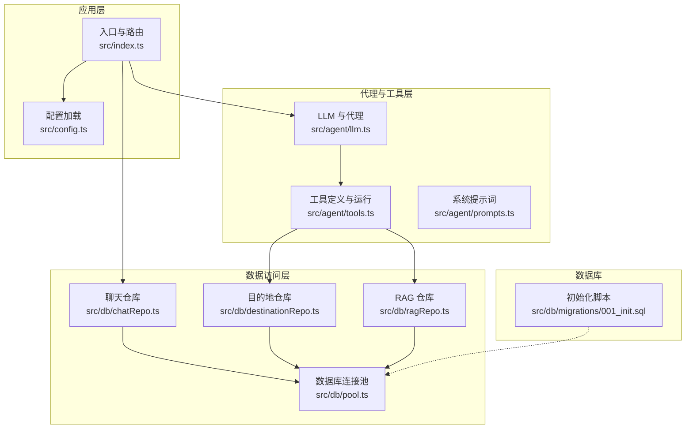
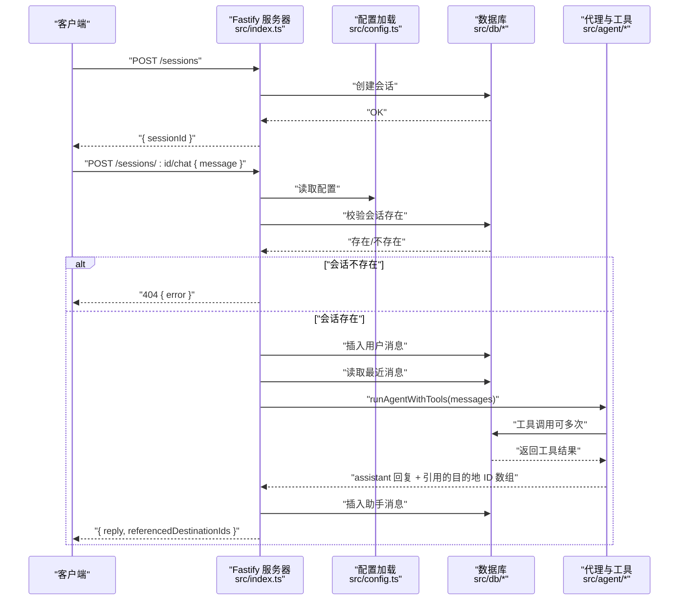
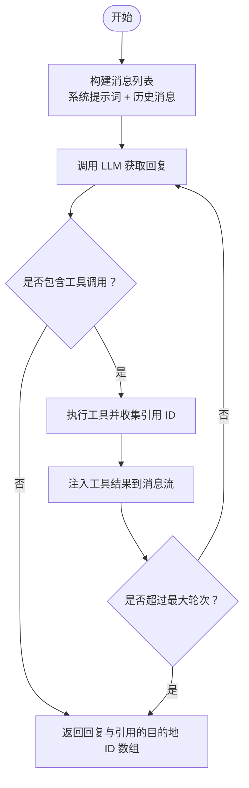
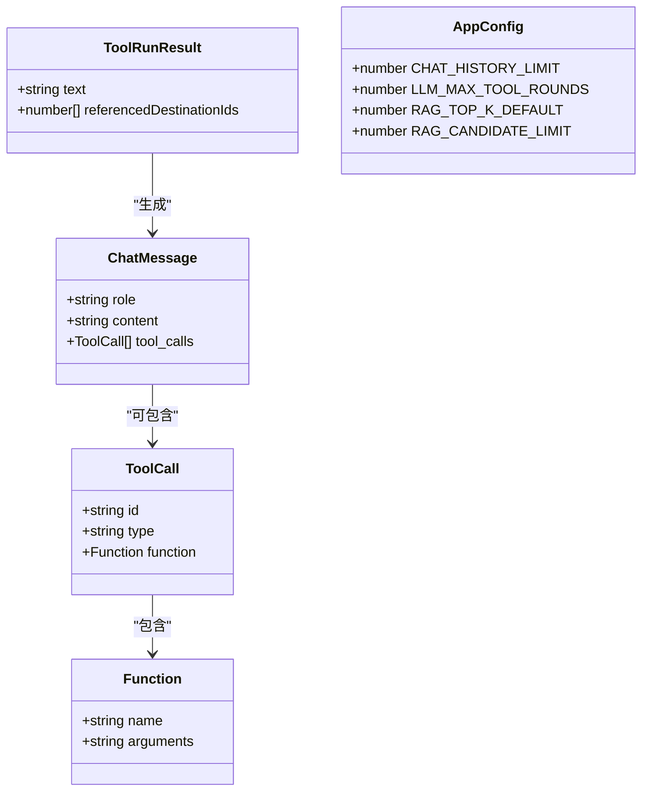

# 请求响应模式

<cite>
**本文档引用的文件**
- [src/index.ts](file://src/index.ts)
- [src/config.ts](file://src/config.ts)
- [src/db/chatRepo.ts](file://src/db/chatRepo.ts)
- [src/agent/llm.ts](file://src/agent/llm.ts)
- [src/agent/tools.ts](file://src/agent/tools.ts)
- [src/db/destinationRepo.ts](file://src/db/destinationRepo.ts)
- [src/db/ragRepo.ts](file://src/db/ragRepo.ts)
- [src/db/migrations/001_init.sql](file://src/db/migrations/001_init.sql)
- [package.json](file://package.json)
</cite>

## 目录
1. [简介](#简介)
2. [项目结构](#项目结构)
3. [核心组件](#核心组件)
4. [架构总览](#架构总览)
5. [详细组件分析](#详细组件分析)
6. [依赖分析](#依赖分析)
7. [性能考虑](#性能考虑)
8. [故障排查指南](#故障排查指南)
9. [结论](#结论)
10. [附录](#附录)

## 简介
本文件为 Guide-Plan-Agent 的 API 统一请求响应模式文档，覆盖以下内容：
- 所有 API 端点的通用响应格式（成功与错误）
- 错误码体系与错误信息格式，HTTP 状态码与业务错误的对应关系
- 数据模型定义：ChatMessage 结构、会话 ID 格式、引用的目的地 ID 数组格式
- 实际请求/响应示例与数据验证规则
- 与数据库表结构的映射关系

## 项目结构
本项目采用分层设计：
- 入口与路由：Fastify 服务器在入口文件中注册路由与中间件
- 配置层：环境变量校验与加载
- 数据访问层：聊天会话与消息、目的地与特征、RAG 片段
- 代理与工具层：LLM 调用、工具函数、系统提示词
- 数据库迁移：初始化表结构

图表来源
- [src/index.ts:1-77](file://src/index.ts#L1-L77)
- [src/config.ts:1-46](file://src/config.ts#L1-L46)
- [src/db/chatRepo.ts:1-53](file://src/db/chatRepo.ts#L1-L53)
- [src/db/destinationRepo.ts:1-100](file://src/db/destinationRepo.ts#L1-L100)
- [src/db/ragRepo.ts:1-143](file://src/db/ragRepo.ts#L1-L143)
- [src/agent/llm.ts:1-114](file://src/agent/llm.ts#L1-L114)
- [src/agent/tools.ts:1-195](file://src/agent/tools.ts#L1-L195)
- [src/db/migrations/001_init.sql:1-54](file://src/db/migrations/001_init.sql#L1-L54)

章节来源
- [src/index.ts:1-77](file://src/index.ts#L1-L77)
- [src/config.ts:1-46](file://src/config.ts#L1-L46)
- [src/db/migrations/001_init.sql:1-54](file://src/db/migrations/001_init.sql#L1-L54)

## 核心组件
- Fastify 服务器与路由
  - /health 健康检查
  - /sessions 会话创建
  - /sessions/:id/chat 聊天对话
- 配置加载与校验
  - 环境变量类型安全解析
- 数据访问层
  - 聊天会话与消息 CRUD
  - 目的地与特征查询
  - RAG 片段加载与相似度检索
- 代理与工具
  - LLM 调用与工具循环
  - 工具定义与参数解析
- 数据模型
  - ChatMessage 角色与内容
  - 会话 ID UUID 格式
  - 引用的目的地 ID 数组

章节来源
- [src/index.ts:18-68](file://src/index.ts#L18-L68)
- [src/config.ts:35-41](file://src/config.ts#L35-L41)
- [src/db/chatRepo.ts:6-52](file://src/db/chatRepo.ts#L6-L52)
- [src/agent/llm.ts:5-18](file://src/agent/llm.ts#L5-L18)
- [src/agent/tools.ts:10-13](file://src/agent/tools.ts#L10-L13)

## 架构总览
下图展示了 API 请求到响应的关键流程，以及与数据库交互的关系。

图表来源
- [src/index.ts:28-68](file://src/index.ts#L28-L68)
- [src/agent/llm.ts:49-114](file://src/agent/llm.ts#L49-L114)
- [src/db/chatRepo.ts:6-52](file://src/db/chatRepo.ts#L6-L52)
- [src/agent/tools.ts:114-195](file://src/agent/tools.ts#L114-L195)

## 详细组件分析

### 通用响应格式与错误处理
- 成功响应
  - /health：返回布尔状态字段
  - /sessions：返回会话 ID
  - /sessions/:id/chat：返回回复文本与引用的目的地 ID 数组
- 错误响应
  - 通用错误结构：包含错误描述字符串
  - HTTP 状态码与业务错误的对应关系：
    - 400：缺少必填字段（如聊天消息为空）
    - 404：会话不存在
    - 503：数据库不可用
    - 其他错误：由下游服务返回的非 2xx 状态触发统一错误响应

章节来源
- [src/index.ts:18-68](file://src/index.ts#L18-L68)

### 数据模型定义

#### ChatMessage 结构
- 角色与内容
  - system：角色为 system，内容为字符串
  - user：角色为 user，内容为字符串
  - assistant：角色为 assistant，内容为字符串或 null，可包含工具调用数组
  - tool：角色为 tool，包含工具调用标识与内容
- 工具调用数组（assistant 中）
  - 每个工具调用包含：工具名、参数（字符串形式）

章节来源
- [src/agent/llm.ts:5-18](file://src/agent/llm.ts#L5-L18)
- [src/agent/llm.ts:19-24](file://src/agent/llm.ts#L19-L24)

#### 会话 ID 格式
- UUID v4 字符串，长度为 36，形如：xxxxxxxx-xxxx-4xxx-yxxx-xxxxxxxxxxxx
- 在数据库中作为主键存储，确保唯一性

章节来源
- [src/index.ts:29](file://src/index.ts#L29)
- [src/db/migrations/001_init.sql:24-28](file://src/db/migrations/001_init.sql#L24-L28)

#### 引用的目的地 ID 数组格式
- 类型：整数数组
- 语义：代理在工具调用过程中收集到的被引用的目的地 ID 列表
- 去重策略：在代理工具循环中使用集合去重，最终以数组形式返回

章节来源
- [src/agent/llm.ts:55-56](file://src/agent/llm.ts#L55-L56)
- [src/agent/llm.ts:106-109](file://src/agent/llm.ts#L106-L109)
- [src/agent/tools.ts:10-13](file://src/agent/tools.ts#L10-L13)

### API 端点与请求/响应规范

#### GET /health
- 功能：健康检查，验证数据库连通性
- 请求：无
- 成功响应：布尔字段表示服务与数据库状态
- 错误响应：503 且包含错误描述
- 示例
  - 成功：{"ok": true, "db": true}
  - 失败：{"ok": false, "db": false, "error": "..."}

章节来源
- [src/index.ts:18-26](file://src/index.ts#L18-L26)

#### POST /sessions
- 功能：创建新会话
- 请求：无体
- 成功响应：包含会话 ID
- 错误响应：无
- 示例
  - 成功：{"sessionId": "xxxxxxxx-xxxx-4xxx-yxxx-xxxxxxxxxxxx"}

章节来源
- [src/index.ts:28-33](file://src/index.ts#L28-L33)

#### POST /sessions/:id/chat
- 功能：向指定会话发送消息并获取代理回复
- 请求体
  - message：字符串，必填，前后去空白
- 成功响应
  - reply：字符串，代理回复内容
  - referencedDestinationIds：整数数组，被引用的目的地 ID 列表
- 错误响应
  - 400：message 为空
  - 404：会话不存在
  - 503：数据库不可用
- 示例
  - 请求：{"message": "推荐一些美食"}
  - 成功：{"reply": "...", "referencedDestinationIds": [1, 2]}
  - 失败：{"error": "message required"}

章节来源
- [src/index.ts:35-68](file://src/index.ts#L35-L68)

### 数据验证规则
- message 必填且非空（去除前后空白后）
- 会话 ID 存在性校验
- 工具参数解析与范围约束
  - search_destinations：limit 最小 1，最大 50
  - get_destination_detail：destination_id 必须为有限数值
- 数据库约束
  - 会话 ID 为主键
  - 聊天消息 role 为枚举值
  - 目的地与特征外键关联

章节来源
- [src/index.ts:39-48](file://src/index.ts#L39-L48)
- [src/agent/tools.ts:121-127](file://src/agent/tools.ts#L121-L127)
- [src/agent/tools.ts:101-105](file://src/agent/tools.ts#L101-L105)
- [src/db/migrations/001_init.sql:24-38](file://src/db/migrations/001_init.sql#L24-L38)

### 代理与工具调用流程
- 输入：系统提示词 + 最近历史消息（最多配置项限制）
- 输出：assistant 回复文本与引用的目的地 ID 数组
- 工具循环：根据 LLM 返回的工具调用，执行工具并注入工具结果，最多轮次受配置限制

图表来源
- [src/agent/llm.ts:49-114](file://src/agent/llm.ts#L49-L114)
- [src/agent/tools.ts:114-195](file://src/agent/tools.ts#L114-L195)

## 依赖分析
- 运行时依赖
  - Fastify：Web 服务器框架
  - @fastify/cors：跨域支持
  - mysql2：MySQL 客户端
  - dotenv：环境变量加载
  - zod：环境变量类型校验
- 开发依赖
  - TypeScript、tsx、相关类型声明

章节来源
- [package.json:18-30](file://package.json#L18-L30)

## 性能考虑
- 历史消息限制：通过配置控制 LLM 上下文长度，减少延迟与成本
- 工具调用轮次限制：防止无限循环与过度调用
- 数据库连接池：限制并发连接数，避免资源耗尽
- RAG 检索候选集限制：控制候选数量，提升检索效率

## 故障排查指南
- /health 返回 503
  - 检查数据库连接配置与可达性
  - 查看错误字段中的具体异常信息
- /sessions/:id/chat 返回 404
  - 确认会话 ID 是否正确且存在
- /sessions/:id/chat 返回 400
  - 确认请求体包含非空 message
- 工具调用失败
  - 检查工具参数合法性（如 destination_id）
  - 查看工具返回的错误信息

章节来源
- [src/index.ts:18-26](file://src/index.ts#L18-L26)
- [src/index.ts:39-48](file://src/index.ts#L39-L48)
- [src/agent/tools.ts:164-168](file://src/agent/tools.ts#L164-L168)

## 结论
本文件建立了 Guide-Plan-Agent 的统一请求响应模式，明确了：
- 所有端点的成功与错误响应结构
- 错误码与 HTTP 状态码的对应关系
- 关键数据模型与验证规则
- 代理与工具调用的完整流程

该模式有助于前端与集成方快速理解 API 行为，保证一致性与可维护性。

## 附录

### 数据模型类图

图表来源
- [src/agent/llm.ts:5-18](file://src/agent/llm.ts#L5-L18)
- [src/agent/llm.ts:19-24](file://src/agent/llm.ts#L19-L24)
- [src/agent/tools.ts:10-13](file://src/agent/tools.ts#L10-L13)
- [src/config.ts:24-25](file://src/config.ts#L24-L25)