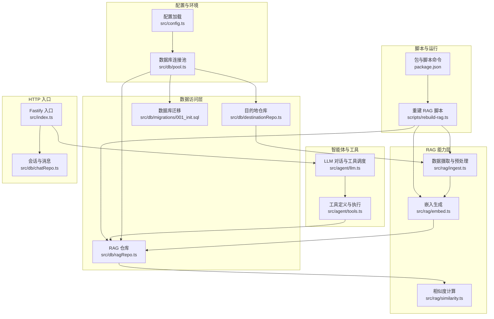
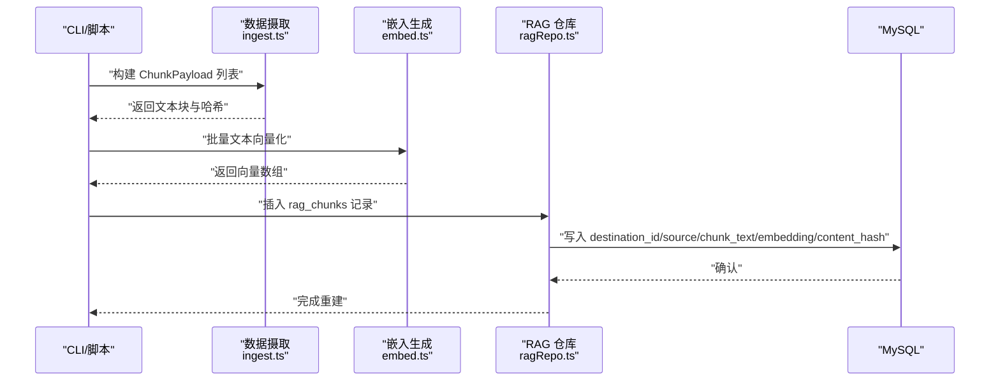
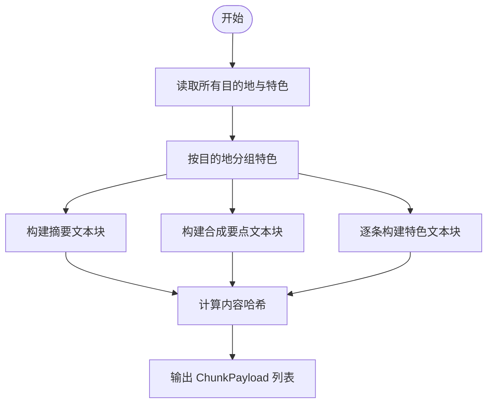
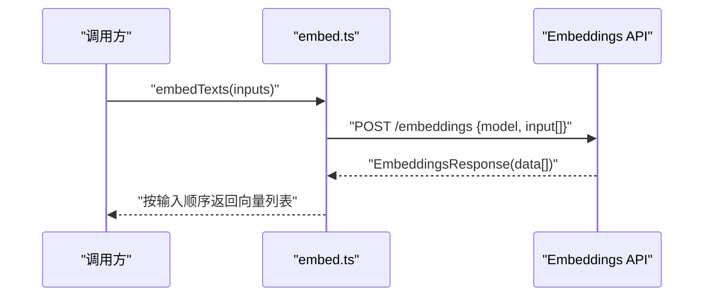
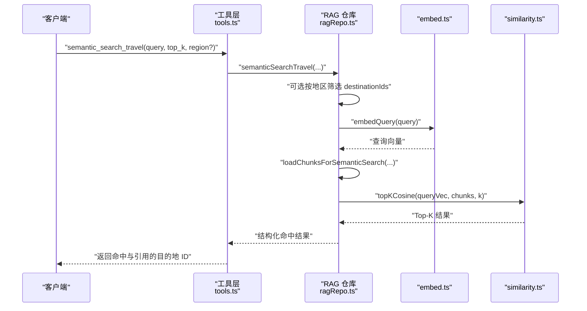
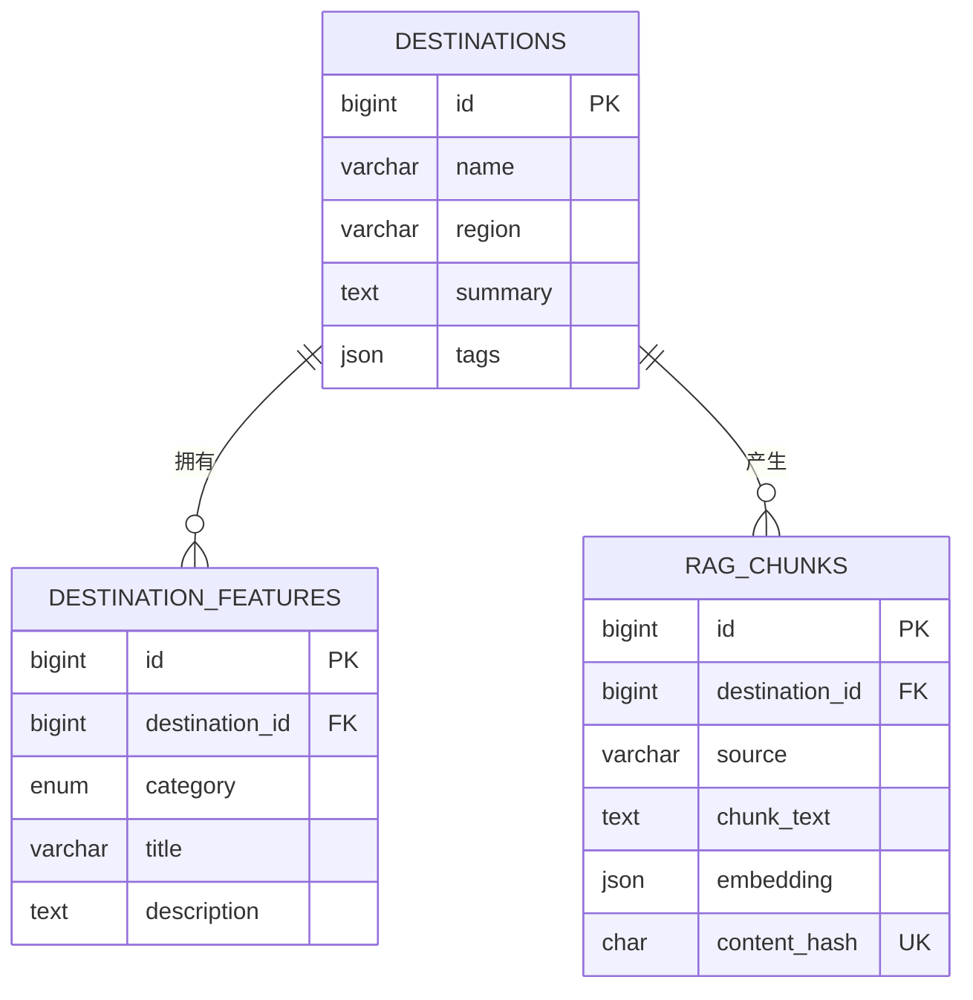
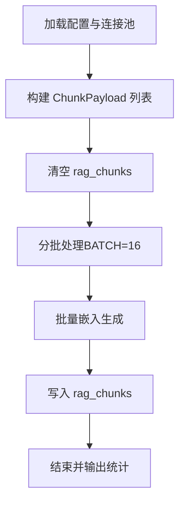
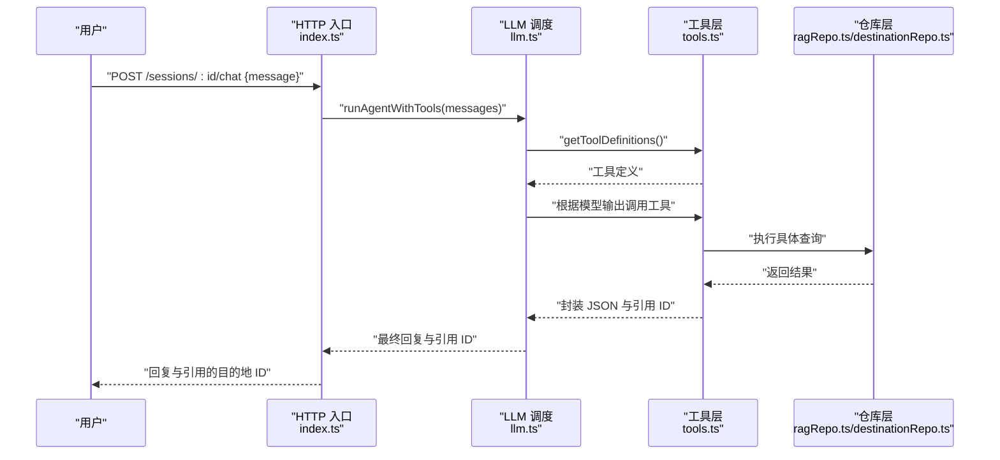
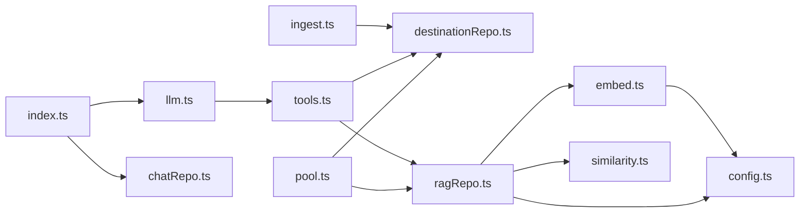

# RAG 检索增强生成系统

<cite>
**本文引用的文件**
- [src/rag/embed.ts](file://src/rag/embed.ts)
- [src/rag/ingest.ts](file://src/rag/ingest.ts)
- [src/rag/similarity.ts](file://src/rag/similarity.ts)
- [src/db/ragRepo.ts](file://src/db/ragRepo.ts)
- [src/db/destinationRepo.ts](file://src/db/destinationRepo.ts)
- [src/db/pool.ts](file://src/db/pool.ts)
- [src/config.ts](file://src/config.ts)
- [scripts/rebuild-rag.ts](file://scripts/rebuild-rag.ts)
- [src/db/migrations/001_init.sql](file://src/db/migrations/001_init.sql)
- [src/agent/tools.ts](file://src/agent/tools.ts)
- [src/agent/llm.ts](file://src/agent/llm.ts)
- [src/db/chatRepo.ts](file://src/db/chatRepo.ts)
- [src/index.ts](file://src/index.ts)
- [package.json](file://package.json)
</cite>

## 目录
1. [简介](#简介)
2. [项目结构](#项目结构)
3. [核心组件](#核心组件)
4. [架构总览](#架构总览)
5. [详细组件分析](#详细组件分析)
6. [依赖关系分析](#依赖关系分析)
7. [性能考量](#性能考量)
8. [故障排除指南](#故障排除指南)
9. [结论](#结论)
10. [附录](#附录)

## 简介
本文件面向 Guide-Plan-Agent 的 RAG（检索增强生成）系统，系统通过“向量嵌入 + 语义相似度检索”的方式，将结构化与半结构化的旅游目的地知识转化为可检索的语义片段，供智能体在对话中进行上下文增强与引用。RAG 管道包括三部分：
- 数据摄取与预处理：从数据库聚合目的地摘要、特色条目与合成文本，形成可嵌入的文本块。
- 向量嵌入生成：调用 OpenAI Embeddings API 或兼容服务，批量生成向量并写入数据库。
- 查询检索与排序：对用户查询向量化后，在候选集合上计算余弦相似度，返回 Top-K 片段。

系统同时提供配置项、脚本化重建流程、以及与智能体工具链的集成，支持在自然语言对话中动态检索并引用相关目的地信息。

## 项目结构
整体采用分层设计：配置与连接层、数据访问层、RAG 能力层、智能体工具层、HTTP 入口层。

图表来源
- [src/config.ts:1-46](file://src/config.ts#L1-L46)
- [src/db/pool.ts:1-17](file://src/db/pool.ts#L1-L17)
- [src/db/destinationRepo.ts:1-100](file://src/db/destinationRepo.ts#L1-L100)
- [src/db/ragRepo.ts:1-143](file://src/db/ragRepo.ts#L1-L143)
- [src/db/migrations/001_init.sql:1-54](file://src/db/migrations/001_init.sql#L1-L54)
- [src/rag/ingest.ts:1-77](file://src/rag/ingest.ts#L1-L77)
- [src/rag/embed.ts:1-38](file://src/rag/embed.ts#L1-L38)
- [src/rag/similarity.ts:1-31](file://src/rag/similarity.ts#L1-L31)
- [src/agent/tools.ts:1-195](file://src/agent/tools.ts#L1-L195)
- [src/agent/llm.ts:1-114](file://src/agent/llm.ts#L1-L114)
- [src/db/chatRepo.ts:1-53](file://src/db/chatRepo.ts#L1-L53)
- [src/index.ts:1-77](file://src/index.ts#L1-L77)
- [scripts/rebuild-rag.ts:1-39](file://scripts/rebuild-rag.ts#L1-L39)
- [package.json:1-31](file://package.json#L1-L31)

章节来源
- [src/config.ts:1-46](file://src/config.ts#L1-L46)
- [src/db/pool.ts:1-17](file://src/db/pool.ts#L1-L17)
- [src/db/migrations/001_init.sql:1-54](file://src/db/migrations/001_init.sql#L1-L54)

## 核心组件
- 配置与环境
  - 加载数据库与 LLM/OpenAI 相关环境变量，提供默认值与校验；暴露嵌入服务基础地址解析函数。
- 数据库连接池
  - 基于 mysql2/promise 创建连接池，统一管理并发与连接限制。
- 数据摄取与预处理
  - 从目的地表与特色表聚合文本，构造摘要、合成要点与单条特色三种来源的文本块，计算内容哈希去重。
- 向量嵌入生成
  - 调用 OpenAI Embeddings API（或兼容服务），批量发送文本，解析返回向量并保持顺序。
- 相似度计算
  - 实现余弦相似度与 Top-K 排序，返回带分数的结果。
- RAG 仓库
  - 提供 RAG 片段的增删改查、分页与条件检索；支持按地区预过滤；查询时执行嵌入与相似度排序。
- 工具与智能体
  - 定义结构化工具（关键词搜索、语义检索、详情读取），并在 LLM 循环中自动调度工具，收集引用的目的地 ID。
- HTTP 入口
  - 提供健康检查、会话创建、聊天接口；将历史消息与系统提示交给智能体处理。

章节来源
- [src/config.ts:1-46](file://src/config.ts#L1-L46)
- [src/db/pool.ts:1-17](file://src/db/pool.ts#L1-L17)
- [src/rag/ingest.ts:1-77](file://src/rag/ingest.ts#L1-L77)
- [src/rag/embed.ts:1-38](file://src/rag/embed.ts#L1-L38)
- [src/rag/similarity.ts:1-31](file://src/rag/similarity.ts#L1-L31)
- [src/db/ragRepo.ts:1-143](file://src/db/ragRepo.ts#L1-L143)
- [src/agent/tools.ts:1-195](file://src/agent/tools.ts#L1-L195)
- [src/agent/llm.ts:1-114](file://src/agent/llm.ts#L1-L114)
- [src/db/chatRepo.ts:1-53](file://src/db/chatRepo.ts#L1-L53)
- [src/index.ts:1-77](file://src/index.ts#L1-L77)

## 架构总览
RAG 系统围绕“数据 → 向量 → 检索”三阶段展开，贯穿脚本重建与在线查询两条路径。

图表来源
- [scripts/rebuild-rag.ts:1-39](file://scripts/rebuild-rag.ts#L1-L39)
- [src/rag/ingest.ts:1-77](file://src/rag/ingest.ts#L1-L77)
- [src/rag/embed.ts:1-38](file://src/rag/embed.ts#L1-L38)
- [src/db/ragRepo.ts:1-143](file://src/db/ragRepo.ts#L1-L143)
- [src/db/migrations/001_init.sql:40-53](file://src/db/migrations/001_init.sql#L40-L53)

## 详细组件分析

### 组件一：数据摄取与预处理（ingest.ts）
- 输入来源
  - 目的地表：名称、地区、摘要、标签等。
  - 特色表：分类（美食/景色/文化）、标题、描述。
- 文本块构建策略
  - 摘要块：整合目的地名称、地区、摘要与标签字符串。
  - 合成块：按目的地聚合其特色条目，生成“要点”式文本。
  - 单条特色块：每一条特色单独作为文本块，便于细粒度检索。
- 去重与一致性
  - 对每个文本块计算 SHA-256 内容哈希，入库时以唯一索引避免重复。
- 输出结构
  - 返回 ChunkPayload 数组，包含 destination_id、source 类型、chunk_text、content_hash。

图表来源
- [src/rag/ingest.ts:30-76](file://src/rag/ingest.ts#L30-L76)

章节来源
- [src/rag/ingest.ts:1-77](file://src/rag/ingest.ts#L1-L77)

### 组件二：向量嵌入生成（embed.ts）
- 调用目标
  - 默认使用 OPENAI_BASE_URL 指向的 OpenAI Embeddings 接口；可通过 EMBEDDING_BASE_URL 覆盖。
- 请求参数
  - 模型名来自 OPENAI_EMBEDDING_MODEL，默认为 text-embedding-3-small。
  - 批量输入为字符串数组，返回对应向量数组。
- 错误处理
  - 非 2xx 响应抛出错误，包含状态码与响应体文本。
- 输出
  - 保证返回顺序与输入一致，按 index 排序后提取向量。

图表来源
- [src/rag/embed.ts:7-37](file://src/rag/embed.ts#L7-L37)
- [src/config.ts:43-45](file://src/config.ts#L43-L45)

章节来源
- [src/rag/embed.ts:1-38](file://src/rag/embed.ts#L1-L38)
- [src/config.ts:11-22](file://src/config.ts#L11-L22)

### 组件三：相似度计算与检索（similarity.ts 与 ragRepo.ts）
- 相似度算法
  - 余弦相似度：计算两个向量的点积与模长比值，范围 [-1, 1]，越接近 1 表示越相似。
- Top-K 选择
  - 对候选集合计算相似度，按分数降序，截取前 K 个。
- 在线检索流程
  - 可选按地区预筛选目的地 ID。
  - 将查询文本向量化。
  - 读取候选 rag_chunks，转换为 {embedding, value} 结构。
  - 执行 topKCosine，返回带分数与原文字段的结构化结果。

图表来源
- [src/agent/tools.ts:142-161](file://src/agent/tools.ts#L142-L161)
- [src/db/ragRepo.ts:97-142](file://src/db/ragRepo.ts#L97-L142)
- [src/rag/embed.ts:34-37](file://src/rag/embed.ts#L34-L37)
- [src/rag/similarity.ts:19-30](file://src/rag/similarity.ts#L19-L30)

章节来源
- [src/rag/similarity.ts:1-31](file://src/rag/similarity.ts#L1-L31)
- [src/db/ragRepo.ts:1-143](file://src/db/ragRepo.ts#L1-L143)

### 组件四：数据库模式与持久化（migrations/001_init.sql 与 ragRepo.ts）
- 关键表
  - destinations：目的地元数据。
  - destination_features：目的地特色条目。
  - rag_chunks：RAG 片段，包含 destination_id、source、chunk_text、embedding（JSON）、content_hash、外键约束与索引。
- 索引与约束
  - rag_chunks.content_hash 唯一键，防止重复。
  - rag_chunks.destination_id 与 source 字段建立索引，加速检索与过滤。
- 读取策略
  - 支持按 destinationIds 过滤与候选上限限制，避免全表扫描。
  - embedding 字段以 JSON 存储，读取时解析为数字数组。

图表来源
- [src/db/migrations/001_init.sql:3-53](file://src/db/migrations/001_init.sql#L3-L53)
- [src/db/ragRepo.ts:15-23](file://src/db/ragRepo.ts#L15-L23)

章节来源
- [src/db/migrations/001_init.sql:1-54](file://src/db/migrations/001_init.sql#L1-L54)
- [src/db/ragRepo.ts:25-95](file://src/db/ragRepo.ts#L25-L95)

### 组件五：脚本化重建流程（scripts/rebuild-rag.ts）
- 流程
  - 加载配置与数据库连接池。
  - 构建 ChunkPayload 列表。
  - 清空 rag_chunks。
  - 分批（BATCH=16）调用嵌入 API，将向量与文本块写回数据库。
- 批处理策略
  - 控制内存占用与网络请求频率，避免单次超大负载。
- 输出
  - 控制台打印重建完成与总块数。

图表来源
- [scripts/rebuild-rag.ts:10-33](file://scripts/rebuild-rag.ts#L10-L33)

章节来源
- [scripts/rebuild-rag.ts:1-39](file://scripts/rebuild-rag.ts#L1-L39)

### 组件六：与智能体的集成（agent/tools.ts 与 agent/llm.ts）
- 工具定义
  - search_destinations：结构化关键词检索，支持地区过滤与数量限制。
  - semantic_search_travel：语义检索，支持 top_k 与地区预筛选。
  - get_destination_detail：读取目的地详情与分类特色。
- 工具执行
  - 解析参数，调用对应仓库方法，返回 JSON 文本与引用的目的地 ID 集合。
- LLM 调度
  - 发送系统提示与历史消息，启用工具调用，循环最多 LLM_MAX_TOOL_ROUNDS 次，最终汇总引用的目的地 ID。

图表来源
- [src/index.ts:35-68](file://src/index.ts#L35-L68)
- [src/agent/llm.ts:49-114](file://src/agent/llm.ts#L49-L114)
- [src/agent/tools.ts:114-195](file://src/agent/tools.ts#L114-L195)
- [src/db/ragRepo.ts:97-142](file://src/db/ragRepo.ts#L97-L142)
- [src/db/destinationRepo.ts:20-100](file://src/db/destinationRepo.ts#L20-L100)

章节来源
- [src/agent/tools.ts:1-195](file://src/agent/tools.ts#L1-L195)
- [src/agent/llm.ts:1-114](file://src/agent/llm.ts#L1-L114)
- [src/index.ts:1-77](file://src/index.ts#L1-L77)

## 依赖关系分析
- 组件内聚与耦合
  - RAG 层内部高内聚：ingest → embed → ragRepo → similarity，职责清晰。
  - 与数据库耦合集中在 ragRepo 与 destinationRepo，通过连接池统一管理。
  - 与 LLM/工具链通过工具定义解耦，便于替换与扩展。
- 外部依赖
  - OpenAI Embeddings API（或兼容服务）。
  - MySQL 8+，使用 JSON 字段存储向量。
- 潜在循环依赖
  - 当前未发现直接循环导入；工具层对仓库层存在单向依赖，合理。

图表来源
- [src/rag/embed.ts:1-38](file://src/rag/embed.ts#L1-L38)
- [src/rag/ingest.ts:1-77](file://src/rag/ingest.ts#L1-L77)
- [src/rag/similarity.ts:1-31](file://src/rag/similarity.ts#L1-L31)
- [src/db/ragRepo.ts:1-143](file://src/db/ragRepo.ts#L1-L143)
- [src/db/destinationRepo.ts:1-100](file://src/db/destinationRepo.ts#L1-L100)
- [src/agent/tools.ts:1-195](file://src/agent/tools.ts#L1-L195)
- [src/agent/llm.ts:1-114](file://src/agent/llm.ts#L1-L114)
- [src/index.ts:1-77](file://src/index.ts#L1-L77)
- [src/db/chatRepo.ts:1-53](file://src/db/chatRepo.ts#L1-L53)
- [src/db/pool.ts:1-17](file://src/db/pool.ts#L1-L17)
- [src/config.ts:1-46](file://src/config.ts#L1-L46)

章节来源
- [src/rag/embed.ts:1-38](file://src/rag/embed.ts#L1-L38)
- [src/rag/ingest.ts:1-77](file://src/rag/ingest.ts#L1-L77)
- [src/rag/similarity.ts:1-31](file://src/rag/similarity.ts#L1-L31)
- [src/db/ragRepo.ts:1-143](file://src/db/ragRepo.ts#L1-L143)
- [src/db/destinationRepo.ts:1-100](file://src/db/destinationRepo.ts#L1-L100)
- [src/agent/tools.ts:1-195](file://src/agent/tools.ts#L1-L195)
- [src/agent/llm.ts:1-114](file://src/agent/llm.ts#L1-L114)
- [src/index.ts:1-77](file://src/index.ts#L1-L77)
- [src/db/chatRepo.ts:1-53](file://src/db/chatRepo.ts#L1-L53)
- [src/db/pool.ts:1-17](file://src/db/pool.ts#L1-L17)
- [src/config.ts:1-46](file://src/config.ts#L1-L46)

## 性能考量
- 向量嵌入
  - 批量大小：脚本中固定 BATCH=16，平衡吞吐与延迟；可根据 API 速率限制调整。
  - 并发控制：连接池 connectionLimit=10，避免数据库压力过大。
- 检索效率
  - 候选集限制：RAG_CANDIDATE_LIMIT 控制候选数量，减少相似度计算开销。
  - Top-K：RAG_TOP_K_DEFAULT 控制最终返回数量，兼顾质量与性能。
  - 地区预筛选：按 region LIKE 查询目的地 ID，缩小候选范围。
- 数据库优化
  - rag_chunks.content_hash 唯一索引避免重复，提升重建稳定性。
  - rag_chunks.destination_id 与 source 建有索引，加速过滤与分页。
- 相似度计算
  - 余弦相似度时间复杂度 O(N·D)，其中 N 为候选数，D 为向量维度；建议控制 D 与 N 的规模。
- 缓存与降级
  - 可在应用层缓存热门查询的 Top-K 结果；当嵌入服务不可用时，可降级为关键词检索。

章节来源
- [scripts/rebuild-rag.ts:8](file://scripts/rebuild-rag.ts#L8)
- [src/db/pool.ts:12](file://src/db/pool.ts#L12)
- [src/db/ragRepo.ts:110-121](file://src/db/ragRepo.ts#L110-L121)
- [src/config.ts:19-20](file://src/config.ts#L19-L20)
- [src/db/migrations/001_init.sql:50-52](file://src/db/migrations/001_init.sql#L50-L52)

## 故障排除指南
- 嵌入 API 调用失败
  - 现象：抛出 HTTP 错误，包含状态码与响应体文本。
  - 排查：检查 OPENAI_API_KEY、OPENAI_BASE_URL/EMBEDDING_BASE_URL 是否正确；确认网络可达性与配额。
  - 参考
    - [src/rag/embed.ts:25-28](file://src/rag/embed.ts#L25-L28)
    - [src/config.ts:13-17](file://src/config.ts#L13-L17)
- 数据库连接问题
  - 现象：/health 返回 DB 不可用或查询报错。
  - 排查：核对 MYSQL_* 环境变量；确认数据库服务运行与网络连通。
  - 参考
    - [src/index.ts:18-26](file://src/index.ts#L18-L26)
    - [src/db/pool.ts:4-14](file://src/db/pool.ts#L4-L14)
- RAG 重建失败
  - 现象：重建脚本报错或未写入数据。
  - 排查：确认 rag_chunks 表存在且迁移成功；检查 BATCH 与网络超时；查看日志输出。
  - 参考
    - [scripts/rebuild-rag.ts:10-33](file://scripts/rebuild-rag.ts#L10-L33)
    - [src/db/migrations/001_init.sql:40-53](file://src/db/migrations/001_init.sql#L40-L53)
- 语义检索无结果
  - 现象：semantic_search_travel 返回空数组。
  - 排查：确认 rag_chunks 是否已重建；检查 region 参数是否导致目的地为空；降低 top_k 与候选限制验证。
  - 参考
    - [src/db/ragRepo.ts:112-121](file://src/db/ragRepo.ts#L112-L121)
    - [src/db/ragRepo.ts:122-134](file://src/db/ragRepo.ts#L122-L134)
- 工具调用异常
  - 现象：LLM 调用工具时报错，工具返回 error。
  - 排查：检查工具参数解析与仓库查询逻辑；确认目的地图是否存在。
  - 参考
    - [src/agent/tools.ts:193](file://src/agent/tools.ts#L193)
    - [src/agent/llm.ts:95-101](file://src/agent/llm.ts#L95-L101)

## 结论
本 RAG 系统以简洁稳定的模块划分实现了从数据到向量再到检索的闭环：通过结构化与合成文本构建高质量语义片段，借助 OpenAI Embeddings API 生成向量并持久化，结合余弦相似度与 Top-K 选择实现高效检索。系统提供了脚本化重建流程、可配置的候选与 Top-K 参数、以及与智能体工具链的无缝集成，适用于旅游场景下的自然语言问答与规划辅助。

## 附录
- 配置项概览
  - 数据库：MYSQL_HOST、MYSQL_PORT、MYSQL_USER、MYSQL_PASSWORD、MYSQL_DATABASE
  - LLM/嵌入：OPENAI_BASE_URL、OPENAI_API_KEY、OPENAI_MODEL、OPENAI_EMBEDDING_MODEL、EMBEDDING_BASE_URL
  - RAG：RAG_TOP_K_DEFAULT、RAG_CANDIDATE_LIMIT
  - 其他：PORT、CHAT_HISTORY_LIMIT、LLM_MAX_TOOL_ROUNDS
- 常用命令
  - 数据库迁移：npm run migrate
  - 种子数据：npm run seed
  - 重建 RAG：npm run rag:rebuild
  - 启动服务：npm run dev/start

章节来源
- [src/config.ts:11-22](file://src/config.ts#L11-L22)
- [package.json:6-14](file://package.json#L6-L14)