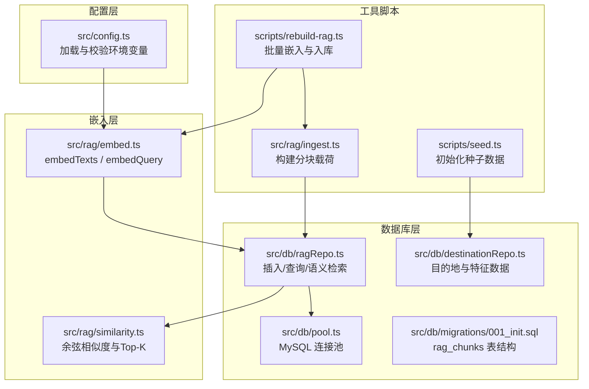
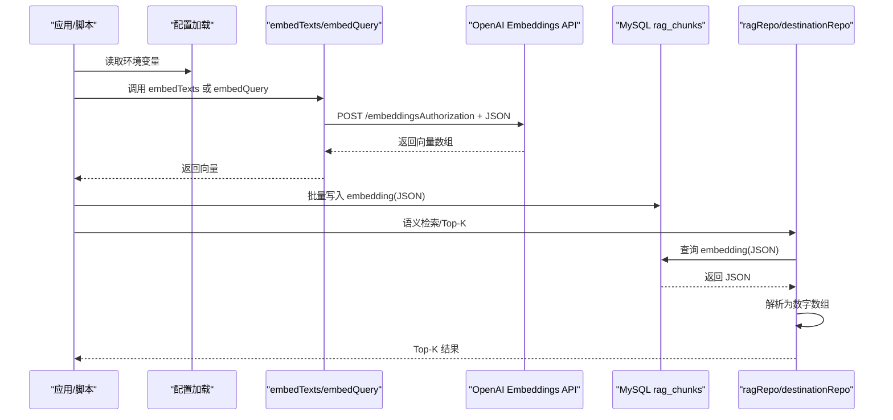
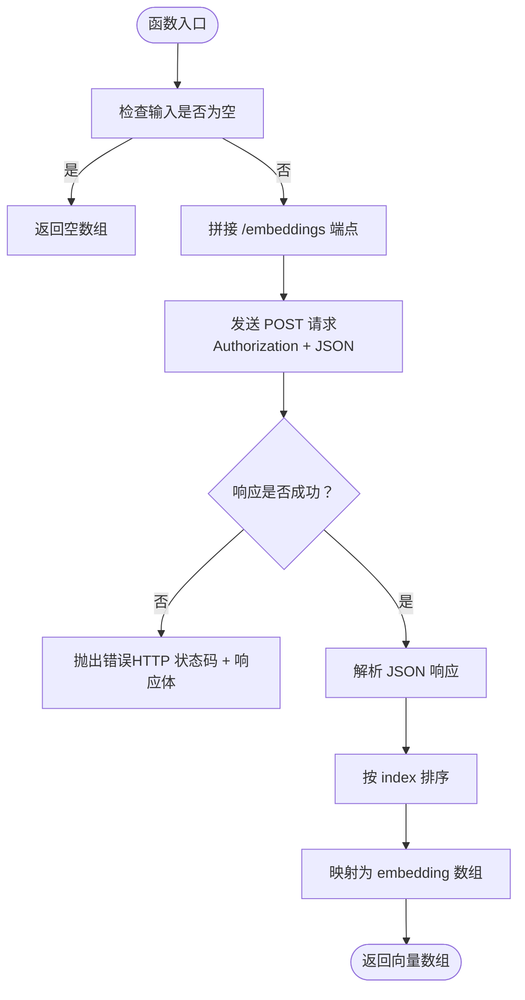
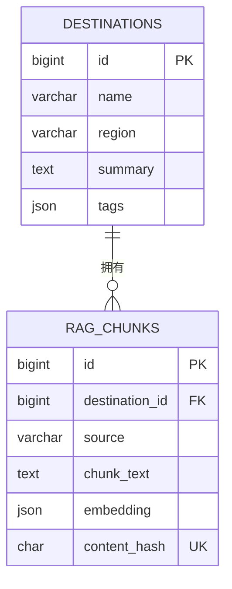
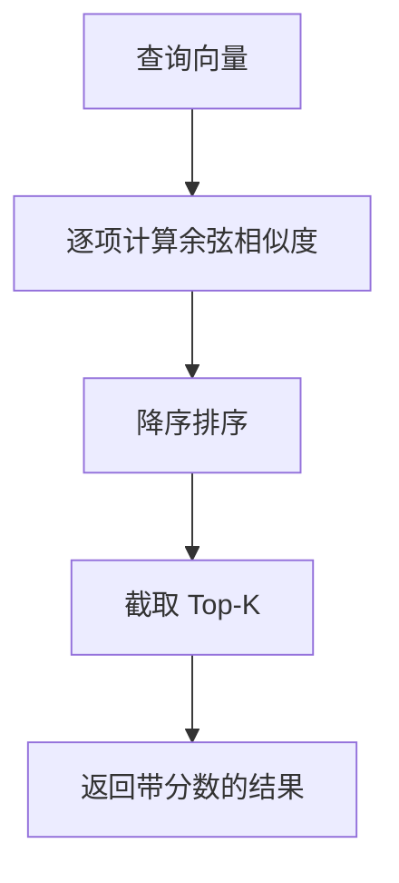
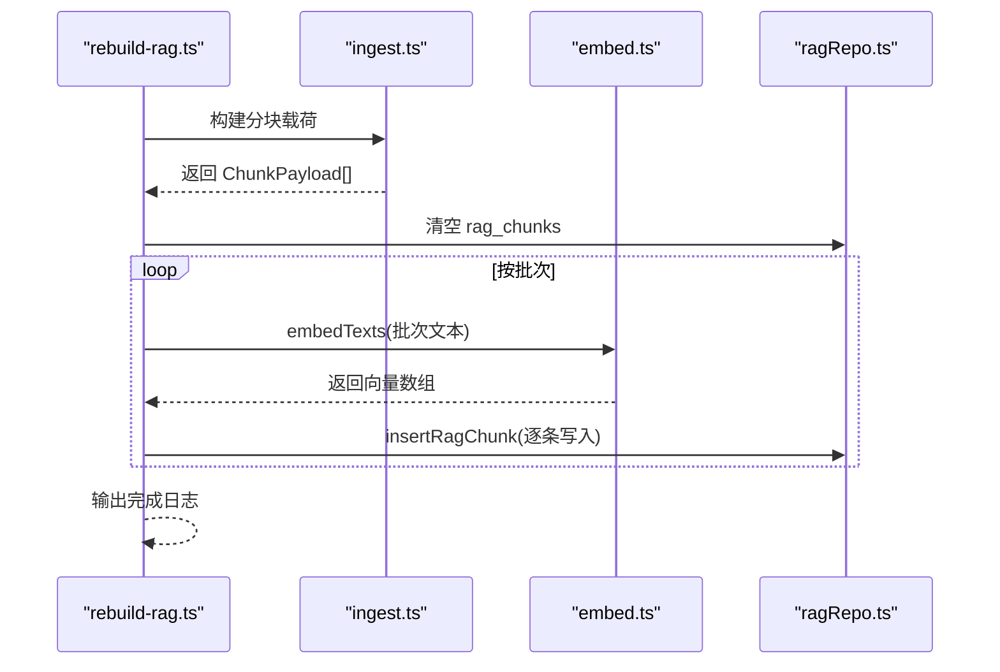
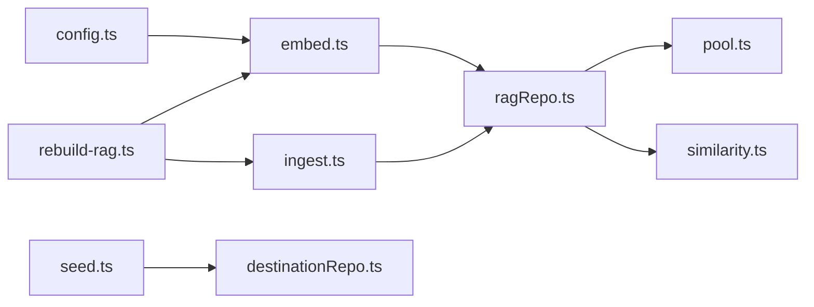

# 向量嵌入生成

<cite>
**本文引用的文件**
- [src/rag/embed.ts](file://src/rag/embed.ts)
- [src/config.ts](file://src/config.ts)
- [src/db/ragRepo.ts](file://src/db/ragRepo.ts)
- [src/db/migrations/001_init.sql](file://src/db/migrations/001_init.sql)
- [src/rag/similarity.ts](file://src/rag/similarity.ts)
- [src/rag/ingest.ts](file://src/rag/ingest.ts)
- [scripts/rebuild-rag.ts](file://scripts/rebuild-rag.ts)
- [scripts/seed.ts](file://scripts/seed.ts)
- [src/db/destinationRepo.ts](file://src/db/destinationRepo.ts)
- [src/db/pool.ts](file://src/db/pool.ts)
- [package.json](file://package.json)
</cite>

## 目录
1. [简介](#简介)
2. [项目结构](#项目结构)
3. [核心组件](#核心组件)
4. [架构总览](#架构总览)
5. [详细组件分析](#详细组件分析)
6. [依赖关系分析](#依赖关系分析)
7. [性能考量](#性能考量)
8. [故障排查指南](#故障排查指南)
9. [结论](#结论)
10. [附录](#附录)

## 简介
本技术文档聚焦于“向量嵌入生成”模块，系统阐述文本向量化的核心概念与实现原理，详解如何通过 OpenAI Embeddings API 进行集成与配置，并给出 embedTexts 与 embedQuery 的使用方法、输入输出格式、错误处理机制。文档还覆盖批量嵌入处理策略、API 调用限制与性能优化技巧，以及嵌入向量在数据库中的存储格式、维度管理与内存优化方案，并提供常见问题排查、API 密钥管理与网络连接故障处理指南。

## 项目结构
该模块位于 src/rag 目录下，配合数据库层与配置层协同工作：
- 配置层：读取环境变量并校验，提供 OpenAI 基础地址、模型名称、嵌入模型名与嵌入基础地址等。
- 嵌入层：封装 OpenAI Embeddings API 的调用，支持批量文本与单条查询向量化。
- 数据库层：负责将嵌入向量持久化到 rag_chunks 表，提供检索与相似度计算能力。
- 工具脚本：提供种子数据与重建 RAG 索引的批处理流程。

图表来源
- [src/config.ts:1-46](file://src/config.ts#L1-L46)
- [src/rag/embed.ts:1-38](file://src/rag/embed.ts#L1-L38)
- [src/rag/similarity.ts:1-31](file://src/rag/similarity.ts#L1-L31)
- [src/db/pool.ts:1-17](file://src/db/pool.ts#L1-L17)
- [src/db/ragRepo.ts:1-143](file://src/db/ragRepo.ts#L1-L143)
- [src/db/destinationRepo.ts:1-100](file://src/db/destinationRepo.ts#L1-L100)
- [src/db/migrations/001_init.sql:40-53](file://src/db/migrations/001_init.sql#L40-L53)
- [scripts/rebuild-rag.ts:1-39](file://scripts/rebuild-rag.ts#L1-L39)
- [src/rag/ingest.ts:1-77](file://src/rag/ingest.ts#L1-L77)
- [scripts/seed.ts:1-89](file://scripts/seed.ts#L1-L89)

章节来源
- [src/config.ts:1-46](file://src/config.ts#L1-L46)
- [src/rag/embed.ts:1-38](file://src/rag/embed.ts#L1-L38)
- [src/db/ragRepo.ts:1-143](file://src/db/ragRepo.ts#L1-L143)
- [src/db/migrations/001_init.sql:40-53](file://src/db/migrations/001_init.sql#L40-L53)
- [src/rag/similarity.ts:1-31](file://src/rag/similarity.ts#L1-L31)
- [src/rag/ingest.ts:1-77](file://src/rag/ingest.ts#L1-L77)
- [scripts/rebuild-rag.ts:1-39](file://scripts/rebuild-rag.ts#L1-L39)
- [scripts/seed.ts:1-89](file://scripts/seed.ts#L1-L89)
- [src/db/destinationRepo.ts:1-100](file://src/db/destinationRepo.ts#L1-L100)
- [src/db/pool.ts:1-17](file://src/db/pool.ts#L1-L17)

## 核心组件
- 配置与环境加载：提供 OPENAI_BASE_URL、OPENAI_API_KEY、OPENAI_EMBEDDING_MODEL、EMBEDDING_BASE_URL 等关键参数，并通过 embeddingBaseUrl 统一解析嵌入服务基础地址。
- 嵌入函数：
  - embedTexts：批量文本向量化，返回二维数组，每行对应一个输入文本的向量。
  - embedQuery：单条查询向量化，返回一维数组。
- 数据库交互：
  - 插入嵌入向量：将向量序列化为 JSON 存储到 rag_chunks.embedding 字段。
  - 查询与解析：从数据库读取 JSON 并解析为数字数组，供相似度计算使用。
- 相似度与检索：提供余弦相似度与 Top-K 选择，用于语义检索。
- 批处理与重建：脚本按批次调用 embedTexts，将结果写回数据库，支持大规模数据重建。

章节来源
- [src/config.ts:11-22](file://src/config.ts#L11-L22)
- [src/config.ts:43-45](file://src/config.ts#L43-L45)
- [src/rag/embed.ts:7-37](file://src/rag/embed.ts#L7-L37)
- [src/db/ragRepo.ts:29-52](file://src/db/ragRepo.ts#L29-L52)
- [src/db/ragRepo.ts:54-95](file://src/db/ragRepo.ts#L54-L95)
- [src/rag/similarity.ts:1-31](file://src/rag/similarity.ts#L1-L31)
- [scripts/rebuild-rag.ts:8-33](file://scripts/rebuild-rag.ts#L8-L33)

## 架构总览
下图展示从应用到 OpenAI Embeddings API 的端到端调用链，以及嵌入向量在数据库中的存储与检索路径。

图表来源
- [src/config.ts:35-45](file://src/config.ts#L35-L45)
- [src/rag/embed.ts:12-31](file://src/rag/embed.ts#L12-L31)
- [src/db/ragRepo.ts:29-52](file://src/db/ragRepo.ts#L29-L52)
- [src/db/ragRepo.ts:54-95](file://src/db/ragRepo.ts#L54-L95)
- [src/db/destinationRepo.ts:87-99](file://src/db/destinationRepo.ts#L87-L99)

## 详细组件分析

### 嵌入函数：embedTexts 与 embedQuery
- 功能概述
  - embedTexts：接收字符串数组，调用 OpenAI Embeddings API，返回与输入顺序一致的向量数组。
  - embedQuery：对单条查询进行向量化，便于后续相似度计算。
- 输入输出
  - 输入：AppConfig（含 OPENAI_API_KEY、OPENAI_EMBEDDING_MODEL、EMBEDDING_BASE_URL 或 OPENAI_BASE_URL），字符串数组或单个字符串。
  - 输出：embedTexts 返回二维数组；embedQuery 返回一维数组。
- 错误处理
  - 若 HTTP 非 2xx，抛出包含状态码与响应体的错误。
  - 对空输入数组直接返回空结果，避免无效请求。
- 关键实现点
  - 使用 embeddingBaseUrl 决定实际调用的基础地址。
  - 请求头包含 Authorization: Bearer <API_KEY> 与 Content-Type: application/json。
  - 将 model 与 input 参数传给 API。
  - 对返回的 data 按 index 排序后提取 embedding，保证与输入顺序一致。

图表来源
- [src/rag/embed.ts:7-37](file://src/rag/embed.ts#L7-L37)

章节来源
- [src/rag/embed.ts:7-37](file://src/rag/embed.ts#L7-L37)

### 配置与环境变量
- 关键参数
  - OPENAI_BASE_URL：OpenAI API 基础地址，默认 https://api.openai.com/v1。
  - OPENAI_API_KEY：必填，用于鉴权。
  - OPENAI_EMBEDDING_MODEL：嵌入模型名称，默认 text-embedding-3-small。
  - EMBEDDING_BASE_URL：可选，若设置则优先作为嵌入服务基础地址。
- 加载与校验
  - 通过 zod schema 校验环境变量，非法时抛出错误。
  - 提供 embeddingBaseUrl(config) 以统一解析嵌入服务地址。

章节来源
- [src/config.ts:11-22](file://src/config.ts#L11-L22)
- [src/config.ts:35-45](file://src/config.ts#L35-L45)

### 数据库存储与检索
- 表结构（rag_chunks）
  - embedding 字段类型为 JSON，存储向量数组。
  - content_hash 用于去重与幂等写入。
  - 外键约束指向 destinations。
- 写入流程
  - 将向量序列化为 JSON 后写入 embedding 字段。
- 读取与解析
  - 从数据库读取 embedding 字段，根据类型判断为数组或字符串，再解析为数字数组。
- 语义检索
  - 读取候选 chunk，计算查询向量与每个 chunk 向量的余弦相似度，取 Top-K。

图表来源
- [src/db/migrations/001_init.sql:40-53](file://src/db/migrations/001_init.sql#L40-L53)

章节来源
- [src/db/migrations/001_init.sql:40-53](file://src/db/migrations/001_init.sql#L40-L53)
- [src/db/ragRepo.ts:29-52](file://src/db/ragRepo.ts#L29-L52)
- [src/db/ragRepo.ts:54-95](file://src/db/ragRepo.ts#L54-L95)

### 相似度与 Top-K
- 余弦相似度
  - 计算两个向量的点积与模长，避免零向量导致除零。
- Top-K
  - 对候选集合计算相似度，排序后取前 K 个结果。

图表来源
- [src/rag/similarity.ts:1-31](file://src/rag/similarity.ts#L1-L31)

章节来源
- [src/rag/similarity.ts:1-31](file://src/rag/similarity.ts#L1-L31)

### 批量嵌入与重建流程
- 分块构建
  - 从目的地与特征数据中生成多种来源的文本块（summary、synthetic、feature），并计算内容哈希。
- 批处理嵌入
  - 按固定批次大小（如 16）调用 embedTexts，得到向量后逐条写入数据库。
- 重建脚本
  - 先清空旧索引，再写入新索引，最后输出统计信息。

图表来源
- [scripts/rebuild-rag.ts:10-33](file://scripts/rebuild-rag.ts#L10-L33)
- [src/rag/ingest.ts:30-77](file://src/rag/ingest.ts#L30-L77)
- [src/rag/embed.ts:7-37](file://src/rag/embed.ts#L7-L37)
- [src/db/ragRepo.ts:29-52](file://src/db/ragRepo.ts#L29-L52)

章节来源
- [scripts/rebuild-rag.ts:8-33](file://scripts/rebuild-rag.ts#L8-L33)
- [src/rag/ingest.ts:30-77](file://src/rag/ingest.ts#L30-L77)
- [src/rag/embed.ts:7-37](file://src/rag/embed.ts#L7-L37)
- [src/db/ragRepo.ts:29-52](file://src/db/ragRepo.ts#L29-L52)

## 依赖关系分析
- 组件耦合
  - 嵌入层仅依赖配置层提供的基础地址与模型名，耦合度低。
  - 数据库层依赖嵌入层与相似度层，形成清晰的数据流。
- 外部依赖
  - OpenAI Embeddings API：用于向量化。
  - MySQL：用于持久化嵌入向量与检索。
- 可能的循环依赖
  - 当前模块未发现循环依赖，各层职责清晰。

图表来源
- [src/config.ts:1-46](file://src/config.ts#L1-L46)
- [src/rag/embed.ts:1-38](file://src/rag/embed.ts#L1-L38)
- [src/db/ragRepo.ts:1-143](file://src/db/ragRepo.ts#L1-L143)
- [src/db/pool.ts:1-17](file://src/db/pool.ts#L1-L17)
- [src/rag/similarity.ts:1-31](file://src/rag/similarity.ts#L1-L31)
- [src/rag/ingest.ts:1-77](file://src/rag/ingest.ts#L1-L77)
- [scripts/rebuild-rag.ts:1-39](file://scripts/rebuild-rag.ts#L1-L39)
- [scripts/seed.ts:1-89](file://scripts/seed.ts#L1-L89)
- [src/db/destinationRepo.ts:1-100](file://src/db/destinationRepo.ts#L1-L100)

章节来源
- [src/config.ts:1-46](file://src/config.ts#L1-L46)
- [src/rag/embed.ts:1-38](file://src/rag/embed.ts#L1-L38)
- [src/db/ragRepo.ts:1-143](file://src/db/ragRepo.ts#L1-L143)
- [src/db/pool.ts:1-17](file://src/db/pool.ts#L1-L17)
- [src/rag/similarity.ts:1-31](file://src/rag/similarity.ts#L1-L31)
- [src/rag/ingest.ts:1-77](file://src/rag/ingest.ts#L1-L77)
- [scripts/rebuild-rag.ts:1-39](file://scripts/rebuild-rag.ts#L1-L39)
- [scripts/seed.ts:1-89](file://scripts/seed.ts#L1-L89)
- [src/db/destinationRepo.ts:1-100](file://src/db/destinationRepo.ts#L1-L100)

## 性能考量
- 批量嵌入策略
  - 使用固定批次大小（如 16）平衡吞吐与延迟，减少 API 调用次数。
  - 在脚本中按批次循环处理，避免一次性提交过多请求。
- API 调用限制
  - 依据 OpenAI 文档合理控制并发与速率，必要时增加重试与退避策略（当前实现未包含重试逻辑）。
- 内存优化
  - 数据库层将向量序列化为 JSON 存储，读取时解析为数字数组，避免在内存中保留多余副本。
  - 相似度计算仅在候选集上进行，通过候选上限与按目的地过滤降低计算规模。
- 网络与超时
  - 建议在生产环境中为 fetch 设置合理的超时与重试策略，避免长时间阻塞。
- 维度管理
  - 通过配置层指定嵌入模型，确保不同模型的向量维度一致，避免跨模型比较带来的不兼容。

章节来源
- [scripts/rebuild-rag.ts:8](file://scripts/rebuild-rag.ts#L8)
- [src/db/ragRepo.ts:54-95](file://src/db/ragRepo.ts#L54-L95)
- [src/rag/similarity.ts:19-30](file://src/rag/similarity.ts#L19-L30)

## 故障排查指南
- API 密钥与鉴权
  - 确认 OPENAI_API_KEY 已正确设置且非空。
  - 检查 EMBEDDING_BASE_URL 或 OPENAI_BASE_URL 是否指向正确的服务端点。
- HTTP 错误
  - 当响应非 2xx 时，函数会抛出包含状态码与响应体的错误，需根据错误信息定位问题（如配额不足、模型不可用、网络异常等）。
- 空输入
  - embedTexts 对空数组直接返回空结果，避免无效请求。
- 数据库写入失败
  - 检查 rag_chunks 表结构与字段类型（embedding 为 JSON），确认 content_hash 唯一性约束未冲突。
- 相似度结果异常
  - 确保查询向量与数据库中向量维度一致；检查 parseEmbedding 的解析逻辑是否正确。
- 网络连接故障
  - 检查网络连通性与代理设置；在脚本中增加超时与重试逻辑以提升鲁棒性。

章节来源
- [src/rag/embed.ts:25-28](file://src/rag/embed.ts#L25-L28)
- [src/db/migrations/001_init.sql:40-53](file://src/db/migrations/001_init.sql#L40-L53)
- [src/db/ragRepo.ts:15-23](file://src/db/ragRepo.ts#L15-L23)

## 结论
本模块通过简洁的嵌入接口与稳健的数据库存储方案，实现了从文本到向量的高效转换与语义检索。配置层提供了灵活的服务地址与模型选择，批量处理脚本支持大规模数据的快速索引重建。在生产环境中，建议结合重试、超时与速率控制策略进一步提升稳定性与性能。

## 附录
- 环境变量清单
  - OPENAI_BASE_URL：OpenAI API 基础地址
  - OPENAI_API_KEY：API 密钥
  - OPENAI_EMBEDDING_MODEL：嵌入模型名称
  - EMBEDDING_BASE_URL：可选，覆盖嵌入服务基础地址
- 常用命令
  - 初始化种子数据：npm run seed
  - 重建 RAG 索引：npm run rag:rebuild

章节来源
- [src/config.ts:11-22](file://src/config.ts#L11-L22)
- [package.json:6-13](file://package.json#L6-L13)