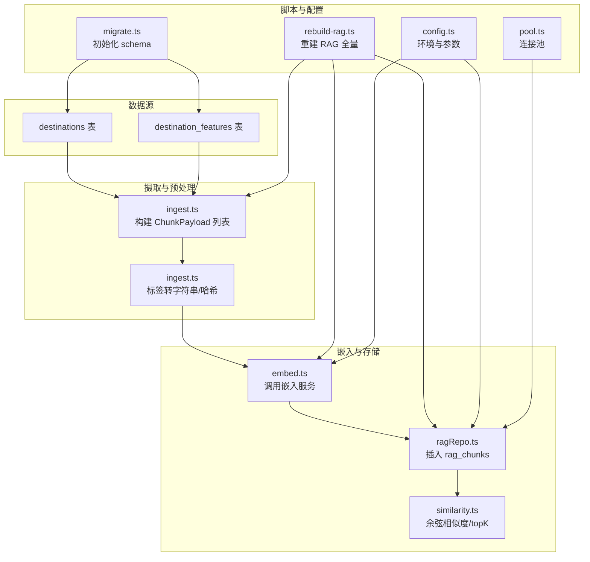
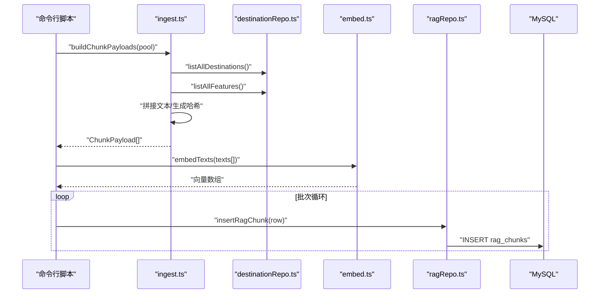
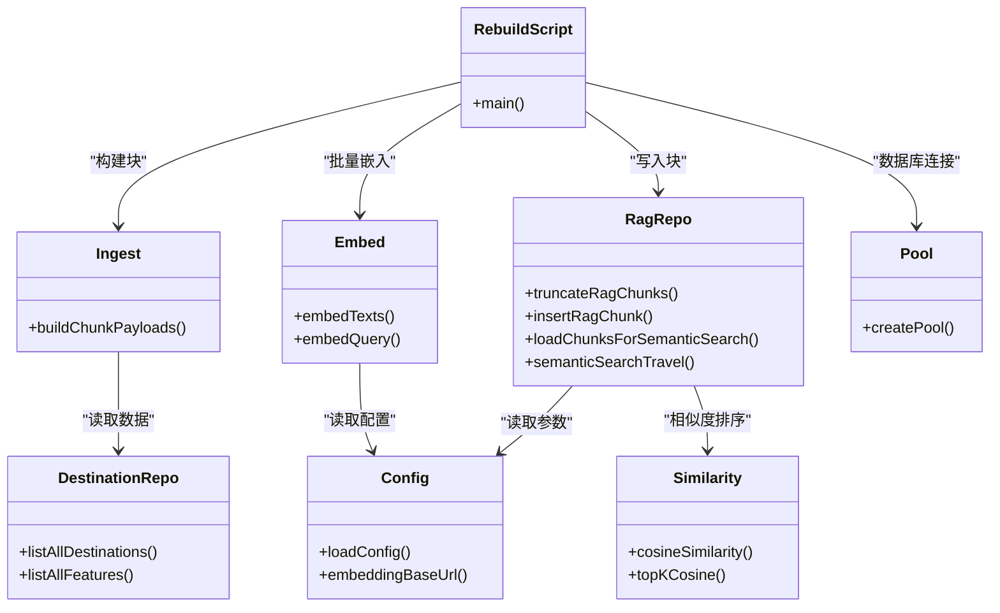
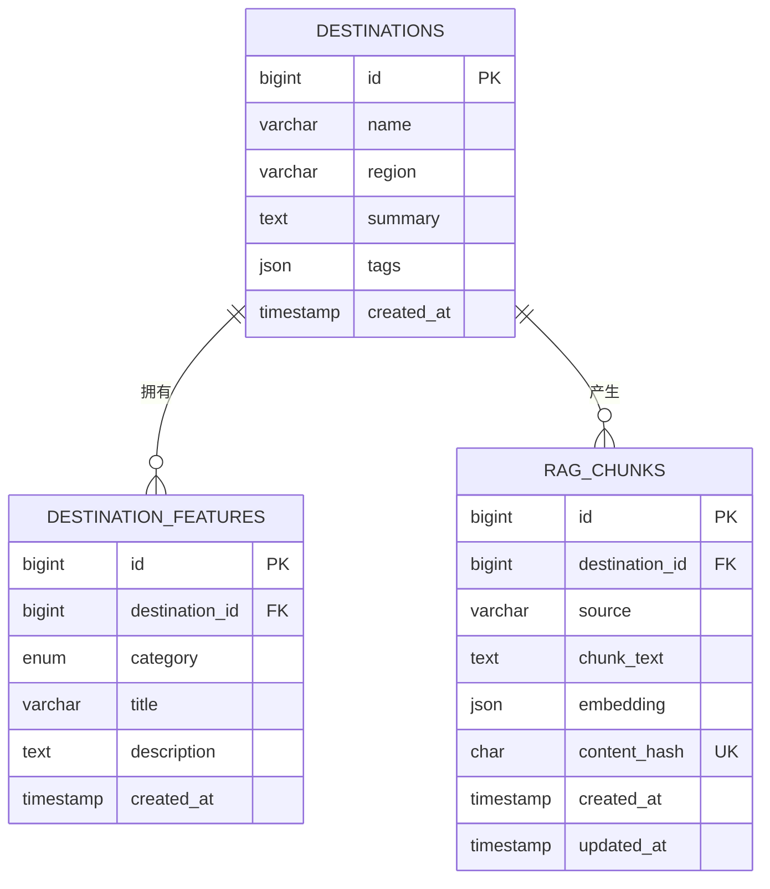

# 数据摄取与处理

<cite>
**本文引用的文件**
- [src/rag/ingest.ts](file://src/rag/ingest.ts)
- [src/db/ragRepo.ts](file://src/db/ragRepo.ts)
- [src/db/destinationRepo.ts](file://src/db/destinationRepo.ts)
- [src/rag/embed.ts](file://src/rag/embed.ts)
- [src/rag/similarity.ts](file://src/rag/similarity.ts)
- [src/db/migrations/001_init.sql](file://src/db/migrations/001_init.sql)
- [scripts/rebuild-rag.ts](file://scripts/rebuild-rag.ts)
- [src/db/pool.ts](file://src/db/pool.ts)
- [src/config.ts](file://src/config.ts)
- [scripts/migrate.ts](file://scripts/migrate.ts)
- [src/index.ts](file://src/index.ts)
</cite>

## 目录
1. [简介](#简介)
2. [项目结构](#项目结构)
3. [核心组件](#核心组件)
4. [架构总览](#架构总览)
5. [详细组件分析](#详细组件分析)
6. [依赖关系分析](#依赖关系分析)
7. [性能考量](#性能考量)
8. [故障排查指南](#故障排查指南)
9. [结论](#结论)
10. [附录](#附录)

## 简介
本文件面向“数据摄取与处理”模块，聚焦 RAG 数据的预处理、文本清洗与分块策略、数据摄取管道（数据源接入、格式转换、批量处理）、RagChunkRow 数据模型设计、数据更新与版本管理、数据质量控制（重复、异常过滤）、以及摄取性能监控与一致性保障。本文所有技术细节均来自仓库现有实现，避免臆测。

## 项目结构
该模块围绕“目的地与特征”数据表构建 RAG 文本块，并通过嵌入服务生成向量，最终写入 rag_chunks 表。脚本化重建流程支持全量重制，同时提供按需查询与相似度检索能力。

图表来源
- [src/rag/ingest.ts:1-77](file://src/rag/ingest.ts#L1-L77)
- [src/db/ragRepo.ts:1-143](file://src/db/ragRepo.ts#L1-L143)
- [src/db/destinationRepo.ts:1-100](file://src/db/destinationRepo.ts#L1-L100)
- [src/rag/embed.ts:1-38](file://src/rag/embed.ts#L1-L38)
- [src/rag/similarity.ts:1-31](file://src/rag/similarity.ts#L1-L31)
- [scripts/migrate.ts:1-34](file://scripts/migrate.ts#L1-L34)
- [scripts/rebuild-rag.ts:1-39](file://scripts/rebuild-rag.ts#L1-L39)
- [src/config.ts:1-46](file://src/config.ts#L1-L46)
- [src/db/pool.ts:1-17](file://src/db/pool.ts#L1-L17)

章节来源
- [src/db/migrations/001_init.sql:1-54](file://src/db/migrations/001_init.sql#L1-L54)
- [src/rag/ingest.ts:1-77](file://src/rag/ingest.ts#L1-L77)
- [src/db/ragRepo.ts:1-143](file://src/db/ragRepo.ts#L1-L143)
- [src/rag/embed.ts:1-38](file://src/rag/embed.ts#L1-L38)
- [src/rag/similarity.ts:1-31](file://src/rag/similarity.ts#L1-L31)
- [scripts/rebuild-rag.ts:1-39](file://scripts/rebuild-rag.ts#L1-L39)
- [scripts/migrate.ts:1-34](file://scripts/migrate.ts#L1-L34)
- [src/config.ts:1-46](file://src/config.ts#L1-L46)
- [src/db/pool.ts:1-17](file://src/db/pool.ts#L1-L17)

## 核心组件
- 摄取与预处理：负责从目的地与特征表读取数据，构造多种来源的文本块，计算内容哈希，形成 ChunkPayload 列表。
- 嵌入服务：调用外部嵌入服务，批量生成向量。
- 存储与检索：将向量与文本写入 rag_chunks；提供按目的地筛选与 topK 相似度检索。
- 脚本化重建：提供全量重建 RAG 的命令行脚本，支持批处理与哈希去重。
- 配置与连接：集中管理数据库与嵌入服务参数，提供连接池。

章节来源
- [src/rag/ingest.ts:1-77](file://src/rag/ingest.ts#L1-L77)
- [src/db/ragRepo.ts:1-143](file://src/db/ragRepo.ts#L1-L143)
- [src/rag/embed.ts:1-38](file://src/rag/embed.ts#L1-L38)
- [scripts/rebuild-rag.ts:1-39](file://scripts/rebuild-rag.ts#L1-L39)
- [src/config.ts:1-46](file://src/config.ts#L1-L46)
- [src/db/pool.ts:1-17](file://src/db/pool.ts#L1-L17)

## 架构总览
下图展示从数据源到检索的完整链路，包括数据清洗、分块、嵌入、入库与检索。

图表来源
- [scripts/rebuild-rag.ts:1-39](file://scripts/rebuild-rag.ts#L1-L39)
- [src/rag/ingest.ts:1-77](file://src/rag/ingest.ts#L1-L77)
- [src/db/destinationRepo.ts:1-100](file://src/db/destinationRepo.ts#L1-L100)
- [src/rag/embed.ts:1-38](file://src/rag/embed.ts#L1-L38)
- [src/db/ragRepo.ts:1-143](file://src/db/ragRepo.ts#L1-L143)

## 详细组件分析

### 预处理与文本清洗
- 数据源接入
  - 从 destinations 与 destination_features 两张表读取目的地与特征数据，按目的地聚合特征。
- 文本清洗与格式转换
  - 标签字段统一转为字符串，兼容数组或 JSON 字符串，使用特定分隔符连接。
  - 构造三类文本块：
    - 目的地摘要块：包含名称、地区、摘要与标签。
    - 合成块：按目的地汇总其特征标题与描述，形成要点列表。
    - 特征块：逐条特征文本，包含分类、目的地与描述。
- 内容哈希
  - 对每条文本块计算哈希，用于后续去重与一致性校验。

章节来源
- [src/rag/ingest.ts:1-77](file://src/rag/ingest.ts#L1-L77)
- [src/db/destinationRepo.ts:1-100](file://src/db/destinationRepo.ts#L1-L100)

### 分块策略
- 分块粒度
  - 目的地级摘要块：单条文本块，适合整体概览。
  - 合成块：按目的地聚合多条特征，适合主题性检索。
  - 特征块：细粒度条目，便于精确匹配与推荐。
- 文本组织
  - 使用结构化前缀（如分类标识）提升检索语义清晰度。
- 哈希约束
  - 以 content_hash 作为唯一键，避免重复入库。

章节来源
- [src/rag/ingest.ts:1-77](file://src/rag/ingest.ts#L1-L77)
- [src/db/migrations/001_init.sql:40-53](file://src/db/migrations/001_init.sql#L40-L53)

### 数据摄取管道
- 流程步骤
  - 读取目的地与特征 -> 构建文本块 -> 计算哈希 -> 批量嵌入 -> 写入 rag_chunks。
- 批量处理
  - 脚本以固定批次大小迭代，先清空旧表，再逐批写入，确保幂等与可控内存占用。
- 错误处理
  - 嵌入请求失败时抛出错误；脚本捕获并退出，避免脏数据入库。

章节来源
- [scripts/rebuild-rag.ts:1-39](file://scripts/rebuild-rag.ts#L1-L39)
- [src/rag/embed.ts:1-38](file://src/rag/embed.ts#L1-L38)
- [src/db/ragRepo.ts:1-143](file://src/db/ragRepo.ts#L1-L143)

### RagChunkRow 数据模型设计
- 字段定义
  - id：自增主键。
  - destination_id：外键关联目的地。
  - source：来源类型（摘要/合成/特征）。
  - chunk_text：文本内容。
  - embedding：JSON 存储的向量数组。
  - content_hash：内容哈希，唯一索引。
  - created_at/updated_at：时间戳。
- 约束与索引
  - 外键约束：删除目的地时级联删除对应块。
  - 唯一约束：content_hash 去重。
  - 辅助索引：destination_id、source，加速检索与过滤。
- 解析与序列化
  - 读取时将 JSON 字符串解析为数字数组；写入时序列化为 JSON 字符串。

章节来源
- [src/db/ragRepo.ts:1-143](file://src/db/ragRepo.ts#L1-L143)
- [src/db/migrations/001_init.sql:40-53](file://src/db/migrations/001_init.sql#L40-L53)

### 数据更新策略、增量摄取与版本管理
- 当前实现
  - 全量重建：每次重建会清空 rag_chunks 并重新写入。
  - 哈希去重：基于 content_hash 唯一键，避免重复。
- 增量摄取建议
  - 引入时间戳字段（如 created_at/updated_at）与变更检测。
  - 仅对变更的目的地或特征生成新块，计算哈希并与现有记录比对。
  - 支持按目的地批量更新，保留未变更块。
- 版本管理
  - 可引入版本号字段与迁移策略，配合迁移脚本进行结构演进。

章节来源
- [scripts/rebuild-rag.ts:1-39](file://scripts/rebuild-rag.ts#L1-L39)
- [src/db/migrations/001_init.sql:40-53](file://src/db/migrations/001_init.sql#L40-L53)

### 数据质量检查、重复数据处理与异常数据过滤
- 重复数据处理
  - 通过 content_hash 唯一键自动去重，避免重复写入。
- 异常数据过滤
  - 标签字段清洗：统一转为字符串，数组或 JSON 字符串均可处理。
  - 嵌入服务错误：HTTP 非 2xx 抛错，由上层脚本捕获。
- 数据完整性
  - 外键约束保证目的地与特征存在性；唯一索引保证内容一致性。

章节来源
- [src/rag/ingest.ts:1-77](file://src/rag/ingest.ts#L1-L77)
- [src/db/ragRepo.ts:1-143](file://src/db/ragRepo.ts#L1-L143)
- [src/rag/embed.ts:1-38](file://src/rag/embed.ts#L1-L38)

### 摄取性能监控、错误重试与一致性保证
- 性能监控
  - 批次大小：脚本中固定批次大小，平衡吞吐与内存占用。
  - 嵌入并发：嵌入接口为批量请求，减少网络往返。
- 错误重试
  - 嵌入服务失败时直接抛错，脚本退出；可在上层作业调度器中增加重试策略。
- 一致性保证
  - 先清空后写入，确保重建过程的一致性。
  - 哈希去重与外键约束共同维护数据一致性。

章节来源
- [scripts/rebuild-rag.ts:1-39](file://scripts/rebuild-rag.ts#L1-L39)
- [src/rag/embed.ts:1-38](file://src/rag/embed.ts#L1-L38)
- [src/db/ragRepo.ts:1-143](file://src/db/ragRepo.ts#L1-L143)

## 依赖关系分析

图表来源
- [src/db/destinationRepo.ts:1-100](file://src/db/destinationRepo.ts#L1-L100)
- [src/rag/ingest.ts:1-77](file://src/rag/ingest.ts#L1-L77)
- [src/rag/embed.ts:1-38](file://src/rag/embed.ts#L1-L38)
- [src/db/ragRepo.ts:1-143](file://src/db/ragRepo.ts#L1-L143)
- [src/rag/similarity.ts:1-31](file://src/rag/similarity.ts#L1-L31)
- [scripts/rebuild-rag.ts:1-39](file://scripts/rebuild-rag.ts#L1-L39)
- [src/config.ts:1-46](file://src/config.ts#L1-L46)
- [src/db/pool.ts:1-17](file://src/db/pool.ts#L1-L17)

## 性能考量
- 批处理与内存占用
  - 固定批次大小在吞吐与内存之间取得平衡；可根据硬件资源调整。
- 嵌入服务调用
  - 批量嵌入减少网络开销；注意嵌入服务的速率限制与错误处理。
- 查询与索引
  - rag_chunks 上的索引有助于按目的地与来源快速筛选候选集。
- 连接池
  - 数据库连接池限制并发连接数，避免过载。

章节来源
- [scripts/rebuild-rag.ts:1-39](file://scripts/rebuild-rag.ts#L1-L39)
- [src/db/ragRepo.ts:1-143](file://src/db/ragRepo.ts#L1-L143)
- [src/db/pool.ts:1-17](file://src/db/pool.ts#L1-L17)

## 故障排查指南
- 嵌入服务错误
  - 现象：嵌入请求返回非 2xx。
  - 排查：检查 API 密钥、基础 URL、模型名与网络连通性。
- 数据库连接问题
  - 现象：健康检查失败或查询报错。
  - 排查：确认数据库凭据、主机与端口、数据库存在性。
- 重建失败
  - 现象：重建脚本退出。
  - 排查：查看脚本输出日志，定位嵌入或写入阶段的异常。
- 重复数据
  - 现象：唯一键冲突。
  - 排查：确认 content_hash 是否正确生成，是否已存在相同内容。

章节来源
- [src/rag/embed.ts:1-38](file://src/rag/embed.ts#L1-L38)
- [src/db/ragRepo.ts:1-143](file://src/db/ragRepo.ts#L1-L143)
- [scripts/rebuild-rag.ts:1-39](file://scripts/rebuild-rag.ts#L1-L39)
- [src/db/migrations/001_init.sql:40-53](file://src/db/migrations/001_init.sql#L40-L53)

## 结论
本模块通过明确的数据源接入、结构化的文本清洗与分块策略、可靠的嵌入与入库流程，实现了可重建、可扩展的 RAG 数据管线。当前以全量重建为主，具备哈希去重与外键约束保障一致性。建议后续引入增量摄取与版本管理机制，进一步提升运维效率与数据稳定性。

## 附录

### 数据模型 ER 图

图表来源
- [src/db/migrations/001_init.sql:1-54](file://src/db/migrations/001_init.sql#L1-L54)