# 相似度计算

<cite>
**本文档引用的文件**
- [src/rag/similarity.ts](file://src/rag/similarity.ts)
- [src/rag/embed.ts](file://src/rag/embed.ts)
- [src/db/ragRepo.ts](file://src/db/ragRepo.ts)
- [src/db/destinationRepo.ts](file://src/db/destinationRepo.ts)
- [src/db/migrations/001_init.sql](file://src/db/migrations/001_init.sql)
- [src/config.ts](file://src/config.ts)
- [src/rag/ingest.ts](file://src/rag/ingest.ts)
</cite>

## 目录
1. [简介](#简介)
2. [项目结构](#项目结构)
3. [核心组件](#核心组件)
4. [架构概览](#架构概览)
5. [详细组件分析](#详细组件分析)
6. [依赖关系分析](#依赖关系分析)
7. [性能考虑](#性能考虑)
8. [故障排除指南](#故障排除指南)
9. [结论](#结论)

## 简介

本项目实现了一个基于向量嵌入的相似度计算系统，主要用于旅行规划Agent的检索增强生成(RAG)功能。系统通过OpenAI的文本嵌入模型将文本转换为高维向量，然后使用余弦相似度算法计算查询与文档片段之间的相似度。

该系统的核心特性包括：
- 基于余弦相似度的向量相似度计算
- 批量相似度计算的Top-K筛选
- 向量嵌入的远程API调用
- 数据库存储的向量化文档
- 可配置的相似度阈值和候选数量限制

## 项目结构

项目采用模块化的架构设计，相似度计算功能主要分布在以下模块中：

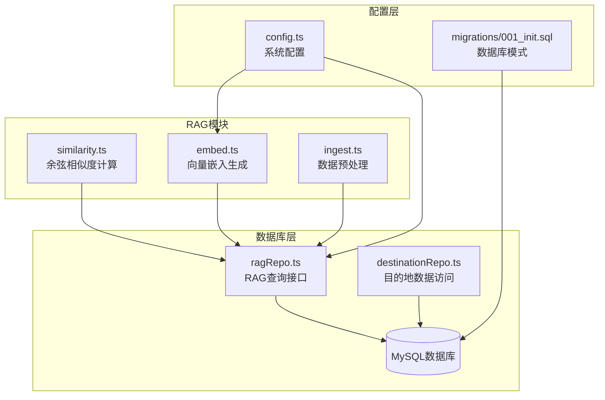

**图表来源**
- [src/rag/similarity.ts:1-31](file://src/rag/similarity.ts#L1-L31)
- [src/rag/embed.ts:1-38](file://src/rag/embed.ts#L1-L38)
- [src/db/ragRepo.ts:1-143](file://src/db/ragRepo.ts#L1-L143)

**章节来源**
- [src/rag/similarity.ts:1-31](file://src/rag/similarity.ts#L1-L31)
- [src/rag/embed.ts:1-38](file://src/rag/embed.ts#L1-L38)
- [src/db/ragRepo.ts:1-143](file://src/db/ragRepo.ts#L1-L143)
- [src/config.ts:1-46](file://src/config.ts#L1-L46)

## 核心组件

### 余弦相似度计算引擎

系统实现了高效的余弦相似度计算函数，支持任意长度的向量比较：

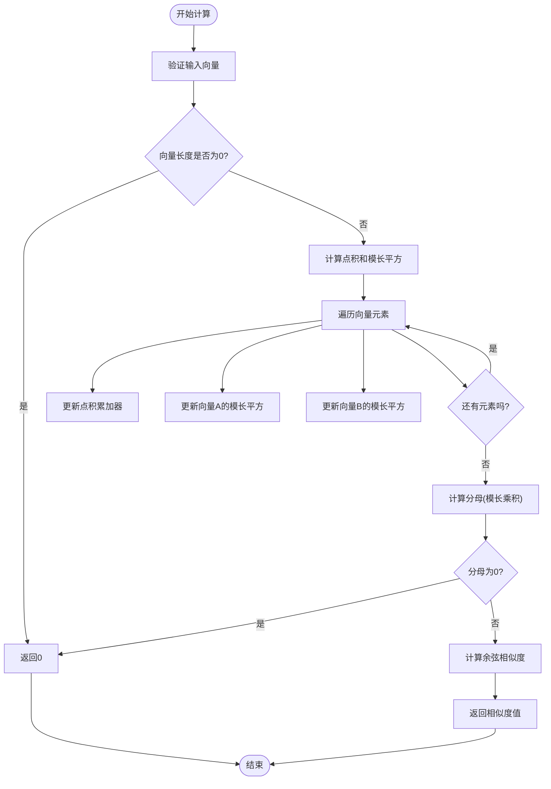

**图表来源**
- [src/rag/similarity.ts:1-15](file://src/rag/similarity.ts#L1-L15)

### Top-K相似度筛选器

实现了高效的Top-K筛选算法，用于从大量候选文档中快速找到最相似的k个结果：

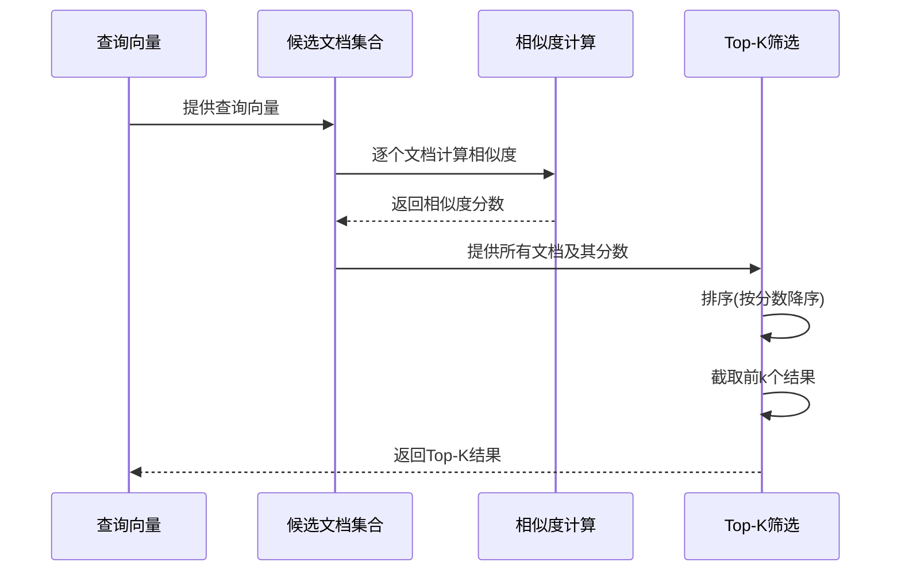

**图表来源**
- [src/rag/similarity.ts:19-30](file://src/rag/similarity.ts#L19-L30)

**章节来源**
- [src/rag/similarity.ts:1-31](file://src/rag/similarity.ts#L1-L31)

## 架构概览

系统的整体架构采用分层设计，从底层的数据存储到上层的应用服务：

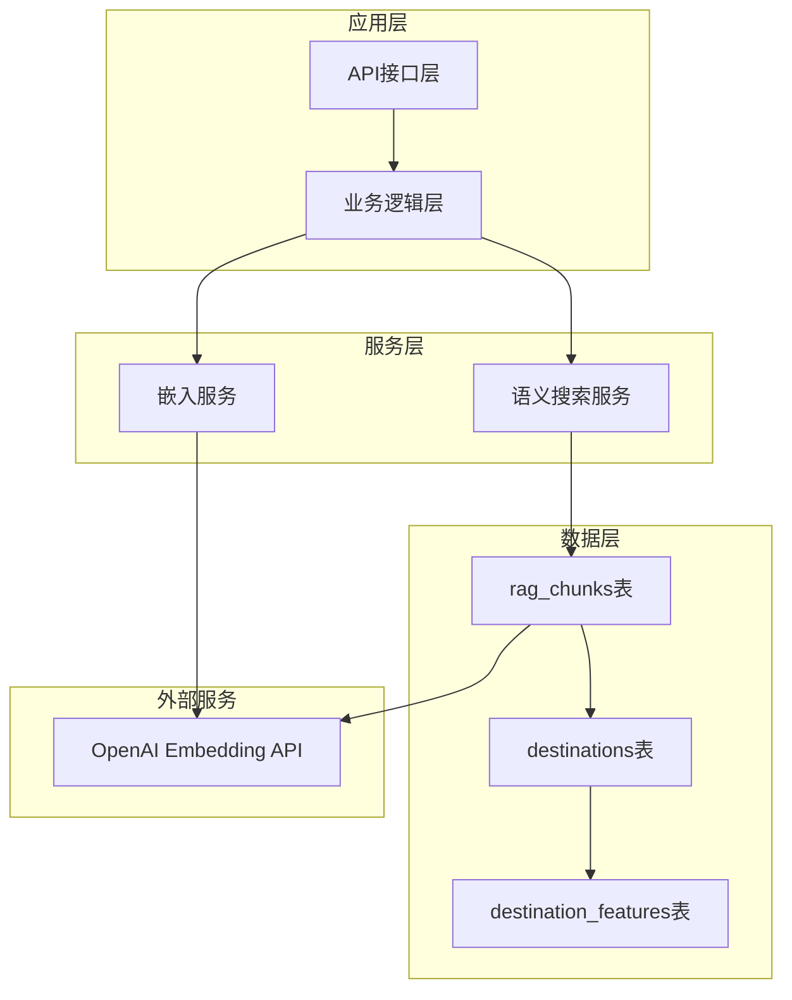

**图表来源**
- [src/db/ragRepo.ts:97-142](file://src/db/ragRepo.ts#L97-L142)
- [src/db/migrations/001_init.sql:40-53](file://src/db/migrations/001_init.sql#L40-L53)

**章节来源**
- [src/db/ragRepo.ts:97-142](file://src/db/ragRepo.ts#L97-L142)
- [src/db/migrations/001_init.sql:1-54](file://src/db/migrations/001_init.sql#L1-L54)

## 详细组件分析

### 相似度计算模块

#### 数学原理

余弦相似度通过计算两个向量夹角的余弦值来衡量它们的方向相似性：

```
cos(θ) = (A · B) / (||A|| × ||B||)
```

其中：
- A · B 是向量A和B的点积
- ||A|| 和 ||B|| 分别是向量A和B的欧几里得范数

**实现特点**：
- 支持不同长度的向量比较（取较短长度）
- 自动处理零向量情况
- 返回值范围[-1, 1]，值越大表示越相似

#### 性能优化

当前实现采用O(n×d)的时间复杂度，其中n是候选文档数量，d是向量维度：

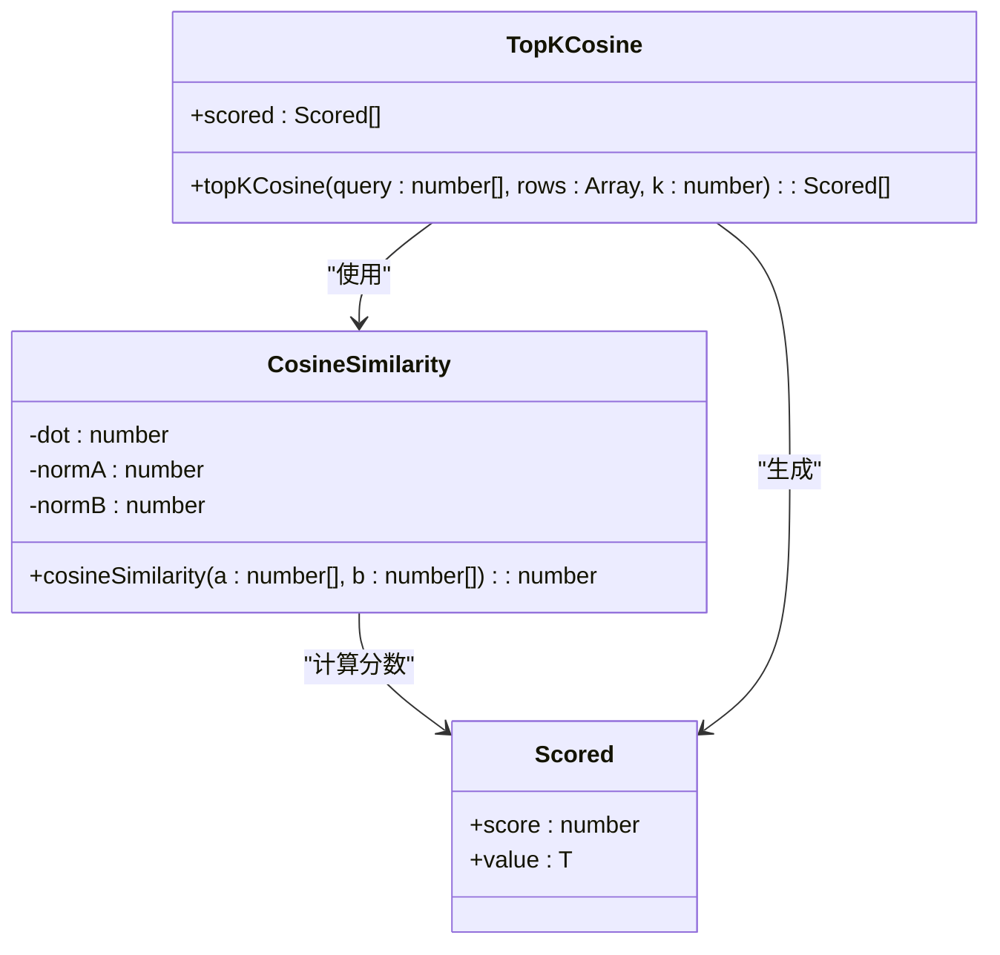

**图表来源**
- [src/rag/similarity.ts:1-31](file://src/rag/similarity.ts#L1-L31)

**章节来源**
- [src/rag/similarity.ts:1-31](file://src/rag/similarity.ts#L1-L31)

### 向量嵌入模块

#### OpenAI嵌入集成

系统通过HTTP API调用OpenAI的文本嵌入服务：

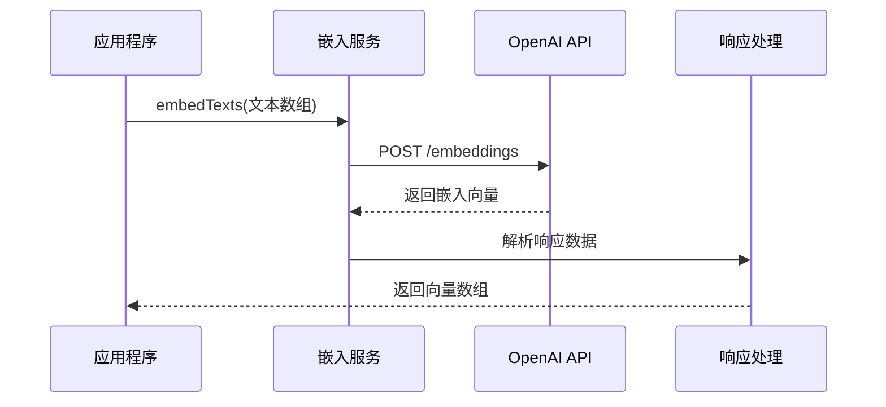

**图表来源**
- [src/rag/embed.ts:7-37](file://src/rag/embed.ts#L7-L37)

#### 数据处理流程

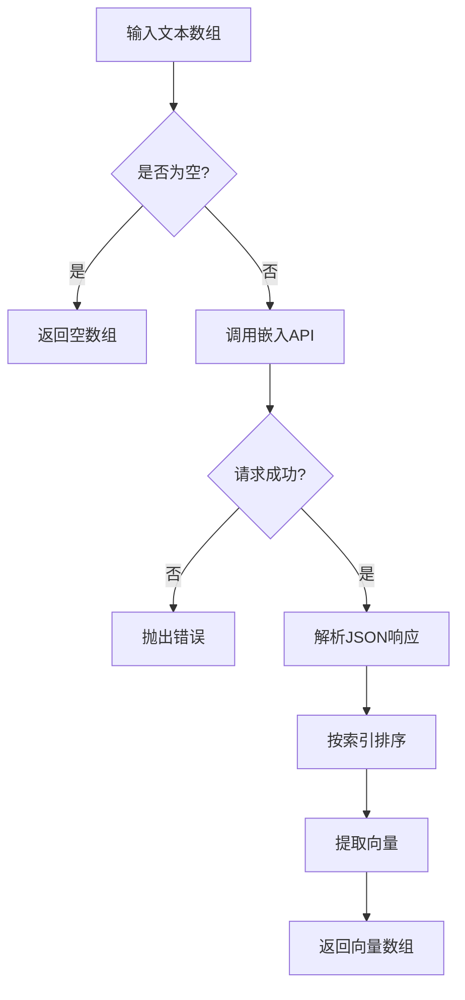

**图表来源**
- [src/rag/embed.ts:14-31](file://src/rag/embed.ts#L14-L31)

**章节来源**
- [src/rag/embed.ts:1-38](file://src/rag/embed.ts#L1-L38)

### 数据库集成模块

#### RAG查询接口

实现了完整的语义搜索功能，包括查询向量生成、候选文档加载和相似度计算：

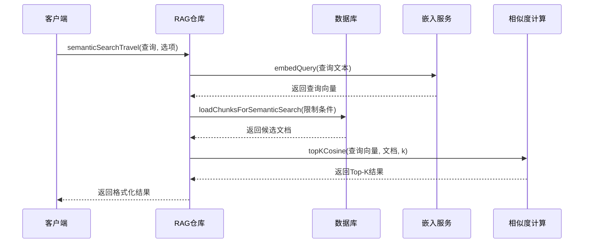

**图表来源**
- [src/db/ragRepo.ts:97-142](file://src/db/ragRepo.ts#L97-L142)

#### 数据库模式设计

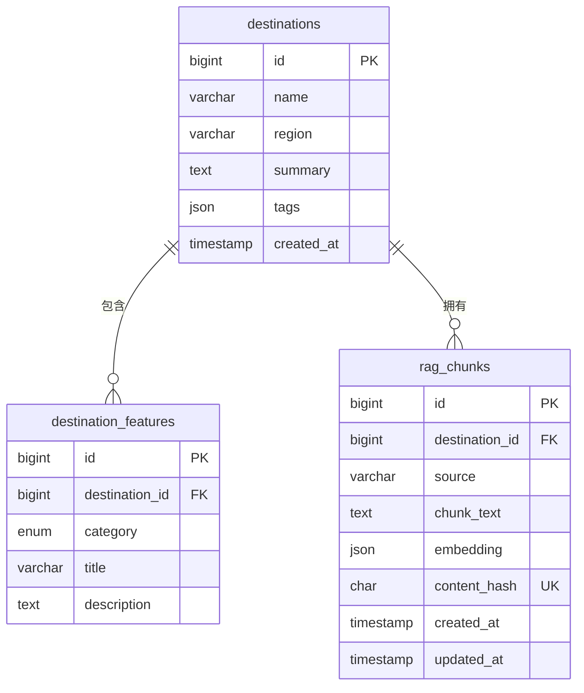

**图表来源**
- [src/db/migrations/001_init.sql:3-53](file://src/db/migrations/001_init.sql#L3-L53)

**章节来源**
- [src/db/ragRepo.ts:1-143](file://src/db/ragRepo.ts#L1-L143)
- [src/db/migrations/001_init.sql:1-54](file://src/db/migrations/001_init.sql#L1-L54)

### 配置管理模块

#### 系统配置

系统通过环境变量进行配置管理，关键配置项包括：

| 配置项 | 默认值 | 描述 |
|--------|--------|------|
| OPENAI_API_KEY | 必需 | OpenAI API密钥 |
| OPENAI_EMBEDDING_MODEL | text-embedding-3-small | 嵌入模型名称 |
| RAG_TOP_K_DEFAULT | 8 | 默认返回的相似文档数量 |
| RAG_CANDIDATE_LIMIT | 2000 | 候选文档数量上限 |
| EMBEDDING_BASE_URL | OPENAI_BASE_URL | 嵌入API基础URL |

**章节来源**
- [src/config.ts:1-46](file://src/config.ts#L1-L46)

## 依赖关系分析

系统的主要依赖关系如下：

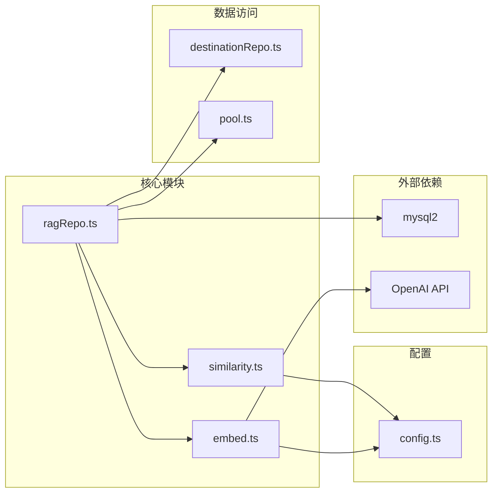

**图表来源**
- [src/rag/similarity.ts:1-31](file://src/rag/similarity.ts#L1-L31)
- [src/rag/embed.ts:1-38](file://src/rag/embed.ts#L1-L38)
- [src/db/ragRepo.ts:1-143](file://src/db/ragRepo.ts#L1-L143)

**章节来源**
- [src/rag/similarity.ts:1-31](file://src/rag/similarity.ts#L1-L31)
- [src/rag/embed.ts:1-38](file://src/rag/embed.ts#L1-L38)
- [src/db/ragRepo.ts:1-143](file://src/db/ragRepo.ts#L1-L143)

## 性能考虑

### 当前实现的性能特征

1. **时间复杂度**：O(n×d + n log n)，其中n是候选文档数量，d是向量维度
2. **空间复杂度**：O(n)，用于存储中间相似度分数
3. **I/O开销**：主要来自嵌入API调用和数据库查询

### 优化建议

#### 索引优化
- 在`rag_chunks.embedding`列上创建JSON函数索引以加速向量比较
- 优化数据库查询中的WHERE条件和LIMIT子句

#### 缓存策略
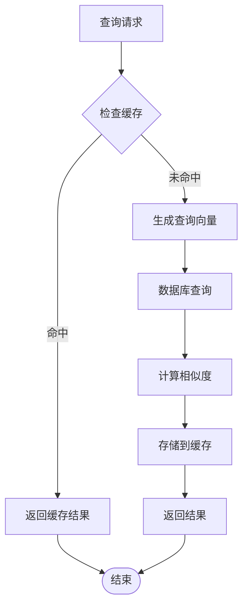

#### 批量处理优化
- 将多个查询合并为批量请求以减少API调用次数
- 实现异步并发处理以提高吞吐量

## 故障排除指南

### 常见问题及解决方案

#### 嵌入API错误
- **症状**：HTTP请求失败，返回非2xx状态码
- **原因**：API密钥无效、网络连接问题、API限流
- **解决**：检查OPENAI_API_KEY配置，验证网络连接，实现重试机制

#### 数据库连接问题
- **症状**：查询超时或连接失败
- **原因**：数据库服务器不可用、连接池耗尽
- **解决**：检查数据库状态，调整连接池配置，实现连接健康检查

#### 向量维度不匹配
- **症状**：相似度计算异常或返回NaN
- **原因**：嵌入向量长度不一致
- **解决**：在数据入库时统一向量维度，添加数据验证

**章节来源**
- [src/rag/embed.ts:25-28](file://src/rag/embed.ts#L25-L28)
- [src/db/ragRepo.ts:15-23](file://src/db/ragRepo.ts#L15-L23)

## 结论

本项目实现了一个功能完整且高效的相似度计算系统，具有以下特点：

1. **算法实现**：正确实现了余弦相似度算法，支持动态向量长度
2. **系统集成**：与RAG工作流无缝集成，提供完整的语义搜索能力
3. **可扩展性**：模块化设计便于后续功能扩展和性能优化
4. **配置灵活**：通过环境变量实现灵活的系统配置

未来可以考虑的改进方向：
- 实现欧几里得距离等其他相似度算法
- 添加向量归一化处理
- 实现更高级的索引和缓存策略
- 添加性能监控和指标收集