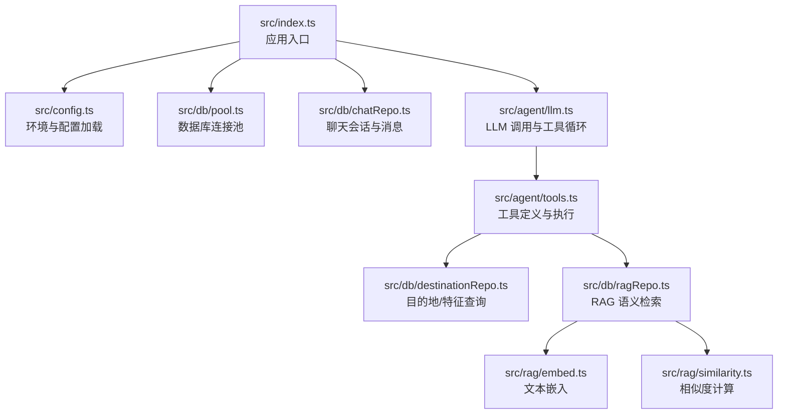
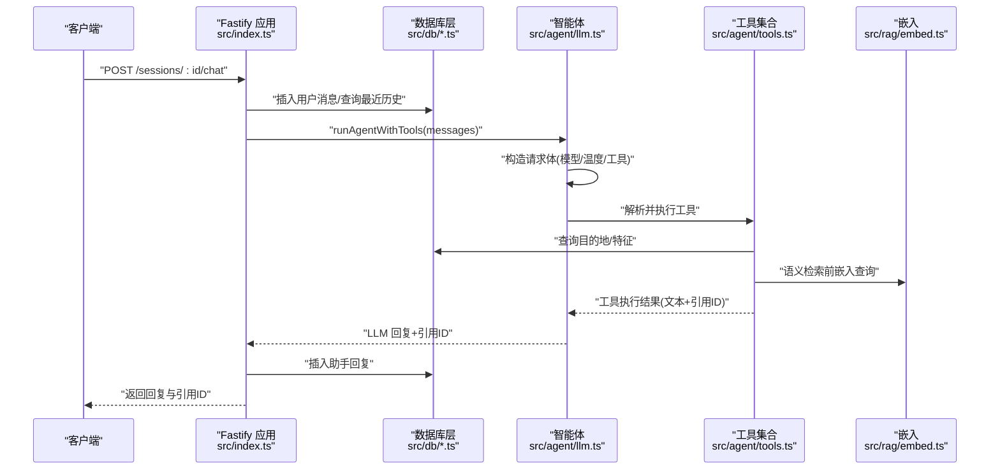
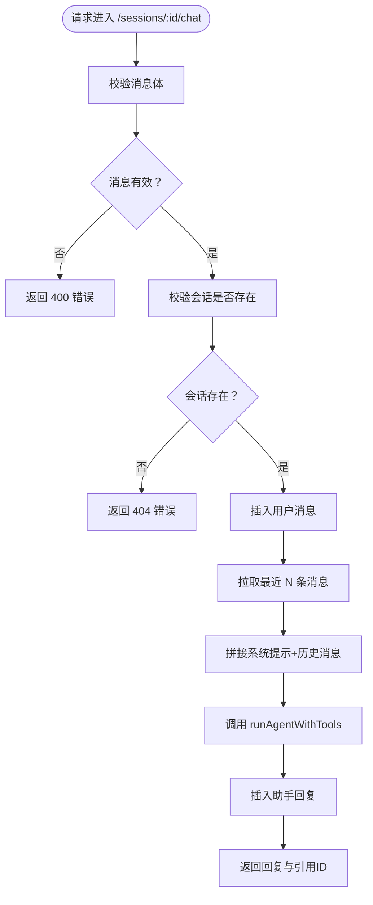
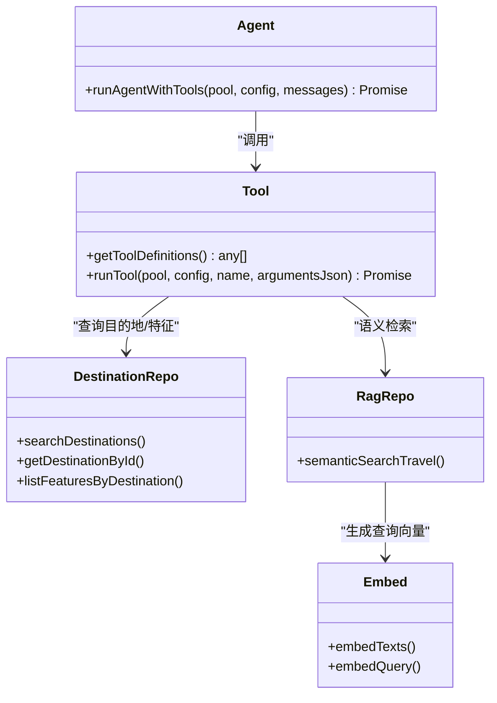
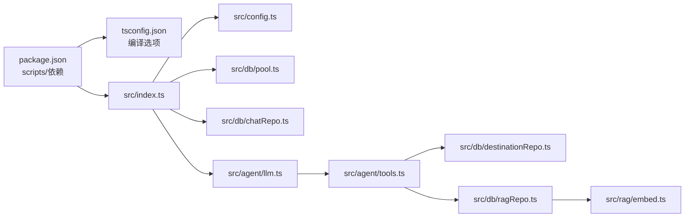

# 开发指南

<cite>
**本文引用的文件**
- [package.json](file://package.json)
- [tsconfig.json](file://tsconfig.json)
- [AGENTS.md](file://AGENTS.md)
- [src/index.ts](file://src/index.ts)
- [src/config.ts](file://src/config.ts)
- [src/agent/llm.ts](file://src/agent/llm.ts)
- [src/agent/prompts.ts](file://src/agent/prompts.ts)
- [src/agent/tools.ts](file://src/agent/tools.ts)
- [src/db/pool.ts](file://src/db/pool.ts)
- [src/db/chatRepo.ts](file://src/db/chatRepo.ts)
- [src/db/destinationRepo.ts](file://src/db/destinationRepo.ts)
- [src/db/ragRepo.ts](file://src/db/ragRepo.ts)
- [src/rag/embed.ts](file://src/rag/embed.ts)
- [src/rag/similarity.ts](file://src/rag/similarity.ts)
- [scripts/migrate.ts](file://scripts/migrate.ts)
- [scripts/seed.ts](file://scripts/seed.ts)
- [src/db/migrations/001_init.sql](file://src/db/migrations/001_init.sql)
</cite>

## 目录
1. [简介](#简介)
2. [项目结构](#项目结构)
3. [核心组件](#核心组件)
4. [架构总览](#架构总览)
5. [详细组件分析](#详细组件分析)
6. [依赖关系分析](#依赖关系分析)
7. [性能考虑](#性能考虑)
8. [故障排查指南](#故障排查指南)
9. [结论](#结论)
10. [附录](#附录)

## 简介
本开发指南面向 Guide-Plan-Agent 项目的开发者，目标是帮助团队建立一致的代码规范、配置与工具链，确保新功能开发、测试与代码审查流程高效稳定。文档覆盖以下方面：
- 代码规范与 TypeScript 配置
- 模块组织原则与命名约定
- 新功能开发流程、测试策略与代码审查标准
- 构建系统、调试方法与性能分析工具
- 贡献指南、Issue 提交规范与 Pull Request 流程
- 常见问题与最佳实践

## 项目结构
项目采用按“领域/职责”分层的模块组织方式：
- 根目录提供脚本与配置，包括构建脚本、迁移与种子数据脚本、TypeScript 编译配置与包管理配置。
- src 目录下按功能域划分：
  - agent：智能体与工具集成，负责与 LLM 对话、工具调用与消息编排
  - db：数据库访问层，含连接池、聊天会话与目的地/特征/向量检索相关仓库
  - rag：嵌入生成与相似度计算，支撑语义检索
  - 根级入口与配置加载
- scripts 目录提供数据库迁移与示例数据填充脚本

图表来源
- [src/index.ts:1-77](file://src/index.ts#L1-L77)
- [src/config.ts:1-46](file://src/config.ts#L1-L46)
- [src/db/pool.ts:1-17](file://src/db/pool.ts#L1-L17)
- [src/db/chatRepo.ts:1-53](file://src/db/chatRepo.ts#L1-L53)
- [src/agent/llm.ts:1-114](file://src/agent/llm.ts#L1-L114)
- [src/agent/tools.ts:1-195](file://src/agent/tools.ts#L1-L195)
- [src/db/destinationRepo.ts:1-100](file://src/db/destinationRepo.ts#L1-L100)
- [src/db/ragRepo.ts:1-143](file://src/db/ragRepo.ts#L1-L143)
- [src/rag/embed.ts:1-38](file://src/rag/embed.ts#L1-L38)
- [src/rag/similarity.ts](file://src/rag/similarity.ts)

章节来源
- [package.json:1-31](file://package.json#L1-L31)
- [tsconfig.json:1-20](file://tsconfig.json#L1-L20)
- [src/index.ts:1-77](file://src/index.ts#L1-L77)

## 核心组件
- 应用入口与路由
  - 加载环境配置、注册 CORS、提供健康检查、会话创建与聊天接口
  - 参考路径：[src/index.ts:11-71](file://src/index.ts#L11-L71)
- 配置系统
  - 使用 Zod 进行环境变量校验与类型推断，支持数据库、LLM、RAG、会话历史等参数
  - 参考路径：[src/config.ts:1-46](file://src/config.ts#L1-L46)
- 数据库层
  - 连接池封装、会话与消息 CRUD、目的地与特征查询、RAG 片段加载与语义检索
  - 参考路径：[src/db/pool.ts:1-17](file://src/db/pool.ts#L1-L17)、[src/db/chatRepo.ts:1-53](file://src/db/chatRepo.ts#L1-L53)、[src/db/destinationRepo.ts:1-100](file://src/db/destinationRepo.ts#L1-L100)、[src/db/ragRepo.ts:1-143](file://src/db/ragRepo.ts#L1-L143)
- Agent 与工具
  - LLM 对话与工具循环、工具定义与参数解析、工具执行结果聚合
  - 参考路径：[src/agent/llm.ts:1-114](file://src/agent/llm.ts#L1-L114)、[src/agent/tools.ts:1-195](file://src/agent/tools.ts#L1-L195)
- RAG 与嵌入
  - 文本嵌入生成、相似度检索、候选集限制与 Top-K 返回
  - 参考路径：[src/rag/embed.ts:1-38](file://src/rag/embed.ts#L1-L38)、[src/rag/similarity.ts](file://src/rag/similarity.ts)、[src/db/ragRepo.ts:97-142](file://src/db/ragRepo.ts#L97-L142)

章节来源
- [src/index.ts:1-77](file://src/index.ts#L1-L77)
- [src/config.ts:1-46](file://src/config.ts#L1-L46)
- [src/db/pool.ts:1-17](file://src/db/pool.ts#L1-L17)
- [src/db/chatRepo.ts:1-53](file://src/db/chatRepo.ts#L1-L53)
- [src/db/destinationRepo.ts:1-100](file://src/db/destinationRepo.ts#L1-L100)
- [src/db/ragRepo.ts:1-143](file://src/db/ragRepo.ts#L1-L143)
- [src/agent/llm.ts:1-114](file://src/agent/llm.ts#L1-L114)
- [src/agent/tools.ts:1-195](file://src/agent/tools.ts#L1-L195)
- [src/rag/embed.ts:1-38](file://src/rag/embed.ts#L1-L38)

## 架构总览
整体架构围绕“Fastify 服务 + LLM 工具循环 + 数据库/RAG”的模式展开。请求进入后，根据会话 ID 获取历史消息，拼接系统提示与历史，调用 LLM 并在需要时执行工具（查询目的地、语义检索、读取详情），最终将回复与引用的目的地 ID 返回。

图表来源
- [src/index.ts:35-68](file://src/index.ts#L35-L68)
- [src/agent/llm.ts:49-114](file://src/agent/llm.ts#L49-L114)
- [src/agent/tools.ts:114-195](file://src/agent/tools.ts#L114-L195)
- [src/db/chatRepo.ts:42-52](file://src/db/chatRepo.ts#L42-L52)
- [src/rag/embed.ts:7-37](file://src/rag/embed.ts#L7-L37)

## 详细组件分析

### 组件一：应用入口与路由
- 功能要点
  - 注册 CORS，提供健康检查端点
  - 会话创建：生成 UUID 并持久化
  - 聊天接口：校验消息、校验会话存在、写入用户消息、拉取历史、调用智能体、写入助手回复并返回结果
- 关键流程图

图表来源
- [src/index.ts:35-68](file://src/index.ts#L35-L68)
- [src/db/chatRepo.ts:6-16](file://src/db/chatRepo.ts#L6-L16)
- [src/db/chatRepo.ts:23-40](file://src/db/chatRepo.ts#L23-L40)

章节来源
- [src/index.ts:18-68](file://src/index.ts#L18-L68)
- [src/db/chatRepo.ts:1-53](file://src/db/chatRepo.ts#L1-L53)

### 组件二：智能体与工具循环
- 功能要点
  - 定义工具清单（结构化检索、语义检索、读取详情）
  - 将工具调用结果注入消息流，最多轮次受控
  - 收敛到纯文本回复并汇总引用的目的地 ID
- 类图

图表来源
- [src/agent/llm.ts:49-114](file://src/agent/llm.ts#L49-L114)
- [src/agent/tools.ts:67-195](file://src/agent/tools.ts#L67-L195)
- [src/db/destinationRepo.ts:20-84](file://src/db/destinationRepo.ts#L20-L84)
- [src/db/ragRepo.ts:97-142](file://src/db/ragRepo.ts#L97-L142)
- [src/rag/embed.ts:7-37](file://src/rag/embed.ts#L7-L37)

章节来源
- [src/agent/llm.ts:1-114](file://src/agent/llm.ts#L1-L114)
- [src/agent/tools.ts:1-195](file://src/agent/tools.ts#L1-L195)

### 组件三：数据库层
- 连接池
  - 统一创建与导出类型，便于跨模块注入
  - 参考路径：[src/db/pool.ts:4-17](file://src/db/pool.ts#L4-L17)
- 聊天会话与消息
  - 会话创建、存在性校验、最近消息列表、插入消息
  - 参考路径：[src/db/chatRepo.ts:6-52](file://src/db/chatRepo.ts#L6-L52)
- 目的地与特征
  - 结构化检索、按 ID 查询、按目的地枚举特征、全量导出
  - 参考路径：[src/db/destinationRepo.ts:20-99](file://src/db/destinationRepo.ts#L20-L99)
- RAG 片段与语义检索
  - 插入/清空片段、按目的地或全量加载、向量化、Top-K 相似度排序
  - 参考路径：[src/db/ragRepo.ts:25-95](file://src/db/ragRepo.ts#L25-L95)、[src/db/ragRepo.ts:97-142](file://src/db/ragRepo.ts#L97-L142)

章节来源
- [src/db/pool.ts:1-17](file://src/db/pool.ts#L1-L17)
- [src/db/chatRepo.ts:1-53](file://src/db/chatRepo.ts#L1-L53)
- [src/db/destinationRepo.ts:1-100](file://src/db/destinationRepo.ts#L1-L100)
- [src/db/ragRepo.ts:1-143](file://src/db/ragRepo.ts#L1-L143)

### 组件四：RAG 与嵌入
- 嵌入生成
  - 批量文本嵌入、单查询向量，统一通过配置中的基础 URL 与模型名
  - 参考路径：[src/rag/embed.ts:7-37](file://src/rag/embed.ts#L7-L37)
- 相似度计算
  - Top-K 余弦相似度，支持候选集裁剪与排序
  - 参考路径：[src/rag/similarity.ts](file://src/rag/similarity.ts)

章节来源
- [src/rag/embed.ts:1-38](file://src/rag/embed.ts#L1-L38)
- [src/rag/similarity.ts](file://src/rag/similarity.ts)

### 组件五：脚本与初始化
- 迁移脚本
  - 读取数据库配置、创建数据库、执行初始化 SQL
  - 参考路径：[scripts/migrate.ts:10-28](file://scripts/migrate.ts#L10-L28)
- 种子脚本
  - 清空并写入示例目的地与特征，便于演示与测试
  - 参考路径：[scripts/seed.ts:5-83](file://scripts/seed.ts#L5-L83)
- 初始化 SQL
  - 参考路径：[src/db/migrations/001_init.sql](file://src/db/migrations/001_init.sql)

章节来源
- [scripts/migrate.ts:1-34](file://scripts/migrate.ts#L1-L34)
- [scripts/seed.ts:1-89](file://scripts/seed.ts#L1-L89)

## 依赖关系分析
- 构建与运行
  - 构建：TypeScript 编译输出至 dist
  - 启动：运行 dist/index.js
  - 开发：监听 src 目录变化热重载
  - 参考路径：[package.json:6-13](file://package.json#L6-L13)、[tsconfig.json:1-20](file://tsconfig.json#L1-L20)
- 外部依赖
  - Web 框架：Fastify
  - 数据库：mysql2
  - 类型校验：Zod
  - 跨域：@fastify/cors
  - 参考路径：[package.json:18-24](file://package.json#L18-L24)

图表来源
- [package.json:1-31](file://package.json#L1-L31)
- [tsconfig.json:1-20](file://tsconfig.json#L1-L20)
- [src/index.ts:1-77](file://src/index.ts#L1-L77)
- [src/config.ts:1-46](file://src/config.ts#L1-L46)
- [src/db/pool.ts:1-17](file://src/db/pool.ts#L1-L17)
- [src/db/chatRepo.ts:1-53](file://src/db/chatRepo.ts#L1-L53)
- [src/agent/llm.ts:1-114](file://src/agent/llm.ts#L1-L114)
- [src/agent/tools.ts:1-195](file://src/agent/tools.ts#L1-L195)
- [src/db/destinationRepo.ts:1-100](file://src/db/destinationRepo.ts#L1-L100)
- [src/db/ragRepo.ts:1-143](file://src/db/ragRepo.ts#L1-L143)
- [src/rag/embed.ts:1-38](file://src/rag/embed.ts#L1-L38)

章节来源
- [package.json:1-31](file://package.json#L1-L31)
- [tsconfig.json:1-20](file://tsconfig.json#L1-L20)

## 性能考虑
- LLM 调用轮次控制
  - 通过最大轮次限制防止无限工具循环，避免响应延迟与成本上升
  - 参考路径：[src/agent/llm.ts:57-113](file://src/agent/llm.ts#L57-L113)
- RAG 候选集与 Top-K
  - 候选集上限与返回条数均受配置控制，降低向量检索开销
  - 参考路径：[src/db/ragRepo.ts:110-134](file://src/db/ragRepo.ts#L110-L134)、[src/config.ts:18-21](file://src/config.ts#L18-L21)
- 嵌入批量处理
  - 批量嵌入减少往返次数，提升检索吞吐
  - 参考路径：[src/rag/embed.ts:10-31](file://src/rag/embed.ts#L10-L31)
- 数据库连接池
  - 合理的连接上限与等待策略，避免并发阻塞
  - 参考路径：[src/db/pool.ts:11-13](file://src/db/pool.ts#L11-L13)

## 故障排查指南
- 健康检查失败
  - 现象：/health 返回 db=false 或错误信息
  - 排查：确认数据库连接参数、网络连通性与数据库可用性
  - 参考路径：[src/index.ts:18-26](file://src/index.ts#L18-L26)、[src/db/pool.ts:4-14](file://src/db/pool.ts#L4-L14)
- 会话不存在
  - 现象：/sessions/:id/chat 返回 404
  - 排查：确认会话是否已创建、会话 ID 是否正确
  - 参考路径：[src/index.ts:44-48](file://src/index.ts#L44-L48)、[src/db/chatRepo.ts:10-16](file://src/db/chatRepo.ts#L10-L16)
- LLM 请求异常
  - 现象：chat/completions 返回非 2xx
  - 排查：核对 API Key、Base URL、模型名与网络权限
  - 参考路径：[src/agent/llm.ts:30-47](file://src/agent/llm.ts#L30-L47)
- 工具参数错误
  - 现象：工具执行抛错或返回错误内容
  - 排查：检查工具参数 JSON 结构与必填字段
  - 参考路径：[src/agent/tools.ts:79-112](file://src/agent/tools.ts#L79-L112)
- 嵌入请求异常
  - 现象：embeddings 返回非 2xx
  - 排查：核对嵌入 Base URL、模型名与 API Key
  - 参考路径：[src/rag/embed.ts:14-28](file://src/rag/embed.ts#L14-L28)

章节来源
- [src/index.ts:18-26](file://src/index.ts#L18-L26)
- [src/db/chatRepo.ts:10-16](file://src/db/chatRepo.ts#L10-L16)
- [src/agent/llm.ts:30-47](file://src/agent/llm.ts#L30-L47)
- [src/agent/tools.ts:79-112](file://src/agent/tools.ts#L79-L112)
- [src/rag/embed.ts:14-28](file://src/rag/embed.ts#L14-L28)

## 结论
本指南提供了 Guide-Plan-Agent 的开发规范、模块组织、流程与工具链的系统性说明。遵循本文档可显著提升开发效率、保证代码质量与可维护性，并为后续扩展（如新增工具、优化检索策略、增强日志与监控）奠定坚实基础。

## 附录

### 代码规范与 TypeScript 配置
- 代码风格
  - TypeScript 严格模式
  - 单引号、无分号
  - 优先使用函数式风格
  - 提交信息使用中文
  - 参考路径：[AGENTS.md:8-12](file://AGENTS.md#L8-L12)
- TypeScript 编译配置
  - ES2022 目标、NodeNext 模块与解析器、声明文件与 Source Map 输出
  - 参考路径：[tsconfig.json:2-16](file://tsconfig.json#L2-L16)

章节来源
- [AGENTS.md:8-12](file://AGENTS.md#L8-L12)
- [tsconfig.json:1-20](file://tsconfig.json#L1-L20)

### 模块组织原则与命名约定
- 文件与目录
  - 按功能域分层：agent、db、rag、根入口与配置
  - 工具与仓库职责单一，避免交叉耦合
- 命名
  - 类型与接口使用 PascalCase
  - 函数与变量使用 camelCase
  - 常量使用 UPPER_SNAKE_CASE
- 导出与导入
  - 明确导出类型与工厂函数（如连接池）
  - 在入口处集中注册中间件与路由

章节来源
- [src/index.ts:1-77](file://src/index.ts#L1-L77)
- [src/db/pool.ts:4-17](file://src/db/pool.ts#L4-L17)

### 新功能开发流程
- 设计与评审
  - 明确需求边界、输入输出与错误场景
  - 评估对 Agent 工具集的影响与兼容性
- 实现步骤
  - 在对应模块添加实现与类型定义
  - 在工具定义中注册新工具（如有）
  - 补充数据库表结构与迁移脚本（如有）
  - 编写单元/集成测试与端到端验证
- 提交流程
  - 提交 Issue 描述问题与方案
  - 分支开发，提交 PR 并关联 Issue
  - 代码审查通过后合并

章节来源
- [src/agent/tools.ts:15-69](file://src/agent/tools.ts#L15-L69)
- [scripts/migrate.ts:19-27](file://scripts/migrate.ts#L19-L27)

### 测试策略
- 单元测试
  - 针对工具执行、嵌入生成、相似度计算进行隔离测试
- 集成测试
  - 覆盖完整对话链路：会话创建 → 历史加载 → LLM 调用 → 工具执行 → 结果写回
- 端到端测试
  - 使用真实数据库与 LLM（或模拟）验证完整流程

章节来源
- [src/agent/tools.ts:114-195](file://src/agent/tools.ts#L114-L195)
- [src/rag/embed.ts:7-37](file://src/rag/embed.ts#L7-L37)
- [src/db/ragRepo.ts:97-142](file://src/db/ragRepo.ts#L97-L142)

### 代码审查标准
- 正确性
  - 输入校验、边界条件与错误处理完备
- 可读性
  - 命名清晰、注释充分、模块职责单一
- 性能
  - 避免不必要的数据库/网络往返，合理使用缓存与批处理
- 兼容性
  - 不破坏现有 API 与行为，必要时提供迁移指引

章节来源
- [src/agent/llm.ts:57-113](file://src/agent/llm.ts#L57-L113)
- [src/agent/tools.ts:121-195](file://src/agent/tools.ts#L121-L195)

### 构建系统与开发工具
- 构建
  - 使用 tsc 编译 TypeScript 到 dist
  - 参考路径：[package.json:7](file://package.json#L7)
- 开发
  - 使用 tsx watch 监听源码变更并自动重启
  - 参考路径：[package.json:9](file://package.json#L9)
- 调试
  - 启用 Source Map 与声明文件，结合编辑器断点调试
  - 参考路径：[tsconfig.json:13-15](file://tsconfig.json#L13-L15)
- 性能分析
  - 使用 Node.js 内置分析器或第三方工具对 LLM 调用与数据库查询进行采样
  - 参考路径：[src/agent/llm.ts:30-47](file://src/agent/llm.ts#L30-L47)、[src/db/ragRepo.ts:122-134](file://src/db/ragRepo.ts#L122-L134)

章节来源
- [package.json:6-13](file://package.json#L6-L13)
- [tsconfig.json:1-20](file://tsconfig.json#L1-L20)

### 贡献指南、Issue 与 PR 规范
- Issue 提交
  - 描述问题现象、期望行为、复现步骤与环境信息
- Pull Request
  - 标题简洁明确，正文包含变更说明、影响范围与测试结果
  - 关联相关 Issue，确保 CI 通过与审查通过

章节来源
- [AGENTS.md:6](file://AGENTS.md#L6)