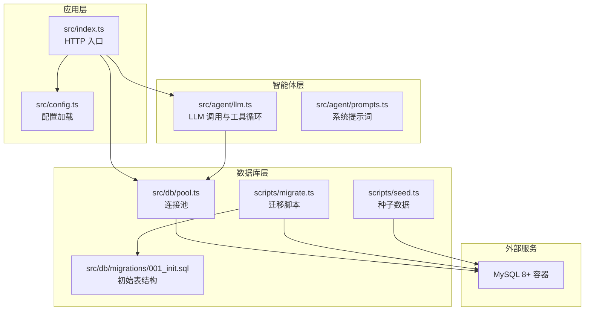
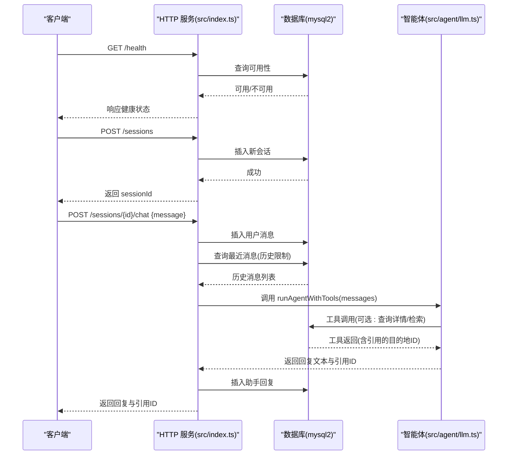
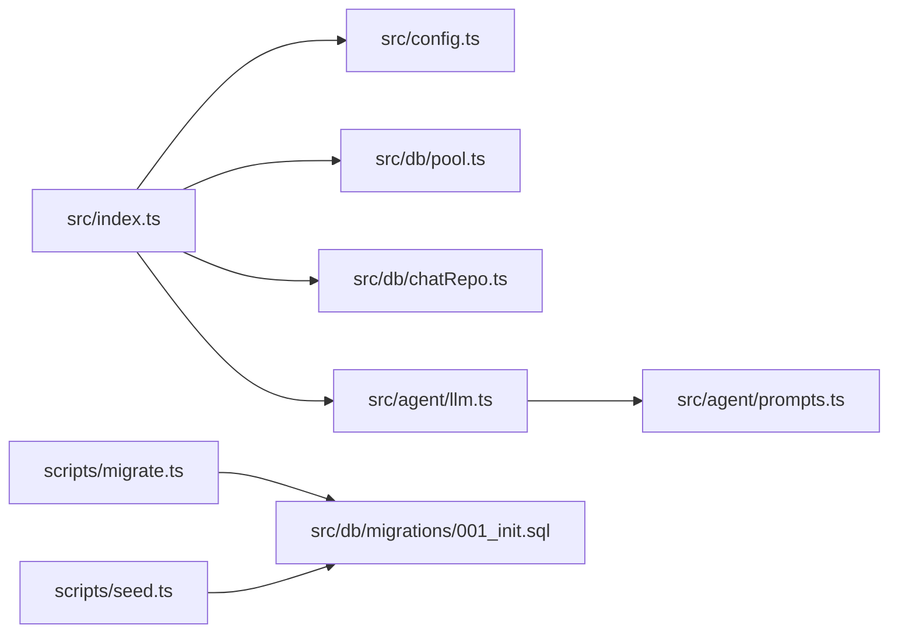

# 快速开始

<cite>
**本文引用的文件**
- [package.json](file://package.json)
- [docker-compose.yml](file://docker-compose.yml)
- [src/index.ts](file://src/index.ts)
- [src/config.ts](file://src/config.ts)
- [src/db/pool.ts](file://src/db/pool.ts)
- [src/db/chatRepo.ts](file://src/db/chatRepo.ts)
- [src/db/migrations/001_init.sql](file://src/db/migrations/001_init.sql)
- [scripts/migrate.ts](file://scripts/migrate.ts)
- [scripts/seed.ts](file://scripts/seed.ts)
- [AGENTS.md](file://AGENTS.md)
- [src/agent/llm.ts](file://src/agent/llm.ts)
- [src/agent/prompts.ts](file://src/agent/prompts.ts)
</cite>

## 目录
1. [简介](#简介)
2. [项目结构](#项目结构)
3. [核心组件](#核心组件)
4. [架构总览](#架构总览)
5. [详细组件解析](#详细组件解析)
6. [依赖关系分析](#依赖关系分析)
7. [性能与资源建议](#性能与资源建议)
8. [故障排查](#故障排查)
9. [结论](#结论)
10. [附录](#附录)

## 简介
本指南面向新手开发者，帮助你在约 30 分钟内完成 Guide-Plan-Agent 的本地开发环境搭建与首次运行，涵盖：
- 环境要求（Node.js >= 18）
- 依赖安装与数据库初始化
- 本地开发启动与 API 使用示例
- Docker 容器化部署与传统部署对比
- 基本 API 调用（健康检查、会话创建、聊天交互）

## 项目结构
该项目采用模块化的 TypeScript 架构，核心目录与职责如下：
- src：应用源码
  - agent：智能体与工具链（LLM 调用、提示词、工具定义）
  - db：数据库连接、迁移脚本、聊天与 RAG 数据访问层
  - rag：嵌入向量化、相似度检索、数据入库
  - config.ts：环境变量校验与加载
  - index.ts：HTTP 服务入口（Fastify）
- scripts：数据库迁移、种子数据、RAG 重建脚本
- docker-compose.yml：MySQL 容器编排
- package.json：脚本、引擎版本与依赖声明

图表来源
- [src/index.ts:1-77](file://src/index.ts#L1-L77)
- [src/config.ts:1-46](file://src/config.ts#L1-L46)
- [src/db/pool.ts:1-17](file://src/db/pool.ts#L1-L17)
- [scripts/migrate.ts:1-34](file://scripts/migrate.ts#L1-L34)
- [scripts/seed.ts:1-89](file://scripts/seed.ts#L1-L89)
- [src/db/migrations/001_init.sql:1-54](file://src/db/migrations/001_init.sql#L1-L54)
- [src/agent/llm.ts:1-114](file://src/agent/llm.ts#L1-L114)
- [src/agent/prompts.ts:1-10](file://src/agent/prompts.ts#L1-L10)

章节来源
- [package.json:1-31](file://package.json#L1-L31)
- [docker-compose.yml:1-16](file://docker-compose.yml#L1-L16)
- [src/index.ts:1-77](file://src/index.ts#L1-L77)
- [src/config.ts:1-46](file://src/config.ts#L1-L46)

## 核心组件
- HTTP 服务入口：基于 Fastify 提供健康检查、会话创建、聊天接口
- 数据库层：使用 mysql2 连接池，提供会话与消息 CRUD、RAG 片段管理
- 智能体：通过 OpenAI 风格的 chat/completions 接口调用模型，支持工具调用（查询目的地详情、语义检索、结构化搜索）
- 配置系统：使用 Zod 对环境变量进行严格校验与类型推断
- 迁移与种子：自动创建数据库与表结构，注入示例目的地与特征数据

章节来源
- [src/index.ts:18-68](file://src/index.ts#L18-L68)
- [src/db/pool.ts:4-14](file://src/db/pool.ts#L4-L14)
- [src/db/chatRepo.ts:6-52](file://src/db/chatRepo.ts#L6-L52)
- [src/agent/llm.ts:49-114](file://src/agent/llm.ts#L49-L114)
- [src/config.ts:27-41](file://src/config.ts#L27-L41)

## 架构总览
下图展示了从客户端请求到数据库与 LLM 工具调用的整体流程。

图表来源
- [src/index.ts:18-68](file://src/index.ts#L18-L68)
- [src/db/chatRepo.ts:6-52](file://src/db/chatRepo.ts#L6-L52)
- [src/agent/llm.ts:49-114](file://src/agent/llm.ts#L49-L114)

## 详细组件解析

### 环境与依赖准备
- Node.js 版本要求：请确保本地 Node.js 版本满足引擎要求（>= 18）
- 包管理工具：项目使用 npm 脚本，同时 AGENTS.md 中提到可使用 tnpm
- 依赖安装：执行安装命令后，TypeScript 编译、开发模式与数据库脚本均可使用

章节来源
- [package.json:15-17](file://package.json#L15-L17)
- [AGENTS.md:4-6](file://AGENTS.md#L4-L6)

### 数据库配置与初始化
- 默认数据库参数：可通过环境变量覆盖（主机、端口、用户名、密码、数据库名）
- 初始化流程：
  1) 启动 MySQL 容器（Docker）
  2) 执行迁移脚本创建数据库与表结构
  3) 执行种子脚本写入示例目的地与特征数据
  4) 可选：重建 RAG 向量索引

章节来源
- [src/config.ts:3-9](file://src/config.ts#L3-L9)
- [scripts/migrate.ts:10-28](file://scripts/migrate.ts#L10-L28)
- [src/db/migrations/001_init.sql:1-54](file://src/db/migrations/001_init.sql#L1-L54)
- [scripts/seed.ts:5-83](file://scripts/seed.ts#L5-L83)

### 本地开发环境搭建（30 分钟清单）
- 步骤 1：克隆仓库并安装依赖
  - 安装命令参考：[package.json:6-13](file://package.json#L6-L13)
- 步骤 2：准备数据库
  - 方案 A（推荐）：使用 Docker Compose 启动 MySQL 容器
    - 参考：[docker-compose.yml:1-16](file://docker-compose.yml#L1-L16)
    - 端口映射：3307:3306，避免与本机已占用端口冲突
  - 方案 B（传统部署）：在本机安装 MySQL 8+，设置账号与数据库权限
- 步骤 3：初始化数据库
  - 创建数据库与表结构：[scripts/migrate.ts:10-28](file://scripts/migrate.ts#L10-L28)
  - 写入示例数据：[scripts/seed.ts:5-83](file://scripts/seed.ts#L5-L83)
- 步骤 4：启动服务
  - 开发模式：监听源码变更并热重载
  - 生产模式：编译后启动
  - 参考脚本：[package.json:6-13](file://package.json#L6-L13)

章节来源
- [docker-compose.yml:1-16](file://docker-compose.yml#L1-L16)
- [scripts/migrate.ts:10-28](file://scripts/migrate.ts#L10-L28)
- [scripts/seed.ts:5-83](file://scripts/seed.ts#L5-L83)
- [package.json:6-13](file://package.json#L6-L13)

### API 使用示例
以下为常用接口的调用路径与要点（不包含具体代码内容）：
- 健康检查
  - 方法与路径：GET /health
  - 行为：检查数据库连通性，返回可用状态
  - 参考实现：[src/index.ts:18-26](file://src/index.ts#L18-L26)
- 创建会话
  - 方法与路径：POST /sessions
  - 行为：生成 UUID 作为会话 ID 并持久化
  - 参考实现：[src/index.ts:28-33](file://src/index.ts#L28-L33)
- 聊天交互
  - 方法与路径：POST /sessions/{id}/chat
  - 请求体：包含 message 字段
  - 行为：校验会话存在、插入用户消息、拉取历史、调用智能体工具、插入助手回复并返回结果
  - 参考实现：[src/index.ts:35-68](file://src/index.ts#L35-L68)
- 智能体工具循环
  - 行为：根据系统提示词与历史消息，最多轮询工具调用指定次数，最终返回回复与引用的目的地 ID 列表
  - 参考实现：[src/agent/llm.ts:49-114](file://src/agent/llm.ts#L49-L114)
- 系统提示词
  - 规则：明确何时调用工具、如何处理冲突、如何标注目的地 ID
  - 参考实现：[src/agent/prompts.ts:1-10](file://src/agent/prompts.ts#L1-L10)

章节来源
- [src/index.ts:18-68](file://src/index.ts#L18-L68)
- [src/agent/llm.ts:49-114](file://src/agent/llm.ts#L49-L114)
- [src/agent/prompts.ts:1-10](file://src/agent/prompts.ts#L1-L10)

### Docker 容器化部署 vs 传统部署
- Docker 部署优势
  - 快速获得一致的 MySQL 环境，避免本机配置差异
  - 端口隔离（3307 映射），降低冲突风险
  - 健康检查保障数据库可用性
- 传统部署注意事项
  - 需要手动安装 MySQL 8+，配置字符集与权限
  - 确保 Node.js 与数据库网络可达
  - 环境变量正确传递给应用

章节来源
- [docker-compose.yml:1-16](file://docker-compose.yml#L1-L16)
- [src/config.ts:3-9](file://src/config.ts#L3-L9)

## 依赖关系分析
- 应用入口依赖配置加载与数据库连接池
- HTTP 路由依赖聊天仓库进行会话与消息管理
- 智能体依赖 LLM 接口与工具集合，工具调用依赖数据库查询
- 迁移与种子脚本独立于运行时，仅用于初始化

图表来源
- [src/index.ts:1-77](file://src/index.ts#L1-L77)
- [src/config.ts:1-46](file://src/config.ts#L1-L46)
- [src/db/pool.ts:1-17](file://src/db/pool.ts#L1-17)
- [src/db/chatRepo.ts:1-53](file://src/db/chatRepo.ts#L1-L53)
- [src/agent/llm.ts:1-114](file://src/agent/llm.ts#L1-L114)
- [src/agent/prompts.ts:1-10](file://src/agent/prompts.ts#L1-L10)
- [scripts/migrate.ts:1-34](file://scripts/migrate.ts#L1-L34)
- [scripts/seed.ts:1-89](file://scripts/seed.ts#L1-L89)
- [src/db/migrations/001_init.sql:1-54](file://src/db/migrations/001_init.sql#L1-L54)

## 性能与资源建议
- 连接池：默认连接数为 10，可根据并发场景调整
- 历史长度：聊天历史限制默认 30 条，过长会影响上下文成本与响应速度
- 工具轮次：最大工具调用轮次默认 10，避免无限循环
- LLM 模型：默认使用小型模型，如需更高质量可调整模型与温度参数

章节来源
- [src/db/pool.ts:11-13](file://src/db/pool.ts#L11-L13)
- [src/config.ts:18-21](file://src/config.ts#L18-L21)
- [src/agent/llm.ts:57](file://src/agent/llm.ts#L57)

## 故障排查
- 健康检查失败
  - 现象：返回 503 或数据库字段为 false
  - 排查：确认数据库连接参数、容器是否健康、网络连通性
  - 参考：[src/index.ts:18-26](file://src/index.ts#L18-L26)
- 会话不存在
  - 现象：返回 404 与错误信息
  - 排查：确认 sessionId 是否正确、是否已创建
  - 参考：[src/index.ts:44-48](file://src/index.ts#L44-L48)
- 缺少消息字段
  - 现象：返回 400 与错误信息
  - 排查：确保请求体包含 message 字段
  - 参考：[src/index.ts:40-43](file://src/index.ts#L40-L43)
- 数据库初始化失败
  - 现象：迁移或种子脚本报错
  - 排查：核对环境变量、数据库权限、SQL 文件路径
  - 参考：[scripts/migrate.ts:10-28](file://scripts/migrate.ts#L10-L28)，[scripts/seed.ts:5-83](file://scripts/seed.ts#L5-L83)
- 环境变量校验失败
  - 现象：抛出无效环境错误
  - 排查：检查必填项（如 OPENAI_API_KEY）与类型
  - 参考：[src/config.ts:35-41](file://src/config.ts#L35-L41)

章节来源
- [src/index.ts:18-26](file://src/index.ts#L18-L26)
- [src/index.ts:40-48](file://src/index.ts#L40-L48)
- [scripts/migrate.ts:10-28](file://scripts/migrate.ts#L10-L28)
- [scripts/seed.ts:5-83](file://scripts/seed.ts#L5-L83)
- [src/config.ts:35-41](file://src/config.ts#L35-L41)

## 结论
通过本指南，你可以快速完成 Guide-Plan-Agent 的本地开发环境搭建与核心功能验证。建议优先使用 Docker 快速获得一致的数据库环境，随后按步骤完成迁移、种子与服务启动。若需进一步扩展，可关注工具链与 RAG 索引的构建与维护。

## 附录

### 环境变量一览（节选）
- 数据库相关：MYSQL_HOST、MYSQL_PORT、MYSQL_USER、MYSQL_PASSWORD、MYSQL_DATABASE
- 应用相关：PORT、CHAT_HISTORY_LIMIT
- LLM 相关：OPENAI_BASE_URL、OPENAI_API_KEY、OPENAI_MODEL、OPENAI_EMBEDDING_MODEL、EMBEDDING_BASE_URL
- RAG 相关：RAG_TOP_K_DEFAULT、RAG_CANDIDATE_LIMIT
- 工具循环上限：LLM_MAX_TOOL_ROUNDS

章节来源
- [src/config.ts:11-22](file://src/config.ts#L11-L22)