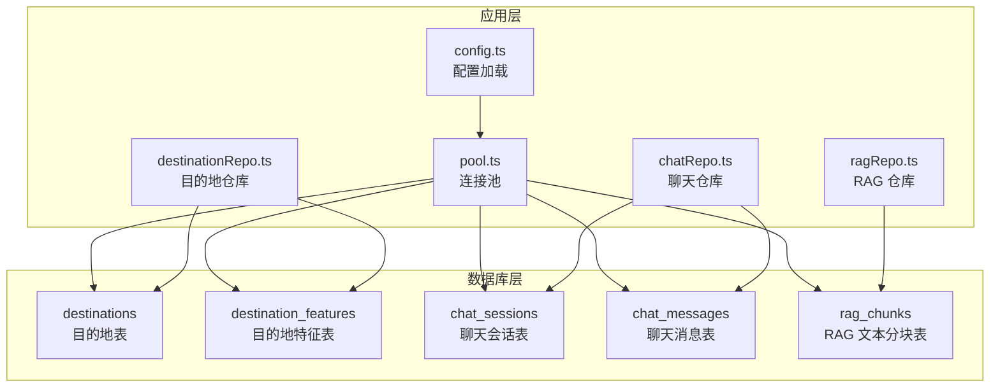
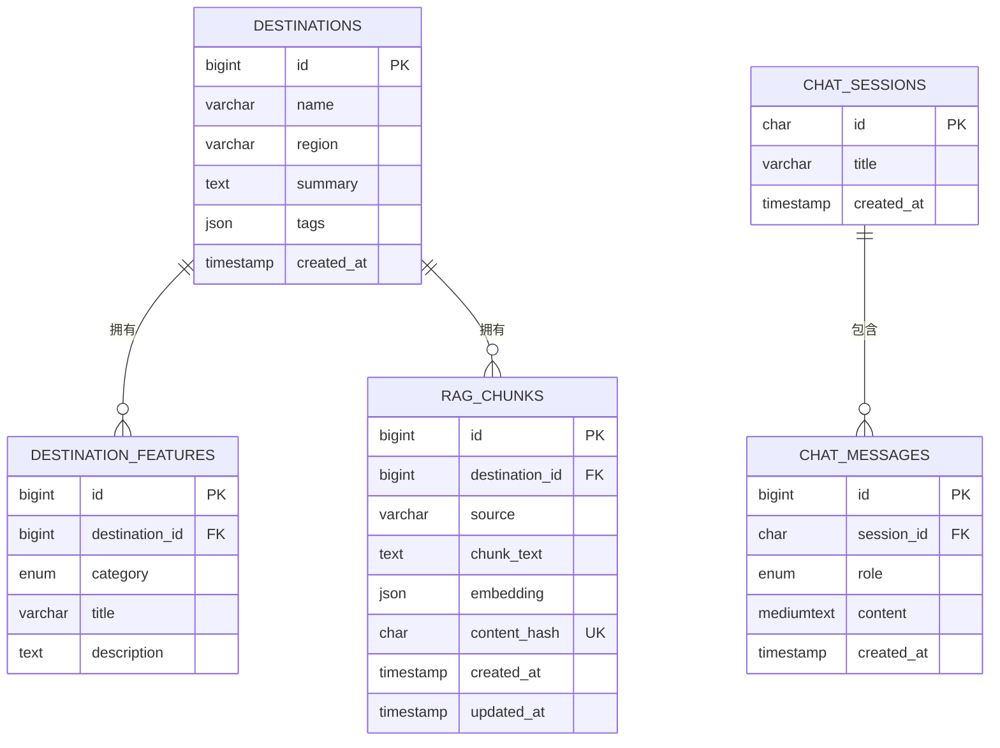
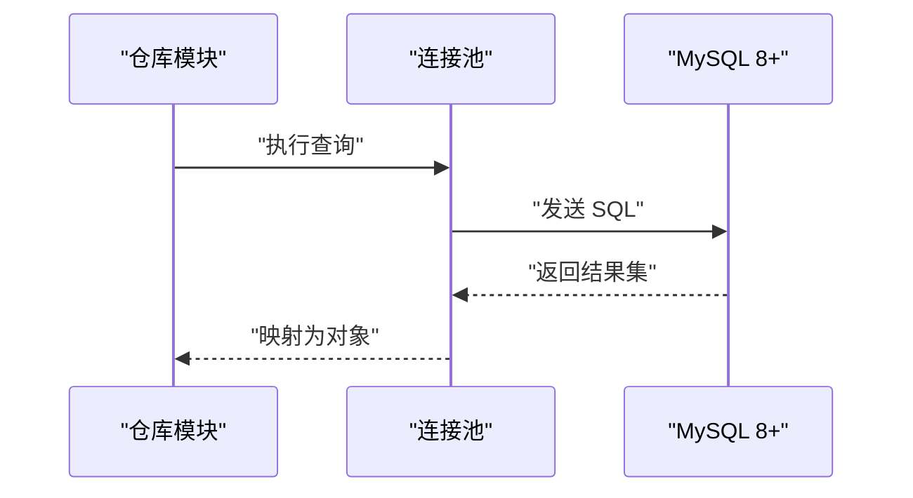

# 数据库模式概览

<cite>
**本文档引用的文件**
- [001_init.sql](file://src/db/migrations/001_init.sql)
- [chatRepo.ts](file://src/db/chatRepo.ts)
- [destinationRepo.ts](file://src/db/destinationRepo.ts)
- [ragRepo.ts](file://src/db/ragRepo.ts)
- [pool.ts](file://src/db/pool.ts)
- [migrate.ts](file://scripts/migrate.ts)
- [config.ts](file://src/config.ts)
</cite>

## 目录
1. [简介](#简介)
2. [项目结构](#项目结构)
3. [核心组件](#核心组件)
4. [架构总览](#架构总览)
5. [详细组件分析](#详细组件分析)
6. [依赖关系分析](#依赖关系分析)
7. [性能考虑](#性能考虑)
8. [故障排除指南](#故障排除指南)
9. [结论](#结论)

## 简介
本文件为 Guide-Plan-Agent 项目的数据库模式概览文档，重点阐述四张核心表之间的关系与约束，解释数据库选型 MySQL 8+ 的技术决策与优势，说明表命名规范、字符集与排序规则的选择，以及外键约束与级联删除策略。同时提供数据库模式的 ER 图与实体关系说明，帮助开发者快速理解并维护数据库结构。

## 项目结构
数据库模式由初始化迁移脚本定义，包含目的地信息、目的地特征、聊天会话与消息、以及 RAG 文本分块四大核心表。数据访问层通过独立的仓库模块对各表进行读写操作，连接池由统一的数据库配置加载函数提供。

图表来源
- [001_init.sql:1-54](file://src/db/migrations/001_init.sql#L1-L54)
- [destinationRepo.ts:1-100](file://src/db/destinationRepo.ts#L1-L100)
- [chatRepo.ts:1-53](file://src/db/chatRepo.ts#L1-L53)
- [ragRepo.ts:1-143](file://src/db/ragRepo.ts#L1-L143)
- [pool.ts:1-17](file://src/db/pool.ts#L1-L17)
- [config.ts:1-46](file://src/config.ts#L1-L46)

章节来源
- [001_init.sql:1-54](file://src/db/migrations/001_init.sql#L1-L54)
- [destinationRepo.ts:1-100](file://src/db/destinationRepo.ts#L1-L100)
- [chatRepo.ts:1-53](file://src/db/chatRepo.ts#L1-L53)
- [ragRepo.ts:1-143](file://src/db/ragRepo.ts#L1-L143)
- [pool.ts:1-17](file://src/db/pool.ts#L1-L17)
- [config.ts:1-46](file://src/config.ts#L1-L46)

## 核心组件
本节从数据库层面概述四张核心表的职责与字段含义：
- 目的地表（destinations）：存储目的地的基本信息（名称、地区、摘要、标签等），并建立“名称+地区”的唯一索引，确保同一地区下目的地名称不重复。
- 目的地特征表（destination_features）：存储目的地的各类特征（美食、风景、文化），通过外键关联到目的地表，并在 destination_id 和 category 上建立索引以支持高效查询。
- 聊天会话表（chat_sessions）：记录一次对话的会话元信息（标题、创建时间），主键采用 UUID 字符串类型，便于分布式场景下的唯一性保证。
- 聊天消息表（chat_messages）：记录会话中的消息内容（角色、内容、时间），通过外键关联到会话表，并在 session_id + created_at 组合上建立索引以支持按时间顺序检索最近消息。
- RAG 文本分块表（rag_chunks）：存储目的地相关的文本分块及其向量嵌入，通过外键关联到目的地表；使用 content_hash 建立唯一索引以避免重复；在 destination_id 和 source 上建立索引以支持按目的地或来源筛选。

章节来源
- [001_init.sql:3-53](file://src/db/migrations/001_init.sql#L3-L53)

## 架构总览
下图展示四张核心表之间的实体关系与约束，体现一对一/一对多与外键级联删除策略。

图表来源
- [001_init.sql:3-53](file://src/db/migrations/001_init.sql#L3-L53)

## 详细组件分析

### 目的地表（destinations）
- 主键：自增 BIGINT UNSIGNED
- 唯一约束：名称 + 地区组合唯一
- 字段用途：名称、地区、摘要、标签（JSON）
- 关键索引：uq_destinations_name_region
- 设计要点：使用 UTF8MB4 字符集与排序规则，确保表情符号与多语言字符正确存储；唯一索引避免重复目的地记录。

章节来源
- [001_init.sql:3-11](file://src/db/migrations/001_init.sql#L3-L11)
- [destinationRepo.ts:20-45](file://src/db/destinationRepo.ts#L20-L45)

### 目的地特征表（destination_features）
- 主键：自增 BIGINT UNSIGNED
- 外键：destination_id 引用 destinations.id，ON DELETE CASCADE
- 字段用途：分类（枚举）、标题、描述
- 索引：destination_id、category
- 设计要点：通过外键级联删除实现“删除目的地即删除其所有特征”的一致性；索引提升按目的地与分类的查询效率。

章节来源
- [001_init.sql:13-22](file://src/db/migrations/001_init.sql#L13-L22)
- [destinationRepo.ts:71-85](file://src/db/destinationRepo.ts#L71-L85)

### 聊天会话表（chat_sessions）
- 主键：CHAR(36) UUID
- 字段用途：标题、创建时间
- 设计要点：UUID 主键适合分布式系统，避免自增主键冲突；默认时间戳简化插入逻辑。

章节来源
- [001_init.sql:24-28](file://src/db/migrations/001_init.sql#L24-L28)
- [chatRepo.ts:6-16](file://src/db/chatRepo.ts#L6-L16)

### 聊天消息表（chat_messages）
- 主键：自增 BIGINT UNSIGNED
- 外键：session_id 引用 chat_sessions.id，ON DELETE CASCADE
- 字段用途：角色（用户/助手/系统）、内容、创建时间
- 索引：session_id + created_at
- 设计要点：级联删除保证会话删除时自动清理消息；复合索引支持按时间倒序检索最近消息。

章节来源
- [001_init.sql:30-38](file://src/db/migrations/001_init.sql#L30-L38)
- [chatRepo.ts:23-40](file://src/db/chatRepo.ts#L23-L40)

### RAG 文本分块表（rag_chunks）
- 主键：自增 BIGINT UNSIGNED
- 外键：destination_id 引用 destinations.id，ON DELETE CASCADE
- 字段用途：来源标识、文本分块、向量嵌入（JSON）、内容哈希、创建/更新时间
- 唯一索引：content_hash
- 索引：destination_id、source
- 设计要点：内容哈希唯一索引避免重复入库；索引支持按目的地与来源检索；嵌入字段以 JSON 存储便于相似度计算。

章节来源
- [001_init.sql:40-53](file://src/db/migrations/001_init.sql#L40-L53)
- [ragRepo.ts:29-52](file://src/db/ragRepo.ts#L29-L52)

### 连接池与配置
- 连接池：基于 mysql2/promise 创建，设置连接上限与等待策略
- 配置加载：从环境变量读取数据库主机、端口、用户名、密码、数据库名
- 迁移脚本：自动创建数据库（UTF8MB4 + 排序规则），并执行初始化 SQL

章节来源
- [pool.ts:4-14](file://src/db/pool.ts#L4-L14)
- [config.ts:27-41](file://src/config.ts#L27-L41)
- [migrate.ts:10-28](file://scripts/migrate.ts#L10-L28)

## 依赖关系分析
- 外键关系
  - destinations.id → destination_features.destination_id（级联删除）
  - destinations.id → rag_chunks.destination_id（级联删除）
  - chat_sessions.id → chat_messages.session_id（级联删除）
- 约束与索引
  - destinations.name + region 唯一
  - rag_chunks.content_hash 唯一
  - destination_features.destination_id、category 索引
  - chat_messages.session_id + created_at 复合索引
  - rag_chunks.destination_id、source 索引
- 查询路径
  - 目的地搜索：destinations LIKE 条件 + 可选地区过滤
  - 特征查询：按 destination_id 排序
  - 最近消息：按 session_id + created_at 倒序取前 N
  - RAG 检索：可按目的地集合或全量候选限制

图表来源
- [destinationRepo.ts:20-45](file://src/db/destinationRepo.ts#L20-L45)
- [chatRepo.ts:23-40](file://src/db/chatRepo.ts#L23-L40)
- [ragRepo.ts:54-95](file://src/db/ragRepo.ts#L54-L95)
- [pool.ts:4-14](file://src/db/pool.ts#L4-L14)

## 性能考虑
- 索引设计
  - destination_features：按 destination_id 与 category 建立索引，满足按目的地与分类的高频查询
  - chat_messages：按 session_id + created_at 建立复合索引，支持高效分页与时间排序
  - rag_chunks：按 destination_id 与 source 建立索引，加速按目的地与来源检索
- 唯一约束
  - destinations：名称+地区唯一，避免重复数据
  - rag_chunks：content_hash 唯一，避免重复向量入库
- 字符集与排序规则
  - 使用 utf8mb4 与 utf8mb4_unicode_ci，兼容表情符号与多语言字符，排序规则支持更自然的比较
- 外键与级联删除
  - 通过 ON DELETE CASCADE 简化数据一致性管理，减少冗余清理逻辑
- 连接池
  - 合理的连接上限与等待策略，避免高并发下的资源争用

## 故障排除指南
- 初始化失败
  - 确认数据库存在且字符集为 utf8mb4，排序规则为 utf8mb4_unicode_ci
  - 检查迁移脚本是否成功执行
- 连接问题
  - 核对环境变量 MYSQL_HOST、MYSQL_PORT、MYSQL_USER、MYSQL_PASSWORD、MYSQL_DATABASE
  - 确认连接池参数与数据库服务状态
- 查询异常
  - 目的地搜索：确认 LIKE 条件与地区过滤参数
  - 最近消息：确认 session_id 存在且 created_at 索引有效
  - RAG 检索：确认 embedding 字段为 JSON 格式，content_hash 唯一性

章节来源
- [migrate.ts:10-28](file://scripts/migrate.ts#L10-L28)
- [config.ts:27-41](file://src/config.ts#L27-L41)
- [destinationRepo.ts:20-45](file://src/db/destinationRepo.ts#L20-L45)
- [chatRepo.ts:23-40](file://src/db/chatRepo.ts#L23-L40)
- [ragRepo.ts:54-95](file://src/db/ragRepo.ts#L54-L95)

## 结论
本数据库模式围绕“目的地”这一核心实体，通过外键与级联删除策略实现数据一致性，配合合理的索引与唯一约束保障查询性能与数据质量。MySQL 8+ 提供了稳定的事务支持、UTF8MB4 字符集与丰富的索引能力，适配本项目对多语言、向量化检索与会话管理的需求。建议在后续扩展中继续遵循现有命名规范与约束设计，保持一致的架构风格。