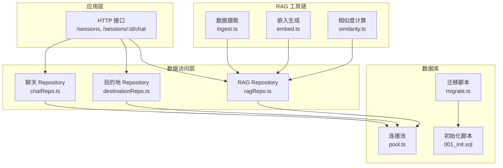
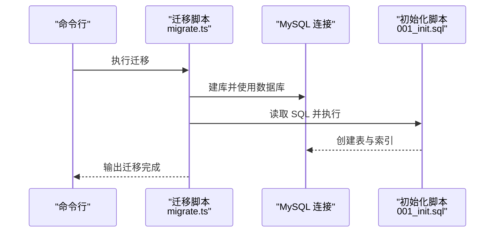
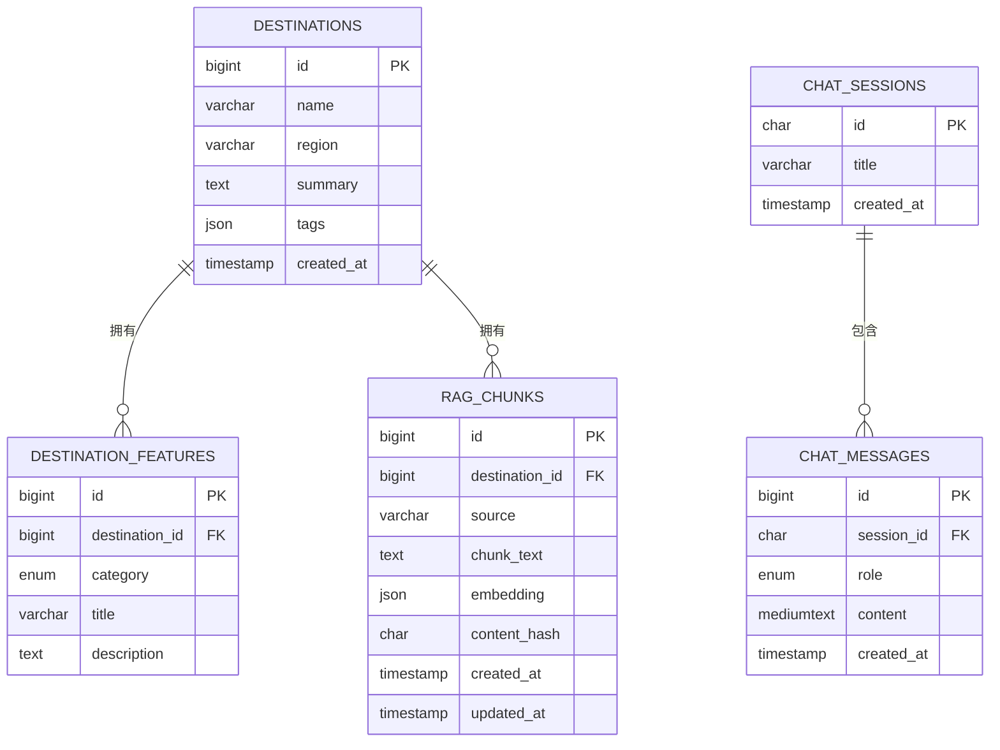
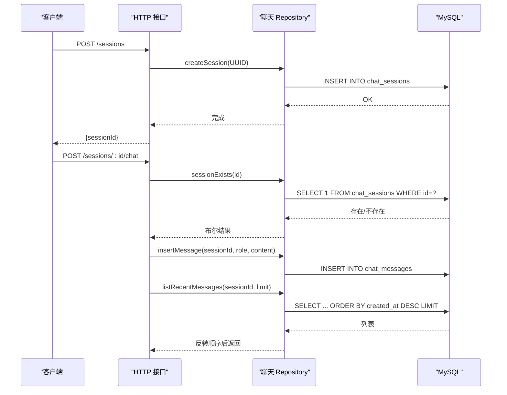
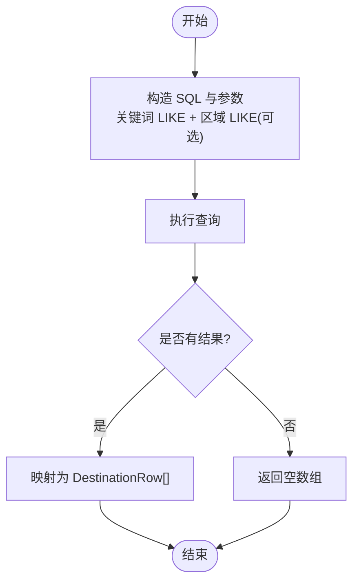
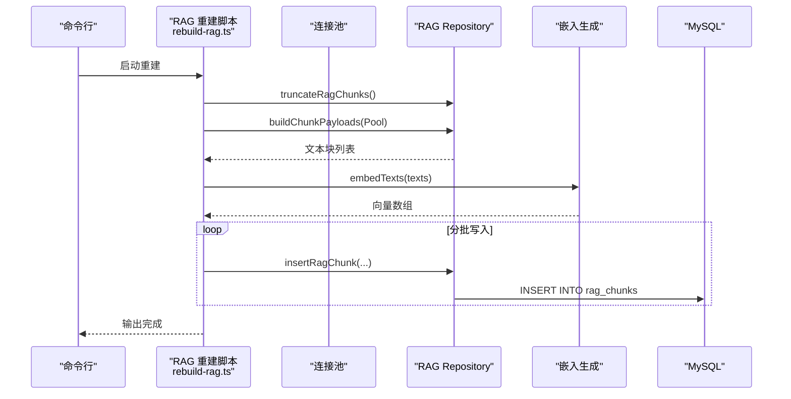
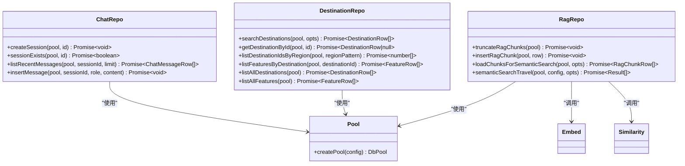
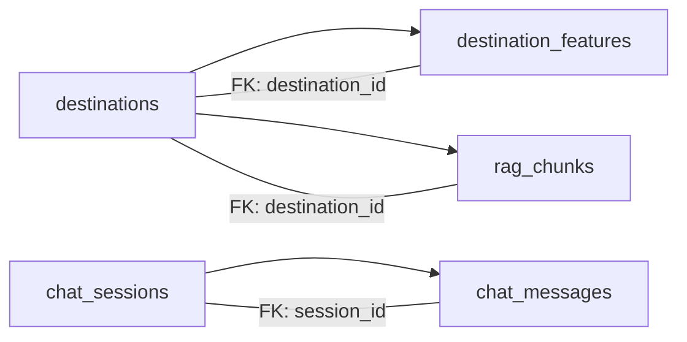

# 数据库设计

<cite>
**本文引用的文件**
- [001_init.sql](file://src/db/migrations/001_init.sql)
- [chatRepo.ts](file://src/db/chatRepo.ts)
- [destinationRepo.ts](file://src/db/destinationRepo.ts)
- [ragRepo.ts](file://src/db/ragRepo.ts)
- [pool.ts](file://src/db/pool.ts)
- [migrate.ts](file://scripts/migrate.ts)
- [rebuild-rag.ts](file://scripts/rebuild-rag.ts)
- [config.ts](file://src/config.ts)
- [index.ts](file://src/index.ts)
- [embed.ts](file://src/rag/embed.ts)
- [ingest.ts](file://src/rag/ingest.ts)
- [similarity.ts](file://src/rag/similarity.ts)
</cite>

## 目录
1. [简介](#简介)
2. [项目结构](#项目结构)
3. [核心组件](#核心组件)
4. [架构总览](#架构总览)
5. [详细组件分析](#详细组件分析)
6. [依赖分析](#依赖分析)
7. [性能考量](#性能考量)
8. [故障排查指南](#故障排查指南)
9. [结论](#结论)
10. [附录](#附录)

## 简介
本文件为 Guide-Plan-Agent 的数据库设计与实现文档，覆盖数据库模式设计、表结构定义、实体关系模型、初始化脚本分析、会话与目的地数据模型、RAG 相关数据模型、索引与查询优化策略、数据访问层设计模式（Repository）、以及数据库迁移与版本管理方案。内容基于仓库中实际的 SQL 脚本、数据访问层代码与配置文件进行归纳总结，帮助开发者与运维人员快速理解并维护数据库层。

## 项目结构
数据库相关代码主要分布在以下模块：
- 初始化与迁移：SQL 初始化脚本与迁移工具
- 数据访问层：聊天、目的地、RAG 三类 Repository
- 连接池：统一的数据库连接池封装
- RAG 流水线：嵌入生成、数据摄取、相似度计算
- 应用入口：通过连接池与 Repository 提供服务接口

图表来源
- [index.ts:11-77](file://src/index.ts#L11-L77)
- [chatRepo.ts:1-53](file://src/db/chatRepo.ts#L1-L53)
- [destinationRepo.ts:1-100](file://src/db/destinationRepo.ts#L1-L100)
- [ragRepo.ts:1-143](file://src/db/ragRepo.ts#L1-L143)
- [pool.ts:1-17](file://src/db/pool.ts#L1-L17)
- [001_init.sql:1-54](file://src/db/migrations/001_init.sql#L1-L54)
- [migrate.ts:1-34](file://scripts/migrate.ts#L1-L34)
- [ingest.ts:1-77](file://src/rag/ingest.ts#L1-L77)
- [embed.ts:1-38](file://src/rag/embed.ts#L1-L38)
- [similarity.ts:1-31](file://src/rag/similarity.ts#L1-L31)

章节来源
- [index.ts:11-77](file://src/index.ts#L11-L77)
- [pool.ts:1-17](file://src/db/pool.ts#L1-L17)
- [migrate.ts:1-34](file://scripts/migrate.ts#L1-L34)
- [001_init.sql:1-54](file://src/db/migrations/001_init.sql#L1-L54)

## 核心组件
- 初始化与迁移：通过 SQL 脚本创建目的地、特征、会话、消息、RAG 片段等表，并建立必要的外键与索引；迁移脚本负责创建数据库并执行初始化 SQL。
- 数据访问层（Repository）：
  - 聊天：会话创建、存在性检查、最近消息列表、插入消息。
  - 目的地：按关键词/区域搜索、按 ID 查询、按区域模糊匹配、列出目的地与特征。
  - RAG：截断 RAG 片段、插入片段（含向量与哈希）、按目的地或全量加载候选片段、语义检索。
- 连接池：统一配置 MySQL 连接参数与连接上限。
- RAG 工具链：从目的地与特征构建文本块，生成向量，进行余弦相似度排序，返回 Top-K 结果。

章节来源
- [chatRepo.ts:1-53](file://src/db/chatRepo.ts#L1-L53)
- [destinationRepo.ts:1-100](file://src/db/destinationRepo.ts#L1-L100)
- [ragRepo.ts:1-143](file://src/db/ragRepo.ts#L1-L143)
- [pool.ts:1-17](file://src/db/pool.ts#L1-L17)
- [migrate.ts:1-34](file://scripts/migrate.ts#L1-L34)
- [ingest.ts:1-77](file://src/rag/ingest.ts#L1-L77)
- [embed.ts:1-38](file://src/rag/embed.ts#L1-L38)
- [similarity.ts:1-31](file://src/rag/similarity.ts#L1-L31)

## 架构总览
数据库层采用“初始化脚本 + 迁移工具 + Repository 模式”的分层设计：
- 初始化脚本定义表结构、主键、唯一键、外键与索引；
- 迁移工具在启动时或手动执行时创建数据库并执行初始化；
- Repository 封装 SQL 访问，提供类型安全的函数式接口；
- RAG 流水线独立于业务逻辑，通过 Repository 读写 RAG 片段表。

图表来源
- [migrate.ts:10-28](file://scripts/migrate.ts#L10-L28)
- [001_init.sql:1-54](file://src/db/migrations/001_init.sql#L1-L54)

## 详细组件分析

### 初始化脚本与表结构
初始化脚本定义了五张核心表，涵盖目的地、特征、会话、消息与 RAG 片段，并建立了必要的约束与索引。

- 目的地表（destinations）
  - 主键：自增整型 ID
  - 唯一键：名称与区域组合唯一
  - 字段：名称、区域、摘要、标签（JSON）、创建时间
  - 索引：无额外索引（唯一键已覆盖常用查询）

- 目的地特征表（destination_features）
  - 主键：自增整型 ID
  - 外键：destination_id 引用 destinations(id)，级联删除
  - 字段：目的地 ID、分类（枚举：食物/风景/文化）、标题、描述
  - 索引：按目的地 ID 与分类建立二级索引，支持按目的地与分类查询

- 会话表（chat_sessions）
  - 主键：UUID 字符串
  - 字段：标题、创建时间

- 消息表（chat_messages）
  - 主键：自增整型 ID
  - 外键：session_id 引用 chat_sessions(id)，级联删除
  - 字段：会话 ID、角色（用户/助手/系统）、内容、创建时间
  - 索引：会话+时间复合索引，用于高效查询最近消息

- RAG 片段表（rag_chunks）
  - 主键：自增整型 ID
  - 外键：destination_id 引用 destinations(id)，级联删除
  - 字段：目的地 ID、来源（字符串）、片段文本、向量（JSON）、内容哈希、创建/更新时间
  - 索引：按目的地 ID 与来源建立索引；内容哈希唯一索引避免重复

章节来源
- [001_init.sql:3-11](file://src/db/migrations/001_init.sql#L3-L11)
- [001_init.sql:13-22](file://src/db/migrations/001_init.sql#L13-L22)
- [001_init.sql:24-28](file://src/db/migrations/001_init.sql#L24-L28)
- [001_init.sql:30-38](file://src/db/migrations/001_init.sql#L30-L38)
- [001_init.sql:40-53](file://src/db/migrations/001_init.sql#L40-L53)

### 实体关系模型

图表来源
- [001_init.sql:3-11](file://src/db/migrations/001_init.sql#L3-L11)
- [001_init.sql:13-22](file://src/db/migrations/001_init.sql#L13-L22)
- [001_init.sql:24-28](file://src/db/migrations/001_init.sql#L24-L28)
- [001_init.sql:30-38](file://src/db/migrations/001_init.sql#L30-L38)
- [001_init.sql:40-53](file://src/db/migrations/001_init.sql#L40-L53)

### 会话管理数据模型
- 会话创建：通过 UUID 作为主键，插入会话记录。
- 会话存在性检查：根据 UUID 快速判断是否存在。
- 最近消息查询：按会话 ID 与时间排序，限制数量，返回历史消息。
- 插入消息：记录用户/助手/系统消息。

图表来源
- [index.ts:28-68](file://src/index.ts#L28-L68)
- [chatRepo.ts:6-16](file://src/db/chatRepo.ts#L6-L16)
- [chatRepo.ts:23-40](file://src/db/chatRepo.ts#L23-L40)
- [chatRepo.ts:42-52](file://src/db/chatRepo.ts#L42-L52)

章节来源
- [chatRepo.ts:1-53](file://src/db/chatRepo.ts#L1-L53)
- [index.ts:28-68](file://src/index.ts#L28-L68)

### 目的地数据模型
- 搜索目的地：支持关键词（名称/区域/摘要）与区域过滤，按 ID 升序与限制数量返回。
- 按 ID 获取：单条目的地详情。
- 区域模糊匹配：返回满足区域模式的所有目的地 ID。
- 特征查询：按目的地 ID 返回所有特征，按分类与 ID 排序。
- 全量列举：返回所有目的地与特征。

图表来源
- [destinationRepo.ts:20-45](file://src/db/destinationRepo.ts#L20-L45)
- [destinationRepo.ts:47-57](file://src/db/destinationRepo.ts#L47-L57)
- [destinationRepo.ts:59-69](file://src/db/destinationRepo.ts#L59-L69)
- [destinationRepo.ts:71-85](file://src/db/destinationRepo.ts#L71-L85)
- [destinationRepo.ts:87-99](file://src/db/destinationRepo.ts#L87-L99)

章节来源
- [destinationRepo.ts:1-100](file://src/db/destinationRepo.ts#L1-L100)

### RAG 相关数据模型
- 截断 RAG 片段：清空 RAG 表，便于重建。
- 插入片段：写入目的地 ID、来源、文本、向量（JSON）、内容哈希。
- 加载候选：按目的地集合或全量加载，限制候选数量。
- 语义检索：对查询向量与候选向量计算余弦相似度，返回 Top-K 结果。

图表来源
- [rebuild-rag.ts:10-33](file://scripts/rebuild-rag.ts#L10-L33)
- [ragRepo.ts:25-52](file://src/db/ragRepo.ts#L25-L52)
- [ragRepo.ts:29-52](file://src/db/ragRepo.ts#L29-L52)
- [ragRepo.ts:54-95](file://src/db/ragRepo.ts#L54-L95)
- [ragRepo.ts:97-142](file://src/db/ragRepo.ts#L97-L142)
- [embed.ts:7-32](file://src/rag/embed.ts#L7-L32)
- [ingest.ts:30-76](file://src/rag/ingest.ts#L30-L76)

章节来源
- [ragRepo.ts:1-143](file://src/db/ragRepo.ts#L1-L143)
- [rebuild-rag.ts:1-39](file://scripts/rebuild-rag.ts#L1-L39)
- [embed.ts:1-38](file://src/rag/embed.ts#L1-L38)
- [ingest.ts:1-77](file://src/rag/ingest.ts#L1-L77)
- [similarity.ts:1-31](file://src/rag/similarity.ts#L1-L31)

### 数据访问层设计模式与实现
- 设计模式：Repository 模式
  - 将 SQL 访问封装为函数式接口，隔离数据库细节，便于测试与替换。
  - 统一使用连接池，避免重复创建连接。
- 类型安全：
  - 使用 TypeScript 类型定义数据行结构，如聊天消息、目的地、特征、RAG 片段。
  - 对 JSON 向量进行解析与校验，确保运行时一致性。
- 外部依赖：
  - 聊天与目的地 Repository 直接依赖连接池；
  - RAG Repository 依赖嵌入生成与相似度计算模块。

图表来源
- [chatRepo.ts:1-53](file://src/db/chatRepo.ts#L1-L53)
- [destinationRepo.ts:1-100](file://src/db/destinationRepo.ts#L1-L100)
- [ragRepo.ts:1-143](file://src/db/ragRepo.ts#L1-L143)
- [pool.ts:4-14](file://src/db/pool.ts#L4-L14)
- [embed.ts:1-38](file://src/rag/embed.ts#L1-L38)
- [similarity.ts:1-31](file://src/rag/similarity.ts#L1-L31)

章节来源
- [chatRepo.ts:1-53](file://src/db/chatRepo.ts#L1-L53)
- [destinationRepo.ts:1-100](file://src/db/destinationRepo.ts#L1-L100)
- [ragRepo.ts:1-143](file://src/db/ragRepo.ts#L1-L143)
- [pool.ts:1-17](file://src/db/pool.ts#L1-L17)

## 依赖分析
- 外键关系
  - destination_features.destination_id -> destinations.id（级联删除）
  - chat_messages.session_id -> chat_sessions.id（级联删除）
  - rag_chunks.destination_id -> destinations.id（级联删除）
- 索引策略
  - destinations：名称+区域唯一键，适合去重与按名称/区域检索
  - destination_features：按 destination_id 与 category 建立索引，加速按目的地与分类查询
  - chat_messages：会话+时间复合索引，支持高效分页与最近消息查询
  - rag_chunks：按 destination_id 与 source 建立索引，内容哈希唯一索引避免重复
- 查询优化建议
  - 目的地搜索：使用 LIKE 通配符，建议配合全文索引或向量化检索（当前已通过 RAG 实现）
  - 聊天消息：利用复合索引按会话与时间排序，限制返回数量
  - RAG：候选集限制与 Top-K 排序，避免全表扫描

图表来源
- [001_init.sql:13-22](file://src/db/migrations/001_init.sql#L13-L22)
- [001_init.sql:30-38](file://src/db/migrations/001_init.sql#L30-L38)
- [001_init.sql:40-53](file://src/db/migrations/001_init.sql#L40-L53)

章节来源
- [001_init.sql:1-54](file://src/db/migrations/001_init.sql#L1-L54)

## 性能考量
- 连接池配置
  - 连接上限：10，适用于中小规模并发请求；可根据负载调整
  - 等待连接：启用等待机制，避免瞬时高峰导致拒绝
- 查询性能
  - 聊天消息：复合索引支持高效分页与时间排序
  - 目的地搜索：LIKE 查询可能较慢，建议结合 RAG 或全文索引
  - RAG：候选集限制与 Top-K 排序，减少向量计算开销
- 存储与向量
  - 向量以 JSON 存储，便于直接查询；注意 JSON 大小与索引策略
  - 内容哈希唯一索引避免重复注入
- I/O 与批处理
  - RAG 重建采用批量写入，降低事务开销

章节来源
- [pool.ts:4-14](file://src/db/pool.ts#L4-L14)
- [chatRepo.ts:23-40](file://src/db/chatRepo.ts#L23-L40)
- [ragRepo.ts:54-95](file://src/db/ragRepo.ts#L54-L95)
- [rebuild-rag.ts:8-33](file://scripts/rebuild-rag.ts#L8-L33)

## 故障排查指南
- 迁移失败
  - 确认数据库凭据与主机端口正确
  - 检查初始化 SQL 是否完整执行
- 连接问题
  - 检查连接池配置与网络连通性
  - 观察连接池上限是否被占满
- 查询异常
  - 聊天消息：确认会话 ID 存在且未过期
  - 目的地搜索：确认关键词与区域参数格式
  - RAG：确认向量维度与嵌入模型一致
- 数据重复
  - 检查内容哈希唯一索引是否触发重复插入
  - 使用截断后再重建的方式清理脏数据

章节来源
- [migrate.ts:10-28](file://scripts/migrate.ts#L10-L28)
- [pool.ts:4-14](file://src/db/pool.ts#L4-L14)
- [ragRepo.ts:25-27](file://src/db/ragRepo.ts#L25-L27)

## 结论
本数据库设计围绕“目的地 + 特征 + 会话 + 消息 + RAG 片段”五大主题展开，通过初始化脚本与迁移工具实现零依赖部署，借助 Repository 模式实现清晰的数据访问层，配合 RAG 流水线实现智能检索能力。索引与查询策略兼顾了常见场景的性能需求，同时为后续扩展（如全文索引、向量索引）预留空间。

## 附录

### 数据库初始化脚本分析
- 目的地表：唯一键保证名称+区域组合唯一，适合去重与快速定位
- 特征表：按目的地与分类索引，支持多维检索
- 会话与消息：外键级联删除保障数据一致性
- RAG 表：内容哈希唯一索引避免重复，JSON 向量便于相似度计算

章节来源
- [001_init.sql:1-54](file://src/db/migrations/001_init.sql#L1-L54)

### 数据访问层 API 概览
- 聊天
  - createSession、sessionExists、listRecentMessages、insertMessage
- 目的地
  - searchDestinations、getDestinationById、listDestinationIdsByRegion、listFeaturesByDestination、listAllDestinations、listAllFeatures
- RAG
  - truncateRagChunks、insertRagChunk、loadChunksForSemanticSearch、semanticSearchTravel

章节来源
- [chatRepo.ts:1-53](file://src/db/chatRepo.ts#L1-L53)
- [destinationRepo.ts:1-100](file://src/db/destinationRepo.ts#L1-L100)
- [ragRepo.ts:1-143](file://src/db/ragRepo.ts#L1-L143)

### 配置与环境变量
- 数据库配置：主机、端口、用户名、密码、数据库名
- 应用配置：端口、OpenAI 基础地址、API Key、模型、嵌入模型、聊天历史限制、RAG 默认 Top-K 与候选数、LLM 工具轮次上限

章节来源
- [config.ts:3-46](file://src/config.ts#L3-L46)