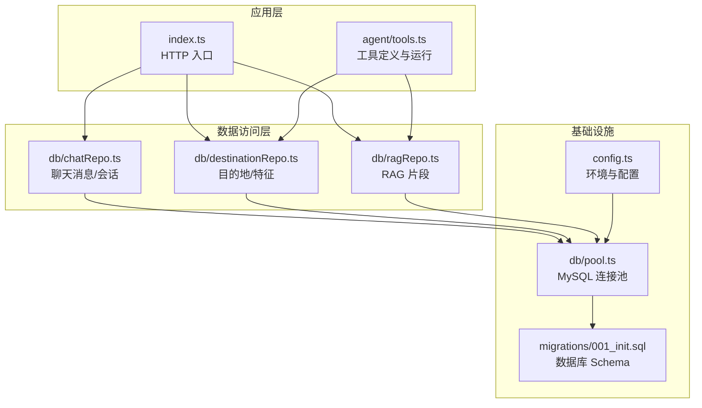
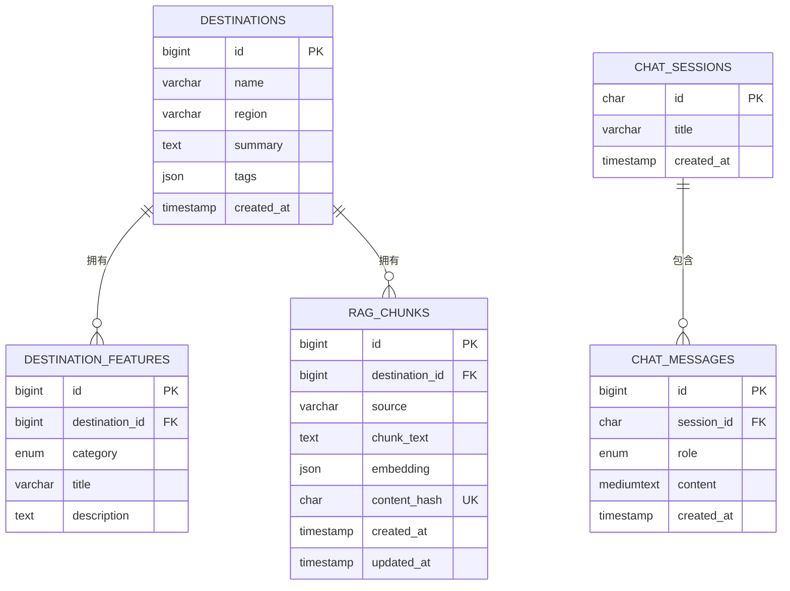
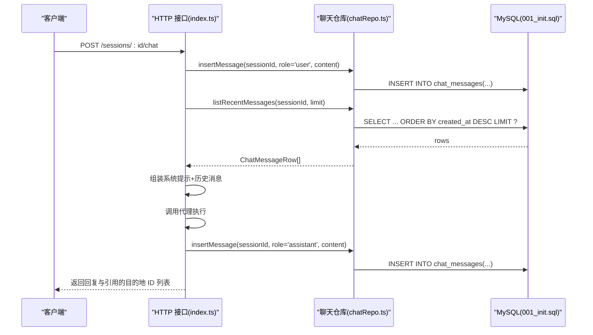
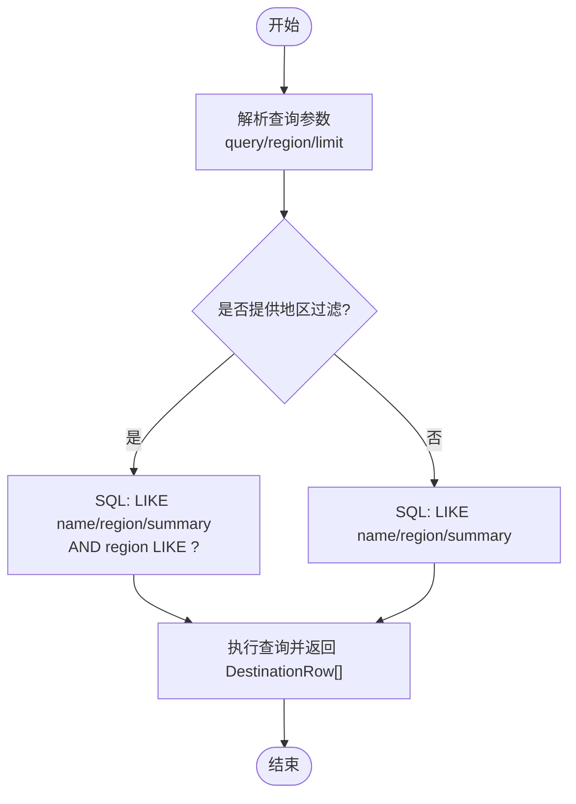
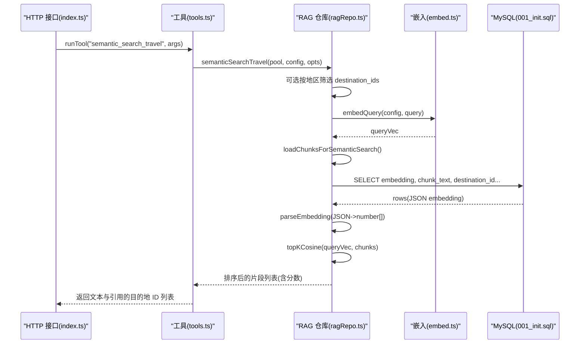
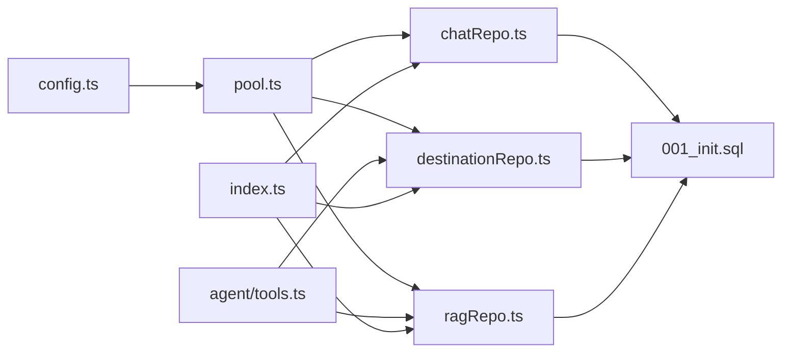

# 数据模型

<cite>
**本文引用的文件**
- [chatRepo.ts](file://src/db/chatRepo.ts)
- [destinationRepo.ts](file://src/db/destinationRepo.ts)
- [ragRepo.ts](file://src/db/ragRepo.ts)
- [001_init.sql](file://src/db/migrations/001_init.sql)
- [pool.ts](file://src/db/pool.ts)
- [config.ts](file://src/config.ts)
- [index.ts](file://src/index.ts)
- [tools.ts](file://src/agent/tools.ts)
</cite>

## 目录
1. [简介](#简介)
2. [项目结构](#项目结构)
3. [核心组件](#核心组件)
4. [架构总览](#架构总览)
5. [详细组件分析](#详细组件分析)
6. [依赖分析](#依赖分析)
7. [性能考虑](#性能考虑)
8. [故障排查指南](#故障排查指南)
9. [结论](#结论)
10. [附录](#附录)

## 简介
本文件系统性梳理 Guide-Plan-Agent 的数据模型，聚焦三个 Repository 模块（聊天、目的地与特征、RAG）所定义的数据模型类与接口，解释其字段映射、类型转换、与数据库表结构的对应关系，以及数据验证规则与业务约束。同时提供使用示例与最佳实践，帮助开发者在不直接阅读源码的情况下理解数据模型的设计意图与使用方式。

## 项目结构
数据模型主要分布在以下模块：
- 数据库连接池与配置：db/pool.ts、config.ts
- 数据访问层（Repository）：db/chatRepo.ts、db/destinationRepo.ts、db/ragRepo.ts
- 数据库初始化脚本：db/migrations/001_init.sql
- 应用入口与工具集成：index.ts、agent/tools.ts

图表来源
- [index.ts:11-77](file://src/index.ts#L11-L77)
- [tools.ts:1-195](file://src/agent/tools.ts#L1-L195)
- [chatRepo.ts:1-53](file://src/db/chatRepo.ts#L1-L53)
- [destinationRepo.ts:1-100](file://src/db/destinationRepo.ts#L1-L100)
- [ragRepo.ts:1-143](file://src/db/ragRepo.ts#L1-L143)
- [pool.ts:1-17](file://src/db/pool.ts#L1-L17)
- [config.ts:1-46](file://src/config.ts#L1-L46)
- [001_init.sql:1-54](file://src/db/migrations/001_init.sql#L1-L54)

章节来源
- [index.ts:11-77](file://src/index.ts#L11-L77)
- [config.ts:1-46](file://src/config.ts#L1-L46)
- [pool.ts:1-17](file://src/db/pool.ts#L1-L17)
- [001_init.sql:1-54](file://src/db/migrations/001_init.sql#L1-L54)

## 核心组件
本节概述三个 Repository 模块的数据模型与职责边界：
- 聊天消息模型：用于存储与检索对话历史，支持角色与内容的结构化表示。
- 目的地与特征模型：用于存储目的地信息与分类化的特色条目，支持搜索、分页与关联查询。
- RAG 片段模型：用于存储嵌入向量与内容哈希，支持语义相似度检索与去重。

章节来源
- [chatRepo.ts:18-40](file://src/db/chatRepo.ts#L18-L40)
- [destinationRepo.ts:4-18](file://src/db/destinationRepo.ts#L4-L18)
- [ragRepo.ts:7-23](file://src/db/ragRepo.ts#L7-L23)

## 架构总览
数据模型与数据库表的对应关系如下：
- destinations 表：对应目的地模型，包含唯一索引约束 name+region。
- destination_features 表：对应特征模型，外键关联 destinations。
- chat_sessions 表：对应会话模型，主键为 UUID。
- chat_messages 表：对应聊天消息模型，外键关联 chat_sessions。
- rag_chunks 表：对应 RAG 片段模型，包含 JSON 嵌入向量与内容哈希唯一约束。

图表来源
- [001_init.sql:3-53](file://src/db/migrations/001_init.sql#L3-L53)

章节来源
- [001_init.sql:3-53](file://src/db/migrations/001_init.sql#L3-L53)

## 详细组件分析

### 聊天消息模型（ChatMessageRow）
- 数据模型定义
  - 角色：限定为 user、assistant、system 三类。
  - 内容：文本内容，长度受数据库列类型限制。
- 字段映射与类型转换
  - 查询结果通过类型断言转换为 ChatMessageRow 数组；排序后反转以保证时间顺序正确。
- 业务约束
  - 角色值由枚举限定，确保一致性。
  - 插入时需提供有效的会话 ID 与角色。
- 使用示例
  - 新建会话、插入用户消息、拉取最近历史、插入助手回复。
- 最佳实践
  - 在应用层对消息内容进行必要清洗与长度控制。
  - 控制历史消息数量，避免超出配置限制。

图表来源
- [index.ts:35-68](file://src/index.ts#L35-L68)
- [chatRepo.ts:42-52](file://src/db/chatRepo.ts#L42-L52)
- [001_init.sql:24-38](file://src/db/migrations/001_init.sql#L24-L38)

章节来源
- [chatRepo.ts:18-40](file://src/db/chatRepo.ts#L18-L40)
- [chatRepo.ts:42-52](file://src/db/chatRepo.ts#L42-L52)
- [index.ts:35-68](file://src/index.ts#L35-L68)
- [001_init.sql:24-38](file://src/db/migrations/001_init.sql#L24-L38)

### 目的地与特征模型（DestinationRow、FeatureRow）
- 数据模型定义
  - 目的地：包含 id、name、region、summary、tags。
  - 特征：包含 id、destination_id、category（枚举）、title、description。
- 字段映射与类型转换
  - 查询结果直接断言为目标模型数组；特征按类别与 id 排序。
- 业务约束
  - destinations 的 name 与 region 组合唯一；destination_features 的 category 为枚举。
  - 外键约束：destination_features.destination_id -> destinations.id（级联删除）。
- 使用示例
  - 关键词搜索目的地、按地区模式列出目的地 ID、按目的地列出特征、列出全部数据。
- 最佳实践
  - 对搜索关键词与地区参数进行必要的空白处理与长度控制。
  - 在工具调用中对返回的特征进行分组展示，便于下游消费。

图表来源
- [destinationRepo.ts:20-45](file://src/db/destinationRepo.ts#L20-L45)
- [001_init.sql:3-22](file://src/db/migrations/001_init.sql#L3-L22)

章节来源
- [destinationRepo.ts:4-18](file://src/db/destinationRepo.ts#L4-L18)
- [destinationRepo.ts:20-45](file://src/db/destinationRepo.ts#L20-L45)
- [destinationRepo.ts:71-85](file://src/db/destinationRepo.ts#L71-L85)
- [001_init.sql:3-22](file://src/db/migrations/001_init.sql#L3-L22)

### RAG 片段模型（RagChunkRow）
- 数据模型定义
  - 包含 id、destination_id、source、chunk_text、embedding（数字数组）。
- 字段映射与类型转换
  - embedding 存储为 JSON，读取时通过解析函数转换为 number[]；写入时序列化为 JSON。
  - 支持按目的地集合或全量加载候选片段，限制候选数量。
- 业务约束
  - rag_chunks.content_hash 唯一；destination_id 外键关联 destinations（级联删除）。
  - source 与 destination_id 建有索引，便于检索加速。
- 使用示例
  - 截断所有片段、插入单条片段、按条件加载候选、执行语义搜索并返回带分数的结果。
- 最佳实践
  - 在插入前计算 content_hash，避免重复入库。
  - 语义搜索时根据地区预筛选目的地 ID，减少候选集规模。

图表来源
- [index.ts:35-68](file://src/index.ts#L35-L68)
- [tools.ts:114-195](file://src/agent/tools.ts#L114-L195)
- [ragRepo.ts:97-142](file://src/db/ragRepo.ts#L97-L142)
- [001_init.sql:40-53](file://src/db/migrations/001_init.sql#L40-L53)

章节来源
- [ragRepo.ts:7-23](file://src/db/ragRepo.ts#L7-L23)
- [ragRepo.ts:29-52](file://src/db/ragRepo.ts#L29-L52)
- [ragRepo.ts:54-95](file://src/db/ragRepo.ts#L54-L95)
- [ragRepo.ts:97-142](file://src/db/ragRepo.ts#L97-L142)
- [001_init.sql:40-53](file://src/db/migrations/001_init.sql#L40-L53)

## 依赖分析
- 数据访问层依赖
  - 所有仓库模块依赖数据库连接池（db/pool.ts），通过统一的 DbPool 类型注入。
  - 配置模块（config.ts）提供数据库连接参数与运行时配置（如 RAG 参数）。
- 工具层集成
  - agent/tools.ts 将数据模型作为工具输入输出的载体，负责参数解析与范围校验。
- 数据库层契约
  - migrations/001_init.sql 定义了表结构、索引与外键约束，确保数据一致性。

图表来源
- [config.ts:1-46](file://src/config.ts#L1-L46)
- [pool.ts:1-17](file://src/db/pool.ts#L1-L17)
- [chatRepo.ts:1-53](file://src/db/chatRepo.ts#L1-L53)
- [destinationRepo.ts:1-100](file://src/db/destinationRepo.ts#L1-L100)
- [ragRepo.ts:1-143](file://src/db/ragRepo.ts#L1-L143)
- [001_init.sql:1-54](file://src/db/migrations/001_init.sql#L1-L54)
- [tools.ts:1-195](file://src/agent/tools.ts#L1-L195)
- [index.ts:11-77](file://src/index.ts#L11-L77)

章节来源
- [config.ts:1-46](file://src/config.ts#L1-L46)
- [pool.ts:1-17](file://src/db/pool.ts#L1-L17)
- [001_init.sql:1-54](file://src/db/migrations/001_init.sql#L1-L54)
- [tools.ts:114-195](file://src/agent/tools.ts#L114-L195)
- [index.ts:11-77](file://src/index.ts#L11-L77)

## 性能考虑
- 索引策略
  - destinations：唯一索引 name+region，避免重复记录。
  - destination_features：按 destination_id 与 category 建立索引，提升特征查询效率。
  - chat_messages：按 session_id+created_at 建索引，优化历史消息分页与排序。
  - rag_chunks：按 destination_id 与 source 建索引，加速检索与去重。
- 查询限制
  - 工具层对搜索结果数量进行范围限制（最小 1，最大 50），避免过大负载。
  - RAG 加载候选数量受配置项控制，防止内存与计算压力过大。
- 向量化检索
  - embedding 以 JSON 存储，读取时解析为数组；建议在入库前进行维度校验与归一化，提高相似度计算稳定性。

[本节为通用性能建议，无需特定文件来源]

## 故障排查指南
- 数据库连接失败
  - 检查环境变量与配置加载（config.ts），确认主机、端口、用户名、密码与数据库名正确。
  - 使用健康检查端点验证数据库连通性。
- 数据模型类型错误
  - ChatMessageRow、DestinationRow、FeatureRow、RagChunkRow 的字段类型与数据库列类型不一致会导致断言失败。
  - 建议在查询后增加日志打印原始行结构，定位具体字段差异。
- 嵌入向量解析异常
  - parseEmbedding 函数仅接受数组或字符串形式的 JSON；若数据库中 embedding 存储格式异常，将抛出错误。
  - 建议在入库时严格校验 embedding 维度与数值范围。
- 唯一约束冲突
  - rag_chunks.content_hash 唯一；若重复插入相同内容，应先计算哈希并去重。
  - destinations.name+region 唯一；重复插入会触发唯一约束冲突。

章节来源
- [config.ts:27-41](file://src/config.ts#L27-L41)
- [ragRepo.ts:15-23](file://src/db/ragRepo.ts#L15-L23)
- [ragRepo.ts:25-52](file://src/db/ragRepo.ts#L25-L52)
- [001_init.sql:10](file://src/db/migrations/001_init.sql#L10)
- [001_init.sql:50](file://src/db/migrations/001_init.sql#L50)

## 结论
本数据模型文档系统性阐述了 Guide-Plan-Agent 中聊天、目的地与特征、RAG 片段三类数据模型的定义、字段映射、类型转换、数据库表结构对应关系、验证规则与业务约束，并提供了使用示例与最佳实践。通过严格的表结构设计与工具层参数校验，系统在保证数据一致性的同时，兼顾了查询性能与扩展性。

[本节为总结性内容，无需特定文件来源]

## 附录

### 数据模型与表字段映射速查
- 聊天消息（chat_messages）
  - ChatMessageRow.role -> enum('user','assistant','system')
  - ChatMessageRow.content -> mediumtext
- 目的地（destinations）
  - DestinationRow.name -> varchar(128)
  - DestinationRow.region -> varchar(64)
  - DestinationRow.summary -> text
  - DestinationRow.tags -> json
- 特征（destination_features）
  - FeatureRow.category -> enum('food','scenery','culture')
  - FeatureRow.title -> varchar(256)
  - FeatureRow.description -> text
- RAG 片段（rag_chunks）
  - RagChunkRow.embedding -> json（number[]）
  - RagChunkRow.content_hash -> char(64)（唯一）

章节来源
- [chatRepo.ts:18-21](file://src/db/chatRepo.ts#L18-L21)
- [destinationRepo.ts:4-18](file://src/db/destinationRepo.ts#L4-L18)
- [ragRepo.ts:7-13](file://src/db/ragRepo.ts#L7-L13)
- [001_init.sql:3-53](file://src/db/migrations/001_init.sql#L3-L53)