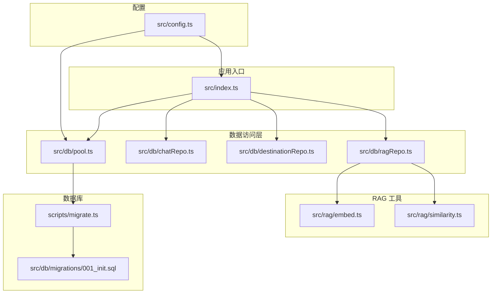
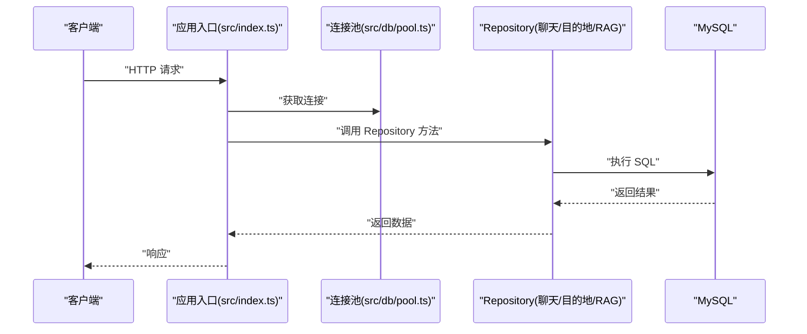
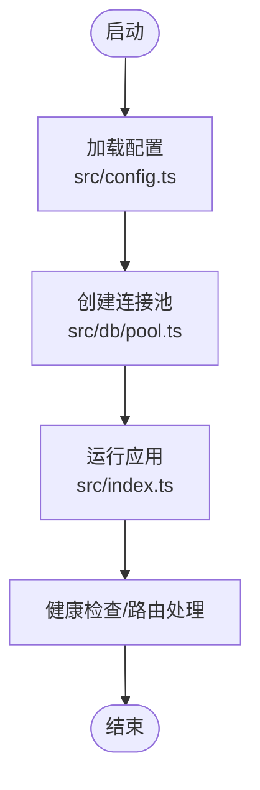
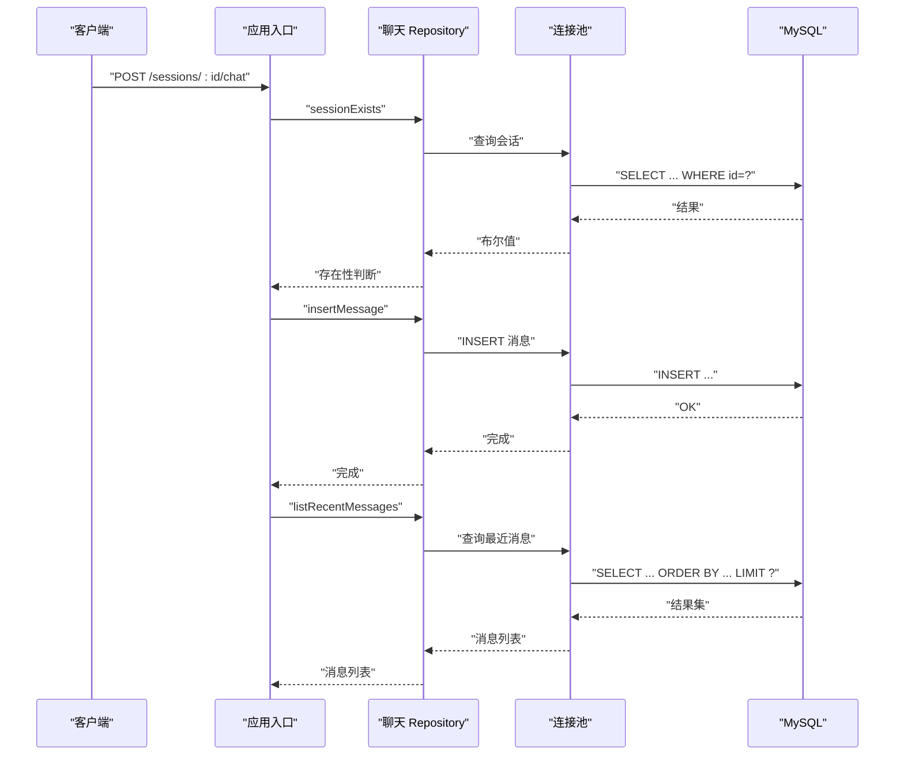
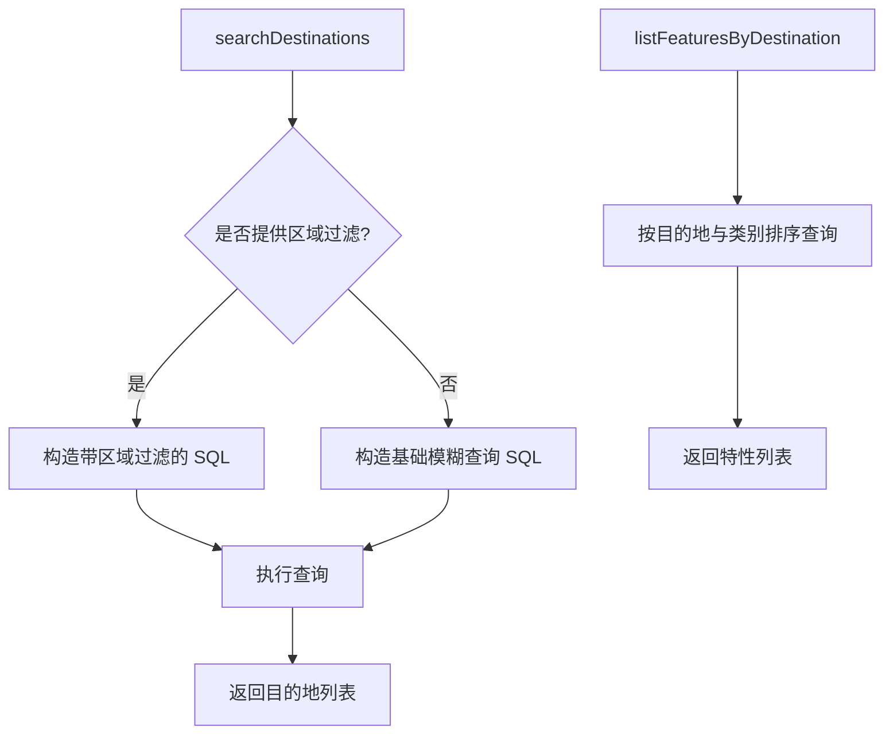
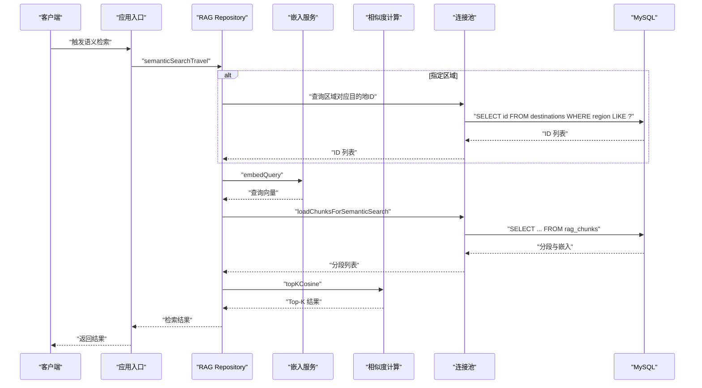
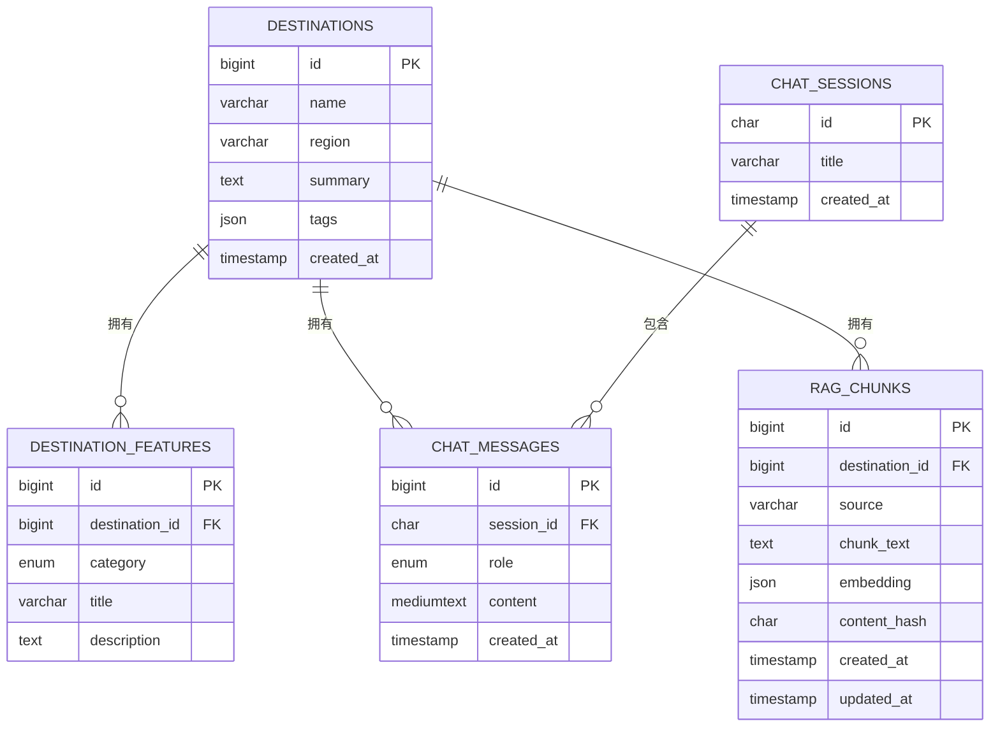
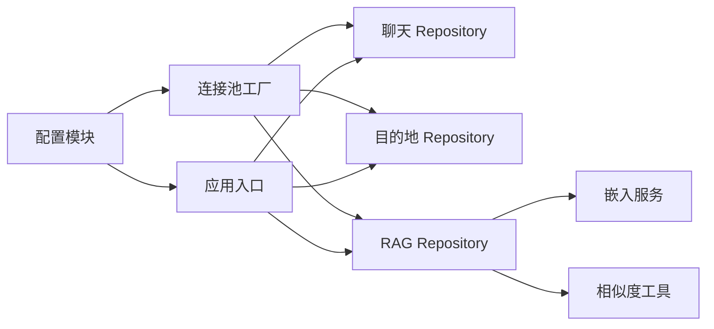

# 数据访问层设计

<cite>
**本文引用的文件**
- [src/db/pool.ts](file://src/db/pool.ts)
- [src/db/chatRepo.ts](file://src/db/chatRepo.ts)
- [src/db/destinationRepo.ts](file://src/db/destinationRepo.ts)
- [src/db/ragRepo.ts](file://src/db/ragRepo.ts)
- [src/db/migrations/001_init.sql](file://src/db/migrations/001_init.sql)
- [src/config.ts](file://src/config.ts)
- [src/index.ts](file://src/index.ts)
- [scripts/migrate.ts](file://scripts/migrate.ts)
- [src/rag/embed.ts](file://src/rag/embed.ts)
- [src/rag/similarity.ts](file://src/rag/similarity.ts)
</cite>

## 目录
1. [简介](#简介)
2. [项目结构](#项目结构)
3. [核心组件](#核心组件)
4. [架构总览](#架构总览)
5. [详细组件分析](#详细组件分析)
6. [依赖关系分析](#依赖关系分析)
7. [性能考量](#性能考量)
8. [故障排查指南](#故障排查指南)
9. [结论](#结论)
10. [附录](#附录)

## 简介
本设计文档聚焦于 Guide-Plan-Agent 的数据访问层，系统性阐述基于 Repository 模式的数据访问架构与设计原则，说明数据库连接池的配置与管理策略，明确各 Repository 的职责与方法定义，梳理错误处理与事务管理现状，并给出测试策略、性能优化建议以及扩展与自定义 Repository 的实现指南。该数据访问层采用函数式 Repository 设计，围绕 MySQL 连接池进行统一的数据库操作封装，服务于聊天会话、目的地信息与 RAG（检索增强生成）检索等业务模块。

## 项目结构
数据访问层位于 src/db 目录，包含：
- 连接池工厂：src/db/pool.ts
- 功能化 Repository：src/db/chatRepo.ts、src/db/destinationRepo.ts、src/db/ragRepo.ts
- 初始化迁移脚本：scripts/migrate.ts 与数据库初始化 SQL：src/db/migrations/001_init.sql
- 应用配置：src/config.ts
- 入口应用：src/index.ts

图表来源
- [src/index.ts:11-77](file://src/index.ts#L11-L77)
- [src/db/pool.ts:4-16](file://src/db/pool.ts#L4-L16)
- [src/db/chatRepo.ts:1-53](file://src/db/chatRepo.ts#L1-L53)
- [src/db/destinationRepo.ts:1-100](file://src/db/destinationRepo.ts#L1-L100)
- [src/db/ragRepo.ts:1-143](file://src/db/ragRepo.ts#L1-L143)
- [src/rag/embed.ts:1-38](file://src/rag/embed.ts#L1-L38)
- [src/rag/similarity.ts:1-31](file://src/rag/similarity.ts#L1-L31)
- [scripts/migrate.ts:10-28](file://scripts/migrate.ts#L10-L28)
- [src/db/migrations/001_init.sql:1-54](file://src/db/migrations/001_init.sql#L1-L54)

章节来源
- [src/index.ts:11-77](file://src/index.ts#L11-L77)
- [src/db/pool.ts:4-16](file://src/db/pool.ts#L4-L16)
- [src/db/chatRepo.ts:1-53](file://src/db/chatRepo.ts#L1-L53)
- [src/db/destinationRepo.ts:1-100](file://src/db/destinationRepo.ts#L1-L100)
- [src/db/ragRepo.ts:1-143](file://src/db/ragRepo.ts#L1-L143)
- [src/rag/embed.ts:1-38](file://src/rag/embed.ts#L1-L38)
- [src/rag/similarity.ts:1-31](file://src/rag/similarity.ts#L1-L31)
- [scripts/migrate.ts:10-28](file://scripts/migrate.ts#L10-L28)
- [src/db/migrations/001_init.sql:1-54](file://src/db/migrations/001_init.sql#L1-L54)

## 核心组件
- 连接池工厂：创建并返回一个可复用的 MySQL 连接池实例，支持等待连接与最大连接数限制。
- 聊天 Repository：负责会话创建、存在性检查、最近消息列表查询与消息插入。
- 目的地 Repository：提供目的地搜索、按 ID 查询、区域匹配、特性列表查询与全量数据导出。
- RAG Repository：负责向量嵌入写入、分段加载、语义检索与结果评分。
- 配置模块：集中校验与加载数据库与应用环境变量，提供类型安全的配置对象。
- 应用入口：在启动时创建连接池并注册路由，调用相应 Repository 完成业务流程。

章节来源
- [src/db/pool.ts:4-16](file://src/db/pool.ts#L4-L16)
- [src/db/chatRepo.ts:6-52](file://src/db/chatRepo.ts#L6-L52)
- [src/db/destinationRepo.ts:20-99](file://src/db/destinationRepo.ts#L20-L99)
- [src/db/ragRepo.ts:25-142](file://src/db/ragRepo.ts#L25-L142)
- [src/config.ts:27-41](file://src/config.ts#L27-L41)
- [src/index.ts:11-77](file://src/index.ts#L11-L77)

## 架构总览
数据访问层采用“连接池 + 函数式 Repository”的架构模式：
- 连接池由工厂函数统一创建，贯穿所有 Repository 使用。
- Repository 通过传入的连接池执行 SQL，不持有状态，便于测试与并发使用。
- RAG 流程结合外部嵌入服务与相似度计算，Repository 负责数据读取与写入。

图表来源
- [src/index.ts:18-68](file://src/index.ts#L18-L68)
- [src/db/pool.ts:4-16](file://src/db/pool.ts#L4-L16)
- [src/db/chatRepo.ts:6-52](file://src/db/chatRepo.ts#L6-L52)
- [src/db/destinationRepo.ts:20-99](file://src/db/destinationRepo.ts#L20-L99)
- [src/db/ragRepo.ts:25-142](file://src/db/ragRepo.ts#L25-L142)

## 详细组件分析

### 连接池与配置
- 连接池工厂
  - 依据配置对象设置主机、端口、用户、密码、数据库名。
  - 启用等待连接与最大连接数限制，确保在高并发下稳定排队。
  - 导出连接池类型以便在各 Repository 中使用。
- 配置加载
  - 使用 Zod 对环境变量进行强类型校验与默认值设置。
  - 分离数据库配置与应用配置，便于独立加载与验证。
- 迁移与初始化
  - 迁移脚本创建数据库并执行初始化 SQL，建立目的地、特性、聊天会话与消息、RAG 分段表及索引。

图表来源
- [src/config.ts:27-41](file://src/config.ts#L27-L41)
- [src/db/pool.ts:4-16](file://src/db/pool.ts#L4-L16)
- [src/index.ts:11-26](file://src/index.ts#L11-L26)

章节来源
- [src/db/pool.ts:4-16](file://src/db/pool.ts#L4-L16)
- [src/config.ts:27-41](file://src/config.ts#L27-L41)
- [scripts/migrate.ts:10-28](file://scripts/migrate.ts#L10-L28)
- [src/db/migrations/001_init.sql:1-54](file://src/db/migrations/001_init.sql#L1-L54)

### 聊天 Repository（chatRepo）
- 职责
  - 会话生命周期管理：创建会话、检查会话是否存在。
  - 历史消息管理：按会话查询最近消息列表，插入新消息。
- 关键方法
  - createSession：创建新的聊天会话。
  - sessionExists：判断会话是否存在。
  - listRecentMessages：按时间倒序返回最近消息，再反转保证顺序正确。
  - insertMessage：插入一条消息记录。
- 数据模型
  - 会话表与消息表具备外键约束与索引，保障一致性与查询效率。

图表来源
- [src/index.ts:35-68](file://src/index.ts#L35-L68)
- [src/db/chatRepo.ts:6-52](file://src/db/chatRepo.ts#L6-L52)

章节来源
- [src/db/chatRepo.ts:6-52](file://src/db/chatRepo.ts#L6-L52)
- [src/db/migrations/001_init.sql:24-38](file://src/db/migrations/001_init.sql#L24-L38)

### 目的地 Repository（destinationRepo）
- 职责
  - 目的地搜索：支持名称/地区/摘要模糊匹配，可选区域过滤。
  - 单条查询：按主键查询目的地详情。
  - 区域匹配：根据区域模式列出目的地 ID。
  - 特性查询：按目的地 ID 列出其特性，按类别排序。
  - 全量导出：导出全部目的地与特性，用于数据维护或 RAG 训练。
- 关键方法
  - searchDestinations：动态拼接 SQL 与参数，支持区域过滤。
  - getDestinationById：单条查询，返回空或对象。
  - listDestinationIdsByRegion：区域模式匹配，返回 ID 列表。
  - listFeaturesByDestination：按目的地与类别排序返回特性列表。
  - listAllDestinations/listAllFeatures：全量导出。
- 数据模型
  - 目的地表与特性表具备外键约束与复合索引，提升查询性能。

图表来源
- [src/db/destinationRepo.ts:20-84](file://src/db/destinationRepo.ts#L20-L84)
- [src/db/migrations/001_init.sql:13-22](file://src/db/migrations/001_init.sql#L13-L22)

章节来源
- [src/db/destinationRepo.ts:20-99](file://src/db/destinationRepo.ts#L20-L99)
- [src/db/migrations/001_init.sql:13-22](file://src/db/migrations/001_init.sql#L13-L22)

### RAG Repository（ragRepo）
- 职责
  - 向量分段写入：将目的地内容分块与嵌入向量写入数据库。
  - 分段加载：按目的地集合或候选上限加载分段，解析 JSON 嵌入。
  - 语义检索：结合嵌入服务与余弦相似度，返回 Top-K 结果。
- 关键方法
  - truncateRagChunks：清空分段表，用于重建。
  - insertRagChunk：写入分段与嵌入，嵌入以 JSON 存储。
  - loadChunksForSemanticSearch：按目的地集合或上限加载分段。
  - semanticSearchTravel：检索流程整合：可选区域过滤、嵌入生成、相似度排序。
- 外部依赖
  - 嵌入服务：调用外部嵌入接口生成向量。
  - 相似度计算：余弦相似度与 Top-K 排序。

图表来源
- [src/db/ragRepo.ts:97-142](file://src/db/ragRepo.ts#L97-L142)
- [src/rag/embed.ts:34-37](file://src/rag/embed.ts#L34-L37)
- [src/rag/similarity.ts:19-30](file://src/rag/similarity.ts#L19-L30)

章节来源
- [src/db/ragRepo.ts:15-142](file://src/db/ragRepo.ts#L15-L142)
- [src/rag/embed.ts:1-38](file://src/rag/embed.ts#L1-L38)
- [src/rag/similarity.ts:1-31](file://src/rag/similarity.ts#L1-L31)
- [src/db/migrations/001_init.sql:40-53](file://src/db/migrations/001_init.sql#L40-L53)

### 数据模型与索引
- 目的地表（destinations）
  - 主键：自增 ID
  - 唯一索引：名称与区域组合唯一
- 特性表（destination_features）
  - 外键：指向目的地表，级联删除
  - 索引：目的地 ID、类别
- 会话表（chat_sessions）
  - 主键：UUID
- 消息表（chat_messages）
  - 外键：指向会话表，级联删除
  - 索引：会话与创建时间
- RAG 分段表（rag_chunks）
  - 外键：指向目的地表，级联删除
  - 唯一索引：内容哈希
  - 索引：目的地 ID、来源

图表来源
- [src/db/migrations/001_init.sql:3-53](file://src/db/migrations/001_init.sql#L3-L53)

章节来源
- [src/db/migrations/001_init.sql:3-53](file://src/db/migrations/001_init.sql#L3-L53)

## 依赖关系分析
- 组件耦合
  - Repository 仅依赖连接池类型，无框架耦合，便于替换与测试。
  - RAG Repository 依赖嵌入服务与相似度工具，但通过函数注入方式解耦。
- 外部依赖
  - MySQL2 Promise 驱动用于异步连接与查询。
  - Zod 用于配置校验。
- 可能的循环依赖
  - 当前未发现循环依赖，模块间为单向依赖。

图表来源
- [src/db/pool.ts:4-16](file://src/db/pool.ts#L4-L16)
- [src/db/chatRepo.ts:1-53](file://src/db/chatRepo.ts#L1-L53)
- [src/db/destinationRepo.ts:1-100](file://src/db/destinationRepo.ts#L1-L100)
- [src/db/ragRepo.ts:1-143](file://src/db/ragRepo.ts#L1-L143)
- [src/rag/embed.ts:1-38](file://src/rag/embed.ts#L1-L38)
- [src/rag/similarity.ts:1-31](file://src/rag/similarity.ts#L1-L31)
- [src/config.ts:27-41](file://src/config.ts#L27-L41)
- [src/index.ts:11-77](file://src/index.ts#L11-L77)

章节来源
- [src/db/pool.ts:4-16](file://src/db/pool.ts#L4-L16)
- [src/db/chatRepo.ts:1-53](file://src/db/chatRepo.ts#L1-L53)
- [src/db/destinationRepo.ts:1-100](file://src/db/destinationRepo.ts#L1-L100)
- [src/db/ragRepo.ts:1-143](file://src/db/ragRepo.ts#L1-L143)
- [src/rag/embed.ts:1-38](file://src/rag/embed.ts#L1-L38)
- [src/rag/similarity.ts:1-31](file://src/rag/similarity.ts#L1-L31)
- [src/config.ts:27-41](file://src/config.ts#L27-L41)
- [src/index.ts:11-77](file://src/index.ts#L11-L77)

## 性能考量
- 连接池配置
  - 当前连接池最大连接数为 10，适用于中低并发场景。若业务增长，应根据 QPS 与平均响应时间调整连接数与等待策略。
- 查询优化
  - 聊天消息查询按会话与时间排序，已建立复合索引，注意避免在大结果集上进行额外排序。
  - 目的地搜索支持区域过滤，建议在高频查询字段上保持索引有效性。
  - RAG 分段加载支持按目的地集合与候选上限限制，避免全表扫描。
- 缓存与批处理
  - 对热点目的地与特性可引入应用层缓存，减少数据库压力。
  - 批量写入嵌入向量时，可考虑分批提交以降低内存峰值。
- I/O 与网络
  - 嵌入服务调用为外部网络请求，建议增加超时与重试策略，避免阻塞数据库连接。
- 监控与告警
  - 建议监控连接池利用率、慢查询与错误率，及时发现性能瓶颈。

[本节为通用性能指导，无需特定文件来源]

## 故障排查指南
- 连接池与数据库
  - 健康检查失败：确认数据库可达、凭据正确、数据库已初始化。
  - 连接耗尽：检查并发量与连接池配置，必要时扩容连接数或优化查询。
- 聊天功能
  - 会话不存在：确认会话 ID 是否正确，或先创建会话。
  - 最近消息为空：确认历史消息是否插入成功，LIMIT 参数是否合理。
- 目的地查询
  - 搜索无结果：确认模糊匹配参数与区域过滤条件。
  - 特性为空：确认目的地 ID 是否有效。
- RAG 检索
  - 嵌入服务异常：检查外部服务可用性与鉴权头。
  - 相似度计算异常：确认向量维度一致与数值稳定性。
- 错误处理现状
  - 当前 Repository 层未显式包裹事务与错误捕获，异常通常向上抛出。建议在应用层统一捕获并转换为标准响应码与错误信息。

章节来源
- [src/index.ts:18-26](file://src/index.ts#L18-L26)
- [src/db/chatRepo.ts:10-16](file://src/db/chatRepo.ts#L10-L16)
- [src/db/ragRepo.ts:15-23](file://src/db/ragRepo.ts#L15-L23)
- [src/rag/embed.ts:25-28](file://src/rag/embed.ts#L25-L28)

## 结论
本数据访问层以连接池为核心，采用函数式 Repository 设计，职责清晰、易于测试与扩展。通过合理的索引与查询策略，满足聊天、目的地与 RAG 的核心需求。建议后续在应用层完善错误处理与事务管理，同时根据业务规模优化连接池与查询性能。

[本节为总结性内容，无需特定文件来源]

## 附录

### Repository 模式设计原则
- 单一职责：每个 Repository 负责单一领域实体或业务场景的数据访问。
- 无状态：Repository 不保存应用状态，通过参数驱动行为。
- 可测试性：通过传入连接池实现依赖注入，便于单元测试与模拟。
- 可扩展性：新增 Repository 仅需遵循现有命名与参数约定。

### 数据库连接池配置与管理策略
- 配置项
  - 主机、端口、用户、密码、数据库名
  - 等待连接与最大连接数
- 管理策略
  - 在应用启动时创建连接池，随进程生命周期复用。
  - 在应用关闭时释放连接池资源（当前实现未显式关闭，建议补充）。
  - 监控连接池状态，按需调整连接数与等待策略。

章节来源
- [src/db/pool.ts:4-16](file://src/db/pool.ts#L4-L16)
- [src/index.ts:11-13](file://src/index.ts#L11-L13)

### 各 Repository 的职责与方法定义
- 聊天 Repository
  - createSession、sessionExists、listRecentMessages、insertMessage
- 目的地 Repository
  - searchDestinations、getDestinationById、listDestinationIdsByRegion、listFeaturesByDestination、listAllDestinations、listAllFeatures
- RAG Repository
  - truncateRagChunks、insertRagChunk、loadChunksForSemanticSearch、semanticSearchTravel

章节来源
- [src/db/chatRepo.ts:6-52](file://src/db/chatRepo.ts#L6-L52)
- [src/db/destinationRepo.ts:20-99](file://src/db/destinationRepo.ts#L20-L99)
- [src/db/ragRepo.ts:25-142](file://src/db/ragRepo.ts#L25-L142)

### 错误处理机制与事务管理
- 错误处理
  - 嵌入服务异常：在调用处抛出错误，应用层捕获并返回错误响应。
  - 数据库异常：当前未显式包裹事务，异常向上抛出。
- 事务管理
  - 当前未使用显式事务。对于需要原子性的多步写入，建议在应用层开启事务并在失败时回滚。

章节来源
- [src/rag/embed.ts:25-28](file://src/rag/embed.ts#L25-L28)
- [src/db/ragRepo.ts:25-52](file://src/db/ragRepo.ts#L25-L52)

### 测试策略
- 单元测试
  - 使用连接池模拟器或内存数据库，隔离外部依赖。
  - 针对每个 Repository 方法编写正反用例，覆盖边界条件与异常路径。
- 集成测试
  - 使用真实数据库与迁移脚本初始化 schema，验证端到端流程。
- 性能测试
  - 基准查询与批量写入，评估连接池与索引效果。

[本节为通用测试指导，无需特定文件来源]

### 性能优化方案
- 查询层面
  - 为高频查询字段添加索引，避免全表扫描。
  - 控制返回字段数量，避免 SELECT *
  - 合理使用 LIMIT 与分页。
- 连接层面
  - 根据并发与延迟调整连接池大小与等待策略。
  - 避免长事务与长时间持有连接。
- 外部依赖
  - 为嵌入服务调用增加超时与重试，避免阻塞数据库连接。
  - 对热点数据引入应用层缓存。

[本节为通用性能指导，无需特定文件来源]

### 扩展指南与自定义 Repository 实现示例
- 新增 Repository 的步骤
  - 定义数据模型与 SQL 操作，确保具备必要的索引。
  - 在 src/db 下新增文件，导出函数式方法，接收连接池作为第一个参数。
  - 在应用入口或业务模块中调用新 Repository。
- 示例思路（以“行程计划”为例）
  - 表结构：行程计划表与行程项表，建立外键与索引。
  - Repository 方法：创建计划、查询计划详情、更新计划项、删除计划项。
  - 调用方式：在应用层注入连接池，调用 Repository 完成业务逻辑。

[本节为概念性扩展指导，无需特定文件来源]