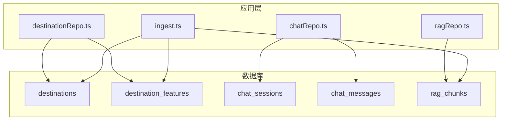
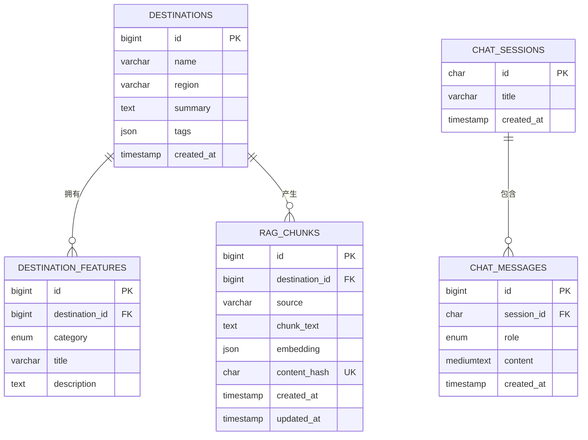
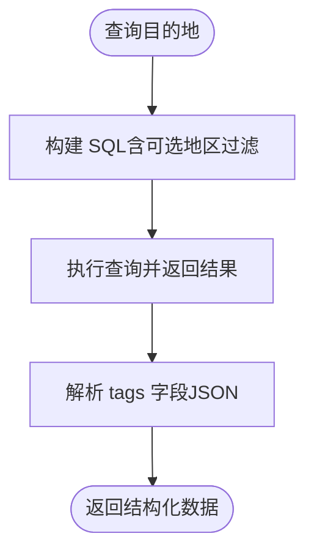
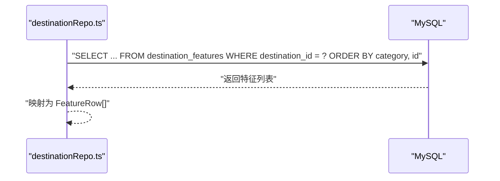
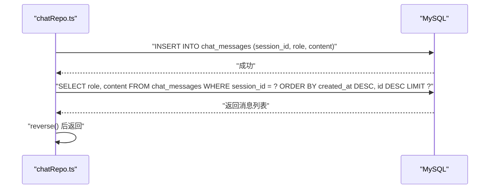
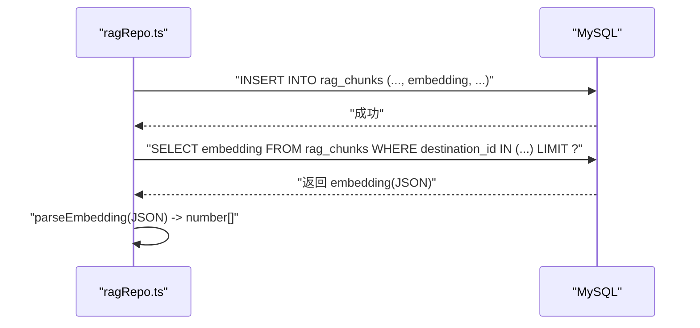
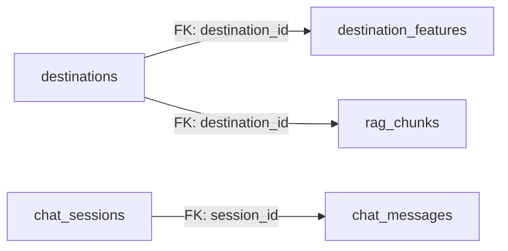

# 表结构定义

<cite>
**本文引用的文件**
- [001_init.sql](file://src/db/migrations/001_init.sql)
- [destinationRepo.ts](file://src/db/destinationRepo.ts)
- [chatRepo.ts](file://src/db/chatRepo.ts)
- [ragRepo.ts](file://src/db/ragRepo.ts)
- [ingest.ts](file://src/rag/ingest.ts)
- [seed.ts](file://scripts/seed.ts)
- [migrate.ts](file://scripts/migrate.ts)
- [config.ts](file://src/config.ts)
</cite>

## 目录
1. [简介](#简介)
2. [项目结构](#项目结构)
3. [核心组件](#核心组件)
4. [架构总览](#架构总览)
5. [详细组件分析](#详细组件分析)
6. [依赖关系分析](#依赖关系分析)
7. [性能考量](#性能考量)
8. [故障排查指南](#故障排查指南)
9. [结论](#结论)

## 简介
本文件面向 Guide-Plan-Agent 的数据库层，系统性梳理并定义五个核心表的完整结构：destinations（目的地）、destination_features（目的地特征）、chat_sessions（聊天会话）、chat_messages（聊天消息）、rag_chunks（RAG 文本块）。内容覆盖字段数据类型、长度/取值范围、空值与默认值、约束与索引设计，并解释 JSON 字段的使用场景与数据格式要求；同时给出每张表的业务含义与典型使用场景，帮助开发者与运维人员快速理解与维护数据库结构。

## 项目结构
数据库初始化脚本位于迁移目录，仓库中通过迁移脚本创建五张核心表；应用侧通过仓库模块读写这些表，RAG 流程涉及嵌入向量与哈希去重；示例数据通过种子脚本插入。

图表来源
- [001_init.sql:3-53](file://src/db/migrations/001_init.sql#L3-L53)
- [destinationRepo.ts:1-100](file://src/db/destinationRepo.ts#L1-L100)
- [chatRepo.ts:1-53](file://src/db/chatRepo.ts#L1-L53)
- [ragRepo.ts:1-143](file://src/db/ragRepo.ts#L1-L143)
- [ingest.ts:1-40](file://src/rag/ingest.ts#L1-L40)

章节来源
- [001_init.sql:1-54](file://src/db/migrations/001_init.sql#L1-L54)
- [migrate.ts:1-33](file://scripts/migrate.ts#L1-L33)
- [seed.ts:1-47](file://scripts/seed.ts#L1-L47)

## 核心组件
本节按表维度逐一说明字段、约束、索引与业务用途。

- destinations（目的地）
  - 字段与约束
    - id：自增主键，无符号整数
    - name：字符串，最大长度 128，非空
    - region：字符串，最大长度 64，非空
    - summary：文本，非空
    - tags：JSON，可空；用于存储标签数组或对象
    - created_at：时间戳，默认当前时间
    - 唯一索引：(name, region)，确保同一地区下目的地名称唯一
  - 使用场景
    - 存储目的地基本信息与标签
    - 支持按名称/地区/摘要的模糊检索
  - JSON 字段说明
    - 应用侧以 JSON 形式存储标签，如数组形式；读取时可解析为数组或字符串拼接
    - 示例数据通过 CAST(? AS JSON) 插入，确保类型正确

- destination_features（目的地特征）
  - 字段与约束
    - id：自增主键，无符号整数
    - destination_id：外键，指向 destinations.id，删除级联
    - category：枚举，取值限定为 food/scenery/culture
    - title：字符串，最大长度 256，非空
    - description：文本，非空
    - 普通索引：idx_features_destination(destination_id)
    - 普通索引：idx_features_category(category)
    - 外键约束：fk_features_destination(destination_id) -> destinations(id) ON DELETE CASCADE
  - 使用场景
    - 存放目的地的美食、景点、文化等特征条目
    - 支持按目的地或类别查询
  - JSON 字段说明
    - 本表不包含 JSON 字段

- chat_sessions（聊天会话）
  - 字段与约束
    - id：主键，CHAR(36)，通常为 UUID
    - title：字符串，最大长度 256，可空
    - created_at：时间戳，默认当前时间
  - 使用场景
    - 记录一次或多轮对话的上下文容器
    - 与 chat_messages 一对多关联

- chat_messages（聊天消息）
  - 字段与约束
    - id：自增主键，无符号整数
    - session_id：外键，指向 chat_sessions.id，删除级联
    - role：枚举，取值 user/assistant/system
    - content：中型文本，非空
    - created_at：时间戳，默认当前时间
    - 普通索引：idx_messages_session_created(session_id, created_at)
    - 外键约束：fk_messages_session(session_id) -> chat_sessions(id) ON DELETE CASCADE
  - 使用场景
    - 存储每条消息的内容与角色
    - 支持按会话分页与排序读取历史消息

- rag_chunks（RAG 文本块）
  - 字段与约束
    - id：自增主键，无符号整数
    - destination_id：外键，指向 destinations.id，删除级联
    - source：字符串，最大长度 32，非空；标识来源类型（如 summary/feature/synthetic）
    - chunk_text：文本，非空
    - embedding：JSON，非空；存储向量数组
    - content_hash：CHAR(64)，非空；文本块内容的 SHA-256 哈希，唯一
    - created_at：时间戳，默认当前时间
    - updated_at：时间戳，默认当前时间，更新时自动刷新
    - 唯一索引：uq_rag_content_hash(content_hash)
    - 普通索引：idx_rag_destination(destination_id)
    - 普通索引：idx_rag_source(source)
    - 外键约束：fk_rag_destination(destination_id) -> destinations(id) ON DELETE CASCADE
  - 使用场景
    - 存储经分块处理后的文本与对应的向量表示
    - 基于向量相似度进行语义检索
  - JSON 字段说明
    - embedding 以 JSON 数组形式存储，入库前序列化为字符串，读取后解析回数字数组
    - content_hash 用于去重，避免重复向量入库

章节来源
- [001_init.sql:3-53](file://src/db/migrations/001_init.sql#L3-L53)
- [destinationRepo.ts:4-18](file://src/db/destinationRepo.ts#L4-L18)
- [chatRepo.ts:18-21](file://src/db/chatRepo.ts#L18-L21)
- [ragRepo.ts:7-13](file://src/db/ragRepo.ts#L7-L13)
- [ingest.ts:5-10](file://src/rag/ingest.ts#L5-L10)
- [seed.ts:21-47](file://scripts/seed.ts#L21-L47)

## 架构总览
下图展示五张表之间的关系与关键索引/约束，帮助理解查询路径与性能优化点。

图表来源
- [001_init.sql:3-53](file://src/db/migrations/001_init.sql#L3-L53)

## 详细组件分析

### destinations（目的地）表
- 字段定义与约束
  - id：自增主键，保证全局唯一
  - name：最大长度 128，非空；与 region 组成复合唯一索引
  - region：最大长度 64，非空；与 name 组成复合唯一索引
  - summary：文本，非空；用于目的地概要描述
  - tags：JSON，可空；建议为数组或对象，便于前端渲染与筛选
  - created_at：时间戳，默认当前时间
  - 唯一索引：(name, region)
- 查询与使用
  - 支持按名称/地区/摘要模糊匹配，可选按地区过滤
  - 可列出所有目的地及特征，支持分页与排序
- JSON 字段使用
  - 写入时通过 CAST(? AS JSON) 确保类型正确
  - 读取后可在应用层解析为数组或字符串拼接

图表来源
- [destinationRepo.ts:20-45](file://src/db/destinationRepo.ts#L20-L45)
- [seed.ts:21-47](file://scripts/seed.ts#L21-L47)

章节来源
- [001_init.sql:3-11](file://src/db/migrations/001_init.sql#L3-L11)
- [destinationRepo.ts:20-92](file://src/db/destinationRepo.ts#L20-L92)
- [seed.ts:21-47](file://scripts/seed.ts#L21-L47)

### destination_features（目的地特征）表
- 字段定义与约束
  - id：自增主键
  - destination_id：外键，指向 destinations.id，删除级联
  - category：枚举，限定为 food/scenery/culture
  - title：最大长度 256，非空
  - description：文本，非空
  - 普通索引：idx_features_destination(destination_id)
  - 普通索引：idx_features_category(category)
  - 外键约束：fk_features_destination(destination_id) -> destinations(id) ON DELETE CASCADE
- 查询与使用
  - 支持按 destination_id 列表查询，按 category 与 id 排序
  - 与 destinations 一对多关系清晰，便于聚合目的地特征
- JSON 字段说明
  - 本表不包含 JSON 字段

图表来源
- [destinationRepo.ts:71-85](file://src/db/destinationRepo.ts#L71-L85)
- [001_init.sql:13-22](file://src/db/migrations/001_init.sql#L13-L22)

章节来源
- [001_init.sql:13-22](file://src/db/migrations/001_init.sql#L13-L22)
- [destinationRepo.ts:71-85](file://src/db/destinationRepo.ts#L71-L85)

### chat_sessions（聊天会话）与 chat_messages（聊天消息）表
- 字段定义与约束
  - chat_sessions
    - id：CHAR(36)，主键（UUID）
    - title：VARCHAR(256)，可空
    - created_at：TIMESTAMP，默认当前时间
  - chat_messages
    - id：自增主键
    - session_id：CHAR(36)，外键，指向 chat_sessions.id，删除级联
    - role：ENUM('user','assistant','system')
    - content：MEDIUMTEXT，非空
    - created_at：TIMESTAMP，默认当前时间
    - 普通索引：idx_messages_session_created(session_id, created_at)
    - 外键约束：fk_messages_session(session_id) -> chat_sessions(id) ON DELETE CASCADE
- 查询与使用
  - 通过 session_id 获取最近 N 条消息，按时间与 id 倒序取后再反转，保证顺序正确
  - 支持按会话创建时间与 id 的联合索引高效排序
- JSON 字段说明
  - 本表不包含 JSON 字段

图表来源
- [chatRepo.ts:23-40](file://src/db/chatRepo.ts#L23-L40)
- [001_init.sql:24-38](file://src/db/migrations/001_init.sql#L24-L38)

章节来源
- [001_init.sql:24-38](file://src/db/migrations/001_init.sql#L24-L38)
- [chatRepo.ts:1-53](file://src/db/chatRepo.ts#L1-L53)

### rag_chunks（RAG 文本块）表
- 字段定义与约束
  - id：自增主键
  - destination_id：外键，指向 destinations.id，删除级联
  - source：VARCHAR(32)，非空；来源类型标识
  - chunk_text：TEXT，非空；文本块内容
  - embedding：JSON，非空；向量数组，入库前序列化为字符串，读取后解析
  - content_hash：CHAR(64)，非空；chunk_text 的 SHA-256 哈希，唯一
  - created_at：TIMESTAMP，默认当前时间
  - updated_at：TIMESTAMP，默认当前时间，更新时自动刷新
  - 唯一索引：uq_rag_content_hash(content_hash)
  - 普通索引：idx_rag_destination(destination_id)
  - 普通索引：idx_rag_source(source)
  - 外键约束：fk_rag_destination(destination_id) -> destinations(id) ON DELETE CASCADE
- 查询与使用
  - 支持按 destination_ids 过滤候选集合，限制候选数量
  - 加载时将 embedding 解析为数字数组，供相似度计算使用
  - 支持按 source 与 destination_id 快速筛选
- JSON 字段说明
  - embedding 以 JSON 数组形式存储，入库时通过 CAST(? AS JSON) 与 JSON.stringify 序列化
  - 读取时 parseEmbedding 将字符串或数组解析为 number[]

图表来源
- [ragRepo.ts:29-95](file://src/db/ragRepo.ts#L29-L95)
- [001_init.sql:40-53](file://src/db/migrations/001_init.sql#L40-L53)

章节来源
- [001_init.sql:40-53](file://src/db/migrations/001_init.sql#L40-L53)
- [ragRepo.ts:7-23](file://src/db/ragRepo.ts#L7-L23)
- [ragRepo.ts:29-95](file://src/db/ragRepo.ts#L29-L95)

## 依赖关系分析
- 外键关系
  - destination_features.destination_id -> destinations.id（级联删除）
  - chat_messages.session_id -> chat_sessions.id（级联删除）
  - rag_chunks.destination_id -> destinations.id（级联删除）
- 索引策略
  - destinations：复合唯一索引(name, region)用于去重
  - destination_features：按 destination_id 与 category 建立普通索引，加速分组查询
  - chat_messages：按 (session_id, created_at) 建立联合索引，支持高效分页与排序
  - rag_chunks：按 destination_id 与 source 建立普通索引，按 content_hash 建立唯一索引用于去重
- JSON 字段
  - destinations.tags：存储标签元数据
  - rag_chunks.embedding：存储向量数组，配合相似度算法实现语义检索

图表来源
- [001_init.sql:13-53](file://src/db/migrations/001_init.sql#L13-L53)

章节来源
- [001_init.sql:13-53](file://src/db/migrations/001_init.sql#L13-L53)

## 性能考量
- 索引选择
  - 联合索引 idx_messages_session_created(session_id, created_at) 有利于按会话分页与时间排序
  - rag_chunks 的 content_hash 唯一索引可有效避免重复向量入库，减少存储与计算开销
- JSON 处理
  - embedding 在入库前序列化为字符串，在应用层解析为数组，避免数据库直接处理复杂 JSON 结构
- 数据规模
  - RAG 候选集通过候选上限参数控制，避免相似度计算时的全表扫描
- 编码与字符集
  - 全库采用 utf8mb4 与统一校对规则，确保多语言与表情符号兼容

[本节提供通用指导，无需特定文件引用]

## 故障排查指南
- JSON 类型错误
  - 现象：embedding 或 tags 写入失败或解析异常
  - 排查：确认写入时使用 CAST(? AS JSON) 与 JSON.stringify；读取时 parseEmbedding 正确处理字符串或数组
  - 参考
    - [ragRepo.ts:15-23](file://src/db/ragRepo.ts#L15-L23)
    - [ragRepo.ts:29-52](file://src/db/ragRepo.ts#L29-L52)
- 唯一冲突
  - 现象：插入 destinations 或 rag_chunks 报唯一约束冲突
  - 排查：检查 (name, region) 或 content_hash 是否已存在
  - 参考
    - [001_init.sql](file://src/db/migrations/001_init.sql#L10)
    - [001_init.sql](file://src/db/migrations/001_init.sql#L50)
- 外键约束
  - 现象：删除目的地时报外键约束错误
  - 排查：确认相关子表（features、rag_chunks）已被清理或允许级联删除
  - 参考
    - [001_init.sql](file://src/db/migrations/001_init.sql#L19)
    - [001_init.sql](file://src/db/migrations/001_init.sql#L49)
- 会话与消息一致性
  - 现象：查询历史消息顺序异常
  - 排查：确认按 created_at 与 id 倒序取后反转的逻辑正确
  - 参考
    - [chatRepo.ts:23-40](file://src/db/chatRepo.ts#L23-L40)

章节来源
- [ragRepo.ts:15-23](file://src/db/ragRepo.ts#L15-L23)
- [ragRepo.ts:29-52](file://src/db/ragRepo.ts#L29-L52)
- [001_init.sql](file://src/db/migrations/001_init.sql#L10)
- [001_init.sql](file://src/db/migrations/001_init.sql#L50)
- [001_init.sql](file://src/db/migrations/001_init.sql#L19)
- [001_init.sql](file://src/db/migrations/001_init.sql#L49)
- [chatRepo.ts:23-40](file://src/db/chatRepo.ts#L23-L40)

## 结论
本文系统梳理了 Guide-Plan-Agent 的五张核心表结构，明确了字段类型、约束与索引设计，并解释了 JSON 字段在标签与向量中的使用方式。通过外键与索引策略，实现了目的地、特征、会话、消息与 RAG 块之间的清晰关系与高效查询。建议在后续扩展中保持一致的 JSON 序列化规范与索引策略，以保障性能与可维护性。