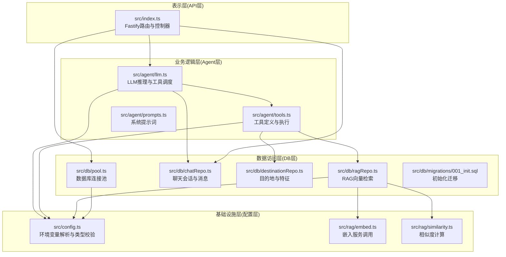
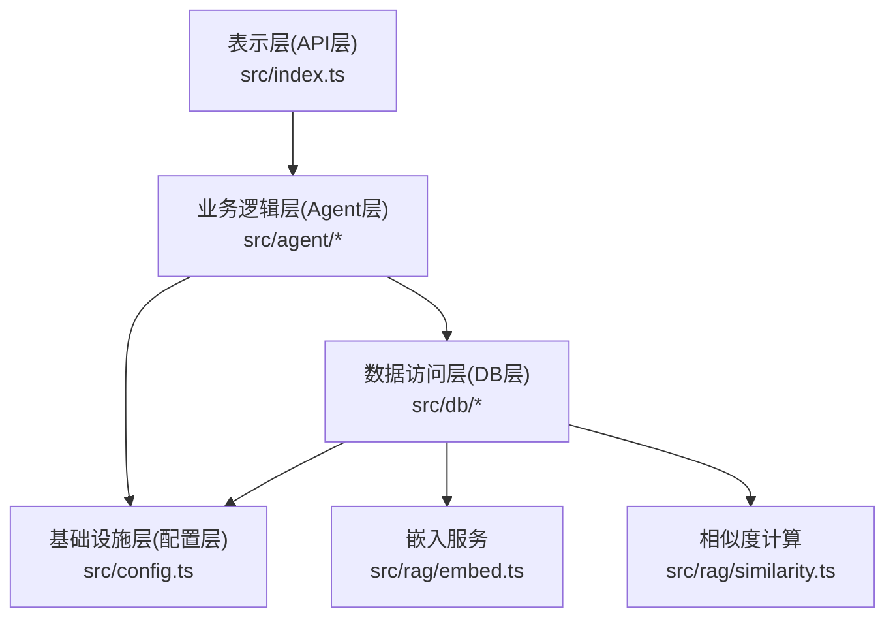
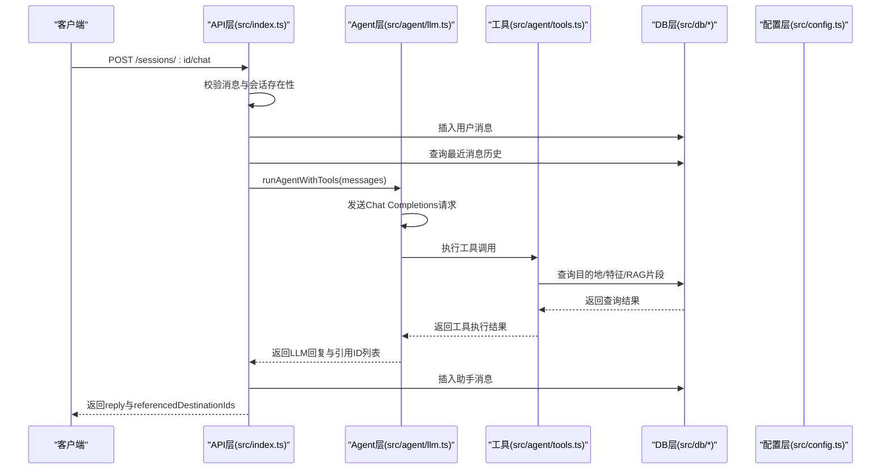
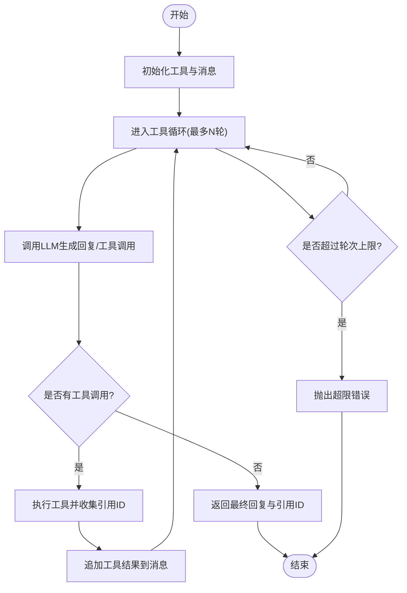
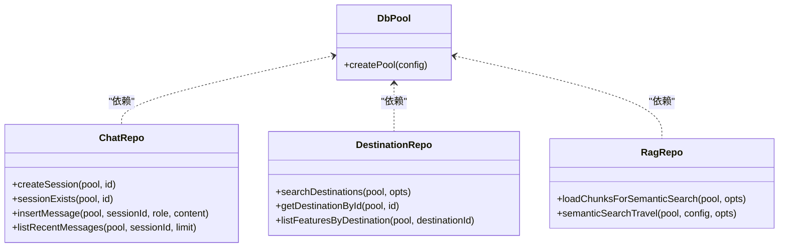
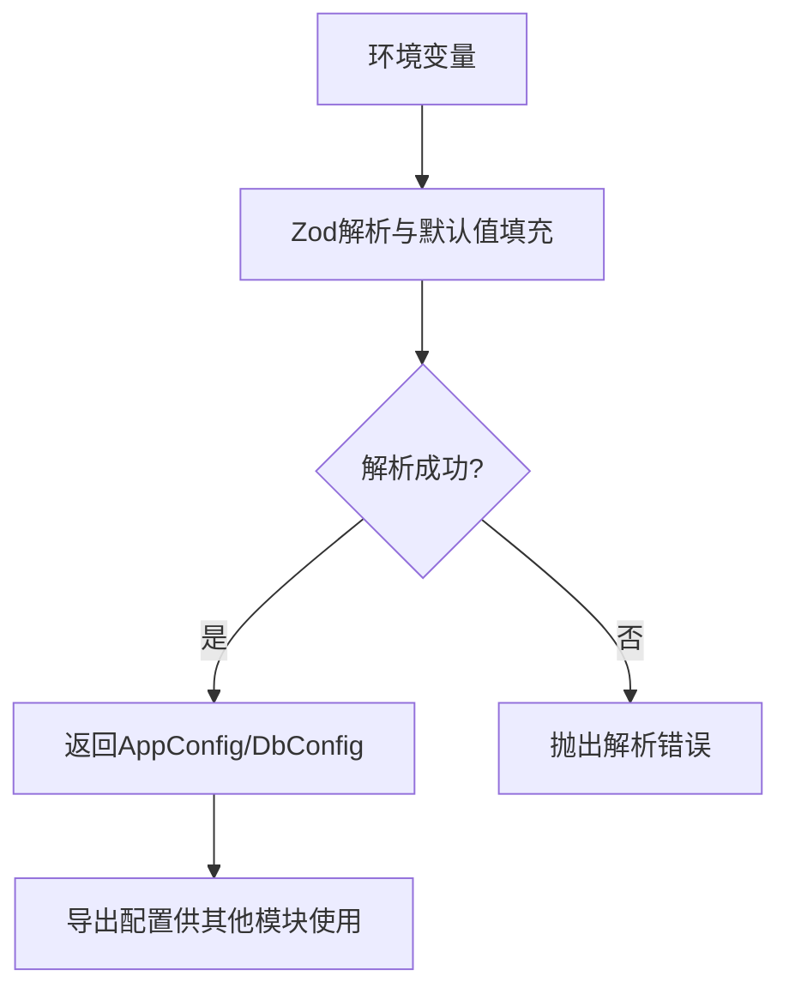
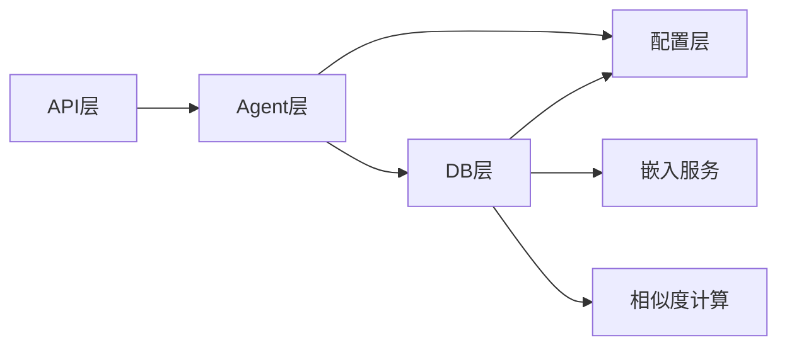
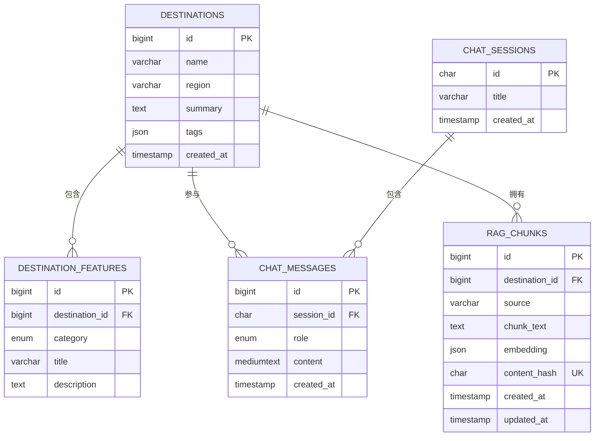

# 分层架构设计

<cite>
**本文档引用的文件**
- [src/index.ts](file://src/index.ts)
- [src/config.ts](file://src/config.ts)
- [src/db/pool.ts](file://src/db/pool.ts)
- [src/db/chatRepo.ts](file://src/db/chatRepo.ts)
- [src/db/destinationRepo.ts](file://src/db/destinationRepo.ts)
- [src/db/ragRepo.ts](file://src/db/ragRepo.ts)
- [src/agent/llm.ts](file://src/agent/llm.ts)
- [src/agent/tools.ts](file://src/agent/tools.ts)
- [src/agent/prompts.ts](file://src/agent/prompts.ts)
- [src/rag/embed.ts](file://src/rag/embed.ts)
- [src/rag/similarity.ts](file://src/rag/similarity.ts)
- [src/db/migrations/001_init.sql](file://src/db/migrations/001_init.sql)
- [package.json](file://package.json)
</cite>

## 目录
1. [引言](#引言)
2. [项目结构](#项目结构)
3. [核心组件](#核心组件)
4. [架构总览](#架构总览)
5. [详细组件分析](#详细组件分析)
6. [依赖关系分析](#依赖关系分析)
7. [性能考量](#性能考量)
8. [故障排查指南](#故障排查指南)
9. [结论](#结论)
10. [附录](#附录)

## 引言
本项目采用四层架构模式：表示层（API 层）、业务逻辑层（Agent 层）、数据访问层（DB 层）、基础设施层（配置层）。该设计通过清晰的职责边界与严格的依赖方向，实现了代码复用、测试隔离与维护便利性。本文档将系统阐述各层职责、接口定义、依赖关系、层间通信机制（数据传递、错误传播与异常处理），并提供时序图与数据流向图，帮助读者快速理解与扩展系统。

## 项目结构
项目采用按功能域划分的目录组织方式，核心模块如下：
- 表示层（API 层）：Fastify 路由与控制器，负责 HTTP 请求处理与响应封装
- 业务逻辑层（Agent 层）：LLM 推理与工具调度，负责对话流程控制与工具调用
- 数据访问层（DB 层）：Repository 模式，封装数据库操作与迁移脚本
- 基础设施层（配置层）：环境变量解析与类型安全校验，提供统一配置对象

图表来源
- [src/index.ts:1-77](file://src/index.ts#L1-L77)
- [src/agent/llm.ts:1-114](file://src/agent/llm.ts#L1-L114)
- [src/agent/tools.ts:1-195](file://src/agent/tools.ts#L1-L195)
- [src/db/pool.ts:1-17](file://src/db/pool.ts#L1-L17)
- [src/db/chatRepo.ts:1-53](file://src/db/chatRepo.ts#L1-L53)
- [src/db/destinationRepo.ts:1-100](file://src/db/destinationRepo.ts#L1-L100)
- [src/db/ragRepo.ts:1-143](file://src/db/ragRepo.ts#L1-L143)
- [src/config.ts:1-46](file://src/config.ts#L1-L46)
- [src/rag/embed.ts:1-38](file://src/rag/embed.ts#L1-L38)
- [src/rag/similarity.ts:1-31](file://src/rag/similarity.ts#L1-L31)

章节来源
- [src/index.ts:1-77](file://src/index.ts#L1-L77)
- [package.json:1-31](file://package.json#L1-L31)

## 核心组件
- 表示层（API 层）
  - 入口函数负责加载配置、创建数据库连接池、注册 CORS 中间件与路由
  - 提供健康检查、会话创建、聊天对话等 HTTP 端点
  - 对外暴露状态码与错误信息，确保错误在 API 层被正确传播
- 业务逻辑层（Agent 层）
  - LLM 推理：封装 OpenAI Chat Completions 调用，支持工具调用与多轮对话
  - 工具调度：根据 LLM 返回的工具调用结果执行数据库查询或向量检索
  - 系统提示词：统一的系统提示词，指导 Agent 的行为与约束
- 数据访问层（DB 层）
  - 连接池：集中管理数据库连接参数与并发限制
  - Repository：封装会话、消息、目的地、特征、RAG 片段等 CRUD 操作
  - 迁移：初始化数据库表结构与索引
- 基础设施层（配置层）
  - 环境变量解析：使用 Zod 对环境变量进行类型校验与默认值设置
  - 统一配置：提供应用配置与数据库配置两类类型，确保类型安全

章节来源
- [src/index.ts:11-77](file://src/index.ts#L11-L77)
- [src/agent/llm.ts:49-114](file://src/agent/llm.ts#L49-L114)
- [src/agent/tools.ts:15-69](file://src/agent/tools.ts#L15-L69)
- [src/db/pool.ts:4-14](file://src/db/pool.ts#L4-L14)
- [src/db/chatRepo.ts:6-52](file://src/db/chatRepo.ts#L6-L52)
- [src/db/destinationRepo.ts:20-100](file://src/db/destinationRepo.ts#L20-L100)
- [src/db/ragRepo.ts:97-143](file://src/db/ragRepo.ts#L97-L143)
- [src/config.ts:27-45](file://src/config.ts#L27-L45)

## 架构总览
四层架构通过“自上而下”的依赖方向实现清晰的职责分离：
- 表示层仅依赖业务逻辑层，不直接访问数据库
- 业务逻辑层依赖配置层与数据访问层，负责协调工具与数据
- 数据访问层依赖配置层，提供稳定的数据库连接与查询能力
- 基础设施层为所有层提供统一的配置与类型安全

图表来源
- [src/index.ts:1-77](file://src/index.ts#L1-L77)
- [src/agent/llm.ts:1-114](file://src/agent/llm.ts#L1-L114)
- [src/agent/tools.ts:1-195](file://src/agent/tools.ts#L1-L195)
- [src/db/pool.ts:1-17](file://src/db/pool.ts#L1-L17)
- [src/db/chatRepo.ts:1-53](file://src/db/chatRepo.ts#L1-L53)
- [src/db/destinationRepo.ts:1-100](file://src/db/destinationRepo.ts#L1-L100)
- [src/db/ragRepo.ts:1-143](file://src/db/ragRepo.ts#L1-L143)
- [src/config.ts:1-46](file://src/config.ts#L1-L46)
- [src/rag/embed.ts:1-38](file://src/rag/embed.ts#L1-L38)
- [src/rag/similarity.ts:1-31](file://src/rag/similarity.ts#L1-L31)

## 详细组件分析

### 表示层（API 层）分析
- 职责边界
  - 负责 HTTP 请求的接收、参数校验、状态码返回与错误传播
  - 不直接执行业务逻辑，仅作为入口协调 Agent 层与 DB 层
- 关键接口
  - GET /health：数据库连通性检查
  - POST /sessions：创建会话并返回 sessionId
  - POST /sessions/:id/chat：接收用户消息，调用 Agent 并返回回复与引用的目的地 ID 列表
- 错误处理
  - 对数据库查询失败返回 503；对无效请求返回 400/404
  - 将错误信息透传给客户端，便于前端展示与日志追踪

图表来源
- [src/index.ts:35-68](file://src/index.ts#L35-L68)
- [src/agent/llm.ts:49-114](file://src/agent/llm.ts#L49-L114)
- [src/agent/tools.ts:114-195](file://src/agent/tools.ts#L114-L195)
- [src/db/chatRepo.ts:42-52](file://src/db/chatRepo.ts#L42-L52)
- [src/db/destinationRepo.ts:20-100](file://src/db/destinationRepo.ts#L20-L100)
- [src/db/ragRepo.ts:97-143](file://src/db/ragRepo.ts#L97-L143)

章节来源
- [src/index.ts:18-68](file://src/index.ts#L18-L68)

### 业务逻辑层（Agent 层）分析
- 职责边界
  - 协调 LLM 推理与工具调用，控制多轮对话与工具执行上限
  - 将工具执行结果转换为对话消息，回写到数据库
- 关键接口
  - runAgentWithTools：执行 LLM 推理与工具循环，返回最终回复与引用的目的地 ID 列表
  - 工具定义：search_destinations、semantic_search_travel、get_destination_detail
- 错误处理
  - 对工具执行异常进行捕获并回写工具消息，避免中断对话流程
  - 对超过最大轮次进行显式错误抛出

图表来源
- [src/agent/llm.ts:49-114](file://src/agent/llm.ts#L49-L114)
- [src/agent/tools.ts:114-195](file://src/agent/tools.ts#L114-L195)

章节来源
- [src/agent/llm.ts:49-114](file://src/agent/llm.ts#L49-L114)
- [src/agent/tools.ts:15-69](file://src/agent/tools.ts#L15-L69)

### 数据访问层（DB 层）分析
- 职责边界
  - 提供统一的数据库连接池与 CRUD 操作
  - 封装会话、消息、目的地、特征、RAG 片段等实体的查询与插入
- 关键接口
  - 连接池：createPool
  - 会话与消息：createSession、sessionExists、insertMessage、listRecentMessages
  - 目的地与特征：searchDestinations、getDestinationById、listFeaturesByDestination
  - RAG 片段：loadChunksForSemanticSearch、semanticSearchTravel
- 错误处理
  - 查询失败时抛出异常，由上层统一处理
  - 对空结果进行安全处理（如返回空数组或 null）

图表来源
- [src/db/pool.ts:4-14](file://src/db/pool.ts#L4-L14)
- [src/db/chatRepo.ts:6-52](file://src/db/chatRepo.ts#L6-L52)
- [src/db/destinationRepo.ts:20-100](file://src/db/destinationRepo.ts#L20-L100)
- [src/db/ragRepo.ts:54-143](file://src/db/ragRepo.ts#L54-L143)

章节来源
- [src/db/pool.ts:4-14](file://src/db/pool.ts#L4-L14)
- [src/db/chatRepo.ts:6-52](file://src/db/chatRepo.ts#L6-L52)
- [src/db/destinationRepo.ts:20-100](file://src/db/destinationRepo.ts#L20-L100)
- [src/db/ragRepo.ts:54-143](file://src/db/ragRepo.ts#L54-L143)

### 基础设施层（配置层）分析
- 职责边界
  - 解析并校验环境变量，提供类型安全的应用配置
  - 提供嵌入服务基础 URL 计算等辅助方法
- 关键接口
  - loadConfig/loadDbConfig：解析环境变量并返回强类型配置
  - embeddingBaseUrl：根据配置选择嵌入服务端点
- 错误处理
  - 对非法环境变量抛出错误，阻止应用启动

图表来源
- [src/config.ts:27-45](file://src/config.ts#L27-L45)

章节来源
- [src/config.ts:27-45](file://src/config.ts#L27-L45)

## 依赖关系分析
- 依赖方向
  - API 层 → Agent 层：API 层调用 Agent 层进行对话推理
  - Agent 层 → DB 层：Agent 层通过工具调用 DB 层查询数据
  - Agent 层 → 配置层：Agent 层使用配置层提供的模型、端点与阈值
  - DB 层 → 配置层：DB 层使用配置层提供的数据库连接参数
  - DB 层 → 嵌入服务与相似度计算：RAG 检索依赖嵌入与相似度模块
- 耦合与内聚
  - 各层内聚良好，跨层依赖通过明确的接口进行
  - 配置层为唯一共享的外部依赖，降低重复配置与耦合

图表来源
- [src/index.ts:1-77](file://src/index.ts#L1-L77)
- [src/agent/llm.ts:1-114](file://src/agent/llm.ts#L1-L114)
- [src/agent/tools.ts:1-195](file://src/agent/tools.ts#L1-L195)
- [src/db/pool.ts:1-17](file://src/db/pool.ts#L1-L17)
- [src/db/ragRepo.ts:1-143](file://src/db/ragRepo.ts#L1-L143)
- [src/config.ts:1-46](file://src/config.ts#L1-L46)
- [src/rag/embed.ts:1-38](file://src/rag/embed.ts#L1-L38)
- [src/rag/similarity.ts:1-31](file://src/rag/similarity.ts#L1-L31)

章节来源
- [src/index.ts:1-77](file://src/index.ts#L1-L77)
- [src/agent/llm.ts:1-114](file://src/agent/llm.ts#L1-L114)
- [src/agent/tools.ts:1-195](file://src/agent/tools.ts#L1-L195)
- [src/db/pool.ts:1-17](file://src/db/pool.ts#L1-L17)
- [src/db/ragRepo.ts:1-143](file://src/db/ragRepo.ts#L1-L143)
- [src/config.ts:1-46](file://src/config.ts#L1-L46)
- [src/rag/embed.ts:1-38](file://src/rag/embed.ts#L1-L38)
- [src/rag/similarity.ts:1-31](file://src/rag/similarity.ts#L1-L31)

## 性能考量
- 连接池与并发
  - 使用 mysql2/promise 的连接池，默认连接数为 10，需根据负载调整
  - 建议在高并发场景下启用连接等待与超时策略
- 查询优化
  - 会话与消息查询使用复合索引，按时间倒序限制数量，减少扫描范围
  - RAG 检索前可按地区预筛选目的地 ID，缩小候选集
- LLM 调用
  - 控制工具调用轮次上限，避免过长的对话链路
  - 合理设置温度与模型参数，平衡生成质量与稳定性
- 向量检索
  - 通过候选集限制与 Top-K 选择，控制相似度计算开销
  - 嵌入向量存储为 JSON 字段，注意序列化与解析成本

## 故障排查指南
- 健康检查失败
  - 现象：/health 返回 503
  - 排查：确认数据库连接参数与网络可达性
  - 参考路径：[src/index.ts:18-26](file://src/index.ts#L18-L26)，[src/db/pool.ts:4-14](file://src/db/pool.ts#L4-L14)
- 会话不存在
  - 现象：POST /sessions/:id/chat 返回 404
  - 排查：确认会话 ID 是否有效，检查 chat_sessions 表
  - 参考路径：[src/index.ts:44-48](file://src/index.ts#L44-L48)，[src/db/chatRepo.ts:10-16](file://src/db/chatRepo.ts#L10-L16)
- LLM 调用异常
  - 现象：工具调用失败或超时
  - 排查：检查 OPENAI_BASE_URL、OPENAI_API_KEY、模型与轮次上限
  - 参考路径：[src/agent/llm.ts:30-47](file://src/agent/llm.ts#L30-L47)，[src/config.ts:35-41](file://src/config.ts#L35-L41)
- RAG 检索无结果
  - 现象：semantic_search_travel 返回空数组
  - 排查：确认 rag_chunks 是否已建立，候选集与 Top-K 设置
  - 参考路径：[src/db/ragRepo.ts:97-143](file://src/db/ragRepo.ts#L97-L143)，[src/rag/embed.ts:7-32](file://src/rag/embed.ts#L7-L32)

章节来源
- [src/index.ts:18-26](file://src/index.ts#L18-L26)
- [src/db/chatRepo.ts:10-16](file://src/db/chatRepo.ts#L10-L16)
- [src/agent/llm.ts:30-47](file://src/agent/llm.ts#L30-L47)
- [src/db/ragRepo.ts:97-143](file://src/db/ragRepo.ts#L97-L143)
- [src/rag/embed.ts:7-32](file://src/rag/embed.ts#L7-L32)

## 结论
本项目的四层架构设计通过清晰的职责边界与严格的依赖方向，实现了良好的可维护性与可扩展性。表示层专注于接口与错误处理，业务逻辑层负责推理与工具调度，数据访问层提供稳定的数据能力，基础设施层保障配置与类型安全。该设计有利于单元测试隔离、模块替换与横向扩展。

## 附录
- 数据模型概览（基于初始化迁移）
  - destinations：目的地基本信息
  - destination_features：美食、美景、文化三类特征
  - chat_sessions：会话记录
  - chat_messages：会话消息
  - rag_chunks：向量检索的文本片段与嵌入

图表来源
- [src/db/migrations/001_init.sql:3-54](file://src/db/migrations/001_init.sql#L3-L54)