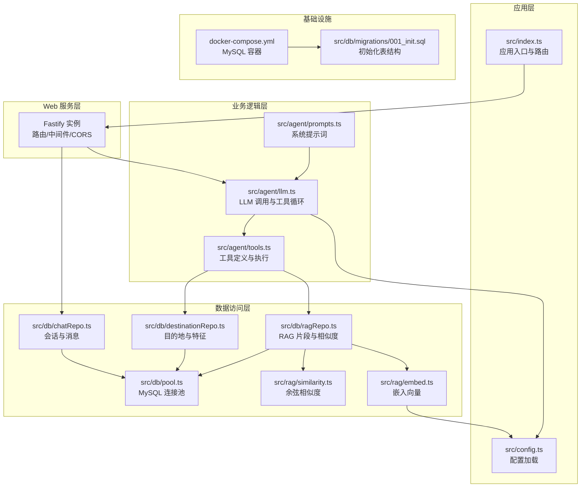
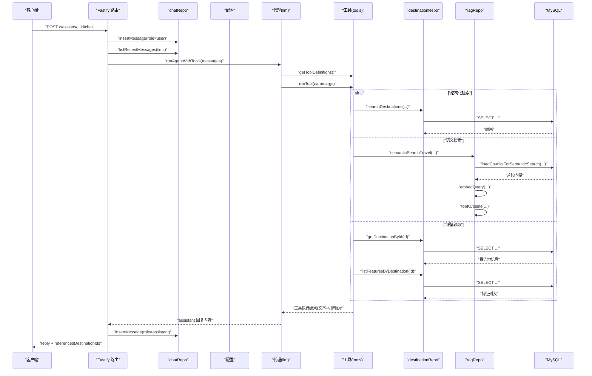
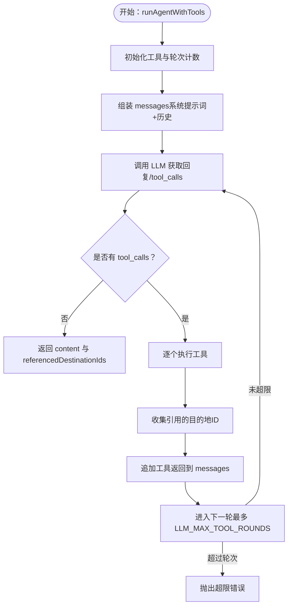
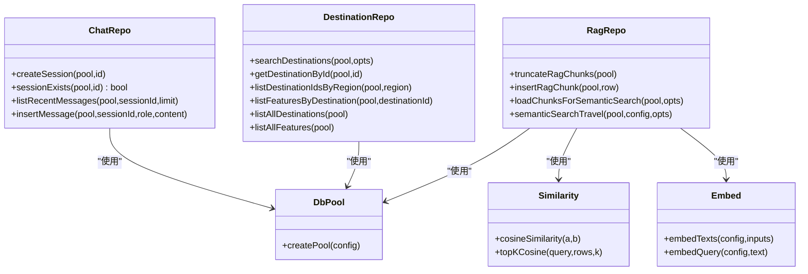
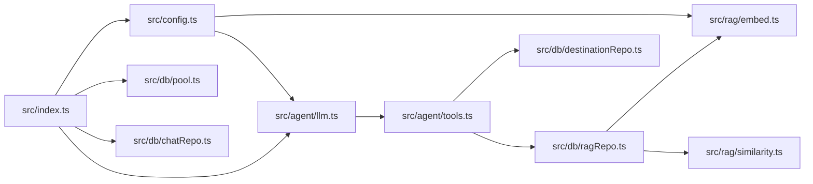

# 整体架构概览

<cite>
**本文引用的文件**
- [src/index.ts](file://src/index.ts)
- [package.json](file://package.json)
- [src/config.ts](file://src/config.ts)
- [src/db/pool.ts](file://src/db/pool.ts)
- [src/db/chatRepo.ts](file://src/db/chatRepo.ts)
- [src/agent/llm.ts](file://src/agent/llm.ts)
- [src/agent/prompts.ts](file://src/agent/prompts.ts)
- [src/agent/tools.ts](file://src/agent/tools.ts)
- [src/db/destinationRepo.ts](file://src/db/destinationRepo.ts)
- [src/db/ragRepo.ts](file://src/db/ragRepo.ts)
- [src/rag/embed.ts](file://src/rag/embed.ts)
- [src/rag/similarity.ts](file://src/rag/similarity.ts)
- [src/db/migrations/001_init.sql](file://src/db/migrations/001_init.sql)
- [scripts/migrate.ts](file://scripts/migrate.ts)
- [scripts/seed.ts](file://scripts/seed.ts)
- [scripts/rebuild-rag.ts](file://scripts/rebuild-rag.ts)
- [docker-compose.yml](file://docker-compose.yml)
</cite>

## 目录
1. [引言](#引言)
2. [项目结构](#项目结构)
3. [核心组件](#核心组件)
4. [架构总览](#架构总览)
5. [详细组件分析](#详细组件分析)
6. [依赖关系分析](#依赖关系分析)
7. [性能考量](#性能考量)
8. [故障排查指南](#故障排查指南)
9. [结论](#结论)
10. [附录](#附录)

## 引言
本文件为 Guide-Plan-Agent 的整体架构概览文档，面向开发者与技术管理者，系统性阐述系统的高层设计与实现要点。系统围绕“Web 服务层—业务逻辑层—数据访问层”的分层架构展开，采用 Fastify 作为核心 Web 服务器，结合 LLM 工具链与 RAG 向量检索能力，提供旅游目的地问答与智能推荐能力。文档重点说明：
- 分层职责与边界：Web 层负责路由与请求处理；业务层封装智能对话与工具调用；数据层负责持久化与检索。
- Fastify 选型原因：高性能、插件生态、类型安全与开发体验。
- 请求处理流程：从 HTTP 请求到数据库与外部 LLM 的完整数据流。
- 错误处理与健康检查策略。
- 架构设计原则：分层解耦、模块化、可扩展与可观测性。

## 项目结构
项目采用按功能域划分的目录结构，清晰分离 Web 路由、配置、数据库访问、智能代理与 RAG 能力：
- 根入口与运行时：src/index.ts
- 配置加载：src/config.ts
- 数据库连接与访问：src/db/pool.ts、src/db/chatRepo.ts、src/db/destinationRepo.ts、src/db/ragRepo.ts、src/db/migrations/001_init.sql
- 代理与工具：src/agent/llm.ts、src/agent/prompts.ts、src/agent/tools.ts
- RAG 能力：src/rag/embed.ts、src/rag/similarity.ts
- 运维脚本：scripts/migrate.ts、scripts/seed.ts、scripts/rebuild-rag.ts
- 容器编排：docker-compose.yml
- 依赖与脚本：package.json

图表来源
- [src/index.ts:1-77](file://src/index.ts#L1-L77)
- [src/config.ts:1-46](file://src/config.ts#L1-L46)
- [src/db/pool.ts:1-17](file://src/db/pool.ts#L1-L17)
- [src/db/chatRepo.ts:1-53](file://src/db/chatRepo.ts#L1-L53)
- [src/db/destinationRepo.ts:1-100](file://src/db/destinationRepo.ts#L1-L100)
- [src/db/ragRepo.ts:1-143](file://src/db/ragRepo.ts#L1-L143)
- [src/rag/embed.ts:1-38](file://src/rag/embed.ts#L1-L38)
- [src/rag/similarity.ts:1-31](file://src/rag/similarity.ts#L1-L31)
- [src/agent/llm.ts:1-114](file://src/agent/llm.ts#L1-L114)
- [src/agent/tools.ts:1-195](file://src/agent/tools.ts#L1-L195)
- [src/agent/prompts.ts:1-10](file://src/agent/prompts.ts#L1-L10)
- [src/db/migrations/001_init.sql:1-54](file://src/db/migrations/001_init.sql#L1-L54)
- [docker-compose.yml:1-16](file://docker-compose.yml#L1-L16)

章节来源
- [src/index.ts:1-77](file://src/index.ts#L1-L77)
- [package.json:1-31](file://package.json#L1-L31)

## 核心组件
- 应用入口与路由
  - Fastify 实例创建、CORS 注册、健康检查、会话创建与聊天接口均在入口文件集中定义，便于统一管理。
- 配置系统
  - 使用 Zod 对环境变量进行强类型校验与默认值设置，涵盖数据库、端口、模型、嵌入模型、历史长度、RAG 参数与最大工具轮次等。
- 数据库层
  - 连接池封装、会话与消息 CRUD、目的地与特征查询、RAG 片段存储与语义检索。
- 代理与工具
  - 系统提示词、LLM 调用、工具定义与执行、工具循环与引用目的地 ID 收集。
- RAG 能力
  - 文本嵌入、余弦相似度计算、候选片段加载与 Top-K 返回。

章节来源
- [src/index.ts:11-77](file://src/index.ts#L11-L77)
- [src/config.ts:1-46](file://src/config.ts#L1-L46)
- [src/db/pool.ts:1-17](file://src/db/pool.ts#L1-L17)
- [src/db/chatRepo.ts:1-53](file://src/db/chatRepo.ts#L1-L53)
- [src/db/destinationRepo.ts:1-100](file://src/db/destinationRepo.ts#L1-L100)
- [src/db/ragRepo.ts:1-143](file://src/db/ragRepo.ts#L1-L143)
- [src/rag/embed.ts:1-38](file://src/rag/embed.ts#L1-L38)
- [src/rag/similarity.ts:1-31](file://src/rag/similarity.ts#L1-L31)
- [src/agent/llm.ts:1-114](file://src/agent/llm.ts#L1-L114)
- [src/agent/tools.ts:1-195](file://src/agent/tools.ts#L1-L195)
- [src/agent/prompts.ts:1-10](file://src/agent/prompts.ts#L1-L10)

## 架构总览
系统采用三层架构：
- Web 服务层：基于 Fastify，提供健康检查、会话创建、聊天接口与 CORS 支持。
- 业务逻辑层：封装系统提示词、LLM 调用、工具定义与执行、工具循环与引用收集。
- 数据访问层：统一通过连接池访问 MySQL，包含目的地、特征、会话消息与 RAG 片段。

请求处理流程（从 HTTP 到数据库）：
- 客户端发送 POST /sessions/:id/chat
- Web 层校验参数、检查会话存在性
- 写入用户消息、拉取最近历史
- 组装系统提示词与历史消息，调用 LLM
- LLM 可能触发工具调用（结构化检索、语义检索、详情读取）
- 工具执行涉及数据库查询与 RAG 向量检索
- 将助手回复写回数据库并返回响应

图表来源
- [src/index.ts:35-68](file://src/index.ts#L35-L68)
- [src/db/chatRepo.ts:42-52](file://src/db/chatRepo.ts#L42-L52)
- [src/db/chatRepo.ts:23-40](file://src/db/chatRepo.ts#L23-L40)
- [src/agent/llm.ts:49-114](file://src/agent/llm.ts#L49-L114)
- [src/agent/tools.ts:114-195](file://src/agent/tools.ts#L114-L195)
- [src/db/destinationRepo.ts:20-92](file://src/db/destinationRepo.ts#L20-L92)
- [src/db/ragRepo.ts:97-143](file://src/db/ragRepo.ts#L97-L143)
- [src/rag/embed.ts:7-37](file://src/rag/embed.ts#L7-L37)
- [src/rag/similarity.ts:19-30](file://src/rag/similarity.ts#L19-L30)

## 详细组件分析

### Web 服务层（Fastify）
- 职责
  - 初始化 Fastify 实例与日志
  - 注册 CORS 中间件
  - 提供 /health 健康检查
  - 提供 /sessions 会话创建
  - 提供 /sessions/:id/chat 聊天接口
- 中间件与错误处理
  - /health 在数据库不可达时返回 503
  - /sessions/:id/chat 对缺失 message 或不存在会话返回 400/404
- 可扩展点
  - 可增加鉴权中间件、速率限制、请求体大小限制等

章节来源
- [src/index.ts:14-71](file://src/index.ts#L14-L71)

### 业务逻辑层（代理与工具）
- 系统提示词
  - 明确工具使用规则与输出约束，确保事实性与一致性
- LLM 调用与工具循环
  - 限制最大工具轮次，避免无限循环
  - 收集工具引用的目的地 ID，便于前端展示
- 工具定义与执行
  - 结构化检索：按关键词/地区/限制返回
  - 语义检索：基于向量相似度的候选片段返回
  - 详情读取：读取目的地与特征并分组

图表来源
- [src/agent/llm.ts:49-114](file://src/agent/llm.ts#L49-L114)
- [src/agent/tools.ts:114-195](file://src/agent/tools.ts#L114-L195)
- [src/agent/prompts.ts:1-10](file://src/agent/prompts.ts#L1-L10)

章节来源
- [src/agent/llm.ts:1-114](file://src/agent/llm.ts#L1-L114)
- [src/agent/tools.ts:1-195](file://src/agent/tools.ts#L1-L195)
- [src/agent/prompts.ts:1-10](file://src/agent/prompts.ts#L1-L10)

### 数据访问层（Repository 与连接池）
- 连接池
  - 统一创建与配置，支持等待连接与连接上限
- 会话与消息
  - 会话创建、存在性检查、最近消息拉取、消息插入
- 目的地与特征
  - 结构化检索、按地区/名称/摘要模糊匹配、详情与分类特征读取
- RAG 片段
  - 截断与插入、按目的地或全量加载、向量解析、语义检索与 Top-K

图表来源
- [src/db/pool.ts:1-17](file://src/db/pool.ts#L1-L17)
- [src/db/chatRepo.ts:1-53](file://src/db/chatRepo.ts#L1-L53)
- [src/db/destinationRepo.ts:1-100](file://src/db/destinationRepo.ts#L1-L100)
- [src/db/ragRepo.ts:1-143](file://src/db/ragRepo.ts#L1-L143)
- [src/rag/similarity.ts:1-31](file://src/rag/similarity.ts#L1-L31)
- [src/rag/embed.ts:1-38](file://src/rag/embed.ts#L1-L38)

章节来源
- [src/db/pool.ts:1-17](file://src/db/pool.ts#L1-L17)
- [src/db/chatRepo.ts:1-53](file://src/db/chatRepo.ts#L1-L53)
- [src/db/destinationRepo.ts:1-100](file://src/db/destinationRepo.ts#L1-L100)
- [src/db/ragRepo.ts:1-143](file://src/db/ragRepo.ts#L1-L143)
- [src/rag/similarity.ts:1-31](file://src/rag/similarity.ts#L1-L31)
- [src/rag/embed.ts:1-38](file://src/rag/embed.ts#L1-L38)

### Fastify 选型与请求处理流程
- 选型原因
  - 高性能与低开销：内置编码器、零反射、极简内核
  - 插件生态：@fastify/cors 等插件简化集成
  - 类型安全：TypeScript 原生支持，路由参数与请求体类型推导
  - 开发体验：热重载脚本、简单易用的注册与路由语法
- 请求处理流程
  - /health：数据库连通性检查
  - /sessions：生成 UUID 并写入会话表
  - /sessions/:id/chat：校验消息与会话，写入用户消息，拉取历史，调用代理，写入助手回复并返回

章节来源
- [src/index.ts:14-71](file://src/index.ts#L14-L71)
- [package.json:18-24](file://package.json#L18-L24)

## 依赖关系分析
- 组件耦合
  - Web 层仅依赖配置与仓库层，保持低耦合
  - 代理层依赖工具层与配置层，工具层依赖仓库层
  - RAG 能力独立于 Web 层，通过仓库层与嵌入层协作
- 外部依赖
  - Fastify 与 @fastify/cors：Web 服务
  - mysql2：数据库驱动与连接池
  - dotenv：环境变量加载
  - zod：配置校验
- 可能的循环依赖
  - 未发现直接循环依赖；工具层通过函数式调用避免类继承循环

图表来源
- [src/index.ts:1-77](file://src/index.ts#L1-L77)
- [src/config.ts:1-46](file://src/config.ts#L1-L46)
- [src/db/pool.ts:1-17](file://src/db/pool.ts#L1-L17)
- [src/db/chatRepo.ts:1-53](file://src/db/chatRepo.ts#L1-L53)
- [src/agent/llm.ts:1-114](file://src/agent/llm.ts#L1-L114)
- [src/agent/tools.ts:1-195](file://src/agent/tools.ts#L1-L195)
- [src/db/destinationRepo.ts:1-100](file://src/db/destinationRepo.ts#L1-L100)
- [src/db/ragRepo.ts:1-143](file://src/db/ragRepo.ts#L1-L143)
- [src/rag/embed.ts:1-38](file://src/rag/embed.ts#L1-L38)
- [src/rag/similarity.ts:1-31](file://src/rag/similarity.ts#L1-L31)

章节来源
- [package.json:18-24](file://package.json#L18-L24)

## 性能考量
- 连接池与并发
  - 连接池限制与等待策略避免瞬时高并发导致资源耗尽
- 查询优化
  - 历史消息按时间倒序并限制数量，减少 LLM 上下文长度
  - RAG 加载候选时限制数量，提升检索效率
- 工具轮次控制
  - 通过最大工具轮次防止长链路阻塞
- 向量化与相似度
  - 批量嵌入与 Top-K 计算，避免全量向量扫描

章节来源
- [src/db/pool.ts:4-14](file://src/db/pool.ts#L4-L14)
- [src/config.ts:18-21](file://src/config.ts#L18-L21)
- [src/agent/llm.ts:57-113](file://src/agent/llm.ts#L57-L113)
- [src/db/ragRepo.ts:123-142](file://src/db/ragRepo.ts#L123-L142)

## 故障排查指南
- 健康检查失败
  - /health 返回 503 表示数据库不可达，检查数据库连接配置与容器状态
- 会话不存在
  - /sessions/:id/chat 返回 404，确认会话 ID 是否正确或是否已创建
- 缺少消息
  - /sessions/:id/chat 返回 400，确认请求体包含非空 message
- LLM 调用异常
  - 检查 OPENAI_BASE_URL、OPENAI_API_KEY、OPENAI_MODEL 等配置
- 工具执行错误
  - 工具返回错误文本，确认输入参数与目标 ID 有效性
- RAG 重建
  - 使用脚本重建向量索引，确认嵌入模型与候选数量配置

章节来源
- [src/index.ts:18-26](file://src/index.ts#L18-L26)
- [src/index.ts:40-48](file://src/index.ts#L40-L48)
- [src/agent/llm.ts:95-101](file://src/agent/llm.ts#L95-L101)
- [scripts/rebuild-rag.ts:10-33](file://scripts/rebuild-rag.ts#L10-L33)

## 结论
本系统以 Fastify 为核心 Web 服务器，结合 LLM 工具链与 RAG 能力，构建了清晰的三层架构。通过严格的配置校验、模块化的仓库层与工具层、以及完善的健康检查与错误处理，系统在保证可维护性的同时具备良好的可扩展性。未来可进一步引入鉴权、缓存、指标监控与可观测性组件，以支撑更高并发与更复杂的业务场景。

## 附录
- 数据库初始化与种子数据
  - 使用迁移脚本初始化表结构，使用种子脚本填充示例数据
- 容器化部署
  - 通过 docker-compose 启动 MySQL，便于本地开发与测试

章节来源
- [src/db/migrations/001_init.sql:1-54](file://src/db/migrations/001_init.sql#L1-L54)
- [scripts/migrate.ts:10-28](file://scripts/migrate.ts#L10-L28)
- [scripts/seed.ts:5-83](file://scripts/seed.ts#L5-L83)
- [docker-compose.yml:1-16](file://docker-compose.yml#L1-L16)