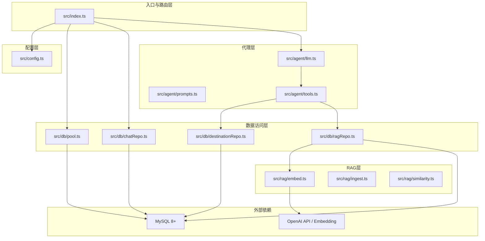
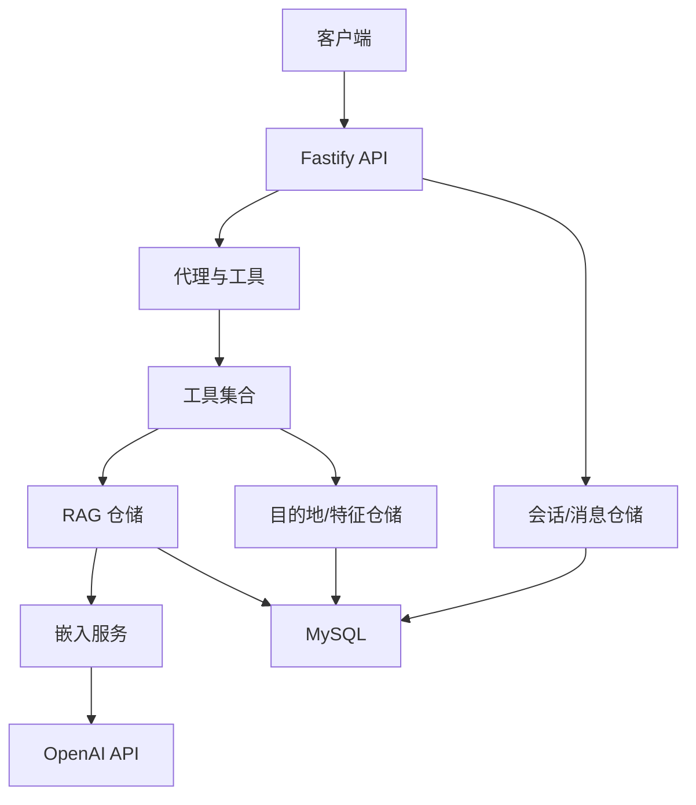
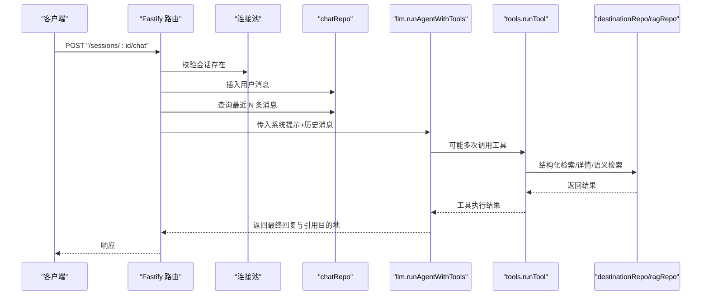
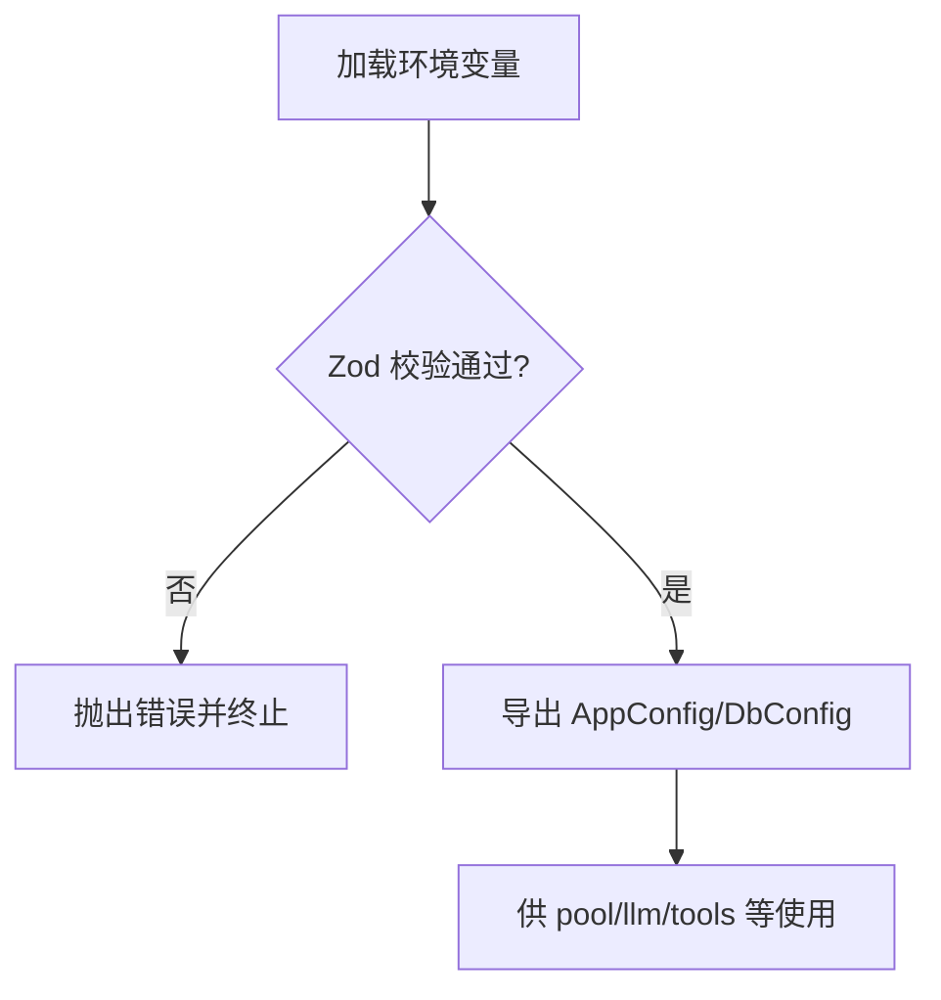
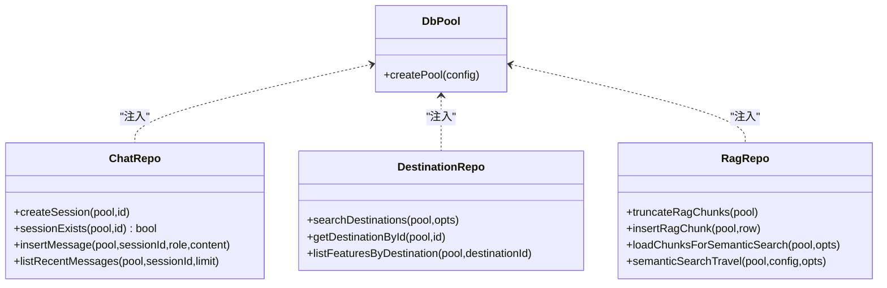
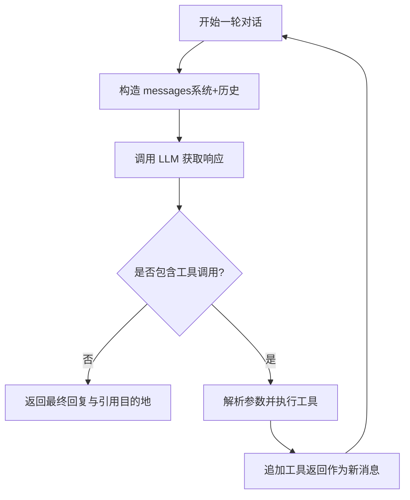
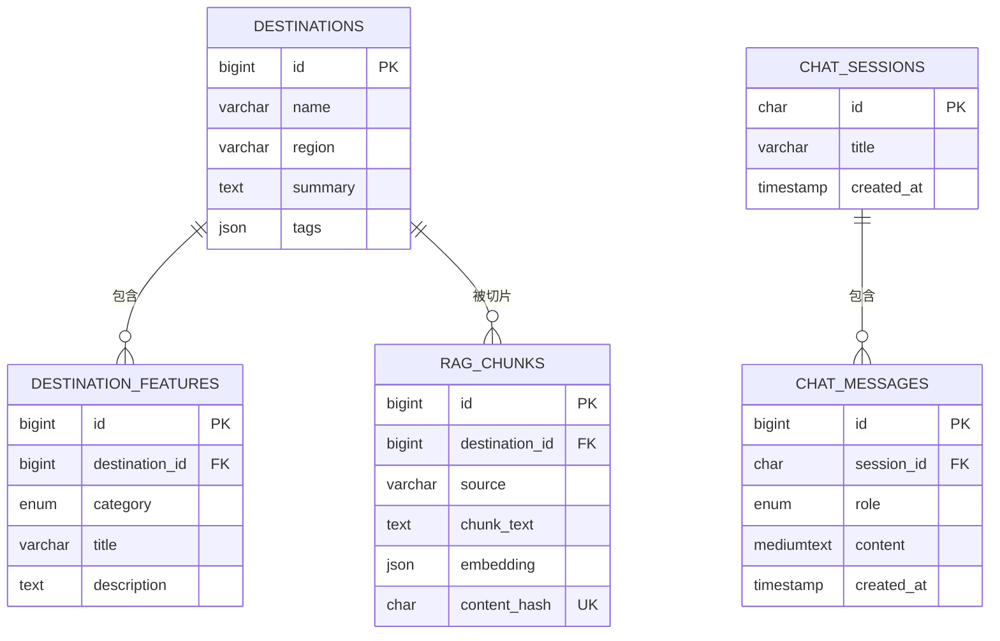
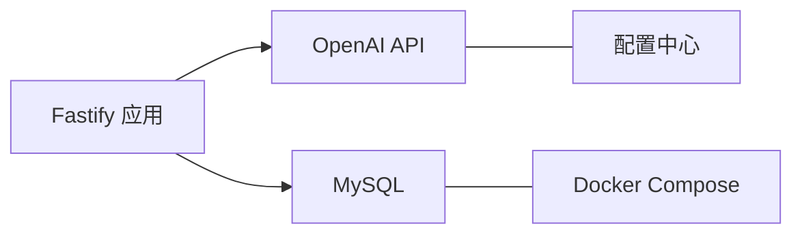
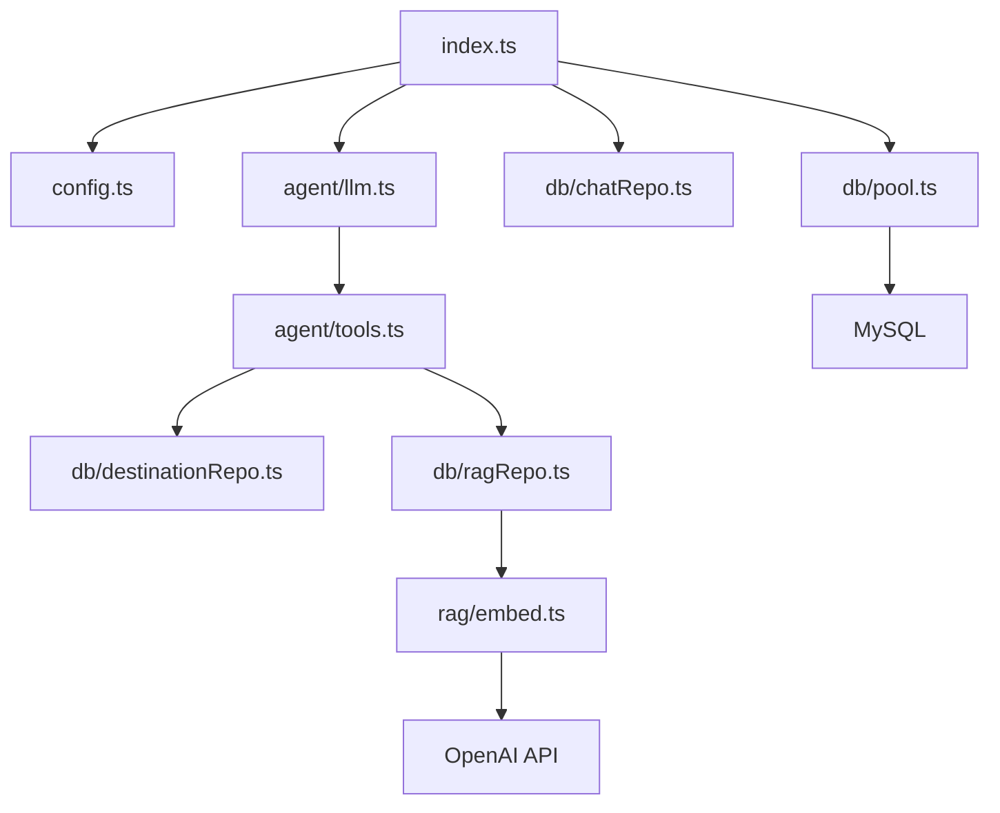

# 架构设计

<cite>
**本文引用的文件**
- [src/index.ts](file://src/index.ts)
- [src/config.ts](file://src/config.ts)
- [src/db/pool.ts](file://src/db/pool.ts)
- [src/db/chatRepo.ts](file://src/db/chatRepo.ts)
- [src/db/destinationRepo.ts](file://src/db/destinationRepo.ts)
- [src/db/ragRepo.ts](file://src/db/ragRepo.ts)
- [src/agent/llm.ts](file://src/agent/llm.ts)
- [src/agent/prompts.ts](file://src/agent/prompts.ts)
- [src/agent/tools.ts](file://src/agent/tools.ts)
- [src/rag/embed.ts](file://src/rag/embed.ts)
- [src/rag/ingest.ts](file://src/rag/ingest.ts)
- [src/rag/similarity.ts](file://src/rag/similarity.ts)
- [src/db/migrations/001_init.sql](file://src/db/migrations/001_init.sql)
- [package.json](file://package.json)
- [docker-compose.yml](file://docker-compose.yml)
</cite>

## 目录
1. [引言](#引言)
2. [项目结构](#项目结构)
3. [核心组件](#核心组件)
4. [架构总览](#架构总览)
5. [详细组件分析](#详细组件分析)
6. [依赖分析](#依赖分析)
7. [性能考虑](#性能考虑)
8. [故障排查指南](#故障排查指南)
9. [结论](#结论)
10. [附录](#附录)

## 引言
本项目为“Guide-Plan-Agent”旅行智能助手，采用分层架构与模块化组织，围绕 Fastify Web 服务、MySQL 数据库存储、OpenAI 与嵌入模型服务构建。系统通过工具化代理（Tool-use Agent）结合结构化检索（SQL）与向量检索（RAG），在对话中动态选择合适的知识来源，输出可引用的目的地信息。

## 项目结构
系统采用按功能域分层的模块化组织：
- 入口与路由层：Fastify 应用、健康检查、会话与聊天接口
- 配置层：环境变量校验与默认值加载
- 数据访问层：会话与消息、目的地与特征、RAG 向量块
- 代理层：LLM 调用、工具定义与执行、提示词
- RAG 层：文本切片、嵌入生成、相似度计算与检索

图表来源
- [src/index.ts:11-71](file://src/index.ts#L11-L71)
- [src/config.ts:35-41](file://src/config.ts#L35-L41)
- [src/db/pool.ts:4-14](file://src/db/pool.ts#L4-L14)
- [src/db/chatRepo.ts:6-52](file://src/db/chatRepo.ts#L6-L52)
- [src/db/destinationRepo.ts:20-100](file://src/db/destinationRepo.ts#L20-L100)
- [src/db/ragRepo.ts:97-142](file://src/db/ragRepo.ts#L97-L142)
- [src/agent/llm.ts:49-113](file://src/agent/llm.ts#L49-L113)
- [src/agent/prompts.ts:1-10](file://src/agent/prompts.ts#L1-L10)
- [src/agent/tools.ts:15-69](file://src/agent/tools.ts#L15-L69)
- [src/rag/embed.ts:7-37](file://src/rag/embed.ts#L7-L37)
- [src/rag/ingest.ts:30-76](file://src/rag/ingest.ts#L30-L76)
- [src/rag/similarity.ts:19-30](file://src/rag/similarity.ts#L19-L30)

章节来源
- [src/index.ts:11-71](file://src/index.ts#L11-L71)
- [package.json:18-24](file://package.json#L18-L24)

## 核心组件
- Fastify 应用与路由
  - 提供健康检查、会话创建、聊天对话接口
  - 使用 CORS 中间件支持跨域
- 配置管理
  - 使用 Zod 对环境变量进行强类型校验与默认值设置
  - 支持 OpenAI 与嵌入服务基础地址切换
- 数据库连接池
  - 基于 mysql2/promise 的连接池，默认连接数 10
  - 通过迁移脚本初始化核心表结构
- 代理与工具
  - 定义三个工具：结构化检索、语义检索、目的地详情
  - LLM 循环调用工具，最多轮次由配置控制
- RAG 管道
  - 文本切片与内容哈希去重
  - 嵌入生成与余弦相似度 Top-K 排序

章节来源
- [src/index.ts:18-68](file://src/index.ts#L18-L68)
- [src/config.ts:35-45](file://src/config.ts#L35-L45)
- [src/db/pool.ts:4-14](file://src/db/pool.ts#L4-L14)
- [src/agent/tools.ts:15-69](file://src/agent/tools.ts#L15-L69)
- [src/rag/ingest.ts:30-76](file://src/rag/ingest.ts#L30-L76)

## 架构总览
系统采用“Web 服务层 → 业务逻辑层 → 数据访问层”的三层结构，配合工具化代理与 RAG 检索，形成“结构化事实 + 语义片段”的双通道知识供给。

图表来源
- [src/index.ts:28-68](file://src/index.ts#L28-L68)
- [src/agent/llm.ts:49-113](file://src/agent/llm.ts#L49-L113)
- [src/agent/tools.ts:114-194](file://src/agent/tools.ts#L114-L194)
- [src/db/chatRepo.ts:6-52](file://src/db/chatRepo.ts#L6-L52)
- [src/db/destinationRepo.ts:20-100](file://src/db/destinationRepo.ts#L20-L100)
- [src/db/ragRepo.ts:97-142](file://src/db/ragRepo.ts#L97-L142)
- [src/rag/embed.ts:7-37](file://src/rag/embed.ts#L7-L37)

## 详细组件分析

### Fastify Web 服务与路由
- 健康检查：验证数据库连通性
- 会话管理：创建会话 UUID 并持久化
- 聊天流程：校验消息与会话存在性；拼接历史消息；调用代理；写入助手回复

图表来源
- [src/index.ts:35-68](file://src/index.ts#L35-L68)
- [src/db/chatRepo.ts:23-52](file://src/db/chatRepo.ts#L23-L52)
- [src/agent/llm.ts:49-113](file://src/agent/llm.ts#L49-L113)
- [src/agent/tools.ts:114-194](file://src/agent/tools.ts#L114-L194)
- [src/db/destinationRepo.ts:20-100](file://src/db/destinationRepo.ts#L20-L100)
- [src/db/ragRepo.ts:97-142](file://src/db/ragRepo.ts#L97-L142)

章节来源
- [src/index.ts:18-71](file://src/index.ts#L18-L71)

### 配置与环境管理
- 强类型校验：数据库与应用配置分离，确保运行时一致性
- 默认值覆盖：端口、模型、历史长度、RAG 参数等
- 嵌入服务地址：可与聊天 API 地址一致，便于统一代理

图表来源
- [src/config.ts:27-45](file://src/config.ts#L27-L45)

章节来源
- [src/config.ts:35-45](file://src/config.ts#L35-L45)

### 数据库连接池与仓储
- 连接池：默认连接数 10，等待连接启用
- 会话与消息：按时间倒序取最近 N 条，再正序返回，保证上下文顺序
- 目的地与特征：提供结构化检索、详情读取、分类聚合
- RAG 块：存储向量与内容哈希，支持去重与按目的地过滤

图表来源
- [src/db/pool.ts:4-14](file://src/db/pool.ts#L4-L14)
- [src/db/chatRepo.ts:6-52](file://src/db/chatRepo.ts#L6-L52)
- [src/db/destinationRepo.ts:20-100](file://src/db/destinationRepo.ts#L20-L100)
- [src/db/ragRepo.ts:25-142](file://src/db/ragRepo.ts#L25-L142)

章节来源
- [src/db/pool.ts:4-14](file://src/db/pool.ts#L4-L14)
- [src/db/chatRepo.ts:23-52](file://src/db/chatRepo.ts#L23-L52)
- [src/db/destinationRepo.ts:20-100](file://src/db/destinationRepo.ts#L20-L100)
- [src/db/ragRepo.ts:54-142](file://src/db/ragRepo.ts#L54-L142)

### 代理与工具：策略与工厂模式
- 工具定义（策略）：通过函数式定义描述工具签名与参数，形成可组合的策略集
- 工具执行（工厂）：根据名称解析参数并分派到具体实现，返回统一结果结构
- 代理循环：根据 LLM 返回的工具调用列表迭代执行，收集引用的目的地 ID

图表来源
- [src/agent/llm.ts:49-113](file://src/agent/llm.ts#L49-L113)
- [src/agent/tools.ts:67-113](file://src/agent/tools.ts#L67-L113)
- [src/agent/prompts.ts:1-10](file://src/agent/prompts.ts#L1-L10)

章节来源
- [src/agent/llm.ts:49-113](file://src/agent/llm.ts#L49-L113)
- [src/agent/tools.ts:15-69](file://src/agent/tools.ts#L15-L69)
- [src/agent/prompts.ts:1-10](file://src/agent/prompts.ts#L1-L10)

### RAG 管道：数据模型与处理流程
- 数据模型：目的地、特征、聊天会话与消息、RAG 块
- 处理流程：构建切片 → 去重 → 嵌入 → 相似度排序 → Top-K 返回

图表来源
- [src/db/migrations/001_init.sql:3-54](file://src/db/migrations/001_init.sql#L3-L54)

章节来源
- [src/db/migrations/001_init.sql:3-54](file://src/db/migrations/001_init.sql#L3-L54)

### 外部依赖集成
- OpenAI API：聊天补全与嵌入生成
- MySQL：结构化数据与向量块存储
- Docker Compose：本地快速启动 MySQL

图表来源
- [src/rag/embed.ts:12-23](file://src/rag/embed.ts#L12-L23)
- [src/db/pool.ts:4-14](file://src/db/pool.ts#L4-L14)
- [docker-compose.yml:1-16](file://docker-compose.yml#L1-L16)

章节来源
- [src/rag/embed.ts:7-37](file://src/rag/embed.ts#L7-L37)
- [docker-compose.yml:1-16](file://docker-compose.yml#L1-L16)

## 依赖分析
- 内聚性：按功能域划分清晰，路由、配置、仓储、代理、RAG 各自职责单一
- 耦合点：代理依赖工具集合；工具依赖仓储；RAG 依赖嵌入服务；所有仓储依赖连接池
- 外部依赖：Fastify、mysql2、zod、dotenv；开发期 tsx、typescript

图表来源
- [src/index.ts:5-9](file://src/index.ts#L5-L9)
- [src/agent/llm.ts:1-3](file://src/agent/llm.ts#L1-L3)
- [src/agent/tools.ts:1-8](file://src/agent/tools.ts#L1-L8)
- [src/db/pool.ts:1-2](file://src/db/pool.ts#L1-L2)
- [src/rag/embed.ts:1](file://src/rag/embed.ts#L1)

章节来源
- [package.json:18-24](file://package.json#L18-L24)

## 性能考虑
- 连接池大小：默认 10，适合中小规模并发；可根据 QPS 与慢查询调整
- 历史窗口：通过配置限制历史消息数量，降低上下文长度与 LLM 成本
- RAG 限制：候选集与 Top-K 可控，避免大规模向量扫描
- 嵌入与相似度：批量嵌入与 O(n) 相似度计算，建议在入库阶段完成向量化，运行时仅做 Top-K 排序
- 缓存策略：可在代理层对热点目的地详情与常用检索结果做缓存（建议）

## 故障排查指南
- 健康检查失败：检查数据库连通性与凭据；确认容器已就绪
- 会话不存在：确认会话 ID 正确且未过期
- LLM 工具超限：增大 LLM_MAX_TOOL_ROUNDS 或优化提示词减少不必要的工具调用
- 嵌入请求失败：核对 OpenAI API Key 与基础地址；检查网络可达性
- RAG 无结果：确认 RAG 块已构建且 content_hash 唯一；检查候选集与 Top-K 设置

章节来源
- [src/index.ts:18-26](file://src/index.ts#L18-L26)
- [src/index.ts:44-48](file://src/index.ts#L44-L48)
- [src/agent/llm.ts:112](file://src/agent/llm.ts#L112)
- [src/rag/embed.ts:25-27](file://src/rag/embed.ts#L25-L27)

## 结论
本系统以 Fastify 为入口，围绕配置驱动、仓储抽象与工具化代理，实现了“结构化事实 + 语义检索”的混合知识供给。通过合理的分层与模块化设计，具备良好的可维护性与扩展性。建议后续引入缓存、可观测性与更细粒度的错误处理与重试机制。

## 附录
- 系统边界
  - 内部：Fastify、配置、仓储、代理、RAG
  - 外部：OpenAI API、MySQL
- 设计模式
  - 工具策略：通过函数式定义与参数解析实现可插拔工具集
  - 工具工厂：按名称分派到具体实现，统一返回结构
  - 单例/全局：连接池在应用生命周期内复用，避免重复创建