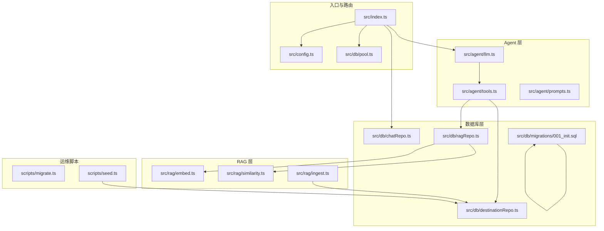
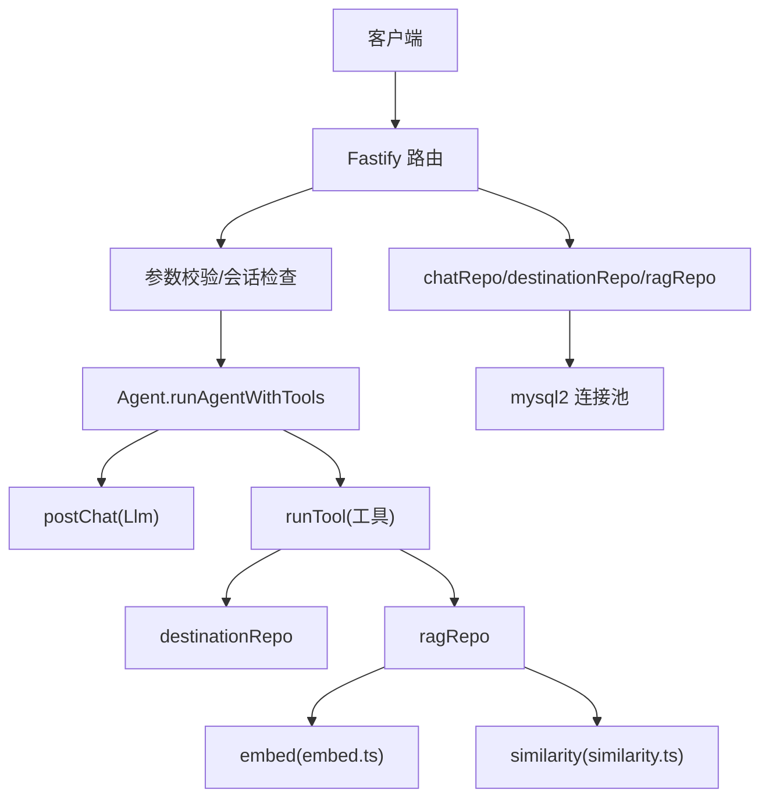
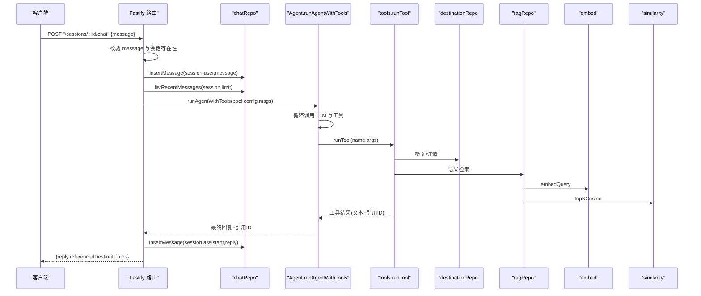
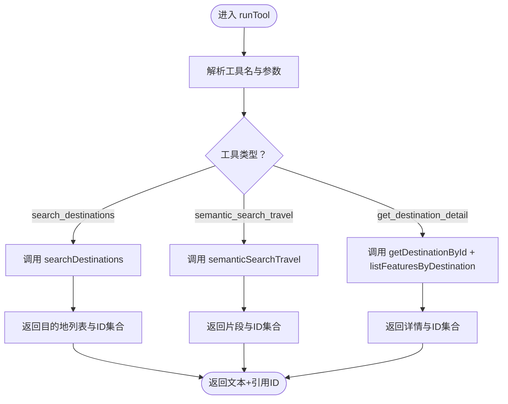
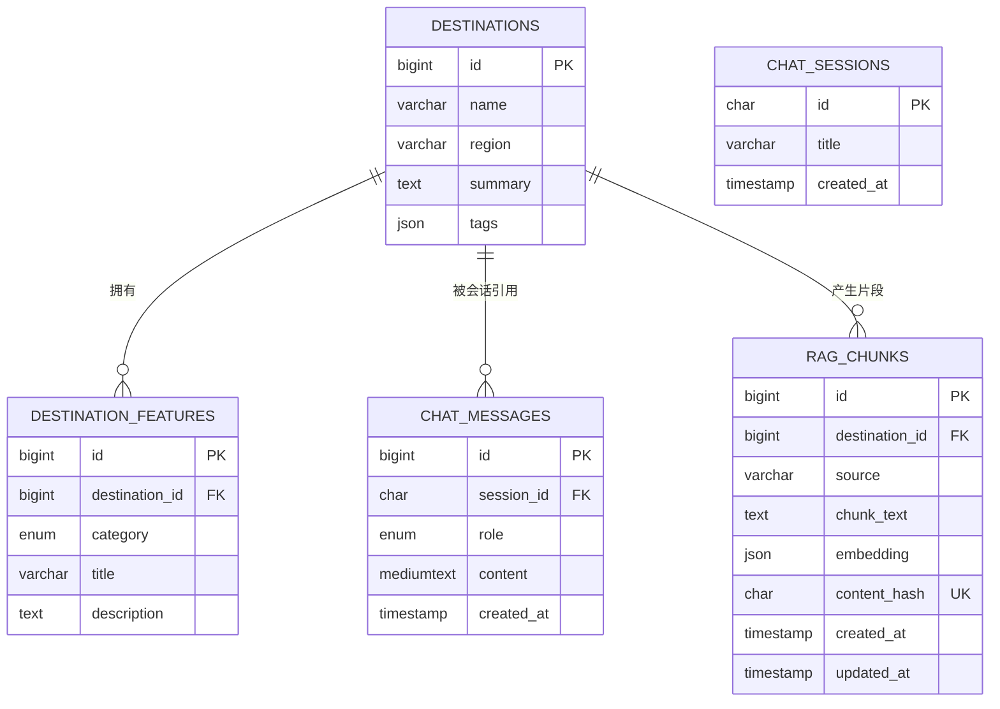
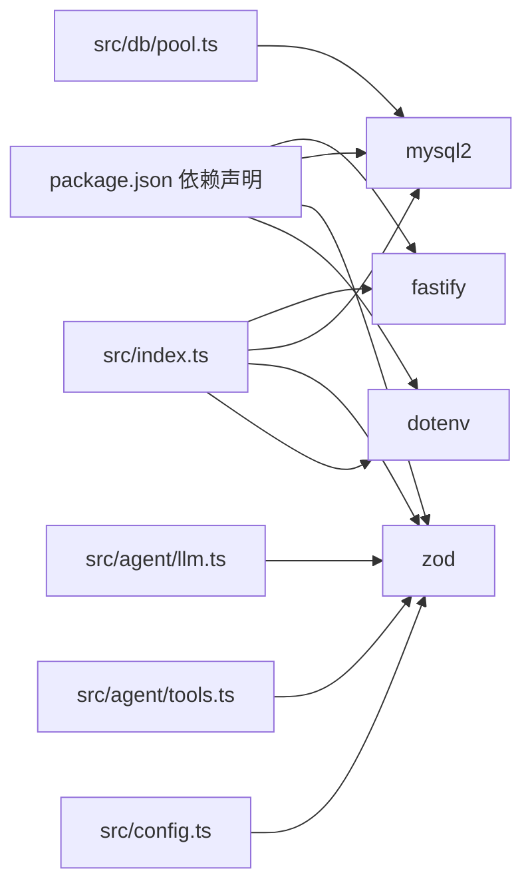

# 组件交互机制

<cite>
**本文引用的文件**
- [src/index.ts](file://src/index.ts)
- [src/config.ts](file://src/config.ts)
- [src/db/pool.ts](file://src/db/pool.ts)
- [src/db/chatRepo.ts](file://src/db/chatRepo.ts)
- [src/db/destinationRepo.ts](file://src/db/destinationRepo.ts)
- [src/db/ragRepo.ts](file://src/db/ragRepo.ts)
- [src/agent/llm.ts](file://src/agent/llm.ts)
- [src/agent/tools.ts](file://src/agent/tools.ts)
- [src/agent/prompts.ts](file://src/agent/prompts.ts)
- [src/rag/embed.ts](file://src/rag/embed.ts)
- [src/rag/similarity.ts](file://src/rag/similarity.ts)
- [src/rag/ingest.ts](file://src/rag/ingest.ts)
- [src/db/migrations/001_init.sql](file://src/db/migrations/001_init.sql)
- [scripts/migrate.ts](file://scripts/migrate.ts)
- [scripts/seed.ts](file://scripts/seed.ts)
- [package.json](file://package.json)
</cite>

## 目录
1. [引言](#引言)
2. [项目结构](#项目结构)
3. [核心组件](#核心组件)
4. [架构总览](#架构总览)
5. [详细组件分析](#详细组件分析)
6. [依赖关系分析](#依赖关系分析)
7. [性能考量](#性能考量)
8. [故障排查指南](#故障排查指南)
9. [结论](#结论)
10. [附录](#附录)

## 引言
本文件聚焦 Guide-Plan-Agent 的“组件交互机制”，系统性阐述路由处理器如何协调各模块完成端到端请求处理；深入 Agent 层与 DB 层的交互模式、数据访问与检索策略；说明依赖注入与配置传递方式；并提供典型请求的序列图与时序图，帮助开发者与运维人员快速理解系统的运行机理。

## 项目结构
项目采用按职责分层的组织方式：
- 路由与入口：Fastify 应用在入口文件中注册路由、加载配置与数据库连接池，对外暴露健康检查、会话创建与聊天接口。
- 配置层：集中定义环境变量校验与默认值，提供应用配置与数据库配置两类类型。
- 数据库层：包含连接池创建、会话与消息表操作、目的地与特征表操作、RAG 向量检索与嵌入。
- Agent 层：封装 LLM 调用、工具定义与执行、系统提示词。
- RAG 层：嵌入生成、相似度计算、数据清洗与向量化入库。
- 运维脚本：迁移与种子数据初始化。

图表来源
- [src/index.ts:1-77](file://src/index.ts#L1-L77)
- [src/config.ts:1-46](file://src/config.ts#L1-L46)
- [src/db/pool.ts:1-17](file://src/db/pool.ts#L1-L17)
- [src/db/chatRepo.ts:1-53](file://src/db/chatRepo.ts#L1-L53)
- [src/db/destinationRepo.ts:1-100](file://src/db/destinationRepo.ts#L1-L100)
- [src/db/ragRepo.ts:1-143](file://src/db/ragRepo.ts#L1-L143)
- [src/agent/llm.ts:1-114](file://src/agent/llm.ts#L1-L114)
- [src/agent/tools.ts:1-195](file://src/agent/tools.ts#L1-L195)
- [src/rag/embed.ts:1-38](file://src/rag/embed.ts#L1-L38)
- [src/rag/similarity.ts:1-31](file://src/rag/similarity.ts#L1-L31)
- [src/rag/ingest.ts:1-77](file://src/rag/ingest.ts#L1-L77)
- [src/db/migrations/001_init.sql:1-54](file://src/db/migrations/001_init.sql#L1-L54)
- [scripts/migrate.ts:1-34](file://scripts/migrate.ts#L1-L34)
- [scripts/seed.ts:1-89](file://scripts/seed.ts#L1-L89)

章节来源
- [src/index.ts:1-77](file://src/index.ts#L1-L77)
- [src/config.ts:1-46](file://src/config.ts#L1-L46)
- [src/db/pool.ts:1-17](file://src/db/pool.ts#L1-L17)
- [src/db/chatRepo.ts:1-53](file://src/db/chatRepo.ts#L1-L53)
- [src/db/destinationRepo.ts:1-100](file://src/db/destinationRepo.ts#L1-L100)
- [src/db/ragRepo.ts:1-143](file://src/db/ragRepo.ts#L1-L143)
- [src/agent/llm.ts:1-114](file://src/agent/llm.ts#L1-L114)
- [src/agent/tools.ts:1-195](file://src/agent/tools.ts#L1-L195)
- [src/rag/embed.ts:1-38](file://src/rag/embed.ts#L1-L38)
- [src/rag/similarity.ts:1-31](file://src/rag/similarity.ts#L1-L31)
- [src/rag/ingest.ts:1-77](file://src/rag/ingest.ts#L1-L77)
- [src/db/migrations/001_init.sql:1-54](file://src/db/migrations/001_init.sql#L1-L54)
- [scripts/migrate.ts:1-34](file://scripts/migrate.ts#L1-L34)
- [scripts/seed.ts:1-89](file://scripts/seed.ts#L1-L89)

## 核心组件
- 路由与入口（Fastify）
  - 提供健康检查、会话创建、聊天对话三个端点。
  - 负责请求参数校验、会话存在性检查、消息持久化与响应组装。
- 配置管理
  - 使用 Zod 对环境变量进行强类型校验与默认值设置，输出应用配置与数据库配置对象。
- 数据库层
  - 连接池：统一创建与复用数据库连接。
  - 会话与消息：维护会话生命周期与消息历史。
  - 目的地与特征：提供结构化检索、详情读取与分类聚合。
  - RAG：向量检索、候选集加载、嵌入写入与去重。
- Agent 层
  - LLM 调用：封装 OpenAI 风格的 chat/completions 接口，支持工具调用循环。
  - 工具集合：提供结构化检索、语义检索、详情读取三类工具。
  - 系统提示词：约束 Agent 的行为与事实来源优先级。
- RAG 层
  - 嵌入：调用外部 Embedding 服务生成向量。
  - 相似度：余弦相似度与 Top-K 选择。
  - 入库：构建文本块、生成内容哈希、批量写入向量库。

章节来源
- [src/index.ts:18-68](file://src/index.ts#L18-L68)
- [src/config.ts:27-41](file://src/config.ts#L27-L41)
- [src/db/pool.ts:4-14](file://src/db/pool.ts#L4-L14)
- [src/db/chatRepo.ts:6-52](file://src/db/chatRepo.ts#L6-L52)
- [src/db/destinationRepo.ts:20-84](file://src/db/destinationRepo.ts#L20-L84)
- [src/db/ragRepo.ts:97-142](file://src/db/ragRepo.ts#L97-L142)
- [src/agent/llm.ts:49-113](file://src/agent/llm.ts#L49-L113)
- [src/agent/tools.ts:15-69](file://src/agent/tools.ts#L15-L69)
- [src/rag/embed.ts:7-32](file://src/rag/embed.ts#L7-L32)
- [src/rag/similarity.ts:19-30](file://src/rag/similarity.ts#L19-L30)
- [src/rag/ingest.ts:30-76](file://src/rag/ingest.ts#L30-L76)

## 架构总览
系统采用“路由层 → Agent 层 → DB/RAG 层”的分层交互模式。路由层负责输入校验与状态检查，Agent 层负责与 LLM 协作与工具调度，DB/RAG 层负责数据与向量检索。配置通过环境变量集中加载，数据库连接池贯穿全链路。

图表来源
- [src/index.ts:35-67](file://src/index.ts#L35-L67)
- [src/agent/llm.ts:49-113](file://src/agent/llm.ts#L49-L113)
- [src/agent/tools.ts:114-194](file://src/agent/tools.ts#L114-L194)
- [src/db/chatRepo.ts:6-52](file://src/db/chatRepo.ts#L6-L52)
- [src/db/destinationRepo.ts:20-84](file://src/db/destinationRepo.ts#L20-L84)
- [src/db/ragRepo.ts:97-142](file://src/db/ragRepo.ts#L97-L142)
- [src/rag/embed.ts:7-32](file://src/rag/embed.ts#L7-L32)
- [src/rag/similarity.ts:19-30](file://src/rag/similarity.ts#L19-L30)
- [src/db/pool.ts:4-14](file://src/db/pool.ts#L4-L14)

## 详细组件分析

### 路由处理器与请求编排
- 健康检查：连接池执行简单查询，返回数据库连通性。
- 会话创建：生成 UUID 并插入会话表，返回 sessionId。
- 聊天接口：校验 message 参数与会话存在性；插入用户消息；拉取最近历史；拼装系统提示词与历史消息；调用 Agent；插入助手回复；返回内容与引用的目的地 ID 列表。

图表来源
- [src/index.ts:35-67](file://src/index.ts#L35-L67)
- [src/db/chatRepo.ts:42-52](file://src/db/chatRepo.ts#L42-L52)
- [src/db/chatRepo.ts:23-40](file://src/db/chatRepo.ts#L23-L40)
- [src/agent/llm.ts:49-113](file://src/agent/llm.ts#L49-L113)
- [src/agent/tools.ts:114-194](file://src/agent/tools.ts#L114-L194)
- [src/db/destinationRepo.ts:20-84](file://src/db/destinationRepo.ts#L20-L84)
- [src/db/ragRepo.ts:97-142](file://src/db/ragRepo.ts#L97-L142)
- [src/rag/embed.ts:34-37](file://src/rag/embed.ts#L34-L37)
- [src/rag/similarity.ts:19-30](file://src/rag/similarity.ts#L19-L30)

章节来源
- [src/index.ts:18-68](file://src/index.ts#L18-L68)
- [src/db/chatRepo.ts:6-52](file://src/db/chatRepo.ts#L6-L52)

### Agent 层与 DB/RAG 的交互模式
- 工具定义与执行
  - 定义三类工具：结构化检索、语义检索、详情读取。
  - 解析工具参数，限制范围与默认值，调用对应仓库方法。
- 数据访问模式
  - 目的地检索：支持关键词与区域过滤，限制返回数量。
  - 详情读取：先查目的地，再按目的地聚合美食/美景/文化条目。
  - RAG 语义检索：可选按区域预筛选，生成查询向量，加载候选，计算余弦相似度，返回 Top-K。
- 事务与并发
  - 仓库方法均为单 SQL 查询或插入，未显式开启事务。
  - 连接池默认并发连接数为 10，工具调用在 Node 线程内顺序执行，避免锁竞争。

图表来源
- [src/agent/tools.ts:79-112](file://src/agent/tools.ts#L79-L112)
- [src/agent/tools.ts:114-194](file://src/agent/tools.ts#L114-L194)
- [src/db/destinationRepo.ts:20-84](file://src/db/destinationRepo.ts#L20-L84)
- [src/db/ragRepo.ts:97-142](file://src/db/ragRepo.ts#L97-L142)

章节来源
- [src/agent/tools.ts:15-69](file://src/agent/tools.ts#L15-L69)
- [src/agent/tools.ts:114-194](file://src/agent/tools.ts#L114-L194)
- [src/db/destinationRepo.ts:20-84](file://src/db/destinationRepo.ts#L20-L84)
- [src/db/ragRepo.ts:97-142](file://src/db/ragRepo.ts#L97-L142)

### 数据模型与依赖注入
- 依赖注入与配置传递
  - 入口函数创建配置与连接池，随后注入到路由、Agent、仓库与 RAG 模块。
  - 配置对象包含端口、LLM 地址、模型、嵌入模型、历史长度、RAG 参数与最大工具轮次。
- 数据模型
  - 目的地、特征、会话、消息、RAG 片段等表结构清晰，具备外键与索引，满足检索与一致性需求。

图表来源
- [src/db/migrations/001_init.sql:3-53](file://src/db/migrations/001_init.sql#L3-L53)

章节来源
- [src/index.ts:11-14](file://src/index.ts#L11-L14)
- [src/config.ts:35-41](file://src/config.ts#L35-L41)
- [src/db/pool.ts:4-14](file://src/db/pool.ts#L4-L14)
- [src/db/migrations/001_init.sql:3-53](file://src/db/migrations/001_init.sql#L3-L53)

## 依赖关系分析
- 组件耦合
  - 路由层仅依赖配置与仓库接口，耦合度低。
  - Agent 层通过工具接口与仓库解耦，便于替换 LLM 或扩展工具。
- 外部依赖
  - Fastify、mysql2、zod、dotenv。
- 运维脚本
  - 迁移脚本负责创建数据库与表结构。
  - 种子脚本负责初始化示例数据。

图表来源
- [package.json:18-30](file://package.json#L18-L30)
- [src/index.ts:1-10](file://src/index.ts#L1-L10)
- [src/agent/llm.ts:1](file://src/agent/llm.ts#L1)
- [src/agent/tools.ts:1](file://src/agent/tools.ts#L1)
- [src/config.ts:1](file://src/config.ts#L1)
- [src/db/pool.ts:1](file://src/db/pool.ts#L1)

章节来源
- [package.json:18-30](file://package.json#L18-L30)
- [src/index.ts:1-10](file://src/index.ts#L1-L10)

## 性能考量
- 连接池与并发
  - 默认连接上限为 10，适用于中小规模并发；如需更高吞吐，可调整连接池参数。
- 查询优化
  - 目的地检索支持区域过滤与 LIMIT 控制，避免全表扫描。
  - RAG 加载候选集时可按目的地 ID 过滤，减少向量计算量。
- LLM 调用
  - 工具调用循环受最大轮次限制，防止无限循环。
  - 温度与工具选择参数可平衡创造性与稳定性。
- 向量检索
  - 余弦相似度计算为 O(N·D)，Top-K 选择排序为 O(N log N)，建议合理设置候选数量与 Top-K。

## 故障排查指南
- 健康检查失败
  - 现象：/health 返回 DB 不可用。
  - 排查：确认数据库地址、端口、账号密码与数据库名正确；检查网络连通性。
- 会话不存在
  - 现象：聊天接口返回会话未找到。
  - 排查：确认会话 ID 是否有效；检查会话创建接口是否成功。
- 请求参数缺失
  - 现象：聊天接口返回缺少 message。
  - 排查：确保请求体包含非空 message 字段。
- LLM 调用异常
  - 现象：工具调用抛出错误或超时。
  - 排查：检查 OPENAI_BASE_URL、OPENAI_API_KEY、模型名称；确认网络可达。
- 工具执行异常
  - 现象：工具返回错误文本或引用 ID 为空。
  - 排查：核对工具参数格式与范围；检查数据库中是否存在目标记录。
- RAG 检索无结果
  - 现象：语义检索返回空。
  - 排查：确认 RAG 向量库已建立；检查候选数量与 Top-K 设置；确认嵌入模型一致。

章节来源
- [src/index.ts:18-26](file://src/index.ts#L18-L26)
- [src/index.ts:40-48](file://src/index.ts#L40-L48)
- [src/agent/llm.ts:95-101](file://src/agent/llm.ts#L95-L101)
- [src/db/ragRepo.ts:118-121](file://src/db/ragRepo.ts#L118-L121)

## 结论
本系统通过清晰的分层设计与严格的配置校验，实现了从路由到 Agent 再到 DB/RAG 的稳定交互。工具驱动的数据访问与 LLM 协作，使系统能够灵活应对不同类型的旅行咨询场景。建议在生产环境中进一步完善日志与监控、限流与熔断策略，并根据业务增长调整连接池与候选集规模。

## 附录
- 运维命令
  - 迁移：npm run migrate
  - 初始化数据：npm run seed
  - 启动服务：npm run dev
- 关键路径参考
  - 入口与路由：[src/index.ts:11-71](file://src/index.ts#L11-L71)
  - 配置加载：[src/config.ts:35-41](file://src/config.ts#L35-L41)
  - 连接池创建：[src/db/pool.ts:4-14](file://src/db/pool.ts#L4-L14)
  - 会话与消息：[src/db/chatRepo.ts:6-52](file://src/db/chatRepo.ts#L6-L52)
  - 目的地检索与详情：[src/db/destinationRepo.ts:20-84](file://src/db/destinationRepo.ts#L20-L84)
  - RAG 语义检索：[src/db/ragRepo.ts:97-142](file://src/db/ragRepo.ts#L97-L142)
  - Agent 工具执行：[src/agent/tools.ts:114-194](file://src/agent/tools.ts#L114-L194)
  - LLM 调用循环：[src/agent/llm.ts:49-113](file://src/agent/llm.ts#L49-L113)
  - 嵌入与相似度：[src/rag/embed.ts:7-32](file://src/rag/embed.ts#L7-L32)、[src/rag/similarity.ts:19-30](file://src/rag/similarity.ts#L19-L30)
  - 表结构定义：[src/db/migrations/001_init.sql:3-53](file://src/db/migrations/001_init.sql#L3-L53)
  - 迁移脚本：[scripts/migrate.ts:10-28](file://scripts/migrate.ts#L10-L28)
  - 种子脚本：[scripts/seed.ts:5-82](file://scripts/seed.ts#L5-L82)