# 设计模式应用

<cite>
**本文档引用的文件**
- [src/agent/tools.ts](file://src/agent/tools.ts)
- [src/db/pool.ts](file://src/db/pool.ts)
- [src/agent/llm.ts](file://src/agent/llm.ts)
- [src/db/destinationRepo.ts](file://src/db/destinationRepo.ts)
- [src/db/ragRepo.ts](file://src/db/ragRepo.ts)
- [src/config.ts](file://src/config.ts)
- [src/index.ts](file://src/index.ts)
- [src/db/chatRepo.ts](file://src/db/chatRepo.ts)
- [src/rag/embed.ts](file://src/rag/embed.ts)
- [src/rag/similarity.ts](file://src/rag/similarity.ts)
</cite>

## 目录
1. [引言](#引言)
2. [项目结构](#项目结构)
3. [核心设计模式](#核心设计模式)
4. [架构概览](#架构概览)
5. [详细组件分析](#详细组件分析)
6. [依赖关系分析](#依赖关系分析)
7. [性能考虑](#性能考虑)
8. [故障排除指南](#故障排除指南)
9. [结论](#结论)

## 引言

Guide-Plan-Agent 是一个基于人工智能的旅行规划助手系统，该项目展示了多种设计模式的实际应用。本文档深入分析了项目中使用的三种核心设计模式：工厂模式、单例模式和策略模式，并详细说明它们在工具系统、数据库连接池和可插拔工具函数中的具体实现。

该系统通过精心设计的架构实现了高度的灵活性、可扩展性和可维护性，为开发者提供了优秀的代码组织范例。

## 项目结构

项目采用模块化的分层架构，主要分为以下几个核心层次：

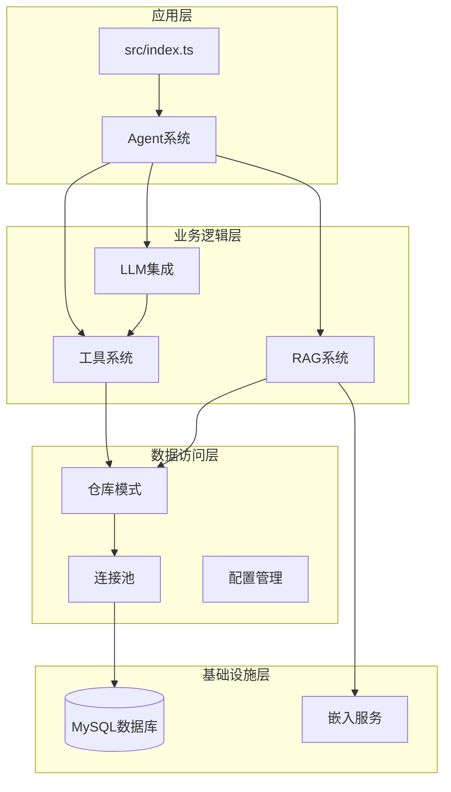

**图表来源**
- [src/index.ts:1-77](file://src/index.ts#L1-L77)
- [src/agent/llm.ts:1-114](file://src/agent/llm.ts#L1-L114)
- [src/agent/tools.ts:1-195](file://src/agent/tools.ts#L1-L195)

**章节来源**
- [src/index.ts:1-77](file://src/index.ts#L1-L77)
- [src/config.ts:1-46](file://src/config.ts#L1-L46)

## 核心设计模式

### 工厂模式在工具系统中的应用

项目中的工具系统是工厂模式的最佳实践案例。工具定义和创建通过统一的工厂函数进行管理，实现了松耦合的设计。

#### 工具定义工厂

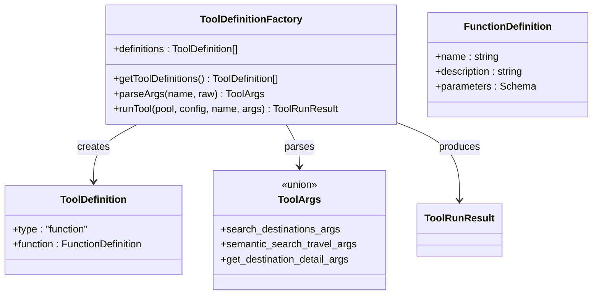

**图表来源**
- [src/agent/tools.ts:15-69](file://src/agent/tools.ts#L15-L69)
- [src/agent/tools.ts:71-112](file://src/agent/tools.ts#L71-L112)

#### 工具执行策略

工具执行采用了策略模式的变体，通过条件判断实现不同的执行策略：

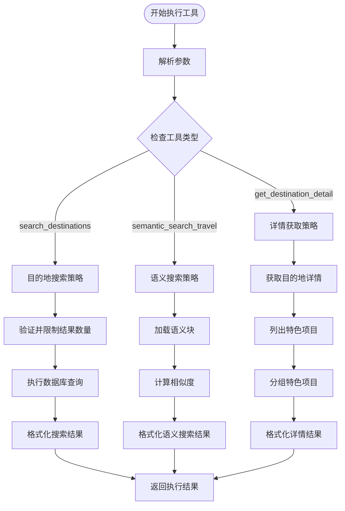

**图表来源**
- [src/agent/tools.ts:114-194](file://src/agent/tools.ts#L114-L194)

**章节来源**
- [src/agent/tools.ts:15-69](file://src/agent/tools.ts#L15-L69)
- [src/agent/tools.ts:71-112](file://src/agent/tools.ts#L71-L112)
- [src/agent/tools.ts:114-194](file://src/agent/tools.ts#L114-L194)

### 单例模式在数据库连接池中的实现

虽然项目中没有显式的单例类实现，但连接池的创建和使用体现了单例模式的核心思想——确保系统中只有一个数据库连接池实例。

#### 连接池工厂

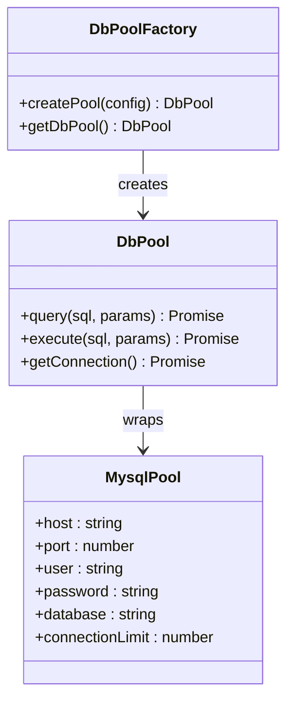

**图表来源**
- [src/db/pool.ts:4-16](file://src/db/pool.ts#L4-L16)

#### 连接池使用模式

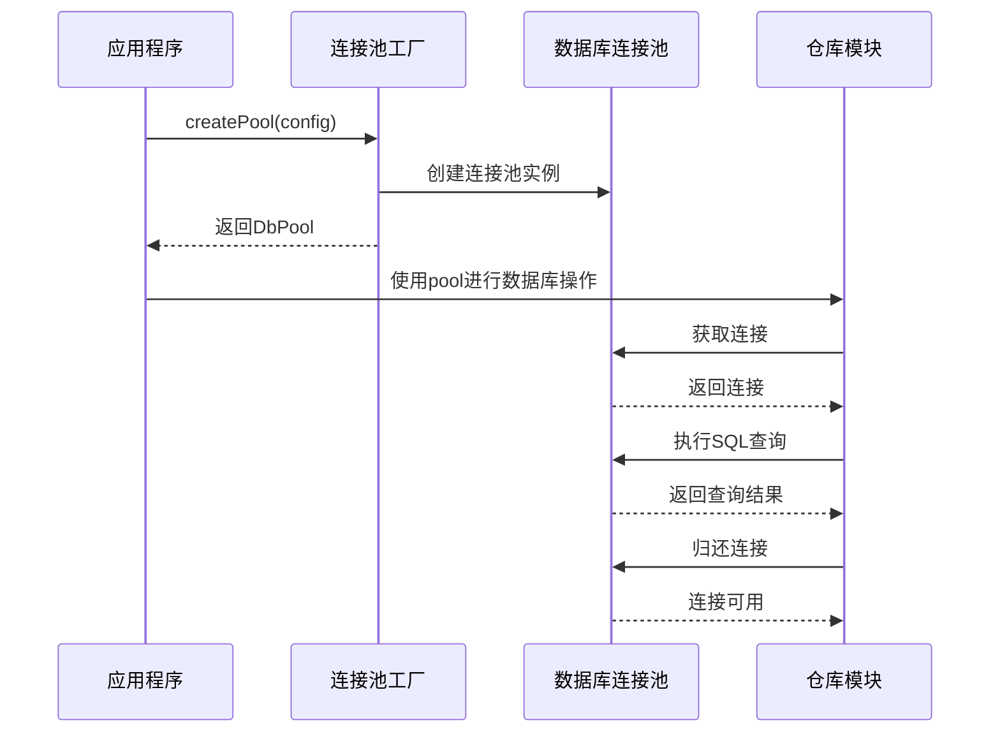

**图表来源**
- [src/db/pool.ts:4-16](file://src/db/pool.ts#L4-L16)
- [src/index.ts:11-13](file://src/index.ts#L11-L13)

**章节来源**
- [src/db/pool.ts:4-16](file://src/db/pool.ts#L4-L16)
- [src/index.ts:11-13](file://src/index.ts#L11-L13)

### 策略模式在可插拔工具函数中的运用

工具系统的策略模式体现在对不同工具类型的动态分发机制上。每个工具都实现了相同的接口契约，但具有不同的执行逻辑。

#### 工具策略接口

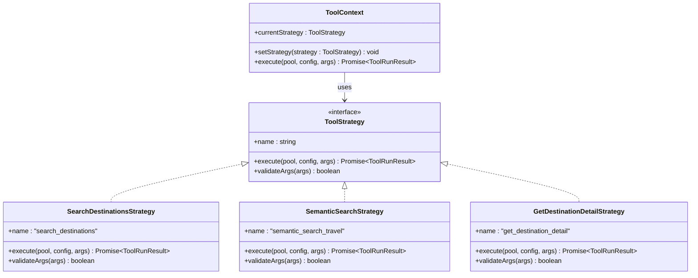

**图表来源**
- [src/agent/tools.ts:114-194](file://src/agent/tools.ts#L114-L194)

**章节来源**
- [src/agent/tools.ts:114-194](file://src/agent/tools.ts#L114-L194)

## 架构概览

系统采用事件驱动的架构模式，结合工具调用循环实现了智能代理功能：

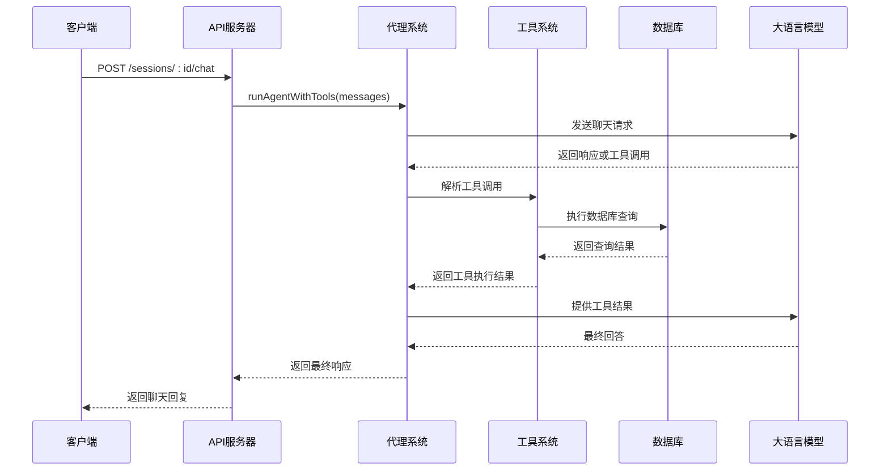

**图表来源**
- [src/agent/llm.ts:49-113](file://src/agent/llm.ts#L49-L113)
- [src/agent/tools.ts:114-194](file://src/agent/tools.ts#L114-L194)

**章节来源**
- [src/agent/llm.ts:49-113](file://src/agent/llm.ts#L49-L113)
- [src/index.ts:35-68](file://src/index.ts#L35-L68)

## 详细组件分析

### 工具系统组件分析

工具系统是整个代理的核心组件，负责处理各种旅行相关的查询和操作。

#### 工具定义结构

| 工具名称 | 功能描述 | 参数类型 | 返回值 |
|---------|----------|----------|--------|
| search_destinations | 结构化目的地搜索 | query, region, limit | 目的地列表 |
| semantic_search_travel | 语义化旅行知识检索 | query, top_k, region | 检索结果片段 |
| get_destination_detail | 获取目的地详细信息 | destination_id | 目的地详情和特色 |

#### 工具执行流程

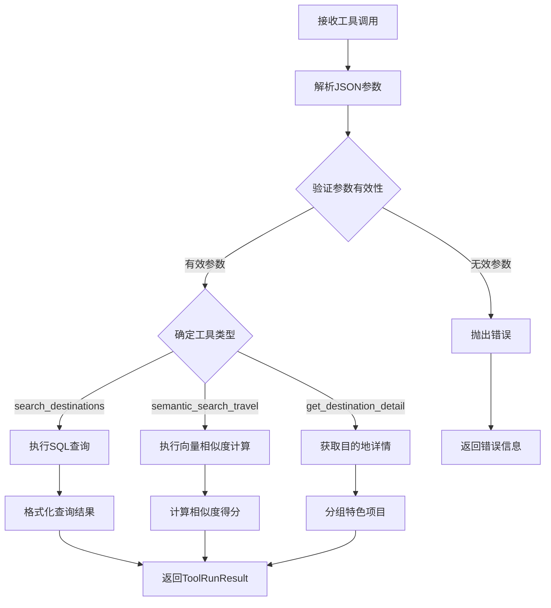

**图表来源**
- [src/agent/tools.ts:79-112](file://src/agent/tools.ts#L79-L112)
- [src/agent/tools.ts:114-194](file://src/agent/tools.ts#L114-L194)

**章节来源**
- [src/agent/tools.ts:15-69](file://src/agent/tools.ts#L15-L69)
- [src/agent/tools.ts:79-112](file://src/agent/tools.ts#L79-L112)
- [src/agent/tools.ts:114-194](file://src/agent/tools.ts#L114-L194)

### 数据库连接池组件分析

连接池是系统性能的关键组件，通过复用数据库连接来提高系统效率。

#### 连接池配置

| 配置项 | 默认值 | 作用 |
|--------|--------|------|
| connectionLimit | 10 | 最大连接数 |
| waitForConnections | true | 等待可用连接 |
| host | 127.0.0.1 | 数据库主机地址 |
| port | 3306 | 数据库端口 |
| user | root | 用户名 |
| password | 空字符串 | 密码 |
| database | guide_plan | 数据库名 |

#### 连接池生命周期

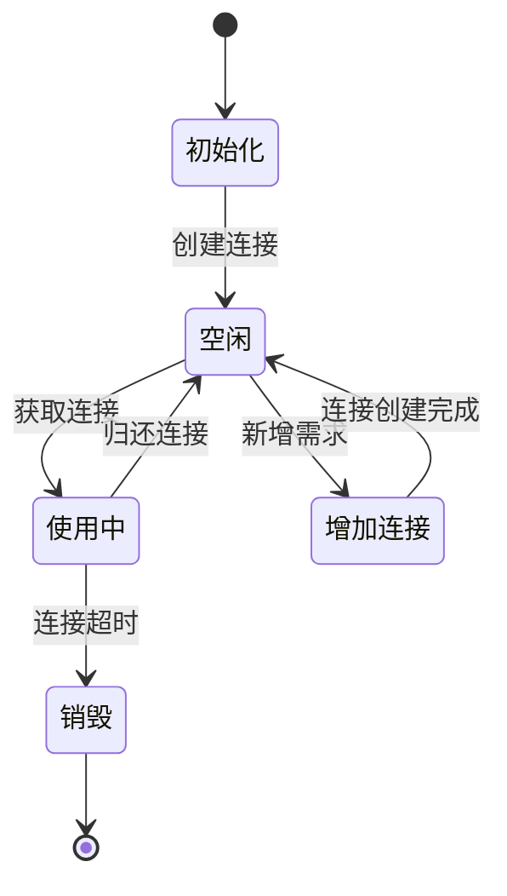

**图表来源**
- [src/db/pool.ts:4-16](file://src/db/pool.ts#L4-L16)

**章节来源**
- [src/db/pool.ts:4-16](file://src/db/pool.ts#L4-L16)

### RAG系统组件分析

RAG（Retrieval-Augmented Generation）系统结合了向量检索和语义搜索功能。

#### 向量嵌入流程

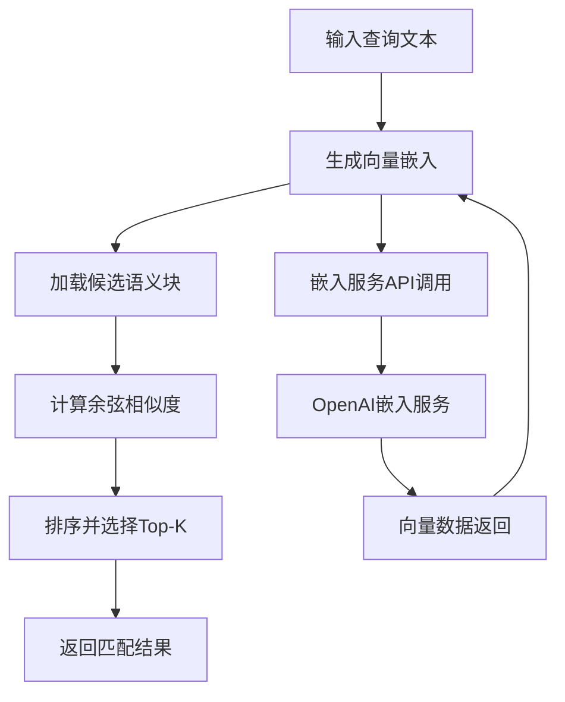

**图表来源**
- [src/db/ragRepo.ts:97-142](file://src/db/ragRepo.ts#L97-L142)
- [src/rag/embed.ts:34-37](file://src/rag/embed.ts#L34-L37)

**章节来源**
- [src/db/ragRepo.ts:97-142](file://src/db/ragRepo.ts#L97-L142)
- [src/rag/embed.ts:34-37](file://src/rag/embed.ts#L34-L37)

## 依赖关系分析

系统采用清晰的依赖层次结构，确保模块间的松耦合：

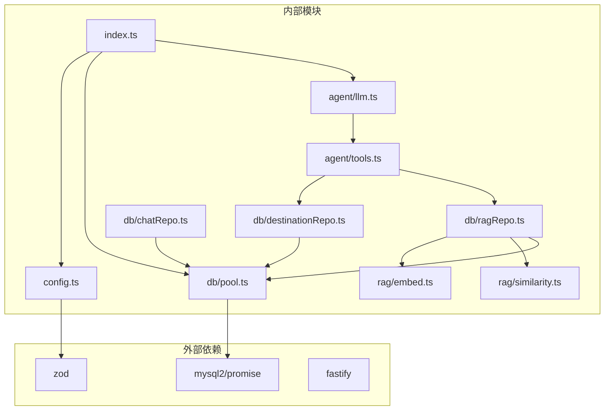

**图表来源**
- [src/index.ts:1-77](file://src/index.ts#L1-L77)
- [src/agent/llm.ts:1-4](file://src/agent/llm.ts#L1-L4)
- [src/agent/tools.ts:1-8](file://src/agent/tools.ts#L1-L8)

**章节来源**
- [src/index.ts:1-77](file://src/index.ts#L1-L77)
- [src/agent/llm.ts:1-4](file://src/agent/llm.ts#L1-L4)
- [src/agent/tools.ts:1-8](file://src/agent/tools.ts#L1-L8)

## 性能考虑

### 连接池优化

- **连接复用**：通过连接池复用数据库连接，减少连接建立开销
- **并发控制**：限制最大连接数防止数据库过载
- **等待机制**：当无可用连接时自动等待，避免系统崩溃

### 查询优化

- **参数验证**：在工具执行前验证参数，减少无效查询
- **结果限制**：对搜索结果设置合理上限，控制内存使用
- **索引利用**：数据库查询使用适当的索引策略

### 缓存策略

- **会话缓存**：聊天历史按需加载，避免全量缓存
- **向量缓存**：嵌入向量可复用，减少重复计算

## 故障排除指南

### 常见问题及解决方案

| 问题类型 | 症状 | 可能原因 | 解决方案 |
|----------|------|----------|----------|
| 工具执行失败 | 抛出unknown tool错误 | 工具名称不匹配 | 检查工具定义和调用名称 |
| 数据库连接失败 | 连接池无法创建 | 配置错误或网络问题 | 验证数据库配置和网络连通性 |
| 参数验证失败 | 抛出invalid destination_id | 参数类型错误 | 确保destination_id为有效数字 |
| 超时错误 | 请求超时 | 网络延迟或服务不可用 | 检查服务状态和网络连接 |

### 调试技巧

1. **启用详细日志**：在开发环境中启用详细的错误信息
2. **参数验证**：在工具执行前添加参数验证
3. **连接监控**：监控连接池使用情况
4. **性能分析**：定期分析查询性能和工具执行时间

**章节来源**
- [src/agent/tools.ts:102-111](file://src/agent/tools.ts#L102-L111)
- [src/agent/llm.ts:95-101](file://src/agent/llm.ts#L95-L101)

## 结论

Guide-Plan-Agent项目成功地将多种设计模式应用于实际的AI代理系统中，展现了以下优势：

### 设计模式的价值体现

1. **工厂模式**：通过统一的工具工厂实现了工具的标准化管理和动态扩展
2. **单例模式**：连接池的单例实现确保了资源的有效管理和复用
3. **策略模式**：工具执行策略的灵活切换支持了系统的可扩展性

### 架构优势

- **高内聚低耦合**：各模块职责明确，依赖关系清晰
- **可扩展性**：新的工具和功能可以轻松添加
- **可维护性**：模块化设计便于代码维护和测试
- **性能优化**：连接池和查询优化提升了系统整体性能

### 最佳实践总结

1. **设计模式选择**：根据具体场景选择合适的设计模式
2. **接口一致性**：保持工具接口的一致性，便于扩展
3. **错误处理**：完善的错误处理机制提升系统稳定性
4. **配置管理**：集中化的配置管理便于部署和维护

该系统为构建复杂的AI代理应用提供了优秀的参考模板，展示了如何通过精心设计的架构实现高质量的软件系统。