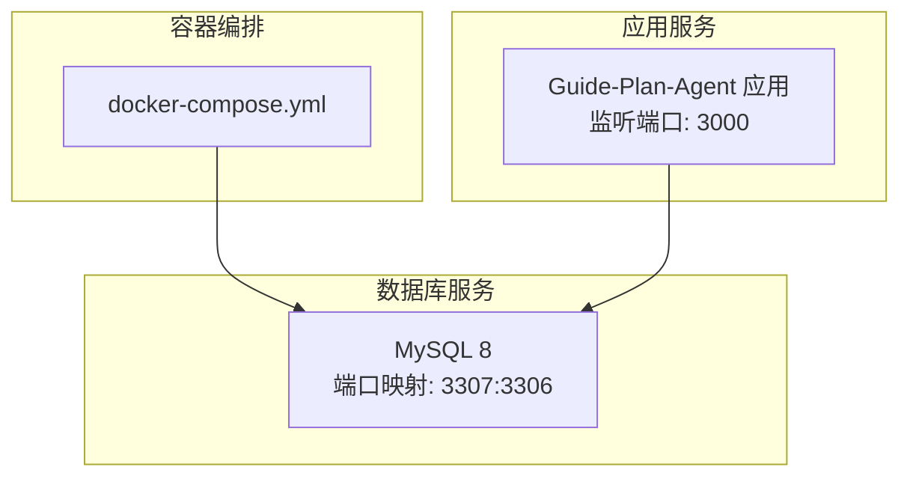
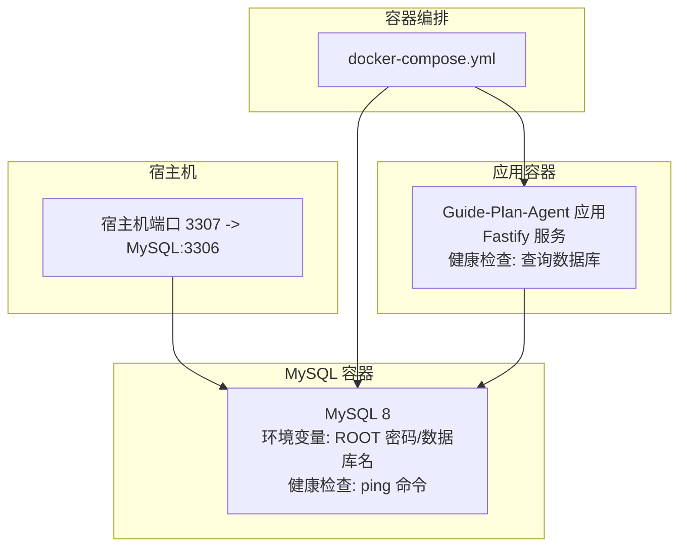
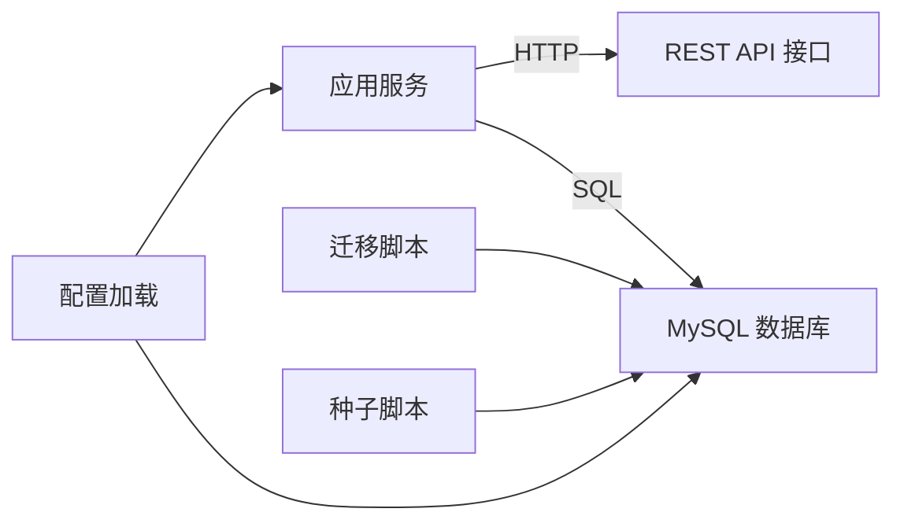

# 容器化部署

<cite>
**本文引用的文件**
- [docker-compose.yml](file://docker-compose.yml)
- [package.json](file://package.json)
- [src/config.ts](file://src/config.ts)
- [src/db/pool.ts](file://src/db/pool.ts)
- [src/index.ts](file://src/index.ts)
- [scripts/migrate.ts](file://scripts/migrate.ts)
- [scripts/seed.ts](file://scripts/seed.ts)
- [src/db/migrations/001_init.sql](file://src/db/migrations/001_init.sql)
</cite>

## 目录
1. [简介](#简介)
2. [项目结构](#项目结构)
3. [核心组件](#核心组件)
4. [架构总览](#架构总览)
5. [详细组件分析](#详细组件分析)
6. [依赖分析](#依赖分析)
7. [性能考虑](#性能考虑)
8. [故障排查指南](#故障排查指南)
9. [结论](#结论)
10. [附录](#附录)

## 简介
本指南面向使用 Docker Compose 部署 Guide-Plan-Agent 的用户，提供从配置到运行、从初始化到验证的完整流程说明。内容涵盖：
- Docker Compose 服务定义与参数说明（MySQL 服务、环境变量、端口映射）
- 服务间依赖关系与健康检查机制
- 数据库初始化与应用启动流程
- 自定义配置参数、资源限制与网络配置
- 常见部署问题排查与解决方案

## 项目结构
Guide-Plan-Agent 使用 Node.js + Fastify 提供 REST API，并通过 mysql2 连接 MySQL 数据库。项目采用 Docker Compose 编排单机或本地开发环境，当前仓库仅包含 MySQL 服务定义，应用服务可通过扩展 Compose 文件添加。

图表来源
- [docker-compose.yml:1-16](file://docker-compose.yml#L1-L16)

章节来源
- [docker-compose.yml:1-16](file://docker-compose.yml#L1-L16)

## 核心组件
- MySQL 服务：提供关系型数据存储，支持目的地、聊天会话与消息、RAG 片段等表结构。
- 应用服务：基于 Fastify 的 Web 服务，提供健康检查、会话创建与对话接口，内部通过数据库连接池访问 MySQL。
- 初始化脚本：迁移脚本负责创建数据库与执行初始 Schema；种子脚本用于填充示例数据。
- 配置系统：通过环境变量加载应用与数据库配置，支持默认值与类型校验。

章节来源
- [src/index.ts:11-77](file://src/index.ts#L11-L77)
- [src/config.ts:1-46](file://src/config.ts#L1-L46)
- [src/db/pool.ts:1-17](file://src/db/pool.ts#L1-L17)
- [scripts/migrate.ts:10-28](file://scripts/migrate.ts#L10-L28)
- [scripts/seed.ts:5-83](file://scripts/seed.ts#L5-L83)

## 架构总览
下图展示容器化部署的整体架构与交互路径，包括服务依赖、健康检查与数据流。

图表来源
- [docker-compose.yml:1-16](file://docker-compose.yml#L1-L16)
- [src/index.ts:18-26](file://src/index.ts#L18-L26)

## 详细组件分析

### MySQL 服务配置详解
- 镜像版本：MySQL 8
- 环境变量
  - ROOT 密码：用于首次初始化与 root 登录
  - 数据库名：应用默认使用的数据库名称
- 端口映射：将宿主机 3307 映射到容器内 3306
- 启动参数：设置字符集与排序规则以适配多语言文本
- 健康检查：通过 mysqladmin ping 检测容器内 MySQL 可达性，包含间隔、超时、重试次数与启动等待时间

章节来源
- [docker-compose.yml:2-16](file://docker-compose.yml#L2-L16)

### 应用服务配置与启动流程
- 端口监听：应用在 0.0.0.0:3000 对外提供服务
- 健康检查：应用内部通过数据库查询进行健康检查，返回状态包含数据库连通性
- 依赖关系：应用启动前需确保 MySQL 已就绪并通过健康检查
- 环境变量：应用通过环境变量读取数据库连接信息与业务参数（如端口、模型、历史长度等）

章节来源
- [src/index.ts:14-77](file://src/index.ts#L14-L77)
- [src/config.ts:11-22](file://src/config.ts#L11-L22)

### 数据库初始化与种子数据
- 迁移脚本：自动创建数据库、切换到目标库并执行初始 Schema
- 种子脚本：清空现有数据后插入示例目的地与特征条目，便于快速验证功能

章节来源
- [scripts/migrate.ts:10-28](file://scripts/migrate.ts#L10-L28)
- [scripts/seed.ts:5-83](file://scripts/seed.ts#L5-L83)
- [src/db/migrations/001_init.sql:1-54](file://src/db/migrations/001_init.sql#L1-L54)

### 配置加载与类型安全
- 应用配置：包含端口、LLM 相关参数、嵌入模型与历史长度等，默认值由 Zod 校验
- 数据库配置：包含主机、端口、用户名、密码与数据库名，默认值由 Zod 校验
- 连接池：基于 mysql2 的 Promise 连接池，支持连接上限与等待策略

章节来源
- [src/config.ts:1-46](file://src/config.ts#L1-L46)
- [src/db/pool.ts:1-17](file://src/db/pool.ts#L1-L17)

## 依赖分析
- 服务依赖
  - 应用服务依赖 MySQL 服务，需在 MySQL 就绪后再启动
  - 健康检查确保数据库可用性，避免应用启动后立即失败
- 外部依赖
  - Node.js 运行时与 Fastify Web 框架
  - mysql2 驱动与连接池
  - Zod 类型校验库
- 脚本依赖
  - 迁移脚本与种子脚本均依赖数据库连接配置

图表来源
- [src/index.ts:11-77](file://src/index.ts#L11-L77)
- [scripts/migrate.ts:10-28](file://scripts/migrate.ts#L10-L28)
- [scripts/seed.ts:5-83](file://scripts/seed.ts#L5-L83)
- [src/config.ts:1-46](file://src/config.ts#L1-L46)

章节来源
- [src/index.ts:11-77](file://src/index.ts#L11-L77)
- [scripts/migrate.ts:10-28](file://scripts/migrate.ts#L10-L28)
- [scripts/seed.ts:5-83](file://scripts/seed.ts#L5-L83)
- [src/config.ts:1-46](file://src/config.ts#L1-L46)

## 性能考虑
- 连接池参数
  - 连接上限：根据并发请求与数据库承载能力合理设置
  - 等待策略：启用等待以避免瞬时高峰导致拒绝
- 健康检查频率
  - MySQL 健康检查间隔与超时应平衡探测开销与响应速度
  - 应用健康检查建议在低频周期内进行，避免频繁查询影响性能
- 端口与网络
  - 仅暴露必要端口，减少攻击面
  - 如需外部访问，建议通过反向代理统一入口

[本节为通用指导，不直接分析具体文件]

## 故障排查指南
- MySQL 无法连接
  - 检查端口映射是否冲突（宿主机 3307 是否被占用）
  - 核对环境变量中的数据库名、用户名与密码
  - 查看 MySQL 健康检查日志，确认容器内服务已启动
- 应用启动后健康检查失败
  - 确认应用已正确加载数据库配置（主机、端口、数据库名）
  - 执行数据库迁移脚本，确保 Schema 已创建
- 数据为空或异常
  - 执行种子脚本，填充示例数据
  - 检查数据库字符集与排序规则是否匹配
- 端口冲突
  - 修改宿主机映射端口或释放冲突端口
- 权限问题
  - 确保数据库用户具备相应权限（创建库、写入表等）

章节来源
- [docker-compose.yml:2-16](file://docker-compose.yml#L2-L16)
- [src/index.ts:18-26](file://src/index.ts#L18-L26)
- [scripts/migrate.ts:10-28](file://scripts/migrate.ts#L10-L28)
- [scripts/seed.ts:5-83](file://scripts/seed.ts#L5-L83)

## 结论
通过 Docker Compose 快速搭建 Guide-Plan-Agent 的数据库与应用环境，配合迁移与种子脚本即可完成初始化。建议在生产环境中进一步完善网络隔离、资源限制与监控告警，并按需扩展应用服务的编排配置。

[本节为总结性内容，不直接分析具体文件]

## 附录

### 部署命令与验证步骤
- 启动服务
  - 使用 Compose 启动 MySQL 服务
- 初始化数据库
  - 执行迁移脚本，创建数据库与表结构
  - 执行种子脚本，插入示例数据
- 验证服务
  - 访问应用健康检查端点，确认数据库连通性
  - 通过 API 创建会话并发起对话，验证业务流程

章节来源
- [package.json:13](file://package.json#L13)
- [scripts/migrate.ts:10-28](file://scripts/migrate.ts#L10-L28)
- [scripts/seed.ts:5-83](file://scripts/seed.ts#L5-L83)
- [src/index.ts:18-26](file://src/index.ts#L18-L26)

### 自定义配置参数与资源限制
- 环境变量
  - 数据库相关：主机、端口、用户名、密码、数据库名
  - 应用相关：端口、LLM 基础地址、模型、嵌入模型、历史长度等
- 资源限制
  - 在 Compose 中为 MySQL 与应用服务设置 CPU/内存限制与重启策略
- 网络配置
  - 使用自定义网络隔离服务，限制外部访问
  - 通过反向代理统一暴露端口

章节来源
- [src/config.ts:1-46](file://src/config.ts#L1-L46)
- [docker-compose.yml:1-16](file://docker-compose.yml#L1-L16)

### 数据库 Schema 概览
- 目的地表：存储目的地基本信息与标签
- 目的地特征表：存储目的地的美食、景色、文化类别条目
- 聊天会话表：记录会话标识与创建时间
- 聊天消息表：记录会话内的消息内容与角色
- RAG 片段表：存储目的地相关的嵌入片段与内容哈希

章节来源
- [src/db/migrations/001_init.sql:1-54](file://src/db/migrations/001_init.sql#L1-L54)