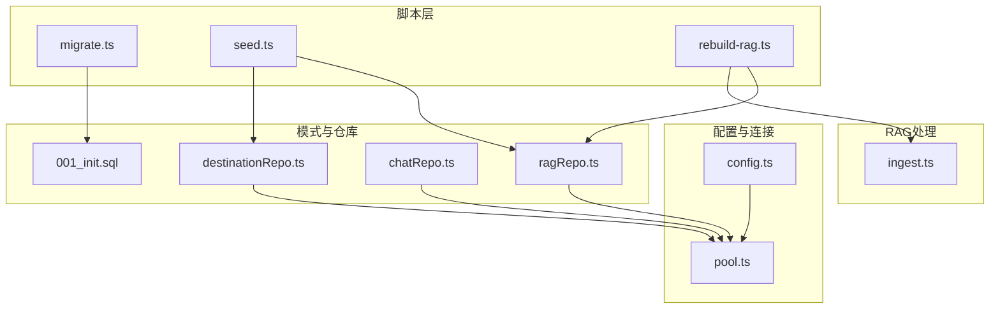
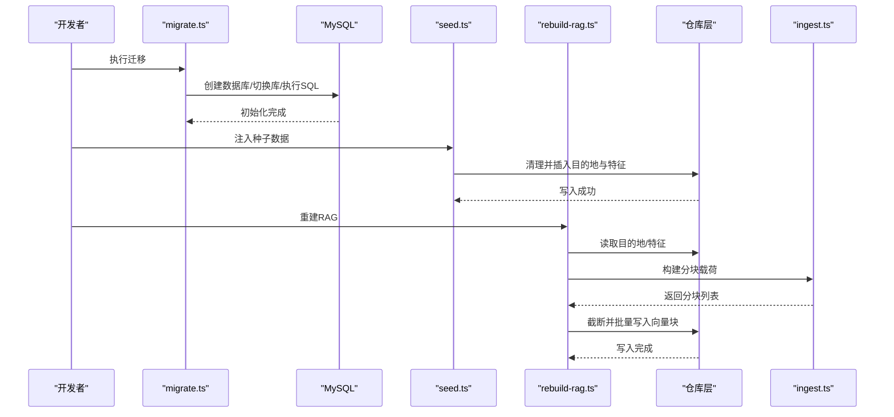
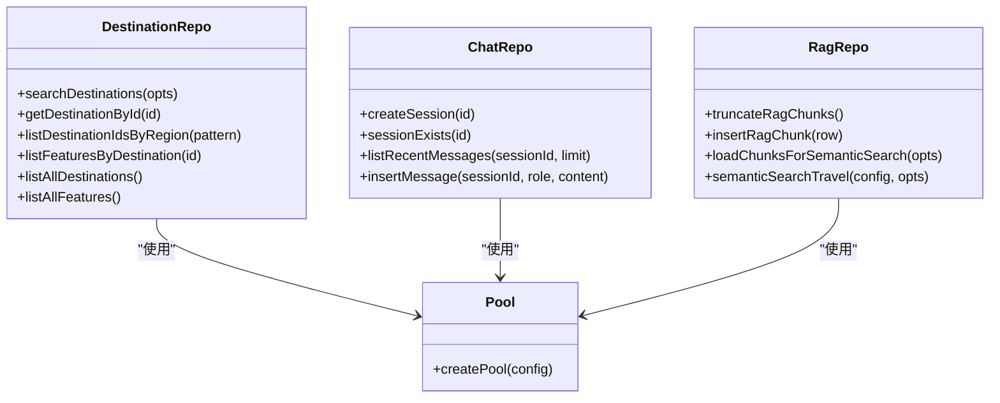
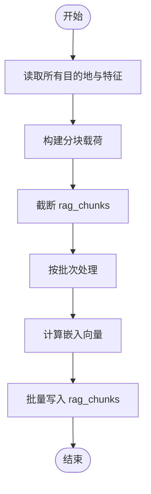
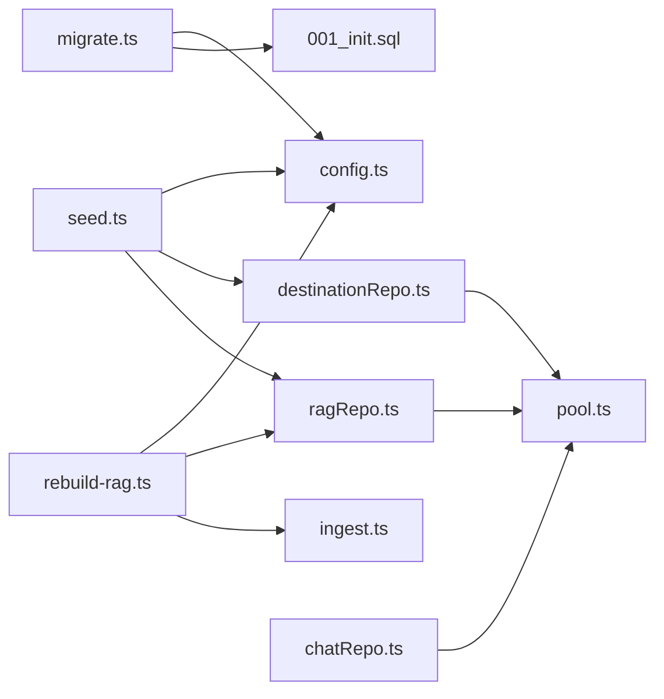

# 数据库管理

<cite>
**本文引用的文件**
- [scripts/migrate.ts](file://scripts/migrate.ts)
- [scripts/seed.ts](file://scripts/seed.ts)
- [scripts/rebuild-rag.ts](file://scripts/rebuild-rag.ts)
- [src/db/pool.ts](file://src/db/pool.ts)
- [src/db/migrations/001_init.sql](file://src/db/migrations/001_init.sql)
- [src/db/chatRepo.ts](file://src/db/chatRepo.ts)
- [src/db/destinationRepo.ts](file://src/db/destinationRepo.ts)
- [src/db/ragRepo.ts](file://src/db/ragRepo.ts)
- [src/config.ts](file://src/config.ts)
- [src/rag/ingest.ts](file://src/rag/ingest.ts)
- [package.json](file://package.json)
- [docker-compose.yml](file://docker-compose.yml)
</cite>

## 目录
1. [简介](#简介)
2. [项目结构](#项目结构)
3. [核心组件](#核心组件)
4. [架构总览](#架构总览)
5. [详细组件分析](#详细组件分析)
6. [依赖关系分析](#依赖关系分析)
7. [性能考虑](#性能考虑)
8. [故障排查指南](#故障排查指南)
9. [结论](#结论)
10. [附录](#附录)

## 简介
本指南面向 Guide-Plan-Agent 的数据库管理需求，覆盖以下主题：
- 数据库迁移脚本的使用方法与执行流程，含迁移文件结构与版本控制策略
- 种子数据脚本的功能与数据导入流程，含初始数据格式与约束
- 备份与恢复最佳实践（含增量备份与灾难恢复）
- 性能优化技巧、索引管理与查询优化
- 监控指标与故障诊断

本项目采用 MySQL 8+，通过 Node.js 脚本完成初始化、迁移与种子数据注入；同时提供 RAG 向量索引重建能力。

## 项目结构
数据库相关代码主要分布在以下位置：
- 迁移与初始化：scripts/migrate.ts、src/db/migrations/001_init.sql
- 种子数据：scripts/seed.ts
- 连接池与仓库层：src/db/pool.ts、src/db/chatRepo.ts、src/db/destinationRepo.ts、src/db/ragRepo.ts
- 配置与环境变量：src/config.ts
- RAG 重建：scripts/rebuild-rag.ts、src/rag/ingest.ts
- 包脚本与 Docker：package.json、docker-compose.yml

图表来源
- [scripts/migrate.ts:1-34](file://scripts/migrate.ts#L1-L34)
- [scripts/seed.ts:1-89](file://scripts/seed.ts#L1-L89)
- [scripts/rebuild-rag.ts:1-39](file://scripts/rebuild-rag.ts#L1-L39)
- [src/db/migrations/001_init.sql:1-54](file://src/db/migrations/001_init.sql#L1-L54)
- [src/db/pool.ts:1-17](file://src/db/pool.ts#L1-L17)
- [src/db/destinationRepo.ts:1-100](file://src/db/destinationRepo.ts#L1-L100)
- [src/db/chatRepo.ts:1-53](file://src/db/chatRepo.ts#L1-L53)
- [src/db/ragRepo.ts:1-143](file://src/db/ragRepo.ts#L1-L143)
- [src/rag/ingest.ts:1-40](file://src/rag/ingest.ts#L1-L40)
- [src/config.ts:1-46](file://src/config.ts#L1-L46)

章节来源
- [package.json:6-13](file://package.json#L6-L13)
- [docker-compose.yml:1-15](file://docker-compose.yml#L1-L15)

## 核心组件
- 迁移脚本：负责创建数据库、切换到目标库、执行初始化 SQL，确保首次部署时具备完整表结构。
- 种子脚本：负责清理并注入示例目的地、特征与 RAG 块，便于演示与测试。
- 连接池：集中管理数据库连接，支持并发与等待队列，避免资源泄露。
- 仓库层：封装对 destinations、destination_features、chat_sessions、chat_messages、rag_chunks 的 CRUD 操作。
- RAG 重建：从现有数据构建分块，计算向量嵌入，写入 rag_chunks 表，支持语义检索。
- 配置加载：统一读取环境变量，校验并输出应用与数据库配置。

章节来源
- [scripts/migrate.ts:10-28](file://scripts/migrate.ts#L10-L28)
- [scripts/seed.ts:5-83](file://scripts/seed.ts#L5-L83)
- [src/db/pool.ts:4-14](file://src/db/pool.ts#L4-L14)
- [src/db/destinationRepo.ts:20-45](file://src/db/destinationRepo.ts#L20-L45)
- [src/db/chatRepo.ts:6-52](file://src/db/chatRepo.ts#L6-L52)
- [src/db/ragRepo.ts:25-52](file://src/db/ragRepo.ts#L25-L52)
- [scripts/rebuild-rag.ts:10-33](file://scripts/rebuild-rag.ts#L10-L33)
- [src/config.ts:27-41](file://src/config.ts#L27-L41)

## 架构总览
下图展示数据库初始化、种子注入与 RAG 重建的关键调用链。

图表来源
- [scripts/migrate.ts:10-28](file://scripts/migrate.ts#L10-L28)
- [scripts/seed.ts:5-83](file://scripts/seed.ts#L5-L83)
- [scripts/rebuild-rag.ts:10-33](file://scripts/rebuild-rag.ts#L10-L33)
- [src/db/destinationRepo.ts:20-45](file://src/db/destinationRepo.ts#L20-L45)
- [src/db/ragRepo.ts:25-52](file://src/db/ragRepo.ts#L25-L52)
- [src/rag/ingest.ts:30-40](file://src/rag/ingest.ts#L30-L40)

## 详细组件分析

### 迁移脚本与版本控制策略
- 功能概述
  - 读取数据库配置，创建数据库（如不存在），切换到目标库
  - 读取并执行初始化 SQL 文件，建立所有表结构与索引
  - 支持多语句执行，确保一次性完成初始化
- 版本控制建议
  - 当前仅存在一个迁移文件，建议后续按“递增编号”扩展，例如 002_add_chat_history_index.sql、003_create_user_table.sql
  - 在每次新增迁移前，先在开发/测试环境验证，再合并到主分支
  - 迁移脚本应幂等且可回滚（保留备份或添加逆向 SQL）
- 执行流程
  - 使用包脚本触发：npm run migrate
  - 脚本会自动读取环境变量中的数据库凭据
  - 成功后输出确认信息

章节来源
- [scripts/migrate.ts:10-28](file://scripts/migrate.ts#L10-L28)
- [src/db/migrations/001_init.sql:1-54](file://src/db/migrations/001_init.sql#L1-L54)
- [package.json](file://package.json#L10)

### 种子数据脚本与导入流程
- 功能概述
  - 清空 rag_chunks、destination_features、destinations
  - 插入示例目的地（名称、地区、摘要、标签 JSON）
  - 将目的地与其特征（分类、标题、描述）关联写入
- 数据格式与约束
  - 目的地表：唯一键约束 name+region，确保不重复
  - 特征表：外键引用目的地，带分类枚举与索引
  - 标签字段为 JSON 类型，插入时以字符串形式传入并转换为 JSON
- 导入流程
  - 使用包脚本触发：npm run seed
  - 脚本使用较小连接池，保证种子阶段的稳定性
  - 成功后输出确认信息

章节来源
- [scripts/seed.ts:5-83](file://scripts/seed.ts#L5-L83)
- [src/db/migrations/001_init.sql:3-22](file://src/db/migrations/001_init.sql#L3-L22)

### 连接池与仓库层
- 连接池
  - 默认连接上限 10，支持等待队列，适合生产场景
  - 由配置模块统一读取环境变量
- 仓库层职责
  - 目的地：搜索、按 ID 查询、按地区模糊匹配、列出全部
  - 聊天：会话创建、存在性检查、最近消息列表、插入消息
  - RAG：截断、插入、按目的地/候选限制加载、语义搜索

图表来源
- [src/db/pool.ts:4-14](file://src/db/pool.ts#L4-L14)
- [src/db/destinationRepo.ts:20-99](file://src/db/destinationRepo.ts#L20-L99)
- [src/db/chatRepo.ts:6-52](file://src/db/chatRepo.ts#L6-L52)
- [src/db/ragRepo.ts:25-142](file://src/db/ragRepo.ts#L25-L142)

章节来源
- [src/db/pool.ts:4-14](file://src/db/pool.ts#L4-L14)
- [src/db/destinationRepo.ts:20-99](file://src/db/destinationRepo.ts#L20-L99)
- [src/db/chatRepo.ts:6-52](file://src/db/chatRepo.ts#L6-L52)
- [src/db/ragRepo.ts:25-142](file://src/db/ragRepo.ts#L25-L142)

### RAG 重建流程与向量索引
- 流程概述
  - 从数据库读取所有目的地与特征，构建分块载荷
  - 截断 rag_chunks 表，按批次计算文本嵌入并写入
  - 支持按区域过滤候选目的地，提升检索效率
- 关键点
  - 分块载荷包含 destination_id、source、chunk_text、content_hash
  - 向量存储为 JSON 字段，读取时解析为数组
  - 语义搜索基于余弦相似度 Top-K

图表来源
- [scripts/rebuild-rag.ts:10-33](file://scripts/rebuild-rag.ts#L10-L33)
- [src/rag/ingest.ts:30-40](file://src/rag/ingest.ts#L30-L40)
- [src/db/ragRepo.ts:25-52](file://src/db/ragRepo.ts#L25-L52)

章节来源
- [scripts/rebuild-rag.ts:10-33](file://scripts/rebuild-rag.ts#L10-L33)
- [src/rag/ingest.ts:30-40](file://src/rag/ingest.ts#L30-L40)
- [src/db/ragRepo.ts:25-142](file://src/db/ragRepo.ts#L25-L142)

## 依赖关系分析
- 脚本依赖
  - migrate.ts 依赖配置模块与初始化 SQL
  - seed.ts 依赖配置模块与仓库层
  - rebuild-rag.ts 依赖配置、仓库层与 RAG 处理模块
- 运行时依赖
  - 仓库层依赖连接池
  - RAG 语义搜索依赖嵌入模块与相似度工具

图表来源
- [scripts/migrate.ts:1-7](file://scripts/migrate.ts#L1-L7)
- [scripts/seed.ts:1-4](file://scripts/seed.ts#L1-L4)
- [scripts/rebuild-rag.ts:1-7](file://scripts/rebuild-rag.ts#L1-L7)
- [src/config.ts:1-46](file://src/config.ts#L1-L46)
- [src/db/migrations/001_init.sql:1-54](file://src/db/migrations/001_init.sql#L1-L54)
- [src/db/destinationRepo.ts:1-3](file://src/db/destinationRepo.ts#L1-L3)
- [src/db/ragRepo.ts:1-6](file://src/db/ragRepo.ts#L1-L6)
- [src/db/pool.ts:1-3](file://src/db/pool.ts#L1-L3)
- [src/rag/ingest.ts:1-4](file://src/rag/ingest.ts#L1-L4)

章节来源
- [package.json:6-13](file://package.json#L6-L13)

## 性能考虑
- 连接池参数
  - 生产环境建议根据并发与数据库承载能力调整连接上限与等待策略
  - 对于高吞吐的聊天与 RAG 场景，适当提高连接池上限
- 索引与查询优化
  - 已有索引：特征表按 destination_id 与 category 建有索引；消息表按 session_id+created_at 建有复合索引
  - 建议：对常用过滤字段（如目的地 region、标签 JSON）评估是否需要虚拟列+索引或全文索引
- 批处理与内存
  - RAG 重建采用批处理写入，减少单次事务开销
  - 嵌入计算与向量写入分离，避免阻塞
- 缓存与外部依赖
  - 嵌入服务与 LLM 接口的超时与重试策略需在配置中明确
- 监控指标建议
  - 连接池：活跃连接数、等待队列长度、最大连接数
  - 查询：慢查询阈值、索引命中率、锁等待
  - RAG：向量写入速率、相似度计算耗时、Top-K 返回数量

[本节为通用性能指导，无需特定文件来源]

## 故障排查指南
- 迁移失败
  - 检查数据库凭据与网络连通性
  - 确认目标数据库字符集与排序规则一致（utf8mb4）
  - 查看脚本输出与错误日志，必要时手动执行初始化 SQL
- 种子数据异常
  - 确认目标库已成功初始化
  - 检查标签字段是否为合法 JSON 字符串
  - 若重复运行，确认是否先清空相关表
- RAG 重建问题
  - 检查嵌入服务可用性与模型配置
  - 确认分块载荷生成逻辑与数据库连接正常
  - 观察批处理写入过程中的错误与重试
- 连接池问题
  - 监控连接池饱和与等待队列
  - 调整连接上限与等待策略
- Docker 环境
  - 使用 compose 提供健康检查，确认 MySQL 可用后再执行迁移/种子

章节来源
- [scripts/migrate.ts:30-33](file://scripts/migrate.ts#L30-L33)
- [scripts/seed.ts:85-88](file://scripts/seed.ts#L85-L88)
- [scripts/rebuild-rag.ts:35-38](file://scripts/rebuild-rag.ts#L35-L38)
- [docker-compose.yml:10-14](file://docker-compose.yml#L10-L14)

## 结论
本项目提供了完整的数据库初始化、种子注入与 RAG 重建能力，配合连接池与仓库层实现清晰的数据访问抽象。建议在现有基础上完善迁移版本化、引入增量备份与灾难恢复策略，并持续优化索引与查询性能，以满足生产环境的稳定性与可维护性要求。

[本节为总结性内容，无需特定文件来源]

## 附录

### 数据库模式概览
- 目的地表：唯一键 name+region，支持 JSON 标签
- 特征表：外键关联目的地，按分类枚举与目的地索引
- 聊天会话与消息：外键级联删除，消息表复合索引
- RAG 块：按内容哈希去重，按目的地与来源索引

章节来源
- [src/db/migrations/001_init.sql:3-53](file://src/db/migrations/001_init.sql#L3-L53)

### 环境变量与默认值
- 数据库相关：MYSQL_HOST、MYSQL_PORT、MYSQL_USER、MYSQL_PASSWORD、MYSQL_DATABASE
- 应用相关：PORT、OPENAI_BASE_URL、OPENAI_API_KEY、OPENAI_MODEL、OPENAI_EMBEDDING_MODEL、EMBEDDING_BASE_URL、CHAT_HISTORY_LIMIT、RAG_TOP_K_DEFAULT、RAG_CANDIDATE_LIMIT、LLM_MAX_TOOL_ROUNDS

章节来源
- [src/config.ts:3-22](file://src/config.ts#L3-L22)

### Docker 快速启动
- 使用 compose 启动 MySQL 8，设置字符集与排序规则，提供健康检查
- 可用于本地开发与测试环境

章节来源
- [docker-compose.yml:1-15](file://docker-compose.yml#L1-L15)