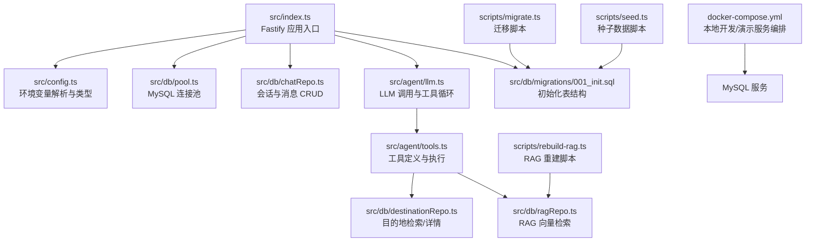
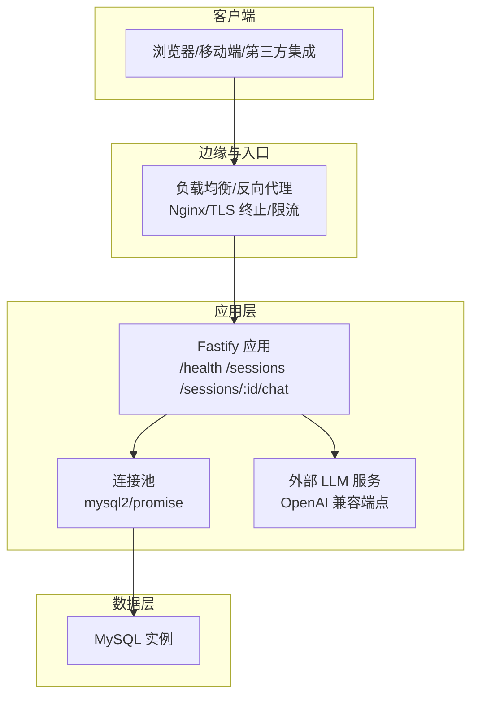
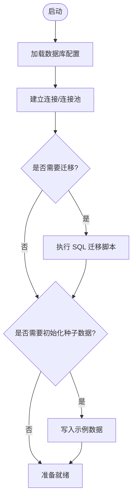
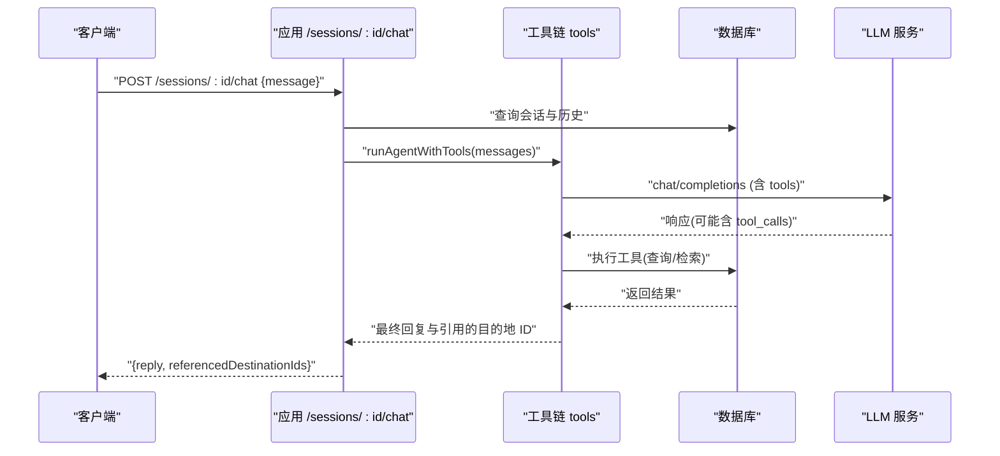
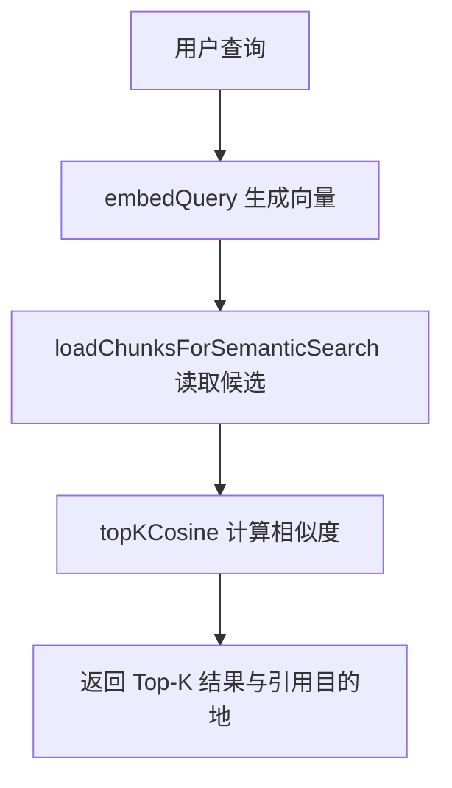
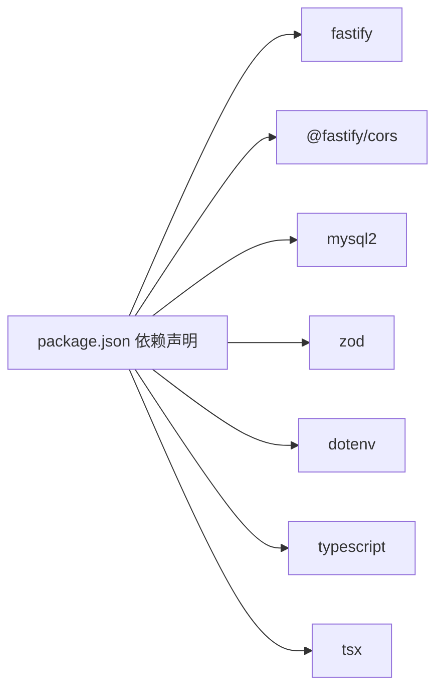

# 生产环境配置

<cite>
**本文引用的文件**
- [src/config.ts](file://src/config.ts)
- [src/index.ts](file://src/index.ts)
- [src/db/pool.ts](file://src/db/pool.ts)
- [src/db/migrations/001_init.sql](file://src/db/migrations/001_init.sql)
- [src/db/chatRepo.ts](file://src/db/chatRepo.ts)
- [src/db/destinationRepo.ts](file://src/db/destinationRepo.ts)
- [src/db/ragRepo.ts](file://src/db/ragRepo.ts)
- [src/agent/llm.ts](file://src/agent/llm.ts)
- [src/agent/tools.ts](file://src/agent/tools.ts)
- [src/agent/prompts.ts](file://src/agent/prompts.ts)
- [scripts/migrate.ts](file://scripts/migrate.ts)
- [scripts/seed.ts](file://scripts/seed.ts)
- [scripts/rebuild-rag.ts](file://scripts/rebuild-rag.ts)
- [docker-compose.yml](file://docker-compose.yml)
- [package.json](file://package.json)
</cite>

## 目录
1. [简介](#简介)
2. [项目结构](#项目结构)
3. [核心组件](#核心组件)
4. [架构总览](#架构总览)
5. [详细组件分析](#详细组件分析)
6. [依赖关系分析](#依赖关系分析)
7. [性能考虑](#性能考虑)
8. [故障排查指南](#故障排查指南)
9. [结论](#结论)
10. [附录](#附录)

## 简介
本指南面向生产环境部署 Guide-Plan-Agent，聚焦以下目标：
- 明确环境变量配置方法与安全最佳实践（数据库连接、OpenAI API 密钥与敏感信息保护）
- 给出生产性能调优参数（连接池、超时、并发控制）
- 提供安全加固（HTTPS、CORS、输入校验）
- 说明负载均衡、高可用与自动扩缩容策略
- 提供安全审计与合规检查方法

## 项目结构
该仓库采用“按功能分层”的组织方式：入口服务、配置加载、数据库访问层、RAG/代理工具链、脚本化迁移与初始化。

图示来源
- [src/index.ts:1-77](file://src/index.ts#L1-L77)
- [src/config.ts:1-46](file://src/config.ts#L1-L46)
- [src/db/pool.ts:1-17](file://src/db/pool.ts#L1-L17)
- [src/db/chatRepo.ts:1-53](file://src/db/chatRepo.ts#L1-L53)
- [src/agent/llm.ts:1-114](file://src/agent/llm.ts#L1-L114)
- [src/agent/tools.ts:1-195](file://src/agent/tools.ts#L1-L195)
- [src/db/destinationRepo.ts:1-100](file://src/db/destinationRepo.ts#L1-L100)
- [src/db/ragRepo.ts:1-143](file://src/db/ragRepo.ts#L1-L143)
- [src/db/migrations/001_init.sql:1-54](file://src/db/migrations/001_init.sql#L1-L54)
- [scripts/migrate.ts:1-34](file://scripts/migrate.ts#L1-L34)
- [scripts/seed.ts:1-89](file://scripts/seed.ts#L1-L89)
- [scripts/rebuild-rag.ts:1-39](file://scripts/rebuild-rag.ts#L1-L39)
- [docker-compose.yml:1-16](file://docker-compose.yml#L1-L16)

章节来源
- [src/index.ts:1-77](file://src/index.ts#L1-L77)
- [src/config.ts:1-46](file://src/config.ts#L1-L46)
- [docker-compose.yml:1-16](file://docker-compose.yml#L1-L16)

## 核心组件
- 环境变量与配置加载：通过 Zod 对环境变量进行强类型解析与默认值设定，确保运行前的参数合法性。
- 数据库连接池：基于 mysql2 的 Promise 接口创建连接池，默认连接数较小，适合开发/演示；生产需按吞吐与资源评估调整。
- Fastify 服务：提供健康检查、会话创建、聊天接口；内置 CORS 放通源。
- 代理与工具链：封装 OpenAI Chat Completions 调用，支持工具函数（结构化检索、语义检索、详情读取），并限制最大工具轮次。
- RAG 流程：文本分块、嵌入向量化、相似度检索、结果聚合。
- 迁移与种子：SQL 初始化、种子数据与 RAG 向量重建脚本。

章节来源
- [src/config.ts:1-46](file://src/config.ts#L1-L46)
- [src/db/pool.ts:1-17](file://src/db/pool.ts#L1-L17)
- [src/index.ts:1-77](file://src/index.ts#L1-L77)
- [src/agent/llm.ts:1-114](file://src/agent/llm.ts#L1-L114)
- [src/agent/tools.ts:1-195](file://src/agent/tools.ts#L1-L195)
- [src/db/ragRepo.ts:1-143](file://src/db/ragRepo.ts#L1-L143)
- [scripts/migrate.ts:1-34](file://scripts/migrate.ts#L1-L34)
- [scripts/seed.ts:1-89](file://scripts/seed.ts#L1-L89)
- [scripts/rebuild-rag.ts:1-39](file://scripts/rebuild-rag.ts#L1-L39)

## 架构总览
下图展示了生产环境的关键交互路径：客户端请求经由网关/负载均衡进入应用实例，应用通过连接池访问数据库，同时调用外部 LLM 服务完成工具执行与回复生成。

图示来源
- [src/index.ts:18-68](file://src/index.ts#L18-L68)
- [src/db/pool.ts:4-14](file://src/db/pool.ts#L4-L14)
- [src/agent/llm.ts:26-47](file://src/agent/llm.ts#L26-L47)

## 详细组件分析

### 环境变量与安全配置
- 必填项与默认值
  - 数据库：MYSQL_HOST、MYSQL_PORT、MYSQL_USER、MYSQL_PASSWORD、MYSQL_DATABASE
  - 应用：PORT、OPENAI_BASE_URL、OPENAI_API_KEY、OPENAI_MODEL、OPENAI_EMBEDDING_MODEL
  - RAG：EMBEDDING_BASE_URL（可选）、CHAT_HISTORY_LIMIT、RAG_TOP_K_DEFAULT、RAG_CANDIDATE_LIMIT、LLM_MAX_TOOL_ROUNDS
- 安全建议
  - 使用只读密钥与最小权限原则；避免在镜像或日志中泄露密钥
  - 将敏感变量置于平台机密管理（如 Kubernetes Secret、云厂商密钥管理）
  - 仅在受信网络内暴露数据库端口；生产环境不使用默认密码
  - 通过只读账号执行常规查询，写操作使用专用账号
- 验证与错误处理
  - 配置加载失败会抛出错误，应纳入启动探针与告警

章节来源
- [src/config.ts:3-22](file://src/config.ts#L3-L22)
- [src/config.ts:27-41](file://src/config.ts#L27-L41)

### 数据库连接池与迁移
- 连接池
  - 默认 connectionLimit 较小，适合开发/演示；生产需根据 QPS、并发、延迟与数据库规格评估
  - 建议开启连接复用、合理设置等待队列与超时
- 迁移与初始化
  - 迁移脚本自动创建数据库与表结构
  - 种子脚本清理并插入示例数据
  - RAG 重建脚本分批向量化并写入向量表

图示来源
- [scripts/migrate.ts:10-28](file://scripts/migrate.ts#L10-L28)
- [scripts/seed.ts:5-83](file://scripts/seed.ts#L5-L83)
- [src/db/migrations/001_init.sql:1-54](file://src/db/migrations/001_init.sql#L1-L54)

章节来源
- [src/db/pool.ts:4-14](file://src/db/pool.ts#L4-L14)
- [scripts/migrate.ts:10-28](file://scripts/migrate.ts#L10-L28)
- [scripts/seed.ts:5-83](file://scripts/seed.ts#L5-L83)
- [src/db/migrations/001_init.sql:1-54](file://src/db/migrations/001_init.sql#L1-L54)

### 代理与工具链（LLM 调用与工具执行）
- LLM 调用
  - 使用 OPENAI_BASE_URL 与 OPENAI_API_KEY 访问模型
  - 发送系统提示、历史消息与工具定义，限制最大工具轮次
- 工具执行
  - 结构化检索、语义检索、目的地详情读取
  - 对参数进行范围约束与类型转换，避免异常输入

图示来源
- [src/index.ts:35-68](file://src/index.ts#L35-L68)
- [src/agent/llm.ts:49-114](file://src/agent/llm.ts#L49-L114)
- [src/agent/tools.ts:114-195](file://src/agent/tools.ts#L114-L195)
- [src/db/chatRepo.ts:23-40](file://src/db/chatRepo.ts#L23-L40)
- [src/db/destinationRepo.ts:20-45](file://src/db/destinationRepo.ts#L20-L45)
- [src/db/ragRepo.ts:97-142](file://src/db/ragRepo.ts#L97-L142)

章节来源
- [src/agent/llm.ts:26-47](file://src/agent/llm.ts#L26-L47)
- [src/agent/llm.ts:49-114](file://src/agent/llm.ts#L49-L114)
- [src/agent/tools.ts:67-113](file://src/agent/tools.ts#L67-L113)
- [src/agent/tools.ts:114-195](file://src/agent/tools.ts#L114-L195)
- [src/agent/prompts.ts:1-10](file://src/agent/prompts.ts#L1-L10)

### RAG 检索流程
- 文本分块与去重
- 向量化与存储
- 查询时的候选集限制与 Top-K 选择
- 结果聚合与引用目的地 ID

图示来源
- [src/db/ragRepo.ts:97-142](file://src/db/ragRepo.ts#L97-L142)
- [scripts/rebuild-rag.ts:10-33](file://scripts/rebuild-rag.ts#L10-L33)

章节来源
- [src/db/ragRepo.ts:15-95](file://src/db/ragRepo.ts#L15-L95)
- [scripts/rebuild-rag.ts:8-33](file://scripts/rebuild-rag.ts#L8-L33)

## 依赖关系分析
- 运行时依赖
  - Fastify 作为 Web 框架，提供路由与中间件能力
  - @fastify/cors 用于跨域放通
  - mysql2 用于连接 MySQL
  - dotenv 用于加载 .env 文件
  - zod 用于环境变量校验
- 开发与构建
  - TypeScript 编译与热更新脚本
  - Docker Compose 用于本地演示

图示来源
- [package.json:18-24](file://package.json#L18-L24)
- [package.json:25-29](file://package.json#L25-L29)

章节来源
- [package.json:1-31](file://package.json#L1-L31)

## 性能考虑
- 连接池大小
  - 基于 mysql2 的 Promise 接口，默认 connectionLimit 偏小；生产需结合 QPS、并发、数据库规格与延迟目标评估
  - 建议启用 waitForConnections，避免瞬时高峰导致拒绝
- 超时与并发
  - 为数据库查询设置合理超时（如 5–10 秒），防止慢查询拖垮连接池
  - 为 LLM 调用设置请求超时与重试策略，避免阻塞线程
- 并发控制
  - 限制单次请求的工具调用轮次（已内置 LLM_MAX_TOOL_ROUNDS）
  - 控制 RAG 候选集数量（RAG_CANDIDATE_LIMIT）与 Top-K（RAG_TOP_K_DEFAULT）
- 缓存与索引
  - 为高频查询添加合适索引（如会话消息按会话与时间排序）
  - 对热点目的地详情与特征进行缓存
- 资源隔离
  - 将数据库与应用容器资源限制与亲和性配置到不同节点，避免争抢

## 故障排查指南
- 健康检查
  - 应用提供 /health 探针，内部执行一次数据库查询以判断连通性
- 常见问题定位
  - 环境变量错误：检查配置加载报错与默认值覆盖
  - 数据库不可达：确认主机、端口、账号、库名与网络连通
  - LLM 调用失败：核对 API Key、Base URL 与网络出口
  - 工具执行异常：查看工具参数解析与数据库查询结果
- 日志与可观测性
  - 启用应用日志与错误追踪
  - 对数据库慢查询与 LLM 调用耗时进行采样监控

章节来源
- [src/index.ts:18-26](file://src/index.ts#L18-L26)
- [src/config.ts:27-41](file://src/config.ts#L27-L41)
- [src/db/pool.ts:4-14](file://src/db/pool.ts#L4-L14)
- [src/agent/llm.ts:30-47](file://src/agent/llm.ts#L30-L47)

## 结论
本指南提供了从环境变量安全、数据库连接池、LLM 调用、RAG 流程到生产部署与运维的全链路建议。请结合业务流量与资源预算，逐步优化连接池、超时与并发参数，并完善安全与合规措施。

## 附录

### A. 环境变量清单与建议
- 数据库相关
  - MYSQL_HOST/MYSQL_PORT/MYSQL_USER/MYSQL_PASSWORD/MYSQL_DATABASE
  - 建议：使用只读账号执行常规查询；写操作使用专用账号；避免明文密码
- 应用相关
  - PORT、OPENAI_BASE_URL、OPENAI_API_KEY、OPENAI_MODEL、OPENAI_EMBEDDING_MODEL
  - 建议：OPENAI_BASE_URL 可指向兼容服务；OPENAI_API_KEY 存入机密管理
- RAG 参数
  - EMBEDDING_BASE_URL（可选）、CHAT_HISTORY_LIMIT、RAG_TOP_K_DEFAULT、RAG_CANDIDATE_LIMIT、LLM_MAX_TOOL_ROUNDS
  - 建议：根据召回质量与延迟权衡调整

章节来源
- [src/config.ts:3-22](file://src/config.ts#L3-L22)

### B. 安全加固清单
- HTTPS 与 TLS
  - 在反向代理层终止 TLS，应用层使用内网通信
- CORS
  - 严格限定允许来源；生产环境建议固定可信域名
- 输入验证
  - 对工具参数进行范围与类型校验；对用户输入进行长度与字符集限制
- 敏感信息保护
  - 不在日志中输出密钥；使用只读账号；定期轮换密钥

章节来源
- [src/index.ts:16](file://src/index.ts#L16)
- [src/agent/tools.ts:121-127](file://src/agent/tools.ts#L121-L127)
- [src/agent/tools.ts:142-147](file://src/agent/tools.ts#L142-L147)
- [src/agent/tools.ts:162-164](file://src/agent/tools.ts#L162-L164)

### C. 高可用与自动扩缩容
- 高可用
  - 多副本部署应用实例；使用健康检查与滚动升级
  - 数据库使用主从或托管高可用方案
- 负载均衡
  - 使用四层/七层负载均衡；开启会话亲和或无状态设计
- 自动扩缩容
  - 基于 CPU/内存/请求延迟指标动态扩缩；限制最大副本数与冷却时间

### D. 安全审计与合规
- 审计
  - 记录关键操作（会话创建、消息写入、工具调用、RAG 检索）
  - 定期审查密钥轮换与访问日志
- 合规
  - 数据最小化与保留策略；用户数据删除与导出接口
  - 第三方服务合规与数据跨境传输限制