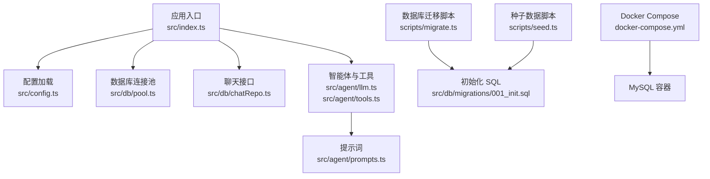
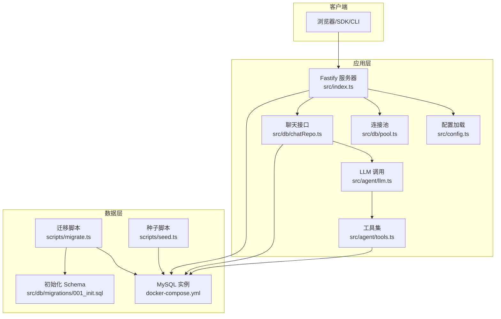
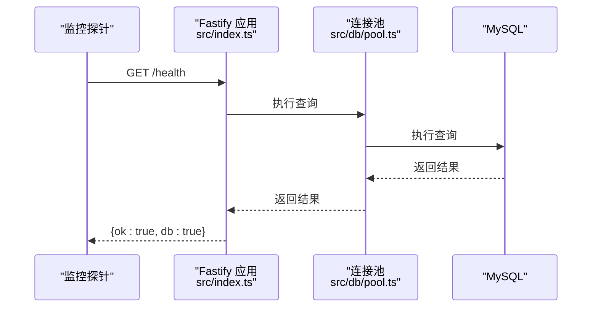
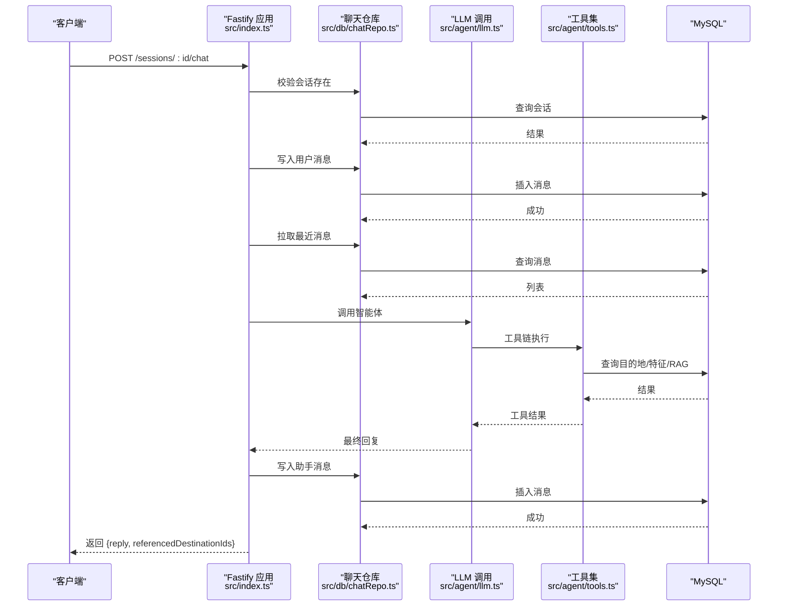
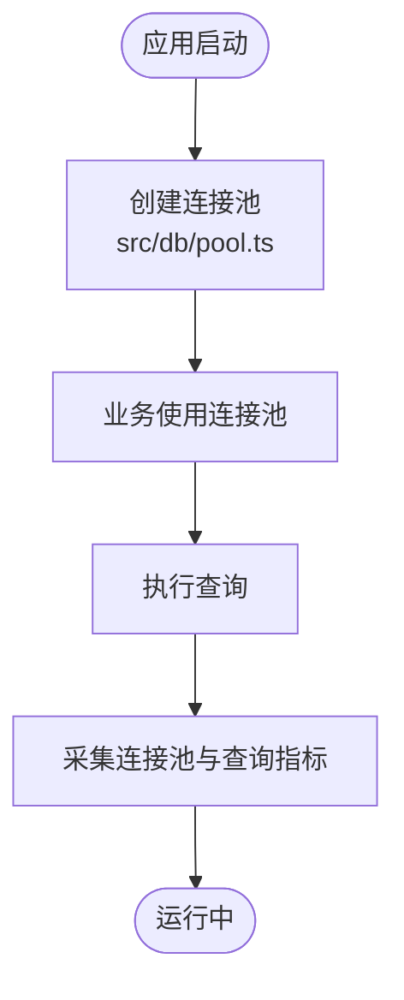
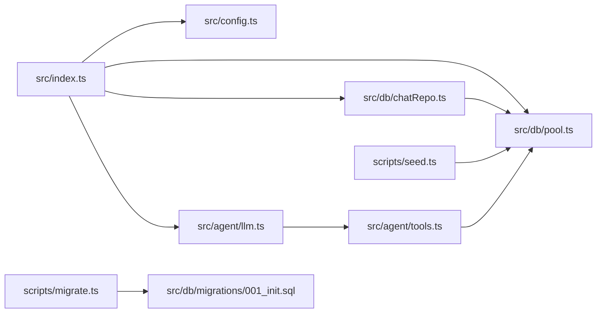
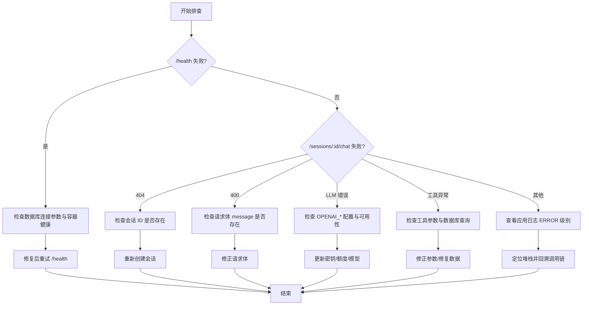

# 监控与日志

<cite>
**本文引用的文件**
- [package.json](file://package.json)
- [docker-compose.yml](file://docker-compose.yml)
- [src/index.ts](file://src/index.ts)
- [src/config.ts](file://src/config.ts)
- [src/db/pool.ts](file://src/db/pool.ts)
- [src/db/chatRepo.ts](file://src/db/chatRepo.ts)
- [src/db/migrations/001_init.sql](file://src/db/migrations/001_init.sql)
- [src/agent/llm.ts](file://src/agent/llm.ts)
- [src/agent/tools.ts](file://src/agent/tools.ts)
- [src/agent/prompts.ts](file://src/agent/prompts.ts)
- [scripts/migrate.ts](file://scripts/migrate.ts)
- [scripts/seed.ts](file://scripts/seed.ts)
</cite>

## 目录
1. [简介](#简介)
2. [项目结构](#项目结构)
3. [核心组件](#核心组件)
4. [架构总览](#架构总览)
5. [详细组件分析](#详细组件分析)
6. [依赖关系分析](#依赖关系分析)
7. [性能考虑](#性能考虑)
8. [故障排查指南](#故障排查指南)
9. [结论](#结论)
10. [附录](#附录)

## 简介
本指南面向 Guide-Plan-Agent 项目的运维与开发团队，提供一套完整的监控与日志管理方案。内容覆盖健康检查端点、系统资源与数据库连接池监控、API 响应时间与错误率统计方法、日志配置与级别策略、日志分析与故障排查流程，以及性能监控工具与告警配置建议。文档同时结合代码实现，确保方案可落地、可验证。

## 项目结构
项目采用模块化分层设计：
- 应用入口与路由：Fastify 服务器在入口文件中注册 CORS 并定义健康检查与聊天接口。
- 配置加载：通过 Zod 校验环境变量，统一导出应用与数据库配置。
- 数据库层：MySQL 连接池封装、会话与消息表操作、RAG 片段与目的地特征表。
- 智能体层：LLM 调用、工具函数集合与提示词策略。
- 运维脚本：迁移与种子数据初始化。

图表来源
- [src/index.ts:11-77](file://src/index.ts#L11-L77)
- [src/config.ts:35-41](file://src/config.ts#L35-L41)
- [src/db/pool.ts:4-14](file://src/db/pool.ts#L4-L14)
- [src/db/chatRepo.ts:6-52](file://src/db/chatRepo.ts#L6-L52)
- [src/agent/llm.ts:49-114](file://src/agent/llm.ts#L49-L114)
- [src/agent/tools.ts:114-195](file://src/agent/tools.ts#L114-L195)
- [scripts/migrate.ts:10-28](file://scripts/migrate.ts#L10-L28)
- [scripts/seed.ts:5-83](file://scripts/seed.ts#L5-L83)
- [docker-compose.yml:1-16](file://docker-compose.yml#L1-L16)

章节来源
- [src/index.ts:11-77](file://src/index.ts#L11-L77)
- [src/config.ts:35-41](file://src/config.ts#L35-L41)
- [src/db/pool.ts:4-14](file://src/db/pool.ts#L4-L14)
- [src/db/chatRepo.ts:6-52](file://src/db/chatRepo.ts#L6-L52)
- [src/agent/llm.ts:49-114](file://src/agent/llm.ts#L49-L114)
- [src/agent/tools.ts:114-195](file://src/agent/tools.ts#L114-L195)
- [scripts/migrate.ts:10-28](file://scripts/migrate.ts#L10-L28)
- [scripts/seed.ts:5-83](file://scripts/seed.ts#L5-L83)
- [docker-compose.yml:1-16](file://docker-compose.yml#L1-L16)

## 核心组件
- 健康检查端点：/health，用于快速判断服务与数据库连通性。
- 聊天接口：/sessions/:id/chat，支持消息历史拼接与工具链调用。
- 数据库连接池：统一配置连接参数与并发限制。
- 配置校验：Zod 对环境变量进行类型与范围校验。
- Docker 健康检查：MySQL 容器内置健康检查命令。

章节来源
- [src/index.ts:18-26](file://src/index.ts#L18-L26)
- [src/index.ts:35-68](file://src/index.ts#L35-L68)
- [src/db/pool.ts:4-14](file://src/db/pool.ts#L4-L14)
- [src/config.ts:35-41](file://src/config.ts#L35-L41)
- [docker-compose.yml:10-15](file://docker-compose.yml#L10-L15)

## 架构总览
下图展示了请求从客户端到数据库的完整路径，以及健康检查与数据库迁移/种子数据的关系。

图表来源
- [src/index.ts:11-77](file://src/index.ts#L11-L77)
- [src/config.ts:35-41](file://src/config.ts#L35-L41)
- [src/db/pool.ts:4-14](file://src/db/pool.ts#L4-L14)
- [src/db/chatRepo.ts:6-52](file://src/db/chatRepo.ts#L6-L52)
- [src/agent/llm.ts:49-114](file://src/agent/llm.ts#L49-L114)
- [src/agent/tools.ts:114-195](file://src/agent/tools.ts#L114-L195)
- [scripts/migrate.ts:10-28](file://scripts/migrate.ts#L10-L28)
- [scripts/seed.ts:5-83](file://scripts/seed.ts#L5-L83)
- [src/db/migrations/001_init.sql:1-54](file://src/db/migrations/001_init.sql#L1-L54)
- [docker-compose.yml:1-16](file://docker-compose.yml#L1-L16)

## 详细组件分析

### 健康检查端点与监控指标
- 端点：GET /health
- 行为：尝试执行一次数据库查询，成功返回服务与数据库均可用状态；失败返回 503 并包含错误信息。
- 指标采集建议：
  - 可用性：/health 返回 200 且 db 字段为 true 视为健康。
  - 错误率：统计 /health 5xx 比例。
  - 响应时间：记录 /health 的 P50/P95。
  - 数据库连通性：将数据库查询耗时纳入健康检查指标。

图表来源
- [src/index.ts:18-26](file://src/index.ts#L18-L26)
- [src/db/pool.ts:4-14](file://src/db/pool.ts#L4-L14)

章节来源
- [src/index.ts:18-26](file://src/index.ts#L18-L26)
- [src/db/pool.ts:4-14](file://src/db/pool.ts#L4-L14)

### 聊天接口与响应时间统计
- 端点：POST /sessions/:id/chat
- 行为：校验消息存在性与会话存在性；写入用户消息；拉取历史消息；调用智能体工具链；写入助手回复；返回结果。
- 响应时间统计建议：
  - 记录从收到请求到返回响应的总耗时。
  - 分解阶段耗时：历史拉取、LLM 请求、工具链执行、消息写入。
  - 统计 P50/P95/P99 与错误率。

图表来源
- [src/index.ts:35-68](file://src/index.ts#L35-L68)
- [src/db/chatRepo.ts:6-52](file://src/db/chatRepo.ts#L6-L52)
- [src/agent/llm.ts:49-114](file://src/agent/llm.ts#L49-L114)
- [src/agent/tools.ts:114-195](file://src/agent/tools.ts#L114-L195)

章节来源
- [src/index.ts:35-68](file://src/index.ts#L35-L68)
- [src/db/chatRepo.ts:6-52](file://src/db/chatRepo.ts#L6-L52)
- [src/agent/llm.ts:49-114](file://src/agent/llm.ts#L49-L114)
- [src/agent/tools.ts:114-195](file://src/agent/tools.ts#L114-L195)

### 数据库连接池与监控
- 连接池参数：host、port、user、password、database、waitForConnections、connectionLimit。
- 监控建议：
  - 连接池活跃连接数、等待队列长度、最大连接数使用率。
  - 连接超时与拒绝次数。
  - 数据库查询延迟分布与慢查询比例。

图表来源
- [src/db/pool.ts:4-14](file://src/db/pool.ts#L4-L14)

章节来源
- [src/db/pool.ts:4-14](file://src/db/pool.ts#L4-L14)

### 日志配置与级别策略
- 应用日志：Fastify 默认启用日志，可用于访问日志与错误日志。
- 日志级别建议：
  - 访问日志：INFO，记录请求方法、路径、状态码、处理耗时。
  - 错误日志：ERROR，记录异常堆栈与上下文。
  - 调试日志：DEBUG，仅在开发/排障时开启，避免生产噪声。
- 日志输出：
  - 控制台输出适用于本地开发。
  - 生产环境建议输出到结构化日志系统（如 stdout JSON），便于集中采集与分析。

章节来源
- [src/index.ts:14](file://src/index.ts#L14)

### 性能监控工具集成与告警
- 推荐工具：Prometheus + Grafana 或云监控平台（如 CloudWatch、Grafana Cloud）。
- 关键指标：
  - CPU 使用率、内存 RSS/Heap。
  - /health 健康检查成功率与延迟。
  - /sessions/:id/chat 响应时间（P50/P95/P99）、错误率。
  - 数据库连接池活跃连接数、等待队列长度、查询延迟。
  - LLM 调用耗时与失败次数。
- 告警阈值示例（需结合业务基线调整）：
  - /health 5xx 比例 > 5% 持续 5 分钟。
  - /sessions/:id/chat P95 > X 毫秒。
  - 连接池等待队列长度 > Y。
  - LLM 调用失败率 > Z%。

章节来源
- [src/index.ts:18-26](file://src/index.ts#L18-L26)
- [src/index.ts:35-68](file://src/index.ts#L35-L68)
- [src/db/pool.ts:4-14](file://src/db/pool.ts#L4-L14)
- [src/agent/llm.ts:30-47](file://src/agent/llm.ts#L30-L47)

## 依赖关系分析
- 应用入口依赖配置加载与数据库连接池。
- 聊天接口依赖聊天仓库与智能体链路。
- 智能体链路依赖工具集与数据库查询。
- 运维脚本依赖初始化 SQL 与配置加载。

图表来源
- [src/index.ts:11-77](file://src/index.ts#L11-L77)
- [src/config.ts:35-41](file://src/config.ts#L35-L41)
- [src/db/pool.ts:4-14](file://src/db/pool.ts#L4-L14)
- [src/db/chatRepo.ts:6-52](file://src/db/chatRepo.ts#L6-L52)
- [src/agent/llm.ts:49-114](file://src/agent/llm.ts#L49-L114)
- [src/agent/tools.ts:114-195](file://src/agent/tools.ts#L114-L195)
- [scripts/migrate.ts:10-28](file://scripts/migrate.ts#L10-L28)
- [scripts/seed.ts:5-83](file://scripts/seed.ts#L5-L83)
- [src/db/migrations/001_init.sql:1-54](file://src/db/migrations/001_init.sql#L1-L54)

章节来源
- [src/index.ts:11-77](file://src/index.ts#L11-L77)
- [src/config.ts:35-41](file://src/config.ts#L35-L41)
- [src/db/pool.ts:4-14](file://src/db/pool.ts#L4-L14)
- [src/db/chatRepo.ts:6-52](file://src/db/chatRepo.ts#L6-L52)
- [src/agent/llm.ts:49-114](file://src/agent/llm.ts#L49-L114)
- [src/agent/tools.ts:114-195](file://src/agent/tools.ts#L114-L195)
- [scripts/migrate.ts:10-28](file://scripts/migrate.ts#L10-L28)
- [scripts/seed.ts:5-83](file://scripts/seed.ts#L5-L83)
- [src/db/migrations/001_init.sql:1-54](file://src/db/migrations/001_init.sql#L1-L54)

## 性能考虑
- 连接池并发：根据 LLM 调用与工具链并发需求设置 connectionLimit，避免过度竞争导致等待队列增长。
- 查询优化：聊天历史查询按会话与时间排序，确保索引有效；工具链查询尽量使用限定条件与合理 limit。
- 缓存策略：对热点目的地详情与常用检索结果可引入缓存（需评估一致性）。
- 资源隔离：容器化部署时设置 CPU/内存限制与重启策略，结合健康检查自动恢复。

章节来源
- [src/db/pool.ts:11-13](file://src/db/pool.ts#L11-L13)
- [src/db/chatRepo.ts:23-40](file://src/db/chatRepo.ts#L23-L40)
- [src/agent/tools.ts:121-141](file://src/agent/tools.ts#L121-L141)

## 故障排查指南
- 健康检查失败
  - 现象：/health 返回 503，db 字段为 false。
  - 排查：确认数据库连接参数、网络连通性、MySQL 容器健康状态。
  - 参考：健康检查实现与 Docker 健康检查配置。
- 会话不存在
  - 现象：POST /sessions/:id/chat 返回 404。
  - 排查：确认会话 ID 是否正确、是否已创建。
- 消息为空
  - 现象：POST /sessions/:id/chat 返回 400。
  - 排查：确认请求体包含非空 message。
- LLM 调用失败
  - 现象：LLM 请求返回非 2xx 或 empty choices。
  - 排查：检查 OPENAI_BASE_URL、OPENAI_API_KEY、模型可用性与配额。
- 工具链异常
  - 现象：工具执行抛错，工具返回错误文本。
  - 排查：检查数据库查询条件、工具参数解析与目标 ID 有效性。
- 数据库初始化
  - 现象：表缺失或数据不全。
  - 排查：执行迁移脚本与种子脚本，确认数据库字符集与权限。

图表来源
- [src/index.ts:18-26](file://src/index.ts#L18-L26)
- [src/index.ts:35-68](file://src/index.ts#L35-L68)
- [src/agent/llm.ts:30-47](file://src/agent/llm.ts#L30-L47)
- [src/agent/tools.ts:114-195](file://src/agent/tools.ts#L114-L195)
- [scripts/migrate.ts:10-28](file://scripts/migrate.ts#L10-L28)
- [scripts/seed.ts:5-83](file://scripts/seed.ts#L5-L83)

章节来源
- [src/index.ts:18-26](file://src/index.ts#L18-L26)
- [src/index.ts:35-68](file://src/index.ts#L35-L68)
- [src/agent/llm.ts:30-47](file://src/agent/llm.ts#L30-L47)
- [src/agent/tools.ts:114-195](file://src/agent/tools.ts#L114-L195)
- [scripts/migrate.ts:10-28](file://scripts/migrate.ts#L10-L28)
- [scripts/seed.ts:5-83](file://scripts/seed.ts#L5-L83)

## 结论
通过健康检查端点、数据库连接池监控、接口响应时间与错误率统计、结构化日志与级别策略，以及性能监控工具与告警配置，可以构建完善的可观测性体系。结合本文提供的故障排查流程与优化建议，能够快速定位问题并提升系统稳定性与用户体验。

## 附录
- 环境变量与配置项
  - 应用端口、OpenAI 基础地址、模型、嵌入模型、历史长度、RAG 参数、LLM 最大工具轮次等。
- Docker Compose
  - MySQL 容器健康检查命令与端口映射，便于容器级健康观测。

章节来源
- [src/config.ts:11-22](file://src/config.ts#L11-L22)
- [docker-compose.yml:10-15](file://docker-compose.yml#L10-L15)