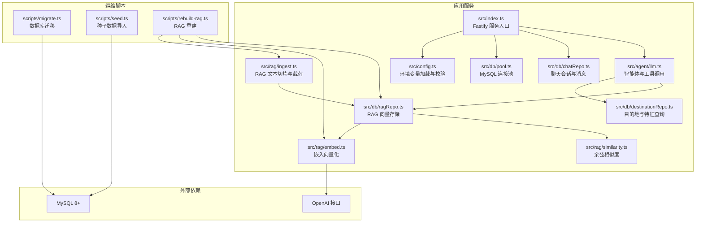
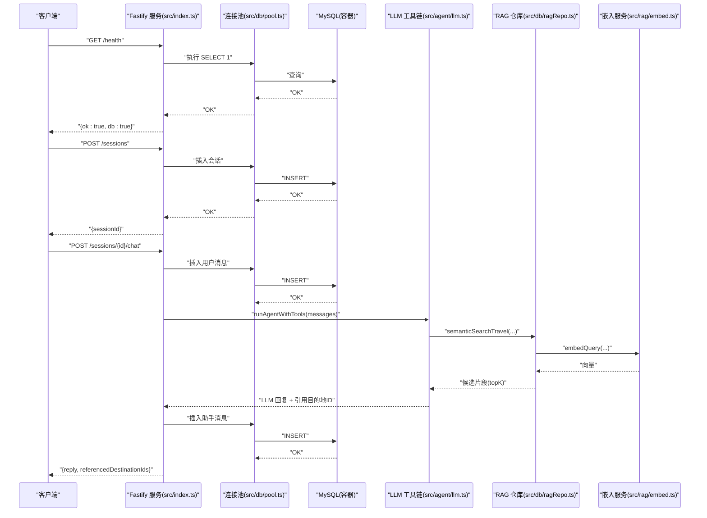
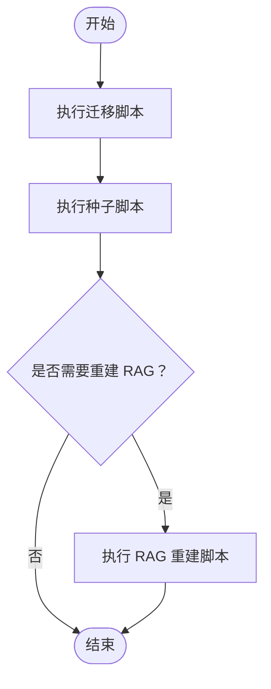
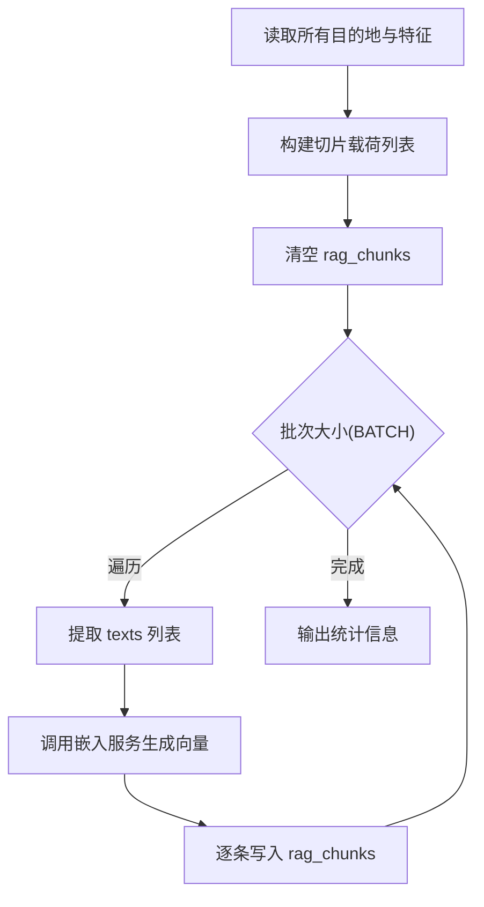
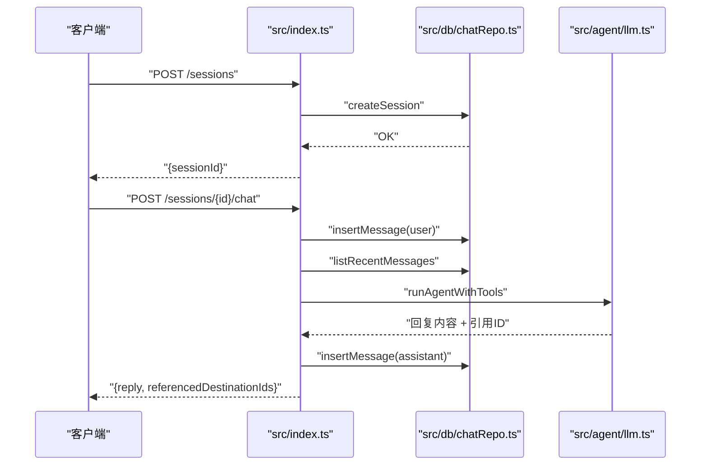
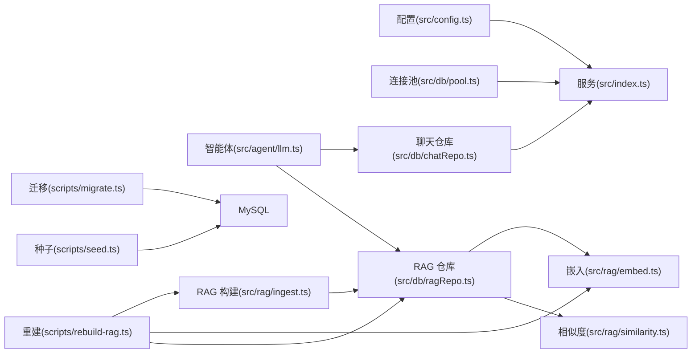

# 部署与运维

<cite>
**本文引用的文件**
- [docker-compose.yml](file://docker-compose.yml)
- [package.json](file://package.json)
- [src/config.ts](file://src/config.ts)
- [src/index.ts](file://src/index.ts)
- [src/db/pool.ts](file://src/db/pool.ts)
- [src/db/chatRepo.ts](file://src/db/chatRepo.ts)
- [src/db/destinationRepo.ts](file://src/db/destinationRepo.ts)
- [src/db/ragRepo.ts](file://src/db/ragRepo.ts)
- [src/rag/ingest.ts](file://src/rag/ingest.ts)
- [src/rag/embed.ts](file://src/rag/embed.ts)
- [src/rag/similarity.ts](file://src/rag/similarity.ts)
- [src/agent/llm.ts](file://src/agent/llm.ts)
- [scripts/migrate.ts](file://scripts/migrate.ts)
- [scripts/seed.ts](file://scripts/seed.ts)
- [scripts/rebuild-rag.ts](file://scripts/rebuild-rag.ts)
- [src/db/migrations/001_init.sql](file://src/db/migrations/001_init.sql)
</cite>

## 目录
1. [简介](#简介)
2. [项目结构](#项目结构)
3. [核心组件](#核心组件)
4. [架构总览](#架构总览)
5. [详细组件分析](#详细组件分析)
6. [依赖关系分析](#依赖关系分析)
7. [性能考虑](#性能考虑)
8. [故障排除指南](#故障排除指南)
9. [结论](#结论)
10. [附录](#附录)

## 简介
本指南面向 Guide-Plan-Agent 的部署与运维团队，覆盖从开发到生产的完整流程：容器化部署、生产环境配置、数据库迁移与种子数据导入、RAG 系统重建、性能监控与日志管理、故障排除、备份恢复、扩容与安全加固，以及 CI/CD 自动化部署建议。文档以仓库现有实现为依据，确保所有操作均可在当前代码库中落地。

## 项目结构
该仓库采用“功能分层 + 脚本工具”的组织方式：
- 应用服务：基于 Fastify 的 Web 服务，提供健康检查与会话聊天接口。
- 数据库层：MySQL 连接池封装、聊天与 RAG 表结构、查询仓库。
- 智能体与检索：LLM 调用、工具链、嵌入向量化、相似度计算、RAG 构建与检索。
- 运维脚本：数据库迁移、种子数据导入、RAG 重建。
- 编排与运行：docker-compose 提供 MySQL 健康检查；NPM 脚本提供构建、启动、迁移、种子、RAG 重建与容器编排快捷命令。

图表来源
- [src/index.ts:1-77](file://src/index.ts#L1-L77)
- [src/config.ts:1-46](file://src/config.ts#L1-L46)
- [src/db/pool.ts:1-17](file://src/db/pool.ts#L1-L17)
- [src/db/chatRepo.ts:1-53](file://src/db/chatRepo.ts#L1-L53)
- [src/db/destinationRepo.ts:1-100](file://src/db/destinationRepo.ts#L1-L100)
- [src/db/ragRepo.ts:1-143](file://src/db/ragRepo.ts#L1-L143)
- [src/rag/embed.ts:1-38](file://src/rag/embed.ts#L1-L38)
- [src/rag/similarity.ts:1-31](file://src/rag/similarity.ts#L1-L31)
- [src/rag/ingest.ts:1-77](file://src/rag/ingest.ts#L1-L77)
- [src/agent/llm.ts:1-114](file://src/agent/llm.ts#L1-L114)
- [scripts/migrate.ts:1-34](file://scripts/migrate.ts#L1-L34)
- [scripts/seed.ts:1-89](file://scripts/seed.ts#L1-L89)
- [scripts/rebuild-rag.ts:1-39](file://scripts/rebuild-rag.ts#L1-L39)

章节来源
- [package.json:1-31](file://package.json#L1-L31)
- [docker-compose.yml:1-16](file://docker-compose.yml#L1-L16)

## 核心组件
- 环境配置与校验：通过 Zod 对数据库与应用环境变量进行解析与校验，支持默认值与必填项约束。
- 数据库连接池：统一创建 MySQL 连接池，支持并发与连接限制。
- 聊天服务：提供会话创建、消息历史读取与智能体回复生成。
- RAG 存储与检索：向量表结构、切片载荷构建、嵌入向量化与语义相似度检索。
- 运维脚本：迁移 SQL 文件、种子数据初始化、RAG 全量重建。

章节来源
- [src/config.ts:1-46](file://src/config.ts#L1-L46)
- [src/db/pool.ts:1-17](file://src/db/pool.ts#L1-L17)
- [src/index.ts:1-77](file://src/index.ts#L1-L77)
- [src/db/migrations/001_init.sql:1-54](file://src/db/migrations/001_init.sql#L1-L54)
- [src/db/ragRepo.ts:1-143](file://src/db/ragRepo.ts#L1-L143)
- [src/rag/ingest.ts:1-77](file://src/rag/ingest.ts#L1-L77)
- [src/rag/embed.ts:1-38](file://src/rag/embed.ts#L1-L38)
- [src/rag/similarity.ts:1-31](file://src/rag/similarity.ts#L1-L31)
- [scripts/migrate.ts:1-34](file://scripts/migrate.ts#L1-L34)
- [scripts/seed.ts:1-89](file://scripts/seed.ts#L1-L89)
- [scripts/rebuild-rag.ts:1-39](file://scripts/rebuild-rag.ts#L1-L39)

## 架构总览
下图展示应用启动、请求处理、数据库与外部 LLM/嵌入服务交互的整体流程。

图表来源
- [src/index.ts:18-68](file://src/index.ts#L18-L68)
- [src/db/pool.ts:4-14](file://src/db/pool.ts#L4-L14)
- [src/agent/llm.ts:49-113](file://src/agent/llm.ts#L49-L113)
- [src/db/ragRepo.ts:97-142](file://src/db/ragRepo.ts#L97-L142)
- [src/rag/embed.ts:34-37](file://src/rag/embed.ts#L34-L37)

## 详细组件分析

### 部署与运行
- 本地开发与运行
  - 使用 NPM 脚本启动开发模式或生产构建后启动。
  - 开发模式自动监听源码变更，便于调试。
- 容器化编排
  - 使用 docker-compose 启动 MySQL 8，设置字符集、端口映射与健康检查。
  - 建议在生产环境中将数据库置于独立实例或托管服务，并通过环境变量连接。

章节来源
- [package.json:6-13](file://package.json#L6-L13)
- [docker-compose.yml:1-16](file://docker-compose.yml#L1-L16)

### 生产环境配置
- 必需环境变量
  - 数据库：MYSQL_HOST、MYSQL_PORT、MYSQL_USER、MYSQL_PASSWORD、MYSQL_DATABASE
  - 应用：PORT、OPENAI_API_KEY、OPENAI_BASE_URL、OPENAI_MODEL、OPENAI_EMBEDDING_MODEL、EMBEDDING_BASE_URL（可选）
  - 检索参数：CHAT_HISTORY_LIMIT、RAG_TOP_K_DEFAULT、RAG_CANDIDATE_LIMIT、LLM_MAX_TOOL_ROUNDS
- 默认值与校验
  - 所有配置通过 Zod 解析与校验，非法配置会抛出错误，避免运行时异常。
- 健康检查
  - 应用提供 /health 接口，内部执行数据库查询以判断可用性。

章节来源
- [src/config.ts:3-45](file://src/config.ts#L3-L45)
- [src/index.ts:18-26](file://src/index.ts#L18-L26)

### 数据库迁移与种子数据
- 迁移脚本
  - 自动创建数据库、切换库、读取迁移 SQL 并执行，保证表结构一致。
- 种子数据
  - 清空相关表后批量写入示例目的地与特征，便于演示与测试。
- 运行顺序
  - 先迁移，再导入种子数据，最后可按需重建 RAG。

图表来源
- [scripts/migrate.ts:10-28](file://scripts/migrate.ts#L10-L28)
- [scripts/seed.ts:5-83](file://scripts/seed.ts#L5-L83)
- [scripts/rebuild-rag.ts:10-33](file://scripts/rebuild-rag.ts#L10-L33)

章节来源
- [scripts/migrate.ts:1-34](file://scripts/migrate.ts#L1-L34)
- [scripts/seed.ts:1-89](file://scripts/seed.ts#L1-L89)
- [src/db/migrations/001_init.sql:1-54](file://src/db/migrations/001_init.sql#L1-L54)

### RAG 系统重建
- 数据来源
  - 从目的地与特征表构建切片载荷，包括摘要、合成文本与单项特征。
- 向量化
  - 调用嵌入服务生成向量，将结果写入 rag_chunks 表。
- 批处理
  - 分批处理，控制内存与网络开销。
- 重置策略
  - 重建前清空向量表，避免重复与脏数据。

图表来源
- [src/rag/ingest.ts:30-76](file://src/rag/ingest.ts#L30-L76)
- [src/db/ragRepo.ts:25-52](file://src/db/ragRepo.ts#L25-L52)
- [src/rag/embed.ts:7-32](file://src/rag/embed.ts#L7-L32)
- [scripts/rebuild-rag.ts:8-33](file://scripts/rebuild-rag.ts#L8-L33)

章节来源
- [src/rag/ingest.ts:1-77](file://src/rag/ingest.ts#L1-L77)
- [src/db/ragRepo.ts:1-143](file://src/db/ragRepo.ts#L1-L143)
- [src/rag/embed.ts:1-38](file://src/rag/embed.ts#L1-L38)
- [scripts/rebuild-rag.ts:1-39](file://scripts/rebuild-rag.ts#L1-L39)

### API 工作流
- 会话创建：生成 UUID 并持久化。
- 聊天请求：校验消息与会话存在性，写入用户消息，拉取历史，调用智能体工具链，写入助手消息并返回结果。

图表来源
- [src/index.ts:28-68](file://src/index.ts#L28-L68)
- [src/db/chatRepo.ts:6-52](file://src/db/chatRepo.ts#L6-L52)
- [src/agent/llm.ts:49-113](file://src/agent/llm.ts#L49-L113)

章节来源
- [src/index.ts:1-77](file://src/index.ts#L1-L77)
- [src/db/chatRepo.ts:1-53](file://src/db/chatRepo.ts#L1-L53)
- [src/agent/llm.ts:1-114](file://src/agent/llm.ts#L1-L114)

## 依赖关系分析
- 组件耦合
  - 应用服务依赖配置加载、连接池与聊天仓库；智能体依赖工具链与 RAG 仓库；RAG 仓库依赖嵌入与相似度模块。
- 外部依赖
  - MySQL 用于持久化；OpenAI 接口用于嵌入与对话补全。
- 可能的循环依赖
  - 当前模块间为单向依赖，未见循环。

图表来源
- [src/config.ts:1-46](file://src/config.ts#L1-L46)
- [src/index.ts:1-77](file://src/index.ts#L1-L77)
- [src/db/pool.ts:1-17](file://src/db/pool.ts#L1-L17)
- [src/db/chatRepo.ts:1-53](file://src/db/chatRepo.ts#L1-L53)
- [src/agent/llm.ts:1-114](file://src/agent/llm.ts#L1-L114)
- [src/db/ragRepo.ts:1-143](file://src/db/ragRepo.ts#L1-L143)
- [src/rag/embed.ts:1-38](file://src/rag/embed.ts#L1-L38)
- [src/rag/similarity.ts:1-31](file://src/rag/similarity.ts#L1-L31)
- [src/rag/ingest.ts:1-77](file://src/rag/ingest.ts#L1-L77)
- [scripts/migrate.ts:1-34](file://scripts/migrate.ts#L1-L34)
- [scripts/seed.ts:1-89](file://scripts/seed.ts#L1-L89)
- [scripts/rebuild-rag.ts:1-39](file://scripts/rebuild-rag.ts#L1-L39)

## 性能考虑
- 数据库连接池
  - 连接池默认并发上限适中，建议根据 QPS 与响应延迟调优。
- 查询优化
  - 聊天消息按会话与时间排序，建议保持索引有效；RAG 检索限制候选数量，避免全表扫描。
- 向量化与检索
  - 批量嵌入减少往返次数；topK 限制候选数量；相似度计算为 O(k·d)。
- LLM 调用
  - 控制最大工具轮次与温度参数，避免长对话导致延迟上升。
- 健康检查
  - /health 内部执行简单查询，建议仅在必要时频繁调用。

章节来源
- [src/db/pool.ts:4-14](file://src/db/pool.ts#L4-L14)
- [src/db/chatRepo.ts:23-40](file://src/db/chatRepo.ts#L23-L40)
- [src/db/ragRepo.ts:54-95](file://src/db/ragRepo.ts#L54-L95)
- [src/rag/similarity.ts:19-30](file://src/rag/similarity.ts#L19-L30)
- [src/agent/llm.ts:57-113](file://src/agent/llm.ts#L57-L113)

## 故障排除指南
- 健康检查失败
  - 现象：/health 返回数据库不可用。
  - 排查：确认数据库可达、凭据正确、迁移已执行。
- 会话不存在
  - 现象：聊天接口返回会话不存在。
  - 排查：确认会话 ID 是否通过 /sessions 正确创建。
- LLM 或嵌入服务错误
  - 现象：LLM 调用或嵌入接口返回非 2xx。
  - 排查：核对 API 密钥、模型名称、基础地址与网络连通性。
- RAG 重建失败
  - 现象：重建过程中断或向量写入异常。
  - 排查：检查嵌入服务可用性、输入文本长度、数据库权限与表结构一致性。
- 日志定位
  - 应用启动与错误日志由 Fastify 输出；脚本执行日志直接打印至标准输出。

章节来源
- [src/index.ts:18-26](file://src/index.ts#L18-L26)
- [src/db/chatRepo.ts:10-16](file://src/db/chatRepo.ts#L10-L16)
- [src/agent/llm.ts:42-46](file://src/agent/llm.ts#L42-L46)
- [src/rag/embed.ts:25-28](file://src/rag/embed.ts#L25-L28)
- [scripts/rebuild-rag.ts:35-38](file://scripts/rebuild-rag.ts#L35-L38)

## 结论
本指南基于仓库现有实现，提供了从环境准备、数据库迁移与种子导入、RAG 重建到运行监控与故障排除的完整运维路径。建议在生产环境中进一步完善安全、可观测性与自动化能力，确保系统稳定与可扩展。

## 附录

### 环境变量清单
- 数据库相关
  - MYSQL_HOST、MYSQL_PORT、MYSQL_USER、MYSQL_PASSWORD、MYSQL_DATABASE
- 应用相关
  - PORT、OPENAI_API_KEY、OPENAI_BASE_URL、OPENAI_MODEL、OPENAI_EMBEDDING_MODEL、EMBEDDING_BASE_URL
- 检索与对话
  - CHAT_HISTORY_LIMIT、RAG_TOP_K_DEFAULT、RAG_CANDIDATE_LIMIT、LLM_MAX_TOOL_ROUNDS

章节来源
- [src/config.ts:3-22](file://src/config.ts#L3-L22)

### 部署步骤（建议）
- 准备
  - 安装 Node.js（版本要求）、MySQL 实例（或使用 docker-compose）。
  - 设置环境变量与 .env 文件。
- 初始化
  - 执行数据库迁移脚本。
  - 执行种子脚本导入示例数据。
  - 如需，执行 RAG 重建脚本。
- 启动
  - 构建应用并启动服务，或使用开发模式监听。
- 验证
  - 访问 /health 检查数据库连通性。
  - 创建会话并发起一次聊天请求验证端到端流程。

章节来源
- [package.json:6-13](file://package.json#L6-L13)
- [scripts/migrate.ts:10-28](file://scripts/migrate.ts#L10-L28)
- [scripts/seed.ts:5-83](file://scripts/seed.ts#L5-L83)
- [scripts/rebuild-rag.ts:10-33](file://scripts/rebuild-rag.ts#L10-L33)
- [src/index.ts:18-26](file://src/index.ts#L18-L26)

### 监控与日志
- 健康检查
  - /health 接口返回数据库状态，可用于容器编排健康探针。
- 日志
  - 应用日志由 Fastify 输出；脚本日志直接输出。
- 建议
  - 在生产环境接入集中式日志与指标采集（如 Prometheus/Grafana），并为关键接口增加埋点与告警阈值。

章节来源
- [src/index.ts:18-26](file://src/index.ts#L18-L26)

### 备份与恢复
- 备份
  - 使用 MySQL 备份工具导出结构与数据；建议定期增量备份。
- 恢复
  - 在新实例上先执行迁移脚本，再导入备份数据，最后按需重建 RAG。
- 注意
  - RAG 重建会清空向量表，恢复后需重新构建。

章节来源
- [scripts/migrate.ts:10-28](file://scripts/migrate.ts#L10-L28)
- [src/db/migrations/001_init.sql:1-54](file://src/db/migrations/001_init.sql#L1-L54)
- [scripts/rebuild-rag.ts:14-14](file://scripts/rebuild-rag.ts#L14-L14)

### 扩容策略
- 应用层
  - 使用进程外负载均衡与多副本部署，共享数据库。
- 数据库层
  - 采用主从复制或托管数据库服务，读写分离与只读副本。
- 向量化与检索
  - 控制候选数量与批大小，避免单节点过载；必要时引入缓存中间结果。

章节来源
- [src/db/pool.ts:4-14](file://src/db/pool.ts#L4-L14)
- [src/db/ragRepo.ts:123-134](file://src/db/ragRepo.ts#L123-L134)

### 安全加固
- 环境变量与密钥
  - 将敏感信息放入受控的环境变量或密钥管理服务，避免硬编码。
- 网络与访问控制
  - 限制数据库与 LLM 接口访问范围，启用 TLS 与最小权限原则。
- 输入校验与限流
  - 对聊天输入进行长度与格式限制；对公共接口增加速率限制与熔断。

章节来源
- [src/config.ts:27-41](file://src/config.ts#L27-L41)
- [src/agent/llm.ts:42-46](file://src/agent/llm.ts#L42-L46)

### CI/CD 与自动化部署
- 构建与测试
  - 在流水线中执行构建与脚本任务（迁移、种子、RAG 重建）。
- 部署
  - 使用容器镜像与编排平台（如 Kubernetes）管理滚动更新与健康检查。
- 发布策略
  - 建议蓝绿或金丝雀发布，配合回滚机制与告警联动。

章节来源
- [package.json:6-13](file://package.json#L6-L13)
- [docker-compose.yml:1-16](file://docker-compose.yml#L1-L16)