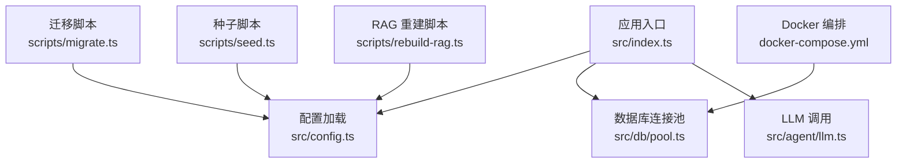
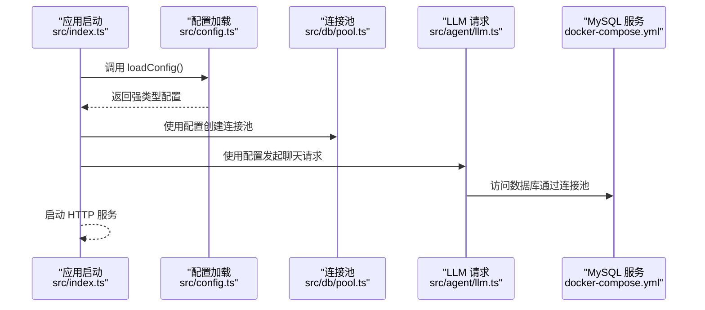
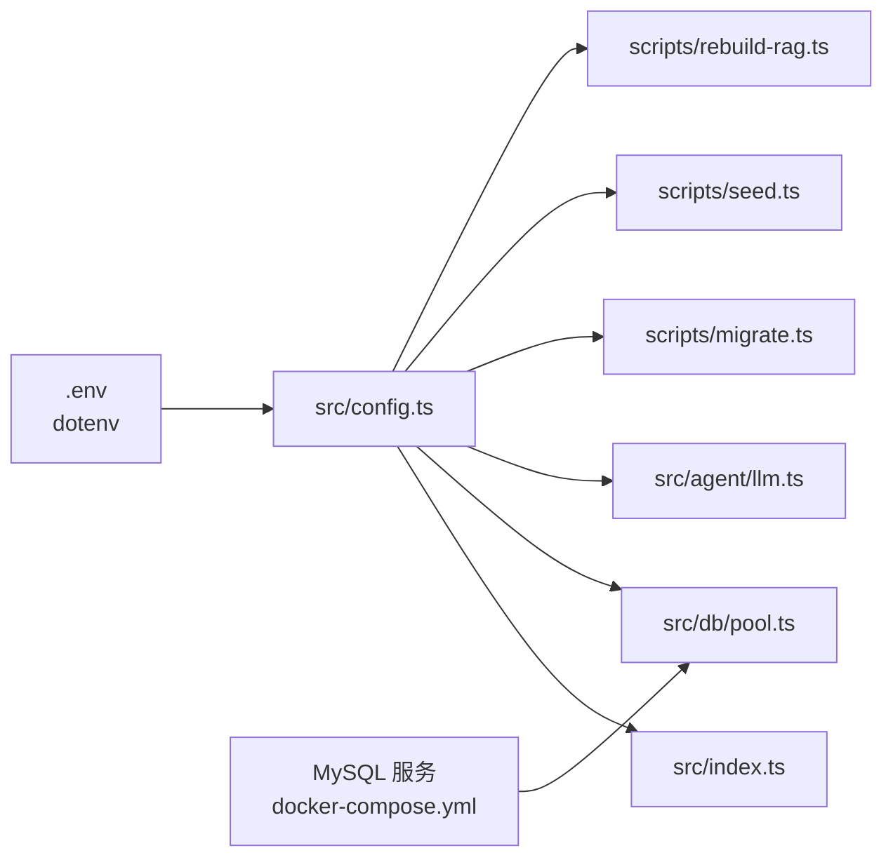

# 配置管理

<cite>
**本文引用的文件列表**
- [src/config.ts](file://src/config.ts)
- [src/index.ts](file://src/index.ts)
- [src/db/pool.ts](file://src/db/pool.ts)
- [src/agent/llm.ts](file://src/agent/llm.ts)
- [scripts/migrate.ts](file://scripts/migrate.ts)
- [scripts/seed.ts](file://scripts/seed.ts)
- [scripts/rebuild-rag.ts](file://scripts/rebuild-rag.ts)
- [docker-compose.yml](file://docker-compose.yml)
- [package.json](file://package.json)
- [src/db/migrations/001_init.sql](file://src/db/migrations/001_init.sql)
</cite>

## 目录
1. [简介](#简介)
2. [项目结构](#项目结构)
3. [核心组件](#核心组件)
4. [架构总览](#架构总览)
5. [详细组件分析](#详细组件分析)
6. [依赖关系分析](#依赖关系分析)
7. [性能考虑](#性能考虑)
8. [故障排查指南](#故障排查指南)
9. [结论](#结论)
10. [附录](#附录)

## 简介
本文件系统性说明 Guide-Plan-Agent 的配置管理方案，涵盖环境变量配置、数据库连接配置、LLM 参数配置；解释配置文件组织结构、默认值设置与环境覆盖机制；对比生产与开发差异、给出安全与敏感信息保护策略；并提供 Docker 容器化部署说明（服务编排、网络与数据卷）、配置验证与错误处理策略。

## 项目结构
- 配置定义集中在 src/config.ts，使用 Zod 进行类型与默认值校验。
- 应用入口 src/index.ts 加载配置并启动服务。
- 数据库连接在 src/db/pool.ts 中基于 AppConfig/DbConfig 构建连接池。
- LLM 请求在 src/agent/llm.ts 中使用 AppConfig 发起请求。
- 迁移、种子与 RAG 重建脚本均通过 dotenv 加载环境变量并调用配置加载函数。
- docker-compose.yml 提供 MySQL 服务编排与健康检查。
- package.json 定义运行时脚本与依赖。

图表来源
- [src/index.ts:11-71](file://src/index.ts#L11-L71)
- [src/config.ts:27-41](file://src/config.ts#L27-L41)
- [src/db/pool.ts:4-14](file://src/db/pool.ts#L4-L14)
- [src/agent/llm.ts:26-47](file://src/agent/llm.ts#L26-L47)
- [scripts/migrate.ts:10-28](file://scripts/migrate.ts#L10-L28)
- [scripts/seed.ts:5-15](file://scripts/seed.ts#L5-L15)
- [scripts/rebuild-rag.ts:10-33](file://scripts/rebuild-rag.ts#L10-L33)
- [docker-compose.yml:1-16](file://docker-compose.yml#L1-L16)

章节来源
- [src/config.ts:1-46](file://src/config.ts#L1-L46)
- [src/index.ts:1-77](file://src/index.ts#L1-L77)
- [docker-compose.yml:1-16](file://docker-compose.yml#L1-L16)

## 核心组件
- 配置模式与默认值：通过 Zod Schema 定义数据库与应用级配置，并提供合理默认值。
- 配置加载函数：loadConfig()/loadDbConfig() 将 process.env 解析为强类型对象，失败时抛出错误。
- 嵌入模型基础地址：embeddingBaseUrl() 支持独立覆盖嵌入接口地址。
- 数据库连接池：基于 AppConfig/DbConfig 创建连接池，统一参数来源。
- LLM 请求：根据 AppConfig 组装 chat/completions 请求，携带认证与模型参数。
- 迁移/种子/RAG 脚本：统一通过 dotenv 加载 .env 并调用配置加载函数。

章节来源
- [src/config.ts:27-45](file://src/config.ts#L27-L45)
- [src/db/pool.ts:4-14](file://src/db/pool.ts#L4-L14)
- [src/agent/llm.ts:26-47](file://src/agent/llm.ts#L26-L47)
- [scripts/migrate.ts:10-28](file://scripts/migrate.ts#L10-L28)
- [scripts/seed.ts:5-15](file://scripts/seed.ts#L5-L15)
- [scripts/rebuild-rag.ts:10-33](file://scripts/rebuild-rag.ts#L10-L33)

## 架构总览
下图展示配置在系统中的流转路径：应用启动时加载配置，数据库连接池与 LLM 请求均依赖该配置；迁移/种子/RAG 脚本同样依赖配置进行数据库操作与 LLM 调用。

图表来源
- [src/index.ts:11-71](file://src/index.ts#L11-L71)
- [src/config.ts:35-41](file://src/config.ts#L35-L41)
- [src/db/pool.ts:4-14](file://src/db/pool.ts#L4-L14)
- [src/agent/llm.ts:26-47](file://src/agent/llm.ts#L26-L47)
- [docker-compose.yml:1-16](file://docker-compose.yml#L1-L16)

## 详细组件分析

### 环境变量与配置模式
- 数据库配置键：
  - MYSQL_HOST：默认 127.0.0.1
  - MYSQL_PORT：默认 3306
  - MYSQL_USER：默认 root
  - MYSQL_PASSWORD：默认空字符串
  - MYSQL_DATABASE：默认 guide_plan
- 应用配置键（除数据库外）：
  - PORT：默认 3000
  - OPENAI_BASE_URL：默认 https://api.openai.com/v1
  - OPENAI_API_KEY：必填（最小长度 1）
  - OPENAI_MODEL：默认 gpt-4o-mini
  - OPENAI_EMBEDDING_MODEL：默认 text-embedding-3-small
  - EMBEDDING_BASE_URL：可选，未设置时回退到 OPENAI_BASE_URL
  - CHAT_HISTORY_LIMIT：默认 30
  - RAG_TOP_K_DEFAULT：默认 8
  - RAG_CANDIDATE_LIMIT：默认 2000
  - LLM_MAX_TOOL_ROUNDS：默认 10
- 加载行为：
  - loadDbConfig() 仅解析数据库相关键，失败抛错
  - loadConfig() 解析全部键，失败抛错
  - embeddingBaseUrl() 提供嵌入接口地址的优先级逻辑

章节来源
- [src/config.ts:3-22](file://src/config.ts#L3-L22)
- [src/config.ts:27-45](file://src/config.ts#L27-L45)

### 数据库连接配置
- 连接池创建：
  - 使用 host/port/user/password/database 等键构建连接池
  - waitForConnections=true，connectionLimit=10
- 迁移/种子/RAG 脚本：
  - 迁移脚本使用 loadDbConfig() 获取数据库凭据并执行初始化 SQL
  - 种子脚本使用 loadDbConfig() 初始化示例数据
  - RAG 重建脚本使用 loadConfig() 获取 LLM 与嵌入相关参数

章节来源
- [src/db/pool.ts:4-14](file://src/db/pool.ts#L4-L14)
- [scripts/migrate.ts:10-28](file://scripts/migrate.ts#L10-L28)
- [scripts/seed.ts:5-15](file://scripts/seed.ts#L5-L15)
- [scripts/rebuild-rag.ts:10-33](file://scripts/rebuild-rag.ts#L10-L33)

### LLM 参数配置
- 模型与端点：
  - 使用 OPENAI_BASE_URL 拼接 chat/completions
  - 使用 OPENAI_MODEL 指定模型
  - 使用 OPENAI_API_KEY 注入认证头
- 嵌入接口：
  - EMBEDDING_BASE_URL 可单独覆盖，否则回退到 OPENAI_BASE_URL
  - 使用 OPENAI_EMBEDDING_MODEL 指定嵌入模型
- 对话历史与工具轮次：
  - CHAT_HISTORY_LIMIT 控制历史消息上限
  - LLM_MAX_TOOL_ROUNDS 限制工具调用轮次，避免无限循环

章节来源
- [src/agent/llm.ts:26-47](file://src/agent/llm.ts#L26-L47)
- [src/config.ts:13-21](file://src/config.ts#L13-L21)
- [src/config.ts:43-45](file://src/config.ts#L43-L45)

### 配置文件组织结构与默认值
- 组织结构：
  - 配置定义集中于 src/config.ts，导出类型与加载函数
  - 应用入口 src/index.ts 在启动时加载配置并注册路由
  - 迁移/种子/RAG 脚本位于 scripts/ 目录，统一通过 dotenv 加载 .env
- 默认值：
  - 数据库与应用配置均提供合理默认值，便于本地开发
- 环境覆盖：
  - 所有配置均来自 process.env，Zod 校验失败会抛出错误
  - EMBEDDING_BASE_URL 可覆盖嵌入接口地址

章节来源
- [src/config.ts:1-46](file://src/config.ts#L1-L46)
- [src/index.ts:11-13](file://src/index.ts#L11-L13)
- [scripts/migrate.ts:1](file://scripts/migrate.ts#L1)
- [scripts/seed.ts:1](file://scripts/seed.ts#L1)
- [scripts/rebuild-rag.ts:1](file://scripts/rebuild-rag.ts#L1)

### 开发与生产差异
- 开发环境：
  - 通过 dotenv 加载 .env，本地启动使用默认端口与数据库配置
  - docker-compose.yml 提供 MySQL 服务，端口映射至 3307
- 生产环境：
  - 建议通过容器编排或平台变量注入 OPENAI_API_KEY、数据库凭据与端口
  - 嵌入接口可通过 EMBEDDING_BASE_URL 单独指向企业版或自托管服务
- 端口与访问：
  - 应用监听 0.0.0.0:PORT，默认 3000
  - CORS 已启用，允许跨域

章节来源
- [src/index.ts:16-16](file://src/index.ts#L16)
- [src/index.ts:70-70](file://src/index.ts#L70)
- [docker-compose.yml:7-8](file://docker-compose.yml#L7-L8)
- [src/config.ts:12-12](file://src/config.ts#L12)

### 安全配置最佳实践与敏感信息保护
- 敏感信息：
  - OPENAI_API_KEY 必须通过环境变量注入，严禁硬编码
  - 数据库凭据（MYSQL_USER/MYSQL_PASSWORD）应通过环境变量注入
- 最佳实践：
  - 使用 .env 文件管理本地开发密钥，加入 .gitignore
  - 在生产中通过平台机密管理或容器编排的密钥注入
  - 限制数据库用户权限，仅授予必要权限
  - 使用 HTTPS 与反向代理保护 API 传输安全
- 配置校验：
  - Zod 对必填项与类型进行严格校验，失败即抛错，避免静默失败

章节来源
- [src/config.ts:14-14](file://src/config.ts#L14)
- [src/config.ts:6-8](file://src/config.ts#L6-L8)
- [src/config.ts:37-39](file://src/config.ts#L37-L39)

### Docker 容器化配置
- 服务编排：
  - MySQL 服务使用官方镜像，设置 root 密码与数据库名
  - 暴露端口 3306，映射到宿主机 3307
  - 健康检查使用 mysqladmin ping，具备重试与启动延时
- 网络配置：
  - 容器内 MySQL 监听默认端口，宿主机映射以避免冲突
- 数据卷管理：
  - 当前 compose 未显式声明数据卷，建议在生产中挂载持久化卷
- 应用容器化建议：
  - 将应用容器与 MySQL 容器置于同一网络
  - 通过环境变量传递数据库与 LLM 凭据
  - 使用健康检查与重启策略提升可用性

章节来源
- [docker-compose.yml:1-16](file://docker-compose.yml#L1-L16)

### 配置验证机制与错误处理策略
- 验证机制：
  - loadConfig()/loadDbConfig() 使用 Zod.safeParse 校验 process.env
  - 失败时抛出包含字段错误信息的错误，便于定位问题
- 错误处理策略：
  - 应用启动阶段若配置无效，立即退出进程
  - LLM 请求失败时返回明确错误信息
  - 数据库连接异常在健康检查中暴露，便于运维发现

章节来源
- [src/config.ts:27-41](file://src/config.ts#L27-L41)
- [src/agent/llm.ts:42-46](file://src/agent/llm.ts#L42-L46)
- [src/index.ts:18-26](file://src/index.ts#L18-L26)

## 依赖关系分析
- 配置依赖链：
  - src/index.ts -> src/config.ts -> process.env
  - src/db/pool.ts -> src/config.ts
  - src/agent/llm.ts -> src/config.ts
  - scripts/* -> src/config.ts
- 外部依赖：
  - dotenv：用于加载 .env 文件
  - mysql2：用于数据库连接与迁移
  - fastify：用于 HTTP 服务
  - zod：用于配置校验

图表来源
- [src/config.ts:1](file://src/config.ts#L1)
- [src/index.ts:1](file://src/index.ts#L1)
- [src/db/pool.ts:1](file://src/db/pool.ts#L1)
- [src/agent/llm.ts:1](file://src/agent/llm.ts#L1)
- [scripts/migrate.ts:1](file://scripts/migrate.ts#L1)
- [scripts/seed.ts:1](file://scripts/seed.ts#L1)
- [scripts/rebuild-rag.ts:1](file://scripts/rebuild-rag.ts#L1)
- [docker-compose.yml:1](file://docker-compose.yml#L1)

章节来源
- [package.json:18-30](file://package.json#L18-L30)

## 性能考虑
- 连接池参数：
  - connectionLimit=10，适用于中小规模并发；可根据负载调整
  - waitForConnections=true，避免瞬时高峰导致拒绝
- LLM 调用：
  - 温度固定为 0.4，减少随机性带来的重复计算
  - 工具调用轮次上限 LLM_MAX_TOOL_ROUNDS=10，防止长时间阻塞
- 嵌入与 RAG：
  - RAG 批处理大小 BATCH=16，平衡吞吐与内存占用
  - 建议在生产中对嵌入接口进行缓存与限流

## 故障排查指南
- 启动失败（配置无效）：
  - 检查 .env 是否正确加载，确认必填项（如 OPENAI_API_KEY）是否存在
  - 查看错误输出中的字段错误信息，逐项修正
- 数据库连接失败：
  - 确认 MYSQL_HOST/PORT/USER/PASSWORD/DATABASE 是否正确
  - 若使用 Docker，确认端口映射与网络连通性
- LLM 请求失败：
  - 检查 OPENAI_BASE_URL 与 OPENAI_API_KEY
  - 关注响应状态码与错误文本，必要时开启更详细的日志
- 健康检查失败：
  - 应用健康端点会检测数据库连接，失败时返回错误详情

章节来源
- [src/config.ts:27-41](file://src/config.ts#L27-L41)
- [src/index.ts:18-26](file://src/index.ts#L18-L26)
- [src/agent/llm.ts:42-46](file://src/agent/llm.ts#L42-L46)

## 结论
本项目采用集中式配置管理模式，通过 Zod 实现强类型与默认值控制，确保开发与生产的可移植性与安全性。配合 Docker 编排与脚本化的迁移/种子/RAG 流程，形成从环境准备到数据初始化再到服务上线的完整配置闭环。建议在生产环境中强化密钥管理、网络隔离与监控告警，持续优化连接池与 LLM 调用参数以满足业务峰值需求。

## 附录
- 数据库初始化 SQL：包含目的地、特征、会话与消息、RAG 分片等表结构
- 运行脚本：包含构建、启动、迁移、种子、RAG 重建与 Docker 启动命令

章节来源
- [src/db/migrations/001_init.sql:1-54](file://src/db/migrations/001_init.sql#L1-L54)
- [package.json:6-14](file://package.json#L6-L14)