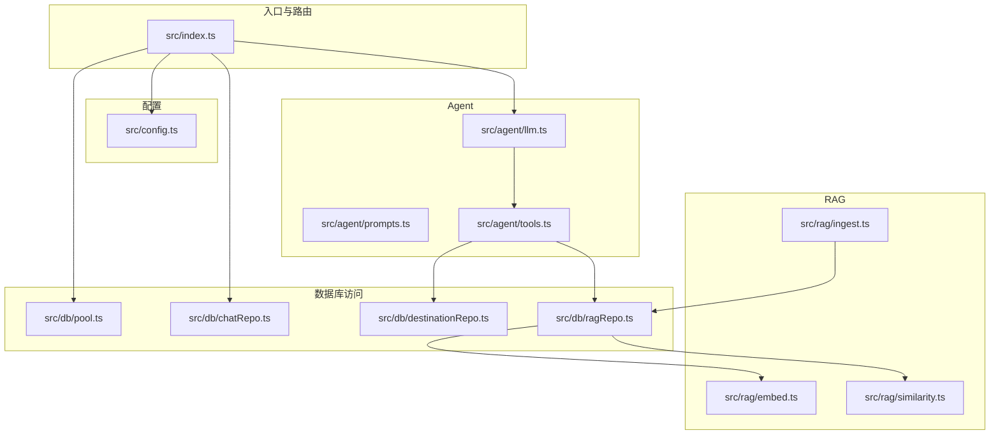
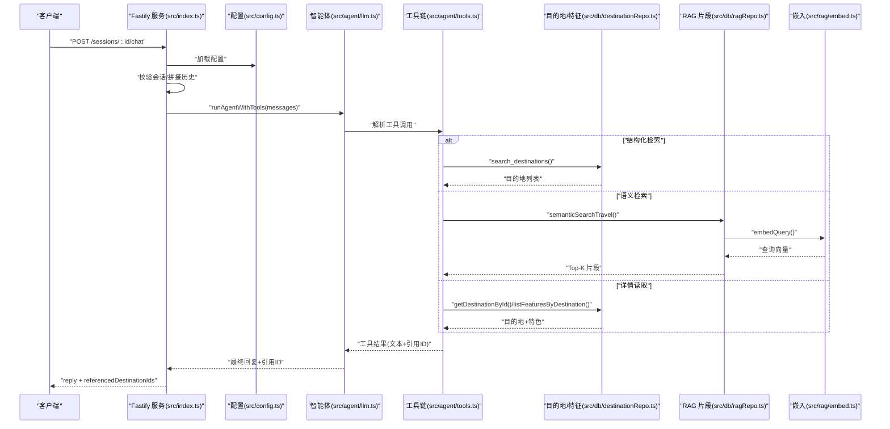
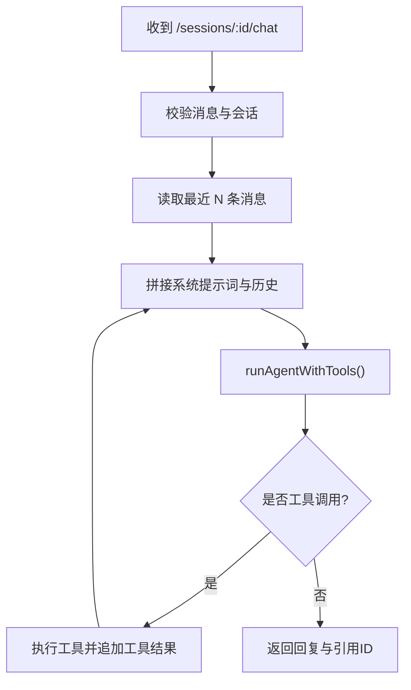
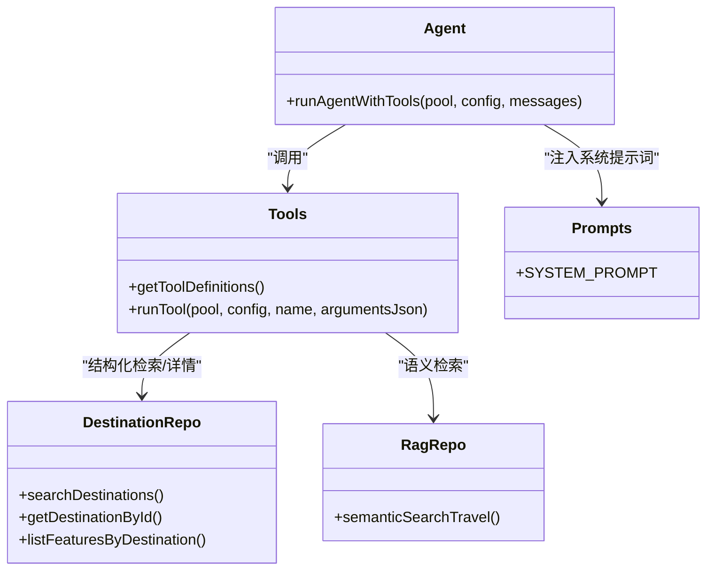
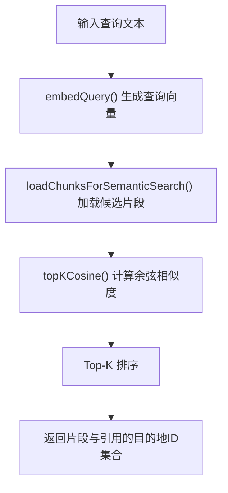
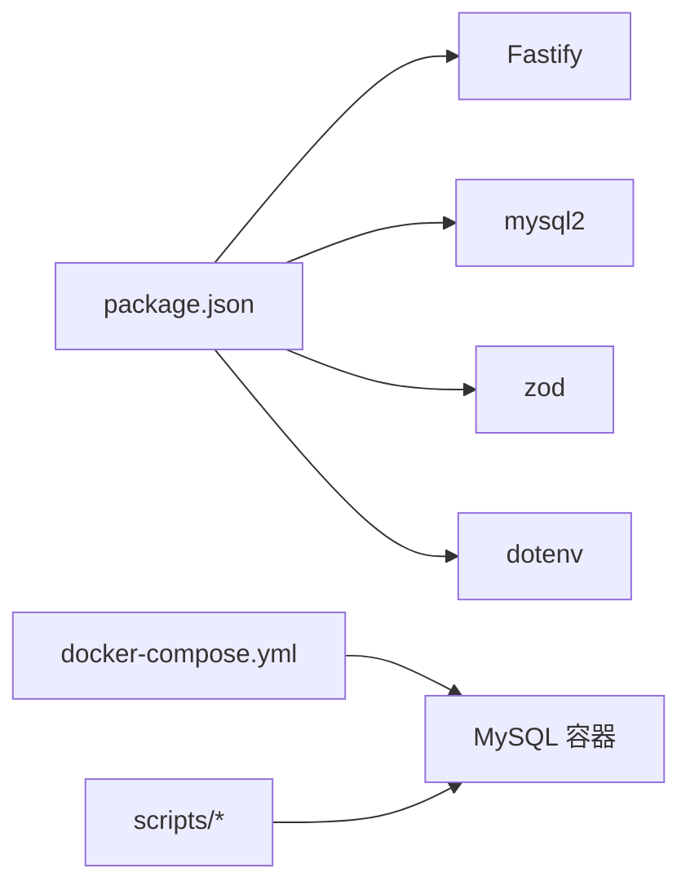

# 项目概述

<cite>
**本文引用的文件**
- [package.json](file://package.json)
- [AGENTS.md](file://AGENTS.md)
- [docker-compose.yml](file://docker-compose.yml)
- [src/index.ts](file://src/index.ts)
- [src/config.ts](file://src/config.ts)
- [src/agent/llm.ts](file://src/agent/llm.ts)
- [src/agent/prompts.ts](file://src/agent/prompts.ts)
- [src/agent/tools.ts](file://src/agent/tools.ts)
- [src/db/pool.ts](file://src/db/pool.ts)
- [src/db/chatRepo.ts](file://src/db/chatRepo.ts)
- [src/db/destinationRepo.ts](file://src/db/destinationRepo.ts)
- [src/db/ragRepo.ts](file://src/db/ragRepo.ts)
- [src/rag/embed.ts](file://src/rag/embed.ts)
- [src/rag/ingest.ts](file://src/rag/ingest.ts)
- [src/rag/similarity.ts](file://src/rag/similarity.ts)
</cite>

## 目录
1. [引言](#引言)
2. [项目结构](#项目结构)
3. [核心组件](#核心组件)
4. [架构总览](#架构总览)
5. [详细组件分析](#详细组件分析)
6. [依赖关系分析](#依赖关系分析)
7. [性能考量](#性能考量)
8. [故障排查指南](#故障排查指南)
9. [结论](#结论)
10. [附录](#附录)

## 引言
Guide-Plan-Agent 是一个面向旅游行业的 AI 助手平台，旨在通过“智能体 + 检索增强生成”的方式，为用户提供高质量、可执行的旅行规划建议。项目具备以下核心价值与目标：
- 基于 AI 的旅游规划助手：通过系统提示词与工具链驱动的智能体，结合对话历史与目的地结构化数据，输出可落地的旅行建议。
- RAG 检索增强生成系统：对目的地摘要、特色条目与合成文本进行向量化嵌入，支持语义检索与相似度排序，提升问答与推荐的准确性与上下文相关性。
- 多模态检索能力：当前以文本检索为主，通过结构化检索（关键词 LIKE 匹配）与语义检索（向量相似度）互补，覆盖明确关键词与模糊意图场景。

在旅游行业中的应用优势：
- 提升用户体验：以自然语言交互快速获得个性化建议，减少信息筛选成本。
- 知识可信度保障：优先调用结构化事实（如目的地详情），避免虚构信息。
- 可扩展的知识体系：通过向量化知识库与工具链，持续扩展目的地与特色内容。

技术选型理由：
- 服务端框架：Fastify 轻量、高性能，适配高并发聊天请求。
- 数据库：MySQL 存储目的地与特征等结构化数据，配合 RAG 向量片段表。
- 大模型与嵌入：统一通过 OpenAI 兼容接口（可配置 Base URL）调用，便于替换与扩展。
- 类型安全：TypeScript 严格模式，Zod 进行环境变量校验，降低运行期错误风险。

与其他类似方案的差异化特点：
- 工具驱动的智能体：通过结构化的工具定义与调用，确保输出内容来自真实数据源。
- 双检索策略：结构化检索与语义检索并存，兼顾精确匹配与泛化理解。
- 会话状态管理：内置会话与消息历史持久化，支持多轮对话与上下文延续。

## 项目结构
项目采用按职责分层的组织方式：
- 入口与路由：Fastify 服务入口负责健康检查、会话创建与聊天接口。
- 配置模块：集中加载与校验环境变量，提供数据库与 LLM/Embedding 配置。
- Agent 层：LLM 调用、系统提示词、工具定义与执行。
- 数据访问层：数据库连接池、聊天会话与消息、目的地与特征、RAG 片段。
- RAG 层：嵌入生成、向量相似度计算、语义检索与知识入库构建。

图表来源
- [src/index.ts:1-77](file://src/index.ts#L1-L77)
- [src/config.ts:1-46](file://src/config.ts#L1-L46)
- [src/agent/llm.ts:1-114](file://src/agent/llm.ts#L1-L114)
- [src/agent/tools.ts:1-195](file://src/agent/tools.ts#L1-L195)
- [src/db/pool.ts:1-17](file://src/db/pool.ts#L1-L17)
- [src/db/chatRepo.ts:1-53](file://src/db/chatRepo.ts#L1-L53)
- [src/db/destinationRepo.ts:1-100](file://src/db/destinationRepo.ts#L1-L100)
- [src/db/ragRepo.ts:1-143](file://src/db/ragRepo.ts#L1-L143)
- [src/rag/embed.ts:1-38](file://src/rag/embed.ts#L1-L38)
- [src/rag/similarity.ts:1-31](file://src/rag/similarity.ts#L1-L31)
- [src/rag/ingest.ts:1-77](file://src/rag/ingest.ts#L1-L77)

章节来源
- [package.json:1-31](file://package.json#L1-L31)
- [docker-compose.yml:1-16](file://docker-compose.yml#L1-L16)
- [AGENTS.md:1-13](file://AGENTS.md#L1-L13)

## 核心组件
- Fastify 服务与路由
  - 健康检查：验证数据库连通性。
  - 会话管理：创建会话、校验会话存在性。
  - 聊天接口：接收用户消息，拼接系统提示词与历史消息，调用智能体工具链，返回回复与引用的目的地 ID 列表。
- 配置模块
  - 统一加载与校验数据库、LLM、嵌入、RAG、会话历史长度等参数，支持自定义嵌入服务 Base URL。
- Agent 智能体
  - 系统提示词：约束工具调用顺序、事实优先级与输出规范。
  - LLM 调用：封装 chat/completions 请求，支持工具调用与多轮工具循环。
  - 工具链：提供结构化检索、语义检索、目的地详情读取三类工具，返回文本与引用的目的地 ID 集合。
- 数据访问层
  - 数据库连接池：统一配置 MySQL 连接参数。
  - 聊天会话：创建会话、插入消息、按时间倒序读取最近 N 条消息。
  - 目的地与特征：结构化检索、按 ID 查询、按目的地聚合特征。
  - RAG 片段：插入/截断向量片段、按目的地或全库加载候选片段、执行语义检索。
- RAG 模块
  - 嵌入生成：调用 embeddings 接口生成查询与文本向量。
  - 相似度计算：余弦相似度与 Top-K 排序。
  - 知识入库：从目的地与特征数据构建摘要、合成与明细文本块，生成内容哈希去重。

章节来源
- [src/index.ts:11-77](file://src/index.ts#L11-L77)
- [src/config.ts:27-46](file://src/config.ts#L27-L46)
- [src/agent/prompts.ts:1-10](file://src/agent/prompts.ts#L1-L10)
- [src/agent/llm.ts:49-114](file://src/agent/llm.ts#L49-L114)
- [src/agent/tools.ts:15-69](file://src/agent/tools.ts#L15-L69)
- [src/db/pool.ts:4-14](file://src/db/pool.ts#L4-L14)
- [src/db/chatRepo.ts:6-52](file://src/db/chatRepo.ts#L6-L52)
- [src/db/destinationRepo.ts:20-100](file://src/db/destinationRepo.ts#L20-L100)
- [src/db/ragRepo.ts:25-143](file://src/db/ragRepo.ts#L25-L143)
- [src/rag/embed.ts:7-37](file://src/rag/embed.ts#L7-L37)
- [src/rag/similarity.ts:19-31](file://src/rag/similarity.ts#L19-L31)
- [src/rag/ingest.ts:30-77](file://src/rag/ingest.ts#L30-L77)

## 架构总览
整体架构围绕“服务入口 → 智能体 → 工具链 → 数据库/RAG”的路径展开，支持多轮工具调用与会话历史延续。

图表来源
- [src/index.ts:35-68](file://src/index.ts#L35-L68)
- [src/agent/llm.ts:49-114](file://src/agent/llm.ts#L49-L114)
- [src/agent/tools.ts:114-195](file://src/agent/tools.ts#L114-L195)
- [src/db/destinationRepo.ts:20-85](file://src/db/destinationRepo.ts#L20-L85)
- [src/db/ragRepo.ts:97-143](file://src/db/ragRepo.ts#L97-L143)
- [src/rag/embed.ts:34-37](file://src/rag/embed.ts#L34-L37)

## 详细组件分析

### 服务入口与路由
- 健康检查：验证数据库连通性，返回服务状态。
- 会话管理：创建 UUID 会话并持久化；校验会话是否存在。
- 聊天接口：校验消息、读取最近历史、拼接系统提示词，调用智能体工具链，写入助手回复，返回文本与引用的目的地 ID 列表。

图表来源
- [src/index.ts:35-68](file://src/index.ts#L35-L68)
- [src/agent/llm.ts:49-114](file://src/agent/llm.ts#L49-L114)

章节来源
- [src/index.ts:18-71](file://src/index.ts#L18-L71)

### 配置模块
- 数据库配置：主机、端口、用户、密码、数据库名。
- 应用配置：端口、大模型与嵌入服务地址、模型名、嵌入模型名、会话历史条数、RAG 默认与候选数量、工具调用最大轮次。
- 嵌入 Base URL 解析：若未设置则回退到大模型 Base URL。

章节来源
- [src/config.ts:3-46](file://src/config.ts#L3-L46)

### Agent 智能体与工具链
- 系统提示词：约束工具调用顺序、事实优先级、输出格式与引用规范。
- LLM 调用：封装 chat/completions 请求，支持工具选择与温度控制；在工具调用失败时记录错误文本。
- 工具链：
  - 结构化检索：关键词/地区/限制条数。
  - 语义检索：自然语言查询，支持地区预筛选与 Top-K 返回。
  - 目的地详情：读取结构化摘要、标签与分类特征清单。

图表来源
- [src/agent/llm.ts:49-114](file://src/agent/llm.ts#L49-L114)
- [src/agent/tools.ts:15-195](file://src/agent/tools.ts#L15-L195)
- [src/agent/prompts.ts:1-10](file://src/agent/prompts.ts#L1-L10)
- [src/db/destinationRepo.ts:20-85](file://src/db/destinationRepo.ts#L20-L85)
- [src/db/ragRepo.ts:97-143](file://src/db/ragRepo.ts#L97-L143)

章节来源
- [src/agent/llm.ts:26-47](file://src/agent/llm.ts#L26-L47)
- [src/agent/prompts.ts:1-10](file://src/agent/prompts.ts#L1-L10)
- [src/agent/tools.ts:67-113](file://src/agent/tools.ts#L67-L113)

### 数据访问层
- 数据库连接池：统一配置连接参数与等待策略。
- 聊天会话：插入消息、按时间倒序读取最近 N 条并恢复顺序。
- 目的地与特征：支持 LIKE 关键词检索、按目的地聚合特征、列出全部数据。
- RAG 片段：截断与插入向量片段、按目的地或全库加载候选、执行语义检索。

章节来源
- [src/db/pool.ts:4-14](file://src/db/pool.ts#L4-L14)
- [src/db/chatRepo.ts:6-52](file://src/db/chatRepo.ts#L6-L52)
- [src/db/destinationRepo.ts:20-100](file://src/db/destinationRepo.ts#L20-L100)
- [src/db/ragRepo.ts:25-143](file://src/db/ragRepo.ts#L25-L143)

### RAG 模块
- 嵌入生成：批量生成文本向量，按索引排序返回。
- 相似度计算：余弦相似度与 Top-K 排序。
- 知识入库：从目的地摘要、特征明细与合成文本构建文本块，生成内容哈希避免重复。

图表来源
- [src/rag/embed.ts:34-37](file://src/rag/embed.ts#L34-L37)
- [src/rag/similarity.ts:19-31](file://src/rag/similarity.ts#L19-L31)
- [src/db/ragRepo.ts:97-143](file://src/db/ragRepo.ts#L97-L143)

章节来源
- [src/rag/embed.ts:7-37](file://src/rag/embed.ts#L7-L37)
- [src/rag/similarity.ts:1-31](file://src/rag/similarity.ts#L1-L31)
- [src/rag/ingest.ts:30-77](file://src/rag/ingest.ts#L30-L77)

## 依赖关系分析
- 运行时依赖：Fastify 提供 HTTP 服务，@fastify/cors 支持跨域，mysql2 提供 MySQL 异步连接，dotenv 加载环境变量，zod 校验配置。
- 开发依赖：TypeScript 类型系统与编译器，tsx 支持开发热重载。
- 启动与运维：docker-compose 提供 MySQL 容器；脚本迁移、初始化种子与重建 RAG 索引。

图表来源
- [package.json:18-29](file://package.json#L18-L29)
- [docker-compose.yml:1-16](file://docker-compose.yml#L1-L16)

章节来源
- [package.json:18-31](file://package.json#L18-L31)
- [AGENTS.md:4-6](file://AGENTS.md#L4-L6)

## 性能考量
- 并发与连接：数据库连接池限制为 10，建议根据部署规模调整；Fastify 默认日志开启，生产环境可关闭或降级。
- 检索候选与 Top-K：RAG 候选数量与 Top-K 可配置，过大可能增加相似度计算开销；建议结合业务规模与硬件资源调优。
- 工具调用轮次：最大工具轮次限制防止无限循环，建议根据复杂度场景适当调整。
- 嵌入与相似度：批量嵌入与余弦相似度计算为 CPU 密集操作，建议在专用节点或异步队列中处理大规模检索任务。

## 故障排查指南
- 健康检查失败
  - 现象：/health 返回数据库不可用。
  - 排查：确认数据库容器已就绪、连接参数正确、网络可达。
- 会话不存在
  - 现象：聊天接口返回会话未找到。
  - 排查：确认会话 ID 是否通过 /sessions 创建，ID 是否正确传递。
- 工具调用异常
  - 现象：工具执行报错并记录错误文本。
  - 排查：检查工具参数合法性（如目的地 ID）、数据库连接、RAG 向量表完整性。
- 嵌入服务错误
  - 现象：嵌入接口返回非 2xx。
  - 排查：确认 API Key、Base URL、模型名与网络连通性。
- 环境变量校验失败
  - 现象：启动时报无效配置。
  - 排查：核对必填项与类型，参考配置模块的校验逻辑。

章节来源
- [src/index.ts:18-26](file://src/index.ts#L18-L26)
- [src/index.ts:44-48](file://src/index.ts#L44-L48)
- [src/agent/llm.ts:95-101](file://src/agent/llm.ts#L95-L101)
- [src/rag/embed.ts:25-28](file://src/rag/embed.ts#L25-L28)
- [src/config.ts:35-41](file://src/config.ts#L35-L41)

## 结论
Guide-Plan-Agent 将“智能体 + 检索增强生成”应用于旅游场景，通过结构化检索与语义检索互补、工具链驱动的事实优先策略，提供可信、可执行的旅行建议。项目结构清晰、配置集中、工具链可扩展，适合在旅游行业快速落地与迭代。对于初学者，建议从会话与聊天接口入手，逐步理解工具链与 RAG 流程；对于有经验的开发者，可在嵌入服务替换、相似度算法优化与会话历史扩展等方面深入定制。

## 附录
- 快速开始
  - 准备 MySQL 容器与数据库：参考 docker-compose 与 AGENTS.md 中的命令。
  - 初始化数据库：迁移脚本与种子数据脚本。
  - 重建 RAG 索引：基于目的地与特征数据构建向量片段。
  - 启动服务：开发模式或构建后运行。
- 关键配置项
  - 数据库：主机、端口、用户、密码、数据库名。
  - 服务：端口、LLM Base URL、API Key、模型名、嵌入模型名。
  - RAG：默认 Top-K、候选数量、会话历史条数、工具最大轮次。

章节来源
- [AGENTS.md:4-6](file://AGENTS.md#L4-L6)
- [docker-compose.yml:1-16](file://docker-compose.yml#L1-L16)
- [src/config.ts:11-22](file://src/config.ts#L11-L22)