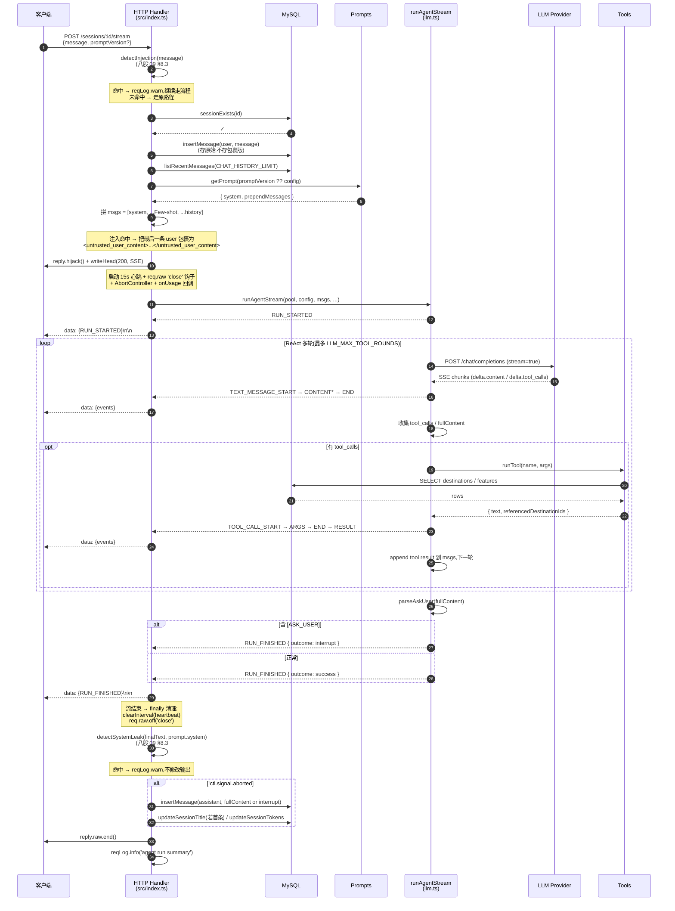

# Agent 服务架构与运转流程

> **文档目的**:把后端 agent 服务从「HTTP 入口 → ReAct 主循环 → 工具调用 → 流式输出」整条链路用一份文档讲清楚。任何人(包括 Claude)接手开发前都应先读此文档,而不是去逆向 `src/index.ts`。
>
> **本文档是活文档**——核心模块改动后必须回到 §7「维护清单」核对相关章节是否要同步更新。
>
> **当前对齐的开发阶段**:阶段2 已完成,**整合阶段 Task 整合-1 + 整合-2 都已完成**(LangGraph 主线 + Run-as-Resource 完整版);**Task 4.0(原 Task 3.7,web_search via Tavily)已完成**;**Task 4.1(增强 ReAct + 可观测性)已完成** — `<think>` 标签拆 THINKING 事件、工具调用 timing 日志、run summary 一行结构化日志、前端思考过程折叠;**Task 4.2(Plan-and-Execute 模式对比)已完成** — `?mode=react\|plan` 切换、`runPlannerAgent` 三阶段(plan/execute/synth)、`PLAN_GENERATED` 事件、对比实验 `exp-05-plan-vs-react`(plan 在复杂任务省 19% token,反问类不擅长);阶段4 4.3~4.4 待启动。
>
> **重大决策(2026-06-01)**:**原阶段3 RAG 主体已废弃** —— 完整实现过(Task 3.1~3.6:chunker / Embedder × 4 / Chroma / RRF + lexical rerank / Xenova ONNX),实测后判定不适合旅游场景的实时性需求,改由阶段4 通过 MCP/Skills 实时调用外部工具(Tavily、高德地图、和风天气等)实现"动态 RAG"。本次提交清空 `src/rag/`、Chroma 容器、chromadb / `@xenova/transformers` 依赖;**Task 3.7 重定位为 Task 4.0**。详见 `docs/开发规划.md` 关键设计决策 #6。
>
> **最近更新**:2026-06-01(RAG 链路废弃 + Task 3.7 迁阶段4 4.0)。前次更新:Task 整合-2 完整版落地(`src/agent/runManager.ts` 三态 abort + 多订阅者 + `src/db/runRepo.ts` + DB migration 003 + `chat_sessions.status` + 3 个新 HTTP 路由 `/runs/active` / `/runs/:runId/stream?after_seq=N` / `POST /runs/:runId/cancel` + 前端「停止」按钮 + 切走自动续订;Node 20+ 后 polyfill 已删,加 `.nvmrc=22` + `engines.node>=20`)。

---

## 0. 文档约定

- **是什么**:运行时的「数据流 + 控制流」全景,加关键工程决策的"为什么"。
- **不是什么**:① 不是 README(不讲怎么安装);② 不是 API 参考(每个字段都讲会过厚);③ 不替代源码注释。
- **引用规则**:代码引用一律带 `path:line`,便于 grep 跳转;Task 引用对应 `docs/开发规划.md`;八股引用对应 `docs/01-面试八股文/`。

---

## 1. 系统全貌

### 1.1 组件分层

```
┌──────────────────────────────────────────────────────────────────┐
│                          Web (web/src/)                          │
│  App.tsx ──HTTP/SSE──> api.ts ──fetch──> 后端                    │
└──────────────────────────────────────────────────────────────────┘
                                  │
                                  ▼
┌──────────────────────────────────────────────────────────────────┐
│                     HTTP 层 (src/index.ts)                       │
│  Fastify routes:                                                 │
│    GET    /health                                                │
│    GET    /sessions             ── 列出全部会话                  │
│    POST   /sessions             ── 创建空会话                    │
│    GET    /sessions/:id/messages── 取历史消息                    │
│    DELETE /sessions/:id         ── 删除会话(FK 级联清消息)     │
│    POST   /sessions/:id/stream  ── ★ 流式对话主入口             │
└──────────────────────────────────────────────────────────────────┘
                                  │
        ┌─────────────────────────┼──────────────────────────────┐
        ▼                         ▼                              ▼
┌──────────────┐    ┌─────────────────────┐    ┌─────────────────────┐
│  Prompts     │    │   Agent 主线         │    │   Tools 层          │
│  (prompts/)  │    │   langgraph-agent.ts │    │  (tools.ts)         │
│              │    │   + langgraphToAgUi  │    │                     │
│ v1_base.ts   │    │                      │    │ search_destinations │
│ v2_cot.ts    │───>│ langchain.createAgent│───>│ get_destination_*   │
│ render.ts    │sys │ MemorySaver Checkpt  │tool│ web_search ★         │
│ index.ts     │    │ streamEvents v2      │    │   (Tavily, Task 4.0)│
│ (注册表)     │    │ → AG-UI 事件         │    └────────┬────────────┘
└──────────────┘    │ sources 聚合(union) │             │
                    └────────┬─────────────┘             │
                             ▼                           ▼
                    ┌────────────────┐         ┌─────────────────────┐
                    │  Run 管理器    │         │   外部数据源        │
                    │  runManager.ts │         │                     │
                    │                │         │  Tavily Search API  │
                    │  三态 abort    │         │   (web_search)      │
                    │  多订阅者      │         │       │             │
                    │  事件流写库    │         │       ▼             │
                    │      │         │         │  webSearchCache.ts  │
                    │      ▼         │         │   SHA-256(q+depth)  │
                    │  runRepo.ts    │         │   TTL 24h           │
                    └────────┬───────┘         └──────────┬──────────┘
                             │                            │
                             ▼                            ▼
                    ┌──────────────────────────────────────────┐
                    │   MySQL Pool (db/pool.ts, 3307)          │
                    │   chat_sessions / chat_messages          │
                    │   agent_runs / agent_run_events (整合-2)  │
                    │   web_search_cache (Task 4.0)            │
                    │   destinations / destination_features    │
                    │     (供 SQL 工具,Task 4.4 MCP 接入后    │
                    │      可能整体退役;见决策 #6)             │
                    └──────────────────────────────────────────┘
```

### 1.2 模块职责表

| 模块 | 文件 | 职责 | 不该做什么 |
|------|------|------|----------|
| HTTP 层 | `src/index.ts` | 路由、SSE 生命周期、abort 钩子、日志 trace_id、token 持久化 | 不写 LLM 调用细节、不解析 SSE 协议 |
| Prompts | `src/agent/prompts/` | section 化模板、版本注册、渲染插值、Few-shot prepend | 不知道 LLM 怎么调、不接 DB |
| **Run 管理器**(Task 整合-2) | `src/agent/runManager.ts` | 进程内 Run 注册表 + 三态 abort(per-subscriber vs per-run)+ 状态机推进 + 事件 pump(写 agent_run_events、广播 subscriber、增量写 chat_messages) | 不直接接 HTTP / LangGraph;只通过 langgraph-agent 拿事件流 |
| **Agent 主线**(Task 整合-1) | `src/agent/langgraph-agent.ts` | `runLangGraphAgent`:`langchain.createAgent` + `MemorySaver` + 工具 wrap;**被 runManager 调用**;`buildChatModel` 导出供 planner 复用 | 不写 DB、不直接接 HTTP |
| **Plan-and-Execute Agent**(Task 4.2) | `src/agent/planner.ts` | `runPlannerAgent`:跟 `runLangGraphAgent` 同签名;三阶段(PLAN LLM → 顺序 runTool → SYNTH LLM);Plan JSON 走 zod 严格校验 + 重试 1 次;**复用 thinkSplit** 处理 `<think>`;runManager 按 mode dispatch | 不写 DB、不直接接 HTTP;不支持步骤间参数引用(简化版) |
| **Agent 事件 Adapter** | `src/agent/langgraphToAgUi.ts` | 把 LangGraph `streamEvents v2` 翻译成项目原生 AG-UI 事件;[ASK_USER] 检测;sources 聚合到 RUN_FINISHED;**Task 4.1.A think 标签拆分**(`<think>...</think>` 走 THINKING 事件,跟 TEXT 平行);**Task 4.1.B 工具调用 timing 日志** | 不知道工具细节、不写库 |
| **Run 仓库** | `src/db/runRepo.ts` | `agent_runs`(完整状态机)+ `agent_run_events`(seq 事件流)CRUD + `markAllRunningAsFailed`(启动清理) | 不发事件、不调 LangGraph |
| Agent 共用类型 | `src/agent/llm.ts` | 只导出 `ChatMessage` / `ResumeItem` / `TokenUsage` 类型;**整合-1 后手写实现全部删除** | 不含任何业务逻辑 |
| Tools | `src/agent/tools.ts` | function calling 定义、工具实现(`search_destinations` / `get_destination_detail` / **`web_search`** Task 4.0)、参数 zod 校验、间接注入防御 | 不发 SSE 事件、不调 LLM |
| Web 搜索缓存 | `src/agent/webSearchCache.ts` | Tavily 调用结果 SHA-256(query+depth) → MySQL `web_search_cache` 表,TTL 默认 24h(`WEB_SEARCH_CACHE_TTL_SECONDS`),避免烧 Tavily 免费额度 | 不调 Tavily、不知道工具语义 |
| AG-UI 协议 | `src/agent/ag-ui.ts` | 事件类型枚举 + 构造器(RUN_STARTED / TEXT_MESSAGE_* / TOOL_CALL_* / **THINKING_*** Task 4.1 / **PLAN_GENERATED** Task 4.2 / RUN_FINISHED);**`Source` 是 discriminated union `DestinationSource \| UrlSource`**(Task 4.0) | 不含业务逻辑 |
| **think 切分(Task 4.1)** | `src/agent/thinkSplit.ts` | 纯函数 + 显式 state 的跨 chunk `<think>...</think>` 切分;adapter 把 think 段当 THINKING_CONTENT 事件,把外部段当 TEXT_MESSAGE_CONTENT | 不发事件、不知 AG-UI;单测覆盖 11 个边界 |
| Sanitize 安全 | `src/agent/sanitize.ts` | `detectInjection` 入口注入检测 / `wrapUntrusted` 边界标记 / `detectSystemLeak` 出口泄露检测(纯函数) | 不发日志、不修改输入,只返回判定结果 |
| Token Usage | `src/agent/token-usage.ts` | `estimateTokens` 兜底估算、`accumulateUsage` 累加 | 不写 DB |
| Chat 持久化 | `src/db/chatRepo.ts` | chat_sessions / chat_messages 的 CRUD | 不知道 LLM、不调工具 |
| Destination 数据 | `src/db/destinationRepo.ts` | destinations / destination_features 的查询 | 不写 chat 表 |
| Config | `src/config.ts` | 环境变量 zod schema + 加载 | 不依赖业务模块 |
| Eval | `src/eval/`、`scripts/eval-prompt.ts` | Prompt 评测器 + 测试集 + 批量脚本(Task 2.3) | 不污染生产 chat 表 |

---

## 2. HTTP API 一览

| Method | Path | 请求体 / 参数 | 响应 | 代码位置 |
|--------|------|-------------|------|---------|
| GET | `/health` | — | `{ ok, db }`,503 表示 DB 挂 | `src/index.ts:40-48` |
| GET | `/sessions` | — | `{ sessions: SessionRow[] }` | `src/index.ts:50-53` |
| POST | `/sessions` | — | `201 { sessionId }` | `src/index.ts:68-73` |
| GET | `/sessions/:id/messages` | `id` | `{ messages, status }`(整合-2 加 `status: 'running'\|'end'`),404 表示不存在 | `src/index.ts` GET `/messages` |
| DELETE | `/sessions/:id` | `id` | `204 null`;整合-2 后会先 cancel 活跃 Run | `src/index.ts` DELETE `/sessions/:id` |
| POST | `/sessions/:id/stream` | `{ message, promptVersion? }` | SSE 流;**整合-2 重构**:启动 Run + subscribe,客户端断开仅 unsubscribe(Run 在 runManager 内继续) | `src/index.ts` POST `/stream` |
| **GET** | **`/sessions/:id/runs/active`** ★ | `id` | `{ active: AgentRunRow \| null }`,前端打开会话时调用以决定续订 | 整合-2 新增 |
| **GET** | **`/sessions/:id/runs/:runId/stream?after_seq=N`** ★ | `id`, `runId`, `after_seq` | SSE:先回放 `seq > N` 的历史事件,Run 仍活跃时接实时流 | 整合-2 新增(续订接口) |
| **POST** | **`/sessions/:id/runs/:runId/cancel`** ★ | `id`, `runId` | `202 { cancelled }` 主动取消,幂等 | 整合-2 新增 |

---

## 3. 核心运转流程

### 3.1 创建会话(POST /sessions)

```
client                      handler                  DB
  │  POST /sessions            │                      │
  │ ─────────────────────────► │                      │
  │                            │ randomUUID()         │
  │                            │ createSession(id)    │
  │                            │ ────────────────────►│ INSERT chat_sessions
  │                            │ ◄────────────────────│
  │  201 { sessionId }         │                      │
  │ ◄───────────────────────── │                      │
```

**约束**:此时 `chat_sessions.title` 为 NULL、`total_tokens=0`、`status=running`(若有此列)。第一次对话结束时由 stream handler 把 user message 前 30 字写入 title(`src/index.ts:195-199`)。

### 3.2 发起对话(POST /sessions/:id/stream)★ 核心场景

这是整个 agent 服务最复杂、调用面最广的流程。下图是**全链路**:



#### 3.2.1 详细步骤说明

1. **入参与会话校验**(`src/index.ts:115-133`):取 body 中的 message / promptVersion / resume,验证 session 存在
2. **持久化 user 消息**(`:138`):立刻写库,即使后续 LLM 失败也保留用户输入
3. **拼 messages**(`:141-158`):
   ```
   [{ role: 'system', content: prompt.system }]
     + prompt.prependMessages (Few-shot 3 条)
     + history (按 CHAT_HISTORY_LIMIT=30 反向取最近)
   ```
4. **接管 SSE socket**(`:161-168`):`reply.hijack()` 让 Fastify 不再管收尾,headers 写完即可流式吐内容
5. **三层保护**:
   - **AbortController**(`:171-178`):`req.raw 'close'` 事件 → `ctl.abort()` → 下游 `fetch` 立刻停
   - **心跳**(`:181-183`):15s 一次 `: ping\n\n` 注释行,防反向代理按 idle 断连
   - **onUsage 回调**(`:188-196`):每轮 LLM 结束累加 `prompt/completion/total tokens`
6. **ReAct 主循环**(`runAgentStream`,`src/agent/llm.ts:222-435`):见 §3.2.2
7. **流结束**(`:189-206`):
   - 仅在 **未 abort** 时才入库 assistant 消息(避免污染历史)
   - 首条用户消息会自动生成 title(前 30 字)
   - `updateSessionTokens` 累加 token 到 `chat_sessions.total_tokens`
8. **关 SSE**(`:224`):`reply.raw.end()`

#### 3.2.2 ReAct 主循环细节(`runAgentStream`)

```
for round in 0..LLM_MAX_TOOL_ROUNDS:           # 默认 10
  if signal.aborted: break

  stream = postChatStream(LLM, msgs, signal)   # OpenAI 兼容 /chat/completions

  for chunk in stream:
    if chunk.usage:                            # 最后一 chunk 带 usage
      lastUsage = ...
    if delta.content:
      yield TEXT_MESSAGE_START / CONTENT       # 首次 content 时发 START
    if delta.tool_calls:
      yield TOOL_CALL_START / ARGS             # 流式收集 args
    if finish_reason in ['stop', 'tool_calls']:
      yield TEXT_MESSAGE_END / TOOL_CALL_END

  totalUsage += lastUsage ?? estimateFromText()
  onUsage(roundUsage, round)                   # 回调到 HTTP 层打日志

  if collected tool_calls:
    msgs.append({ role: assistant, tool_calls })
    for tc in tool_calls:
      result = runTool(tc.name, tc.args)
      yield TOOL_CALL_RESULT
      msgs.append({ role: tool, tool_call_id, content })
    continue  # 下一轮 LLM,带着工具结果重新生成

  # 无工具调用 → 检查是否反问
  if parseAskUser(fullContent).isAskUser:
    yield RUN_FINISHED { outcome: interrupt }
    return

  break  # 正常文本回答,结束循环

yield RUN_FINISHED { outcome: success, usage: totalUsage }
```

**关键不变量**:
- 工具调用结果必须以 `role:tool` + `tool_call_id` 形式追加到 msgs,LLM 下一轮才能"看见"
- `[ASK_USER]` 协议是当前的"反问"实现(临时方案,见 §5.4)
- usage 必须显式声明 `stream_options.include_usage`,否则流式不返回 usage(`postChatStream` 已处理)

### 3.3 中断处理(客户端断开)

当前实现是**阶段1 的 Chat App 心智**:客户端断开 = 整个 Run 终止。

```
client                handler              llm/tools
  │ (关闭页面/切走)      │                      │
  │ ─────[FIN]────────► │                      │
  │                     │ req.raw 'close'      │
  │                     │ → ctl.abort()        │
  │                     │ ────────────────────►│ AbortSignal 触发
  │                     │                      │ fetch 立即终止
  │                     │ ◄────────────────────│
  │                     │ finally:             │
  │                     │   clearInterval      │
  │                     │   reply.raw.end()    │
  │                     │ ⚠️ assistant 消息    │
  │                     │ 不入库               │
```

**为什么 abort 不入库**:`src/index.ts:189` 的 `if (!ctl.signal.aborted)` 保护——中途断开时 LLM 输出可能不完整,存进去会污染下次的 history。

**已知局限**:此设计让"切走会话" = "丢失任务",阶段4 Task 4.5 会把它改造为「切走 = unsubscribe but Run continues」+ event 回放续流。详见 §6。

### 3.4 历史查询(GET /sessions/:id/messages)

最简单的 CRUD:`getSessionMessages` 按 `created_at ASC` 全量返回该会话的 user/assistant/system 三种角色消息(`src/db/chatRepo.ts:56-65`)。

**当前没有的字段**(阶段4 Task 4.5 会加):
- `status: 'running' | 'end'`(标识 Run 是否还在跑)
- `lastMessage` 用于断点续传

### 3.5 删除会话(DELETE /sessions/:id)

```
client                handler                DB
  │ DELETE /sessions/:id │                    │
  │ ──────────────────► │                    │
  │                     │ sessionExists()    │
  │                     │ ──────────────────►│
  │                     │ ◄──────────────────│
  │                     │ deleteSession()    │
  │                     │ ──────────────────►│ DELETE chat_sessions
  │                     │                    │ FK CASCADE → chat_messages
  │                     │ ◄──────────────────│
  │ 204 No Content      │                    │
  │ ◄────────────────── │                    │
```

**前端配合**(`web/src/App.tsx:97`):删除当前激活会话前,前端自己 abort 正在跑的 SSE 连接 → 触发 §3.3 流程,后端把 Run 也停掉。后端因此不需要专门"终止 in-flight stream"的逻辑(阶段4 Task 4.5 改造后需要联动 `runManager.cancel(runId)`)。

### 3.6 工具调用一览(SQL × 2 + Web × 1)

当前 Agent 注册的工具按 `v1_base.toolUsageRules` 各管一类场景:

| 用户问题 | 模型选择 | 工具类型 | 延迟 |
|---------|---------|---------|------|
| "云南有什么目的地" | `search_destinations`(SQL LIKE) | MySQL | ~10ms |
| "列举丽江的美食" | `get_destination_detail`(SQL by id) | MySQL | ~10ms |
| "北京 2026 春节有什么活动" / "上海今天天气" | `web_search`(Tavily, Task 4.0) | 联网 | ~1-3s(缓存命中 ~10ms) |

**演进路径**:Task 4.4 完成后,SQL 工具会被高德地图 / 携程等 MCP source 替代(动态 RAG);若覆盖充分,SQL 工具 + MySQL seed → MCP 整体取代,详见决策 #6。

> **历史说明**:本节原为 §3.6 RAG 检索流程(阶段3 Task 3.3,`semantic_search_travel`),2026-06-01 RAG 废弃后整节重写。git 历史可查原流程图。

---

## 4. 数据流细节

### 4.1 messages 拼接顺序(Task 2.1 后)

```
index = 0   │ system           │ getPrompt(version).system
            │                  │   ├─ role
            │                  │   ├─ taskScope(含示例防污染说明)
            │                  │   ├─ toolUsageRules (1~4)
            │                  │   ├─ outputFormat
            │                  │   ├─ contextRules
            │                  │   ├─ clarificationRules ([ASK_USER] 协议)
            │                  │   ├─ securityRules (Prompt 注入防御指令,八股 09 §8)
            │                  │   └─ cotInstruction(仅 v2_cot)
index 1~N   │ Few-shot prepend │ prompt.prependMessages(3 条 user+assistant 交错)
index N+1~  │ history          │ listRecentMessages(最近 30 条,正序)
            │                  │   └─ 当前 user 消息(insertMessage 已写库,在 history 末)
            │                  │      ⚠ 若 detectInjection 命中,该条会被 wrapUntrusted 包裹
            │                  │        为 <untrusted_user_content>...</untrusted_user_content>
```

**为什么 user 消息在 history 末**:`src/index.ts:138` 先 `insertMessage(user, message)` 再 `listRecentMessages`,所以 history 的最后一条就是当前用户输入,无需单独 append。

**为什么只包裹"当前 user 消息"而不包裹历史**:历史里的旧攻击假定已在当时被防御过(模型已拒绝,fullContent 落库的是拒绝回复)。包裹历史会增加 token、且对已被防御的攻击无意义。

### 4.2 AG-UI 事件流(发给前端的 SSE)

事件类型定义在 `src/agent/ag-ui.ts:6-22`。一次成功对话的事件时序:

**ReAct 模式**(默认,mode='react'):
```
RUN_STARTED
  → STEP_STARTED(generating)
  // Task 4.1.A:THINKING 与 TEXT 平行流;模型可能先 think 再 answer,也可能 think/text 交错
  →   [THINKING_START → THINKING_CONTENT × N → THINKING_END]?  ← MiniMax 把 <think>…</think> 内联 content,adapter 拆出来
  →   TEXT_MESSAGE_START
  →   TEXT_MESSAGE_CONTENT × N
  →   TEXT_MESSAGE_END
  → STEP_FINISHED(generating)

[若有工具调用]
  → STEP_STARTED(tool_call)
  →   TOOL_CALL_START
  →   TOOL_CALL_ARGS × M
  →   TOOL_CALL_END
  → STEP_FINISHED(tool_call)
  → STEP_STARTED(tool_execution)
  →   TOOL_CALL_RESULT
  → STEP_FINISHED(tool_execution)
[回到 LLM 下一轮]

RUN_FINISHED { outcome, usage }
```

**Plan-and-Execute 模式**(Task 4.2,mode='plan'):
```
RUN_STARTED
  → STEP_STARTED(planning)
  →   [THINKING_START / CONTENT / END]?  (plan 阶段也可能出 think)
  →   TEXT_MESSAGE_START / CONTENT (JSON 输出) / END  ← 注意:plan JSON 也走 TEXT 事件流
  →   PLAN_GENERATED { plan: { rationale, steps[] } }
  → STEP_FINISHED(planning)

for each step in plan.steps:
  → STEP_STARTED(tool_call)
  →   TOOL_CALL_START / ARGS / END
  → STEP_FINISHED(tool_call)
  → STEP_STARTED(tool_execution)
  →   TOOL_CALL_RESULT
  → STEP_FINISHED(tool_execution)

  → STEP_STARTED(synthesis)
  →   [THINKING_START / CONTENT / END]?
  →   TEXT_MESSAGE_START / CONTENT × N / END
  → STEP_FINISHED(synthesis)

RUN_FINISHED { outcome, usage }
```

差异关键点:plan 模式比 react 多一对 `STEP_STARTED('planning')` + `PLAN_GENERATED` 事件;tool 部分事件序列完全一致;最后多一对 `STEP_STARTED('synthesis')`。前端 `App.tsx:consumeStream` switch 无 default,新增 `PLAN_GENERATED` / step('planning'|'synthesis') 不破坏(fall through 静默)。

**Task 4.1.B/C + 4.2.C 配套日志**(`logs/app.log`,所有行自带 `runId` + `mode` child binding):
- `'run started' { sessionId, runId, mode }`
- `'plan generated' { stepsCount, retries }`(Task 4.2,仅 plan 模式)
- `'tool finished' { tool, toolCallId, durationMs, argsPreview, resultPreview, mode? }` × N
- `'run summary' { runId, status, mode, durationMs, totalTokens, costUsd, toolStats: { count, names } }`

grep `runId=xxxx` 即可拿一次 Run 的完整 trace。

**前端解析**(`web/src/api.ts:65-80`):按行拆 SSE,识别 `data: ` 前缀,JSON.parse 后 yield;`App.tsx:99-200` switch 事件类型更新 UI。

### 4.3 Token 统计与计费链路

```
postChatStream 发送时显式带:
  stream_options: { include_usage: true }
                         │
                         ▼
最后一个 chunk 携带 usage { prompt_tokens, completion_tokens, total_tokens }
                         │
                         ▼
llm.ts runAgentStream:
  lastUsage = { promptTokens, completionTokens, totalTokens }  // snake → camel
  totalUsage = accumulateUsage(totalUsage, lastUsage)
  options.onUsage(roundUsage, round)  ────────┐
                         │                    │ 回调
                         ▼                    ▼
RUN_FINISHED { usage: totalUsage }    index.ts onUsage:
                         │              totalUsage += u
                         ▼              reqLog.info({ round, usage }, ...)
前端 sessionItem.totalTokens
(updateSessionTokens 落库后下次 GET /sessions 返回)
                         │
                         ▼
日志:agent run summary { usage, cost_usd, duration_ms }
       cost = (prompt/1000 × INPUT_PRICE) + (completion/1000 × OUTPUT_PRICE)
```

**Fallback 估算**:若 LLM 不返回 usage(部分 MiniMax 兼容协议),`runAgentStream` 用 `estimateTokens(text.length / 2)` 兜底——精度差但能保住成本审计链路。

### 4.4 web_search 数据流(Task 4.0)

当前唯一的非数据库工具,数据流向:

```
LLM tool_call: web_search({query, max_results?, search_depth?})
        │
        ▼
tools.ts:runWebSearch
        │
        ├─ ① 无 key 降级:返回提示消息,模型回退到 SQL 或如实告知
        │
        ├─ ② 缓存优先:buildCacheKey = SHA-256(query + depth)
        │     │
        │     ▼
        │   MySQL SELECT web_search_cache WHERE cache_key=? AND age<TTL
        │     ├─ 命中 → 直接返回(避免烧 Tavily 额度)
        │     └─ 未命中 → 调 Tavily
        │           │
        │           ▼
        │       @tavily/core client.search(...)
        │           │
        │           ▼
        │       INSERT ... ON DUPLICATE KEY UPDATE 写回缓存
        │
        ├─ ③ 间接注入防御:每条 snippet → detectInjection
        │     命中 → wrapUntrusted(snippet)
        │
        └─ ④ sources 收集:每条 result → UrlSource { url, title, snippet, via:'web_search' }
        │
        ▼
ToolRunResult { text:JSON{query, answer, results}, referencedDestinationIds:[], sources }
        │
        ▼
langgraph-agent.ts buildTools 闭包:
  ├── sourceKey(s) = `dest-${id}` 或 `url-${url}`(union 类型分流)
  ├── sourceMap.set(sourceKey(s), s)
  └── tool 返回 text 给 LLM(sources 旁路传出)
        │
        ▼
langgraphToAgUi.ts on_tool_end:
  yield STEP_STARTED(tool_execution) + TOOL_CALL_RESULT + STEP_FINISHED
        │
        ▼
流末 RUN_FINISHED { outcome, usage, sources: Array.from(sourceMap.values()) }
        │
        ▼
前端按 source.type 渲染:
  - type='destination' → "信息来源:丽江"(可跳详情)
  - type='url'         → 可点击链接(web_search 场景)
```

#### 关键路径要素

| 要素 | 出处 | 说明 |
|------|------|------|
| **缓存 TTL 在应用层** | `webSearchCache.ts:getCached` 用 `TIMESTAMPDIFF` 判 age | DB 不主动清,下次写入 `ON DUPLICATE KEY UPDATE` 覆盖 |
| **lazy import @tavily/core** | `tools.ts:runWebSearch` | 无 key 时不引包,减少冷启动 |
| **snippet 走 detectInjection** | 网页是高危源 | 阶段2 §5.6 留的"间接注入"伏笔正式生效 |
| **Source 是 discriminated union** | `ag-ui.ts:DestinationSource \| UrlSource` | 前端按 `type` 渲染不同 UI |
| **sourceKey 跨类型去重** | `langgraph-agent.ts:sourceKey()` | `dest-${id}` / `url-${url}` |
| **AG-UI RunFinishedEvent.sources** | `ag-ui.ts:RunFinishedEvent` | 前后端契约 |

> **历史说明**:本节原为 §4.4 RAG 数据流(MySQL → Chroma → tool result → sources),2026-06-01 RAG 废弃后整节重写为 web_search 数据流。

---

## 5. 关键工程决策

### 5.1 为什么 `reply.hijack()` 而不是 Fastify 默认响应

Fastify 默认会等 handler return 后才 flush response。SSE 需要"边写边发",所以 `reply.hijack()` 把底层 socket 交给我们,自己管 `writeHead` / `write` / `end`。

**代价**:必须自己处理所有错误路径(否则 socket 泄漏),所以有 `try/finally` 包整段。

### 5.2 为什么显式声明 `stream_options.include_usage`

OpenAI 兼容协议默认**流式响应不返回 usage**。不声明就拿不到精确 token,只能用 `estimateTokens` 估算。Task 1.2 的成本审计依赖 usage,所以必须显式开。

### 5.3 为什么 Few-shot 用 messages 数组 prepend(而不是 system 内文本)

八股 09 §3.5 推荐:模型预训练时见到的 user/assistant 交错格式最熟悉,理解最稳。

**踩过的坑**:messages 形式有"模型把示例当真实历史"的污染风险——见 `docs/02-实验记录/exp-02-prompt-versions.md` 第 1 轮。修复方案:`v1_base.taskScope` 加边界声明(已落地)。

### 5.4 为什么 `[ASK_USER]` 用字符串协议(临时方案)

当前反问检测靠 `parseAskUser(fullContent)` 解析模型输出的 `[ASK_USER]` 前缀字符串(`src/agent/llm.ts:171-198`)。

**为什么不用 LangGraph 的 `interrupt()` 或更严谨的 function calling**:学习项目要把"流程拼起来"先跑通,字符串协议是最低成本。**Task 4.5 会重构**为 Run-as-Resource 模型 + 显式 interrupt 事件 + Checkpoint。

### 5.5 为什么 abort 时不入库 assistant 消息

中途断开时 LLM 输出截断,可能是 `"我推荐云南的..."` 这种不完整句子。存进去后下次对话作为 history 喂给 LLM,会严重污染上下文。所以 `src/index.ts:189` 用 `if (!ctl.signal.aborted)` 保护。

**已知缺陷**:用户切走会话再回来,assistant 输出丢失。阶段4 Task 4.5 会改造,见 §6。

### 5.6 为什么注入命中后不直接拒绝请求

`detectInjection` 命中后,handler 只做两件事:① 记日志告警;② 把消息用 `<untrusted_user_content>` 包裹后**继续走 LLM**。**不直接 return 403**。

理由:
1. **规则匹配有误杀**:用户真说"我想去看 system update 风格的建筑设计"会命中 `pseudo_section_delimiter` 规则——直接拒绝会让正常用户莫名其妙
2. **双层防御更鲁棒**:`securityRules` 已经训练模型识别注入并自己拒绝,sanitize 只是"加一层提醒",让模型在更明确的边界下做最终判断
3. **可观测优先**:阶段当前是项目早期,先把"注入流量分布"通过 `prompt injection detected` 告警收集起来,后期决定是否升级为硬拦截
4. **实测验证**:`docs/02-实验记录/exp-02-prompt-versions-2026-05-30T10-37-46-151Z.json` 的 5 条 inj-* case 全部通过,说明双层防御足够

**未来升级方向**:严重等级 = `high` 且来自非可信用户(阶段5 加身份层后)时硬拒绝,low/medium 仍走"包裹 + 让模型判"路径。

### 5.7 为什么 Run-as-Resource 完整版用"自研 RunManager + agent_run_events 表"而不是直接用 LangGraph Checkpointer(Task 整合-2)★

LangGraph 的 `MemorySaver` / `SqliteSaver` 是**框架自身的 thread 状态持久化**——给"interrupt + Command(resume)"用的,让 LangGraph 自己知道上次跑到哪。

我们的"前端切走再回来续订"需求是**另一回事**:
- 前端要从某个事件 seq 开始重新拿到 AG-UI 事件流(渲染聊天 UI)
- LangGraph thread state 跟 AG-UI 事件流是两套数据(前者是消息历史 + 工具调用记录,后者是 SSE 帧)

所以做了职责分离:
- **LangGraph Checkpointer**(进程内 `MemorySaver`)管 LangGraph 自己的 thread state
- **`agent_run_events` 表**存我们项目业务的 AG-UI 事件流,seq 单调递增,**前端续订的 `?after_seq=N` 直接 SQL 查**
- **`runManager` 在内存中持有 RunHandle**,绑定 LangGraph stream + 订阅者集合 + per-run AbortController;客户端断开仅 unsubscribe,Run 在 manager 内继续跑

**为什么 Checkpointer 不升级到 SqliteSaver**:进程重启后 LangGraph 自己能恢复 thread state 没问题,但"重新挂上 stream + 重建 subscriber + 重新 pump"这套需要重写大量代码,**收益不匹配学习项目复杂度**——所以选简单方案:重启时把 running 全标 failed,前端续订拿到 active=null 显示"已中断"。

**三态 abort 模型**:
- **Per-subscriber AbortController**:HTTP handler 持有,`req.raw 'close'` 触发 → 只调 `unsubscribe`,**不通知 RunManager**
- **Per-run AbortController**:RunManager 持有,只在 ① `POST /runs/:runId/cancel`、② SIGTERM(目前没接,Task 5.4 接)、③ 5 分钟超时(目前没设,后续可加)三种情况触发 → 才真正 abort LangGraph stream
- **两个 Controller 无级联** —— 这是跟 Chat App 阶段(整合-1 之前)最关键的差异

实测验证(e2e smoke):
- 切走后查 /runs/active → status='running',lastEventSeq=283 持续涨 ✅
- 主动 cancel → HTTP 202 + active=null + status='end' ✅
- 续订 GET /runs/:runId/stream?after_seq=0 → 完整回放 RUN_STARTED + 后续事件 ✅

### 5.8 为什么主 Agent 切到 LangGraph(Task 整合-1)★

整合阶段做的决策:阶段3 完成后,真实使用反馈出"会话续流"需求(切走 Run 不停、回来续订),手写实现成本约 Task 4.5 完整复杂度;而 LangGraph 的 `thread_id` + `Checkpointer` 是现成的,**接框架的成本远低于手写**——所以决定整合-1 把主 Agent 切到 LangGraph,整合-2 借 Checkpointer 做轻量续流。

具体落地选择:
- 用 `langchain.createAgent`(LangChain 1.x 推荐 API,旧 `@langchain/langgraph/prebuilt:createReactAgent` 标 deprecated)
- `MemorySaver` 作 Checkpointer(开发用,Task 4.5 升级 SqliteSaver/MySQLSaver)
- 工具复用 `tools.ts:runTool`,用闭包 wrap 成 LangChain tool(sources 通过闭包 sourceMap 旁路透出)
- `[ASK_USER]` 协议保留(整合-2 / Task 4.5 再升级原生 `interrupt()`)
- AG-UI 事件协议 0 改动(adapter 层翻译 LangGraph `streamEvents v2`)

保留资产:
- 手写 `runAgentStream` / `postChatStream` 等**直接删除**,`src/agent/llm.ts` 瘦身为只导出 3 个类型(理由:留死代码会腐烂);"手写 vs LangGraph 对比" STAR 故事写在 `docs/03-开发笔记/note-04`
- AG-UI 协议、tools.ts、sanitize.ts、prompts/、sources/ 全部复用

完整决策见 `docs/开发规划.md` 关键设计决策 #6、`docs/03-开发笔记/note-04`(待写)。

### 5.9 为什么放弃静态 RAG → 改用动态 RAG via MCP(2026-06-01 决策)★

**完整实施过 → 实测后回滚**。阶段3 把 RAG 八股全套做过一遍(chunker / Embedder 抽象 4 实现 / Chroma 向量库 / RRF + lexical rerank / Xenova ONNX 本地 embedding,5 个 commit:`8502d52` ~ `ea485e8`)。

**为什么实测后判定不适合**:旅游场景的核心数据(开园时间、票价、活动、天气)是**高频变动**的——静态 RAG 的"离线索引 + 召回"范式天生不适合,索引一旦灌完就开始过期。`docs/02-实验记录/exp-04`(已删)显示语义检索 Top-K 召回从 deterministic 4/6 → Xenova 6/6,但这只解决"查得准"不解决"内容新"。

**改用方案**:阶段4 通过 MCP/Skills 实时调用外部工具(Tavily web_search、高德地图、和风天气、携程等),本质上实现"动态 RAG"——查询时拉最新数据,不维护离线索引。Task 4.0(web_search,本次已完成)是第一步。

**学习材料保留**:`docs/01-面试八股文/03-RAG技术.md` 作为面试知识点保留,文件顶部加"本项目未采用"框注。面试讲法:**学了 → 实施了 → 实测后判定 → 回滚**——这是一个完整的工程判断 STAR 故事。

完整决策见 `docs/开发规划.md` 关键设计决策 #6。

---

## 6. 已知局限与演进路线

| 局限 | 当前症状 | 修复 Task | 备注 |
|------|---------|----------|------|
| ~~切走会话 = 任务终止~~ | ✅ **整合-2 已修复**:客户端断开 = unsubscribe(Run 继续写库) | — | e2e smoke 验证通过(lastEventSeq 持续涨) |
| ~~无主动取消按钮~~ | ✅ **整合-2 已修复**:`POST /runs/:runId/cancel` + 前端「停止」按钮 | — | 三态 abort 模型(per-subscriber vs per-run 互不级联) |
| `[ASK_USER]` 是字符串协议 | 模型偶尔会忘记加前缀;且无法附带结构化 schema | 后续可单独评估升级 LangGraph 原生 `interrupt()` | 当前协议工作正常,不阻塞 |
| 进程重启后 Run 不自动续跑 | 启动时把 running 全标 failed;前端续订时拿到 `active=null` | Task 5.4 容器化时配 Redis Pub/Sub 跨进程方案 | 学习项目当前可接受 |
| 评测无重试 | LLM 服务抖动时单次评测 fail,不可信 | Task 5.3 容错与重试 | 见 exp-02 第 2 轮事故 |
| LLM 请求只盯总时长 | 服务长时间不下发数据但 keep-alive 时 timeout 不触发 | Task 5.3 stream-idle timeout | postChatStream 需要增加空闲监控 |
| `estimateTokens` 精度差 | `length / 2` 在长 prompt 上误差 ±20% | Task 5.5 网关层接入 tiktoken | 不同 tokenizer 不通用是阻塞点 |
| ~~静态 RAG 不适合实时数据场景~~ | ✅ **2026-06-01 决策回滚**:整套 RAG 链路删除,改用 Task 4.0 web_search + Task 4.4 MCP/Skills 实现动态 RAG | — | 详见 §5.9 决策 |
| 数据库只覆盖 3 个目的地 | seed 硬编码成都/丽江/哈尔滨,其他城市靠 web_search | Task 4.4 MCP 接入高德/和风等 source 后,SQL 工具 + MySQL seed 可能整体退役 | 详见 `开发规划.md` Task 4.4 |
| 多 Agent 协作 | 当前是单 Agent ReAct | Task 5.1 Supervisor 模式 | 阶段5 |
| 注入检测纯靠正则规则 | 规则库有限,新型注入(语义级、多语种变体)可能漏检 | 阶段5 Task 5.3 引入 LLM-as-judge 二次校验 / 规则热更新 | 当前 11 条规则覆盖常见模式;实测 5/5 通过 |
| 输出过滤只做"system prompt 泄露检测" | 没做 PII / 密钥 / 暴力内容过滤 | 阶段5 Task 5.5 网关层 + 项目无 PII 场景暂不紧迫 | 当前项目不涉及个人数据 |
| sources 字段前端未消费 | RUN_FINISHED.sources 已透出(union 类型),但 web/src/App.tsx 尚未渲染"来源"标签 | 任意 web 迭代任务 | 后端契约已就位 |
| web_search 无 key 时降级 | 未配 TAVILY_API_KEY 时模型走 SQL 兜底或如实告知用户 | 部署时配 key 即可 | 评测 `hardFailRate=0%` |
| ~~MiniMax `<think>` 标签污染回答~~ | ✅ **Task 4.1.A 已修复**:adapter 把 `<think>...</think>` 拆成 THINKING_* 事件,前端折叠显示;text 字段不再含 think 内容 | — | thinkSplit 单测 11 种边界全通过 |
| ~~工具调用 / Run summary 无 info 日志~~ | ✅ **Task 4.1.B + 4.1.C 已修复**:每轮 `'tool finished' { tool, durationMs, ... }` + finalize 一次 `'run summary' { runId, durationMs, totalTokens, costUsd, toolStats }` | — | 所有日志带 runId child binding,grep 可拿全链路 |
| Plan 模式不擅长反问 / 注入场景 | plan 强制 steps ≥ 1,反问类 case 被迫规划无意义工具(实测 `ask-01` 慢 +15s) | 后续可加 "若问题信息不足,plan 输出 steps:[]" 协议(目前刻意保留作 ReAct 对比点) | 实测见 `exp-05-plan-vs-react-*.json` |
| Plan 模式不支持步骤间参数引用 | 第 2 步无法用第 1 步结果(如先 search 拿 id 再 detail by id) | Task 4.4 接 MCP 后由更智能的 supervisor 处理 | 简化版,刻意保留作教学对比 |
| ~~Plan_GENERATED 前端未渲染~~ | ✅ **已修复**:`web/src/App.tsx` 加 `ChatMsg.plan` 字段、`PLAN_GENERATED` case、`<details open>` 计划清单 UI(显示 rationale + 步骤 × N + 工具名);同时输入区上方加 `react / plan` segment 单选切换 | — | mode 选择默认 react,UI 不强制重置;`api.sendMessageStream` 加 mode 参数透传 |

---

## 7. 维护清单(本文档应当何时更新)

| 你改了什么 | 检查本文档哪几节 |
|----------|----------------|
| 新增/删除 HTTP 路由 | §2 API 一览 + §3 对应小节 + §1.1 分层图 |
| 改 `runAgentStream` 主循环 | §3.2.2 ReAct 主循环细节 + §4.2 AG-UI 事件时序 |
| 改 `postChatStream` / LLM 调用 | §3.2.2 + §4.3 Token 链路 + §5.2 |
| 改 prompts/ 目录(新版本、新 section) | §4.1 messages 拼接顺序 + §1.2 模块职责 |
| 改 tools.ts(新工具、改 schema) | §1.2 模块职责 + §3.2.2 ReAct 工具调用部分 |
| 改 abort / 中断行为 | §3.3 中断处理 + §5.5 + §6 |
| 改 chat_sessions / chat_messages schema | §3.4 / §3.5 + §1.2 + §6 局限对照 |
| 落地某个规划 Task | §6 局限表标记移除 + 必要时新增决策小节到 §5 |
| 引入新模块(eval/、mcp/、skills/、agents/) | §1.1 分层图 + §1.2 职责表 |
| 改 sanitize.ts 规则库 / 检测策略 | §1.2 模块职责 + §3.2 时序图入口节点 + §5.6 决策 + §6 局限表注入检测条目 |
| 改 tools.ts(增删工具 / 改 schema) | §1.2 模块职责 + §3.6 工具一览;若 web_search 流程变化同步 §4.4 |
| 改 webSearchCache.ts(TTL、key 算法等) | §1.2 模块职责 + §4.4 缓存层路径 |
| 改 langgraph-agent.ts / langgraphToAgUi.ts(整合-1 后) | §1.2 模块表 Agent 主线 + §5.8 LangGraph 切换决策;若新事件类型同步 §4.2 |
| 改 runManager.ts / runRepo.ts(整合-2 核心) | §1.2 模块表 Run 管理器 / Run 仓库 + §5.7 Run-as-Resource 决策 + §6 局限表续订 / cancel 条目 |
| 改 agent_runs / agent_run_events schema | DB migration 003 + §1.2 + §6 |
| 加 / 改 /runs/* HTTP 路由 | §2 API 一览 |
| 改 ag-ui.ts 的 Source 类型(union 分支) | §1.2 AG-UI 协议行 + §4.4 sources 路径 |

**维护铁律**:任何 PR 涉及上述变更,**必须在 PR 描述里勾选已更新本文档的章节**。Claude Code 接手开发时,提交前应回到本文档自检。

---

## 附录:相关文档

- 开发规划全景:[`../开发规划.md`](../开发规划.md)
- 面试八股(架构决策的"为什么"出处):[`../01-面试八股文/`](../01-面试八股文/)
  - 工程化:`08-工程化实践.md`(容错、Token、可观测)
  - Prompt:`09-Prompt工程.md`(本文档 §4.1 / §5.3 的理论依据)
- 实验记录:[`../02-实验记录/`](../02-实验记录/)
  - `exp-01-temperature.md`(温度选型)
  - `exp-02-prompt-versions.md`(2 轮 prompt 迭代)
- 学习笔记:[`../03-开发笔记/`](../03-开发笔记/)
  - `note-01` LLM 三件套(配合 §4.3 Token 链路读)
  - `note-02` Prompt Engineering(配合 §4.1 + §5.3 读)
