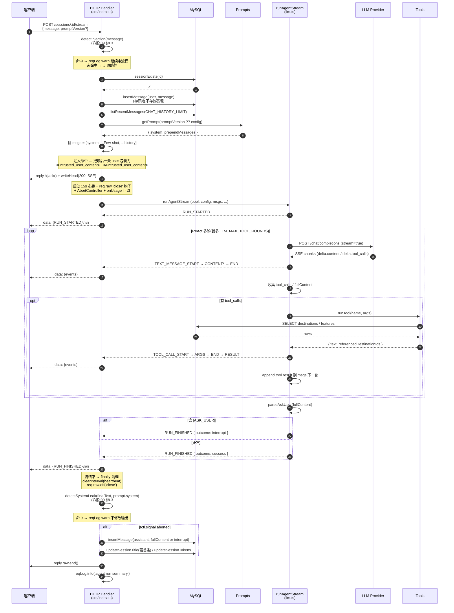
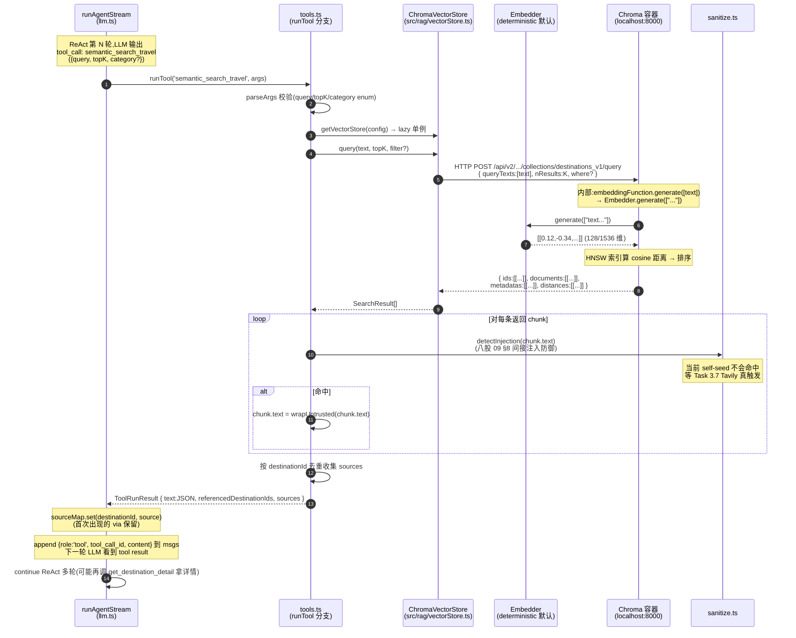

# Agent 服务架构与运转流程

> **文档目的**:把后端 agent 服务从「HTTP 入口 → ReAct 主循环 → 工具调用 → 流式输出」整条链路用一份文档讲清楚。任何人(包括 Claude)接手开发前都应先读此文档,而不是去逆向 `src/index.ts`。
>
> **本文档是活文档**——核心模块改动后必须回到 §7「维护清单」核对相关章节是否要同步更新。
>
> **当前对齐的开发阶段**:阶段2 已完成,阶段3 RAG 主体已完成(Chroma + Embedder 多 provider + semantic_search_travel + RRF + sources),**整合阶段 Task 整合-1 已完成**(主 Agent 切到 LangGraph 主线)。
>
> **最近更新**:2026-05-31(Task 整合-1:主 Agent 从手写 `runAgentStream` 切到 `langchain.createAgent`;新增 `src/agent/langgraph-agent.ts` + `langgraphToAgUi.ts` adapter;`src/agent/llm.ts` 瘦身为只导出类型,手写实现全删;`src/eval/runner.ts` 同步切 LangGraph;Node 18.16 polyfill 加 `globalThis.crypto` + `AbortSignal.any`;AG-UI 协议 0 改动、前端 0 改动)

---

## 0. 文档约定

- **是什么**:运行时的「数据流 + 控制流」全景,加关键工程决策的"为什么"。
- **不是什么**:① 不是 README(不讲怎么安装);② 不是 API 参考(每个字段都讲会过厚);③ 不替代源码注释。
- **引用规则**:代码引用一律带 `path:line`,便于 grep 跳转;Task 引用对应 `docs/开发规划.md`;八股引用对应 `docs/01-面试八股文/`。

---

## 1. 系统全貌

### 1.1 组件分层

```
┌──────────────────────────────────────────────────────────────────┐
│                          Web (web/src/)                          │
│  App.tsx ──HTTP/SSE──> api.ts ──fetch──> 后端                    │
└──────────────────────────────────────────────────────────────────┘
                                  │
                                  ▼
┌──────────────────────────────────────────────────────────────────┐
│                     HTTP 层 (src/index.ts)                       │
│  Fastify routes:                                                 │
│    GET    /health                                                │
│    GET    /sessions             ── 列出全部会话                  │
│    POST   /sessions             ── 创建空会话                    │
│    GET    /sessions/:id/messages── 取历史消息                    │
│    DELETE /sessions/:id         ── 删除会话(FK 级联清消息)     │
│    POST   /sessions/:id/stream  ── ★ 流式对话主入口             │
└──────────────────────────────────────────────────────────────────┘
                                  │
        ┌─────────────────────────┼──────────────────────────────┐
        ▼                         ▼                              ▼
┌──────────────┐         ┌────────────────┐         ┌─────────────────────┐
│  Prompts     │         │   Agent 核心   │         │   Tools 层          │
│  (prompts/)  │         │   (llm.ts)     │         │  (tools.ts)         │
│              │         │                │         │                     │
│ v1_base.ts   │ system  │ runAgentStream │  tool   │ search_destinations │
│ v2_cot.ts    │────────>│  ReAct 多轮    │────────>│ get_destination_*   │
│ render.ts    │         │  AbortSignal   │         │ semantic_search_*  ★│
│ index.ts     │         │  Token 累加    │         └────────┬────────────┘
│ (注册表)     │         │  AG-UI 事件流  │                  │
└──────────────┘         │  sources 聚合 ★│                  │
                         └────────┬───────┘                  │
                                  │                          │
                                  ▼                          ▼
                         ┌────────────────┐       ┌────────────────────────┐
                         │  LLM Provider  │       │  RAG 层 (src/rag/) ★  │
                         │  postChatStream│       │                        │
                         │  SSE 解析      │       │  vectorStore.query()   │
                         │  超时控制      │       │      │                 │
                         └────────────────┘       │      ▼                 │
                                                  │  ChromaVectorStore     │
                                                  │   + Embedder           │
                                                  │   (minimax/openai/     │
                                                  │    deterministic)      │
                                                  │      │                 │
                                                  │      ▼                 │
                                                  │  Chroma 容器(8000)★  │
                                                  │   destinations_v1      │
                                                  │   18 vectors + HNSW    │
                                                  └──────────┬─────────────┘
                                                             │
                                                             ▼
                                                  ┌────────────────────────┐
                                                  │   MySQL Pool           │
                                                  │   (db/pool.ts,3307)   │
                                                  │                        │
                                                  │   chat_sessions        │
                                                  │   chat_messages        │
                                                  │   destinations(源)    │
                                                  │   destination_features │
                                                  └────────────────────────┘

★ 阶段3 新增。RAG 数据流:MySQL(真理) → npm run index → Chroma(索引衍生物)
                       查询路径:tools.ts:semantic_search_travel → vectorStore.query → Chroma HNSW
```

### 1.2 模块职责表

| 模块 | 文件 | 职责 | 不该做什么 |
|------|------|------|----------|
| HTTP 层 | `src/index.ts` | 路由、SSE 生命周期、abort 钩子、日志 trace_id、token 持久化 | 不写 LLM 调用细节、不解析 SSE 协议 |
| Prompts | `src/agent/prompts/` | section 化模板、版本注册、渲染插值、Few-shot prepend | 不知道 LLM 怎么调、不接 DB |
| **Agent 主线**(Task 整合-1) | `src/agent/langgraph-agent.ts` | `runLangGraphAgent`:`langchain.createAgent` + `MemorySaver` + 工具 wrap;**当前 HTTP handler 调用的就是这个** | 不写 DB、不解析 SSE 协议(LangGraph 内部干) |
| **Agent 事件 Adapter** | `src/agent/langgraphToAgUi.ts` | 把 LangGraph `streamEvents v2` 翻译成项目原生 AG-UI 事件;[ASK_USER] 检测;sources 注入 RUN_FINISHED | 不知道工具细节 |
| Agent 共用类型 | `src/agent/llm.ts` | 只导出 `ChatMessage` / `ResumeItem` / `TokenUsage` 类型;**整合-1 后手写实现全部删除** | 不含任何业务逻辑 |
| Tools | `src/agent/tools.ts` | function calling 定义、工具实现、参数 zod 校验 | 不发 SSE 事件、不调 LLM |
| AG-UI 协议 | `src/agent/ag-ui.ts` | 事件类型枚举 + 构造器(RUN_STARTED / TEXT_MESSAGE_* / TOOL_CALL_* / RUN_FINISHED) | 不含业务逻辑 |
| Sanitize 安全 | `src/agent/sanitize.ts` | `detectInjection` 入口注入检测 / `wrapUntrusted` 边界标记 / `detectSystemLeak` 出口泄露检测(纯函数) | 不发日志、不修改输入,只返回判定结果 |
| RAG 类型 | `src/rag/types.ts` | Chunk / ChunkMetadata / SearchResult 类型定义 | 不含逻辑 |
| RAG 切分 | `src/rag/chunker.ts` | `buildAllChunks` 从 destinations + destination_features 表生成 chunks | 不做 embedding、不写 Chroma |
| RAG Embedder | `src/rag/embedder.ts` | 抽象 `Embedder` 接口 + 3 实现(minimax / openai / deterministic);`createEmbedder` 按 config 工厂 | 不依赖向量库 |
| RAG 向量存储 | `src/rag/vectorStore.ts` | 抽象 `VectorStore` 接口 + `ChromaVectorStore` 实现;`createVectorStore` 工厂(嵌入 Embedder 到 collection 的 EmbeddingFunction) | 不解析查询语义、不知 tools/llm |
| RAG 混合检索 | `src/rag/hybridSearch.ts` | `hybridSearchTravel(strategy)` 三策略统一入口(keyword/semantic/hybrid);RRF 融合 + lexical rerank | 不暴露为工具,供评测脚本和未来 toolAgent 调用 |
| Token Usage | `src/agent/token-usage.ts` | `estimateTokens` 兜底估算、`accumulateUsage` 累加 | 不写 DB |
| Chat 持久化 | `src/db/chatRepo.ts` | chat_sessions / chat_messages 的 CRUD | 不知道 LLM、不调工具 |
| Destination 数据 | `src/db/destinationRepo.ts` | destinations / destination_features 的查询 | 不写 chat 表 |
| Config | `src/config.ts` | 环境变量 zod schema + 加载 | 不依赖业务模块 |
| Eval | `src/eval/`、`scripts/eval-prompt.ts` | Prompt 评测器 + 测试集 + 批量脚本(Task 2.3) | 不污染生产 chat 表 |

---

## 2. HTTP API 一览

| Method | Path | 请求体 / 参数 | 响应 | 代码位置 |
|--------|------|-------------|------|---------|
| GET | `/health` | — | `{ ok, db }`,503 表示 DB 挂 | `src/index.ts:40-48` |
| GET | `/sessions` | — | `{ sessions: SessionRow[] }` | `src/index.ts:50-53` |
| POST | `/sessions` | — | `201 { sessionId }` | `src/index.ts:68-73` |
| GET | `/sessions/:id/messages` | `id` | `{ messages: { role, content }[] }`,404 表示不存在 | `src/index.ts:55-66` |
| DELETE | `/sessions/:id` | `id` | `204 null`(成功)/`404`(不存在) | `src/index.ts:83-95` |
| POST | `/sessions/:id/stream` | `{ message, threadId?, runId?, resume?, promptVersion? }` | SSE 流(`data: {AGUIEvent}\n\n`),`X-Trace-Id` 头携带 runId | `src/index.ts:113-235` |

---

## 3. 核心运转流程

### 3.1 创建会话(POST /sessions)

```
client                      handler                  DB
  │  POST /sessions            │                      │
  │ ─────────────────────────► │                      │
  │                            │ randomUUID()         │
  │                            │ createSession(id)    │
  │                            │ ────────────────────►│ INSERT chat_sessions
  │                            │ ◄────────────────────│
  │  201 { sessionId }         │                      │
  │ ◄───────────────────────── │                      │
```

**约束**:此时 `chat_sessions.title` 为 NULL、`total_tokens=0`、`status=running`(若有此列)。第一次对话结束时由 stream handler 把 user message 前 30 字写入 title(`src/index.ts:195-199`)。

### 3.2 发起对话(POST /sessions/:id/stream)★ 核心场景

这是整个 agent 服务最复杂、调用面最广的流程。下图是**全链路**:



#### 3.2.1 详细步骤说明

1. **入参与会话校验**(`src/index.ts:115-133`):取 body 中的 message / promptVersion / resume,验证 session 存在
2. **持久化 user 消息**(`:138`):立刻写库,即使后续 LLM 失败也保留用户输入
3. **拼 messages**(`:141-158`):
   ```
   [{ role: 'system', content: prompt.system }]
     + prompt.prependMessages (Few-shot 3 条)
     + history (按 CHAT_HISTORY_LIMIT=30 反向取最近)
   ```
4. **接管 SSE socket**(`:161-168`):`reply.hijack()` 让 Fastify 不再管收尾,headers 写完即可流式吐内容
5. **三层保护**:
   - **AbortController**(`:171-178`):`req.raw 'close'` 事件 → `ctl.abort()` → 下游 `fetch` 立刻停
   - **心跳**(`:181-183`):15s 一次 `: ping\n\n` 注释行,防反向代理按 idle 断连
   - **onUsage 回调**(`:188-196`):每轮 LLM 结束累加 `prompt/completion/total tokens`
6. **ReAct 主循环**(`runAgentStream`,`src/agent/llm.ts:222-435`):见 §3.2.2
7. **流结束**(`:189-206`):
   - 仅在 **未 abort** 时才入库 assistant 消息(避免污染历史)
   - 首条用户消息会自动生成 title(前 30 字)
   - `updateSessionTokens` 累加 token 到 `chat_sessions.total_tokens`
8. **关 SSE**(`:224`):`reply.raw.end()`

#### 3.2.2 ReAct 主循环细节(`runAgentStream`)

```
for round in 0..LLM_MAX_TOOL_ROUNDS:           # 默认 10
  if signal.aborted: break

  stream = postChatStream(LLM, msgs, signal)   # OpenAI 兼容 /chat/completions

  for chunk in stream:
    if chunk.usage:                            # 最后一 chunk 带 usage
      lastUsage = ...
    if delta.content:
      yield TEXT_MESSAGE_START / CONTENT       # 首次 content 时发 START
    if delta.tool_calls:
      yield TOOL_CALL_START / ARGS             # 流式收集 args
    if finish_reason in ['stop', 'tool_calls']:
      yield TEXT_MESSAGE_END / TOOL_CALL_END

  totalUsage += lastUsage ?? estimateFromText()
  onUsage(roundUsage, round)                   # 回调到 HTTP 层打日志

  if collected tool_calls:
    msgs.append({ role: assistant, tool_calls })
    for tc in tool_calls:
      result = runTool(tc.name, tc.args)
      yield TOOL_CALL_RESULT
      msgs.append({ role: tool, tool_call_id, content })
    continue  # 下一轮 LLM,带着工具结果重新生成

  # 无工具调用 → 检查是否反问
  if parseAskUser(fullContent).isAskUser:
    yield RUN_FINISHED { outcome: interrupt }
    return

  break  # 正常文本回答,结束循环

yield RUN_FINISHED { outcome: success, usage: totalUsage }
```

**关键不变量**:
- 工具调用结果必须以 `role:tool` + `tool_call_id` 形式追加到 msgs,LLM 下一轮才能"看见"
- `[ASK_USER]` 协议是当前的"反问"实现(临时方案,见 §5.4)
- usage 必须显式声明 `stream_options.include_usage`,否则流式不返回 usage(`postChatStream` 已处理)

### 3.3 中断处理(客户端断开)

当前实现是**阶段1 的 Chat App 心智**:客户端断开 = 整个 Run 终止。

```
client                handler              llm/tools
  │ (关闭页面/切走)      │                      │
  │ ─────[FIN]────────► │                      │
  │                     │ req.raw 'close'      │
  │                     │ → ctl.abort()        │
  │                     │ ────────────────────►│ AbortSignal 触发
  │                     │                      │ fetch 立即终止
  │                     │ ◄────────────────────│
  │                     │ finally:             │
  │                     │   clearInterval      │
  │                     │   reply.raw.end()    │
  │                     │ ⚠️ assistant 消息    │
  │                     │ 不入库               │
```

**为什么 abort 不入库**:`src/index.ts:189` 的 `if (!ctl.signal.aborted)` 保护——中途断开时 LLM 输出可能不完整,存进去会污染下次的 history。

**已知局限**:此设计让"切走会话" = "丢失任务",阶段4 Task 4.5 会把它改造为「切走 = unsubscribe but Run continues」+ event 回放续流。详见 §6。

### 3.4 历史查询(GET /sessions/:id/messages)

最简单的 CRUD:`getSessionMessages` 按 `created_at ASC` 全量返回该会话的 user/assistant/system 三种角色消息(`src/db/chatRepo.ts:56-65`)。

**当前没有的字段**(阶段4 Task 4.5 会加):
- `status: 'running' | 'end'`(标识 Run 是否还在跑)
- `lastMessage` 用于断点续传

### 3.5 删除会话(DELETE /sessions/:id)

```
client                handler                DB
  │ DELETE /sessions/:id │                    │
  │ ──────────────────► │                    │
  │                     │ sessionExists()    │
  │                     │ ──────────────────►│
  │                     │ ◄──────────────────│
  │                     │ deleteSession()    │
  │                     │ ──────────────────►│ DELETE chat_sessions
  │                     │                    │ FK CASCADE → chat_messages
  │                     │ ◄──────────────────│
  │ 204 No Content      │                    │
  │ ◄────────────────── │                    │
```

**前端配合**(`web/src/App.tsx:97`):删除当前激活会话前,前端自己 abort 正在跑的 SSE 连接 → 触发 §3.3 流程,后端把 Run 也停掉。后端因此不需要专门"终止 in-flight stream"的逻辑(阶段4 Task 4.5 改造后需要联动 `runManager.cancel(runId)`)。

### 3.6 RAG 检索流程(阶段3 新增)★

RAG 不是新 HTTP 路由,而是 §3.2 ReAct 主循环里"工具调用"的一种具体形态——当 LLM 在多轮里选择 `semantic_search_travel` 时触发。下图展示这条路径:



#### 3.6.1 关键不变量

| 不变量 | 出处 |
|--------|------|
| **MySQL 是 source of truth,Chroma 是可丢弃索引** | 改 seed 必须 `npm run index` 重灌 |
| **vectorStore 是 lazy 单例** | `tools.ts:getVectorStore()`,Chroma client 复用 HTTP keep-alive |
| **EmbeddingFunction 走 Embedder 抽象** | `vectorStore.ts:asEmbeddingFunction()`,切 provider 业务代码 0 改动 |
| **检索结果走 detectInjection** | 复用阶段2 §5.6 的 sanitize 模块,RAG 场景间接注入兜底 |
| **sources 跨多轮去重** | `llm.ts` 的 sourceMap;同 destinationId 多次命中保留首次 via |

#### 3.6.2 RAG 工具与 SQL 工具的协作

三个工具按 `v1_base.toolUsageRules` 各管一类场景:

| 用户问题 | 模型选择 | 何处 |
|---------|---------|------|
| "云南有什么目的地" | `search_destinations`(SQL LIKE) | 明确关键词/地区 |
| "列举丽江的美食" | `get_destination_detail`(SQL by id) | 必调,禁止编造 |
| "想看雪山不想太累" | **`semantic_search_travel`(RAG)** | 模糊需求兜底 |

实测 `sem-01` 展示了**多工具协作链路**:
```
LLM Round 1: semantic_search_travel('想看雪山...')     ← 语义召回找方向
LLM Round 2: get_destination_detail(丽江)              ← SQL 拿精确条目
LLM Round 3: 整合生成,带 "(来源:丽江)" 溯源标签
```

#### 3.6.3 灌数据流程(脚本入口,非生产路径)

`scripts/index-vectors.ts`(`npm run index`)流程,**仅在数据/embedder 变更时手动跑**:

```
1. buildAllChunks(pool)            ← MySQL → 18 chunks
2. vectorStore.reset()             ← drop 旧 collection(防 embedder 维度冲突)
3. vectorStore.add(chunks)         ← Chroma 自动调 embedder.generate() 批量入库
4. vectorStore.count()             ← 校验 = 18
5. 3 条 smoke query 看 Top-3       ← 验证 query 路径通
```

实测灌入耗时:18 chunks × deterministic = ~55ms。换 Ollama / OpenAI provider 后会更慢(网络调用)。

---

## 4. 数据流细节

### 4.1 messages 拼接顺序(Task 2.1 后)

```
index = 0   │ system           │ getPrompt(version).system
            │                  │   ├─ role
            │                  │   ├─ taskScope(含示例防污染说明)
            │                  │   ├─ toolUsageRules (1~4)
            │                  │   ├─ outputFormat
            │                  │   ├─ contextRules
            │                  │   ├─ clarificationRules ([ASK_USER] 协议)
            │                  │   ├─ securityRules (Prompt 注入防御指令,八股 09 §8)
            │                  │   └─ cotInstruction(仅 v2_cot)
index 1~N   │ Few-shot prepend │ prompt.prependMessages(3 条 user+assistant 交错)
index N+1~  │ history          │ listRecentMessages(最近 30 条,正序)
            │                  │   └─ 当前 user 消息(insertMessage 已写库,在 history 末)
            │                  │      ⚠ 若 detectInjection 命中,该条会被 wrapUntrusted 包裹
            │                  │        为 <untrusted_user_content>...</untrusted_user_content>
```

**为什么 user 消息在 history 末**:`src/index.ts:138` 先 `insertMessage(user, message)` 再 `listRecentMessages`,所以 history 的最后一条就是当前用户输入,无需单独 append。

**为什么只包裹"当前 user 消息"而不包裹历史**:历史里的旧攻击假定已在当时被防御过(模型已拒绝,fullContent 落库的是拒绝回复)。包裹历史会增加 token、且对已被防御的攻击无意义。

### 4.2 AG-UI 事件流(发给前端的 SSE)

事件类型定义在 `src/agent/ag-ui.ts:6-22`。一次成功对话的事件时序:

```
RUN_STARTED
  → STEP_STARTED(generating)
  →   TEXT_MESSAGE_START
  →   TEXT_MESSAGE_CONTENT × N
  →   TEXT_MESSAGE_END
  → STEP_FINISHED(generating)

[若有工具调用]
  → STEP_STARTED(tool_call)
  →   TOOL_CALL_START
  →   TOOL_CALL_ARGS × M
  →   TOOL_CALL_END
  → STEP_FINISHED(tool_call)
  → STEP_STARTED(tool_execution)
  →   TOOL_CALL_RESULT
  → STEP_FINISHED(tool_execution)
[回到 LLM 下一轮]

RUN_FINISHED { outcome, usage }
```

**前端解析**(`web/src/api.ts:65-80`):按行拆 SSE,识别 `data: ` 前缀,JSON.parse 后 yield;`App.tsx:99-200` switch 事件类型更新 UI。

### 4.3 Token 统计与计费链路

```
postChatStream 发送时显式带:
  stream_options: { include_usage: true }
                         │
                         ▼
最后一个 chunk 携带 usage { prompt_tokens, completion_tokens, total_tokens }
                         │
                         ▼
llm.ts runAgentStream:
  lastUsage = { promptTokens, completionTokens, totalTokens }  // snake → camel
  totalUsage = accumulateUsage(totalUsage, lastUsage)
  options.onUsage(roundUsage, round)  ────────┐
                         │                    │ 回调
                         ▼                    ▼
RUN_FINISHED { usage: totalUsage }    index.ts onUsage:
                         │              totalUsage += u
                         ▼              reqLog.info({ round, usage }, ...)
前端 sessionItem.totalTokens
(updateSessionTokens 落库后下次 GET /sessions 返回)
                         │
                         ▼
日志:agent run summary { usage, cost_usd, duration_ms }
       cost = (prompt/1000 × INPUT_PRICE) + (completion/1000 × OUTPUT_PRICE)
```

**Fallback 估算**:若 LLM 不返回 usage(部分 MiniMax 兼容协议),`runAgentStream` 用 `estimateTokens(text.length / 2)` 兜底——精度差但能保住成本审计链路。

### 4.4 RAG 数据流(MySQL → Chroma → tool result → sources)★

阶段3 引入了 RAG 后,数据有两条流向。**写入流**(灌数据,手动触发):

```
scripts/seed.ts                  npm run index
─────────────────                ──────────────
destinations 表(3 行)
destination_features 表(15 行)
        │
        │  buildAllChunks(pool)
        ▼
Chunk[18](text + metadata)
        │
        │  vectorStore.add(chunks)
        ▼
Chroma EmbeddingFunction.generate(texts)
        │  调 Embedder(deterministic/openai/minimax)
        ▼
向量 number[][]
        │
        │  HNSW 索引
        ▼
Chroma collection: destinations_v1
  { ids:[...], documents:[...], metadatas:[...], embeddings:[...] }
```

**查询流**(每次 LLM 调 RAG 工具时):

```
LLM tool_call: semantic_search_travel({query, topK})
        │
        ▼
tools.ts → vectorStore.query(text, topK, filter?)
        │
        ▼
Chroma POST /api/v2/.../query { queryTexts:[text], nResults }
        │  Chroma 内部调 EmbeddingFunction.generate([query])
        ▼
query 向量 → HNSW Top-K → 返回 chunks + distance
        │
        ▼
SearchResult[]:[ { id, text, metadata, distance }, ... ]
        │
        ▼
tools.ts:
  ├── 每条 chunk.text 走 detectInjection(防间接注入)
  ├── 按 destinationId 去重收集 ToolSource[]
  └── 返回 ToolRunResult { text:JSON{chunks}, referencedDestinationIds, sources }
        │
        ▼
llm.ts:
  ├── sourceMap.set(destinationId, source)(跨多轮聚合)
  ├── append { role:'tool', tool_call_id, content } 到 msgs
  └── continue ReAct 下一轮
        │
        ▼
最终 RUN_FINISHED 事件挂载:
  { type:'RUN_FINISHED', outcome, usage,
    sources:[{destinationId, destinationName, region, via}, ...] }
        │
        ▼
前端 web/src/api.ts 解析 SSE,从 RUN_FINISHED.sources 渲染来源标签
```

#### 关键路径要素

| 要素 | 出处 | 说明 |
|------|------|------|
| **chunk text 自带前缀** | `chunker.ts` 拼"丽江的美景「玉龙雪山」" | 让 chunk 自我描述,不依赖外部上下文 |
| **embedder 直接当 Chroma EmbeddingFunction 用** | `vectorStore.ts:asEmbeddingFunction` | 接口完全对齐,几行 wrapper |
| **每次 query 都重新算 query 向量** | Chroma 内置行为 | 这是 deterministic 模式下查询 1ms 的关键(无网络调用) |
| **检索结果走 detectInjection** | `tools.ts:semantic_search_travel` 分支 | 当前 self-seed 不触发,Task 3.7 真生效 |
| **sources 跨多轮去重** | `llm.ts:sourceMap`,保留首次 via | 同目的地被两个工具引用时,via 标记首次召回方式 |
| **AG-UI RunFinishedEvent.sources** | `ag-ui.ts:51-65` | 前后端契约,前端按此渲染"信息来源"UI |

---

## 5. 关键工程决策

### 5.1 为什么 `reply.hijack()` 而不是 Fastify 默认响应

Fastify 默认会等 handler return 后才 flush response。SSE 需要"边写边发",所以 `reply.hijack()` 把底层 socket 交给我们,自己管 `writeHead` / `write` / `end`。

**代价**:必须自己处理所有错误路径(否则 socket 泄漏),所以有 `try/finally` 包整段。

### 5.2 为什么显式声明 `stream_options.include_usage`

OpenAI 兼容协议默认**流式响应不返回 usage**。不声明就拿不到精确 token,只能用 `estimateTokens` 估算。Task 1.2 的成本审计依赖 usage,所以必须显式开。

### 5.3 为什么 Few-shot 用 messages 数组 prepend(而不是 system 内文本)

八股 09 §3.5 推荐:模型预训练时见到的 user/assistant 交错格式最熟悉,理解最稳。

**踩过的坑**:messages 形式有"模型把示例当真实历史"的污染风险——见 `docs/02-实验记录/exp-02-prompt-versions.md` 第 1 轮。修复方案:`v1_base.taskScope` 加边界声明(已落地)。

### 5.4 为什么 `[ASK_USER]` 用字符串协议(临时方案)

当前反问检测靠 `parseAskUser(fullContent)` 解析模型输出的 `[ASK_USER]` 前缀字符串(`src/agent/llm.ts:171-198`)。

**为什么不用 LangGraph 的 `interrupt()` 或更严谨的 function calling**:学习项目要把"流程拼起来"先跑通,字符串协议是最低成本。**Task 4.5 会重构**为 Run-as-Resource 模型 + 显式 interrupt 事件 + Checkpoint。

### 5.5 为什么 abort 时不入库 assistant 消息

中途断开时 LLM 输出截断,可能是 `"我推荐云南的..."` 这种不完整句子。存进去后下次对话作为 history 喂给 LLM,会严重污染上下文。所以 `src/index.ts:189` 用 `if (!ctl.signal.aborted)` 保护。

**已知缺陷**:用户切走会话再回来,assistant 输出丢失。阶段4 Task 4.5 会改造,见 §6。

### 5.6 为什么注入命中后不直接拒绝请求

`detectInjection` 命中后,handler 只做两件事:① 记日志告警;② 把消息用 `<untrusted_user_content>` 包裹后**继续走 LLM**。**不直接 return 403**。

理由:
1. **规则匹配有误杀**:用户真说"我想去看 system update 风格的建筑设计"会命中 `pseudo_section_delimiter` 规则——直接拒绝会让正常用户莫名其妙
2. **双层防御更鲁棒**:`securityRules` 已经训练模型识别注入并自己拒绝,sanitize 只是"加一层提醒",让模型在更明确的边界下做最终判断
3. **可观测优先**:阶段当前是项目早期,先把"注入流量分布"通过 `prompt injection detected` 告警收集起来,后期决定是否升级为硬拦截
4. **实测验证**:`docs/02-实验记录/exp-02-prompt-versions-2026-05-30T10-37-46-151Z.json` 的 5 条 inj-* case 全部通过,说明双层防御足够

**未来升级方向**:严重等级 = `high` 且来自非可信用户(阶段5 加身份层后)时硬拒绝,low/medium 仍走"包裹 + 让模型判"路径。

### 5.7 为什么向量库选 Chroma(而不是 MySQL JSON 列 或 Milvus)★

阶段3 落地前 5 分钟的选型决策。三档对比:

| 方案 | 评价 |
|------|------|
| **MySQL JSON 列存向量**(原计划 MVP) | ❌ 全表扫描算内积无索引,几千 chunk 就慢;不能讲行业标准接口;玩具感强 |
| **Milvus / Pinecone**(生产级) | ❌ 运维成本与我们"几百个目的地"的数据规模不匹配,"为什么选 Milvus"难自圆其说 |
| **Chroma**(实际选择) | ✅ docker 一键起;LangChain/LlamaIndex 生态;内置 HNSW 索引;能讲清楚选型理由 |

**Chroma 的甜蜜点**:几千~几十万向量、单机或小集群。我们项目 18 chunk 性能上完全冗余——选它是为了学**行业标准接口**而非性能。

**接口仍然抽象成 `VectorStore`**(`src/rag/vectorStore.ts`),后续真有"亿级向量"需求,只换实现不动业务代码。

完整决策见 `docs/开发规划.md` 关键设计决策 #2、`docs/03-开发笔记/note-03 §3.1`。

### 5.9 为什么主 Agent 切到 LangGraph(Task 整合-1)★

整合阶段做的决策:阶段3 完成后,真实使用反馈出"会话续流"需求(切走 Run 不停、回来续订),手写实现成本约 Task 4.5 完整复杂度;而 LangGraph 的 `thread_id` + `Checkpointer` 是现成的,**接框架的成本远低于手写**——所以决定整合-1 把主 Agent 切到 LangGraph,整合-2 借 Checkpointer 做轻量续流。

具体落地选择:
- 用 `langchain.createAgent`(LangChain 1.x 推荐 API,旧 `@langchain/langgraph/prebuilt:createReactAgent` 标 deprecated)
- `MemorySaver` 作 Checkpointer(开发用,Task 4.5 升级 SqliteSaver/MySQLSaver)
- 工具复用 `tools.ts:runTool`,用闭包 wrap 成 LangChain tool(sources 通过闭包 sourceMap 旁路透出)
- `[ASK_USER]` 协议保留(整合-2 / Task 4.5 再升级原生 `interrupt()`)
- AG-UI 事件协议 0 改动(adapter 层翻译 LangGraph `streamEvents v2`)

保留资产:
- 手写 `runAgentStream` / `postChatStream` 等**直接删除**,`src/agent/llm.ts` 瘦身为只导出 3 个类型(理由:留死代码会腐烂);"手写 vs LangGraph 对比" STAR 故事写在 `docs/03-开发笔记/note-04`
- AG-UI 协议、tools.ts、sanitize.ts、prompts/、sources/ 全部复用

完整决策见 `docs/开发规划.md` 关键设计决策 #6、`docs/03-开发笔记/note-04`(待写)。

### 5.8 为什么 Embedder 抽象成多 Provider(而不是直连 MiniMax)★

阶段3 实施时碰到了一个非常真实的工程问题:**MiniMax 当前账号无 embedding 权限**(实测 `embo-01` 返回 `your current token plan not support model, embo-01`)。

如果硬编码到 MiniMax,RAG 全链路卡在第一步跑不通。所以做了抽象:

```ts
// src/rag/embedder.ts
export interface Embedder {
  readonly name: string
  readonly dim: number
  generate(texts: string[]): Promise<number[][]>
}

// 3 个实现:
// - MinimaxEmbedder(走 embo-01,需账号支持)
// - OpenAIEmbedder(走 /embeddings 标准协议,需 OpenAI key)
// - DeterministicEmbedder(字符 n-gram 哈希,完全离线,**默认**)
```

**Deterministic 算法**:字符 2-gram + 3-gram → FNV-1a 哈希到 [0, 128) 维 → L2 归一化。
- ✅ 相同/相似字面文本 cosine 较高,流程能跑
- ❌ 不能捕捉真语义("辣"≠"火锅"——`exp-04` q2 实测暴露)

**升级路径**:
1. 改 `.env`:`EMBEDDING_PROVIDER=openai`(或 `minimax`/未来 `ollama`)
2. 跑 `npm run index`(必须,维度变了)
3. 业务代码 0 改动

**这个决策的元价值**:所有外部依赖都该先做抽象层,你永远不知道哪个 provider 会卡你——这是阶段3 的工程教训,直接对应阶段5 Task 5.5 LLM 网关层的"多 provider 适配"思路。

完整决策见 `docs/开发规划.md` 关键设计决策 #7、`docs/03-开发笔记/note-03 §2`。

---

## 6. 已知局限与演进路线

| 局限 | 当前症状 | 修复 Task | 备注 |
|------|---------|----------|------|
| 切走会话 = 任务终止 | 切换会话或网络抖动,Run 被 abort,assistant 输出丢失 | **整合-2**(轻量版,即将做)+ **Task 4.5**(完整版) | 整合-1 已切 LangGraph 主线 → Checkpointer 现成,整合-2 借力做轻量续流 |
| 无主动取消按钮 | 用户只能切走/关页面,不能"立刻停" | Task 4.5 | 需要新增 POST /sessions/:id/runs/:runId/cancel |
| `[ASK_USER]` 是字符串协议 | 模型偶尔会忘记加前缀;且无法附带结构化 schema | Task 4.5 引入 LangGraph 风格 interrupt | 见 §5.4 |
| 评测无重试 | LLM 服务抖动时单次评测 fail,不可信 | Task 5.3 容错与重试 | 见 exp-02 第 2 轮事故 |
| LLM 请求只盯总时长 | 服务长时间不下发数据但 keep-alive 时 timeout 不触发 | Task 5.3 stream-idle timeout | postChatStream 需要增加空闲监控 |
| `estimateTokens` 精度差 | `length / 2` 在长 prompt 上误差 ±20% | Task 5.5 网关层接入 tiktoken | 不同 tokenizer 不通用是阻塞点 |
| ~~`semantic_search_travel` 工具未实现~~ | ✅ **已完成**(Task 3.3) | — | testset.ts:sem-01 已转入硬性评估,实测通过 |
| 多 Agent 协作 | 当前是单 Agent ReAct | Task 5.1 Supervisor 模式 | 阶段5 |
| 注入检测纯靠正则规则 | 规则库有限,新型注入(语义级、多语种变体)可能漏检 | 阶段5 Task 5.3 引入 LLM-as-judge 二次校验 / 规则热更新 | 当前 11 条规则覆盖常见模式;实测 5/5 通过 |
| 输出过滤只做"system prompt 泄露检测" | 没做 PII / 密钥 / 暴力内容过滤 | 阶段5 Task 5.5 网关层 + 项目无 PII 场景暂不紧迫 | 当前项目不涉及个人数据 |
| Embedding 当前走 deterministic provider | 字符 n-gram 哈希,不反映真语义("辣"≠"火锅") | 切 `.env` 的 `EMBEDDING_PROVIDER=openai` 即可(需 OpenAI key) | 流程已通,生产前换 |
| RAG 接 RAG 检索 chunk 已做 `detectInjection` | tools.ts:semantic_search_travel 中已实现 | — | 阶段3 顺手补完(原 note-02 §5.6 留的坑) |
| RAG sources 字段前端未消费 | RUN_FINISHED.sources 已透出,但 web/src/App.tsx 尚未渲染"来源"标签 | 任意 web 迭代任务 | 后端契约已就位 |

---

## 7. 维护清单(本文档应当何时更新)

| 你改了什么 | 检查本文档哪几节 |
|----------|----------------|
| 新增/删除 HTTP 路由 | §2 API 一览 + §3 对应小节 + §1.1 分层图 |
| 改 `runAgentStream` 主循环 | §3.2.2 ReAct 主循环细节 + §4.2 AG-UI 事件时序 |
| 改 `postChatStream` / LLM 调用 | §3.2.2 + §4.3 Token 链路 + §5.2 |
| 改 prompts/ 目录(新版本、新 section) | §4.1 messages 拼接顺序 + §1.2 模块职责 |
| 改 tools.ts(新工具、改 schema) | §1.2 模块职责 + §3.2.2 ReAct 工具调用部分 |
| 改 abort / 中断行为 | §3.3 中断处理 + §5.5 + §6 |
| 改 chat_sessions / chat_messages schema | §3.4 / §3.5 + §1.2 + §6 局限对照 |
| 落地某个规划 Task | §6 局限表标记移除 + 必要时新增决策小节到 §5 |
| 引入新模块(eval/、rag/、agents/) | §1.1 分层图 + §1.2 职责表 |
| 改 sanitize.ts 规则库 / 检测策略 | §1.2 模块职责 + §3.2 时序图入口节点 + §5.6 决策 + §6 局限表注入检测条目 |
| 改 src/rag/(chunker / embedder / vectorStore / hybridSearch) | §1.2 模块职责 + §6 局限表 RAG 相关条目;若改了 AG-UI 事件结构(如 sources)同步 §4.2 |
| 改 langgraph-agent.ts / langgraphToAgUi.ts(整合-1 后) | §1.2 模块表 Agent 主线 + §5.9 LangGraph 切换决策;若新事件类型同步 §4.2 |
| 改 .env 的 EMBEDDING_PROVIDER / CHROMA_* | §6 局限表 embedding 行;不影响时序图 |

**维护铁律**:任何 PR 涉及上述变更,**必须在 PR 描述里勾选已更新本文档的章节**。Claude Code 接手开发时,提交前应回到本文档自检。

---

## 附录:相关文档

- 开发规划全景:[`../开发规划.md`](../开发规划.md)
- 面试八股(架构决策的"为什么"出处):[`../01-面试八股文/`](../01-面试八股文/)
  - 工程化:`08-工程化实践.md`(容错、Token、可观测)
  - Prompt:`09-Prompt工程.md`(本文档 §4.1 / §5.3 的理论依据)
- 实验记录:[`../02-实验记录/`](../02-实验记录/)
  - `exp-01-temperature.md`(温度选型)
  - `exp-02-prompt-versions.md`(2 轮 prompt 迭代)
- 学习笔记:[`../03-开发笔记/`](../03-开发笔记/)
  - `note-01` LLM 三件套(配合 §4.3 Token 链路读)
  - `note-02` Prompt Engineering(配合 §4.1 + §5.3 读)
